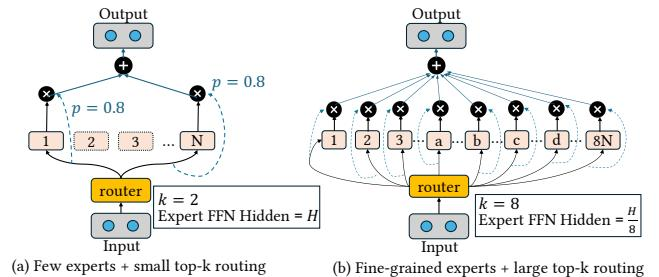

## X-MoE: Enabling Scalable Training for Emerging Mixture-of-Experts Architectures on HPC Platforms

Yueming Yuan UIUC Urbana, IL, USA yy28@illinois.edu

Sajal Dash Oak Ridge National Laboratory Oak Ridge, TN, USA dashs@ornl.gov

Ahan Gupta UIUC Urbana, IL, USA ag82@illinois.edu

Feiyi Wang Oak Ridge National Laboratory Oak Ridge, TN, USA fwang2@ornl.gov

Jianping Li UIUC Urbana, IL, USA jli199@illinois.edu

Minjia Zhang UIUC Urbana, IL, USA minjiaz@illinois.edu

## Abstract

Emerging expert-specialized Mixture-of-Experts (MoE) architectures, such as DeepSeek-MoE, deliver strong model quality through fine-grained expert segmentation and large top-k routing. However, their scalability is limited by substantial activation memory overhead and costly all-to-all communication. Furthermore, current MoE training systems – primarily optimized for NVIDIA GPUs – perform suboptimally on non-NVIDIA platforms, leaving significant computational potential untapped. In this work, we present X-MoE, a novel MoE training system designed to deliver scalable training performance for next-generation MoE architectures. X-MoE achieves this via several novel techniques, including efficient padding-free MoE training with cross-platform kernels, redundancy-bypassing dispatch, and hybrid parallelism with sequence-sharded MoE blocks. Our evaluation on the Frontier supercomputer, powered by AMD MI250X GPUs, shows that X-MoE scales DeepSeek-style MoEs up to 545 billion parameters across 1024 GPUs – 10x larger than the largest trainable model with existing methods under the same hardware budget, while maintaining high training throughput. The source code of X-MoE is available at [https://github.com/Supercomputing-System-AI-Lab/X-MoE.](https://github.com/Supercomputing-System-AI-Lab/X-MoE)

## 1 Introduction

Large Language Models (LLMs) have become the backbone of modern AI applications, achieving remarkable results across domains such as dialogue systems, code generation, and scientific reasoning [\[6,](#page-10-0) [28,](#page-11-0) [29\]](#page-11-1). However, training these models at scale remains prohibitively expensive. For example, training models at the scale of GPT-3 or GPT-4 consumes hundreds of thousands of GPU days and incurs billions of dollars in compute cost [\[1,](#page-10-1) [3,](#page-10-2) [35,](#page-11-2) [37\]](#page-11-3). As such, reducing the training cost while still achieving high model quality has become a key research challenge.

Numerous efforts have been made to improve the training efficiency of LLMs. Among those, Mixture-of-Experts (MoE) have emerged as a promising path to enable sublinear compute with respect to the model parameters, allowing for improved model quality without increased training costs [\[2,](#page-10-3) [13,](#page-11-4) [17,](#page-11-5) [23,](#page-11-6) [33\]](#page-11-7). In contrast to dense models, MoEs sparsely activate model parameters, which allows one to scale to larger model parameters while keeping pertoken compute budgets relatively low. Prior works have shown that MoEs can successfully scale to trillions of parameters [\[13\]](#page-11-4).

More recently, models such as DeepSeek-MoE [\[10\]](#page-11-8) represent a new class of emerging MoE architectures that depart from earlier designs like GShard [\[24\]](#page-11-9) and Mixtral-MoE [\[17\]](#page-11-5). These models rely on architectural modifications such as fine-grained experts and large top- routing to allow experts to focus on more distinct contextual concepts, known as expert specialization. As a result, DeepSeek-MoE style models have great potential to accelerate LLM training with low costs, renewing interest in developing scalable and efficient training systems for emerging MoE architectures.

Unfortunately, training expert-specialized MoEs at scale is very challenging. First, existing MoE training systems heavily rely on CUDA-specific implementations for standard MoEs, which are inefficient for expert-specialized MoEs and difficult to port to non-NVIDIA platforms such as AMD Instinct GPUs or Slingshot-based interconnects using ROCm and RCCL. This lack of cross-platform support leads to inflated memory usage and suboptimal performance on heterogeneous HPC systems like Frontier [\[5\]](#page-10-4) and Aurora [\[4\]](#page-10-5) (§ [3.1\)](#page-1-0). Second, expert-specialized MoEs introduce a structural shift: they increase the number of routed experts per token and shrink each expert's hidden dimension. This change shifts the memory bottleneck from model parameters to activations, particularly in the dispatch and combine stages. However, existing MoE training systems, such as DeepSpeed-MoE [\[31\]](#page-11-10), DeepSpeed-TED [\[34\]](#page-11-11), and Tutel [\[16\]](#page-11-12), do not effectively address this shifted bottleneck, causing a memory explosion (§ [3.2\)](#page-2-0). Third, many-expert routing significantly increases duplication in communication, especially when multiple experts are selected per token. On platforms with hierarchical interconnects, such as Dragonfly network [\[21\]](#page-11-13) in Frontier, this results in inefficient use of inter-node bandwidth and causes communication to become a major training efficiency bottleneck as the expert granularity increases (§ [3.3\)](#page-3-0).

To address these challenges, we present system-level optimizations for training emerging MoE architectures on cross-platform, non-NVIDIA hardware. Our analysis reveals that off-the-shelf MoE training systems, designed under the assumption of conventional MoEs and NVIDIA platforms, perform sub-optimally on new MoE architectures and non-NVIDIA hardware. For example, we observe that state-of-the-art MoE frameworks like Tutel [\[16\]](#page-11-12) and DeepSpeed-MoE [\[31\]](#page-11-10) achieve < 10 TFLOPS on AMD MI250X GPUs, which is under 10% of their peak performance, whereas Megablocks [\[14\]](#page-11-14) is highly integrated with NVIDIA Megatron-LM, which does not easily run on AMD hardware. Motivated by these observations,

Figure 1: Standard vs. expert-specialized MoE architecture.

we propose X-MoE, an MoE training system that enables scaling of expert-specialized MoEs across massive GPUs. X-MoE accomplishes this via a combination of techniques, such as padding-free MoE training with cross-platform kernels for improved memory and communication efficiency(§ [4.1\)](#page-3-1), redundancy-bypassing dispatching for communication reduction (§ [4.2\)](#page-5-0), and hybrid parallelism with sequence-sharded MoE blocks (§ [4.3\)](#page-6-0). Unlike prior systems, we achieve this without relying on vendor-specific software stacks like CUDA, and instead rely on portable backends such as Triton [\[36\]](#page-11-15). This makes X-MoE backend-agnostic and suitable for future hardware platforms. To our knowledge, X-MoE is the first work that systematically optimizes for both emerging expert-specialized MoEs and the heterogeneity of non-NVIDIA platforms.

We demonstrate our approach on the Frontier supercomputer [\[5\]](#page-10-4), which consists of AMD MI250X GPUS with Dragonfly architecture [\[21\]](#page-11-13). We validate our design through comprehensive experiments. X-MoE enables the training of DeepSeek-style MoEs up-to 545B-parameters on 1024 AMD GPUs, which is 10× larger than the largest trainable model under the same hardware budget using existing solutions. Beyond model scale, X-MoE delivers up to 1.42x higher training throughput than state-of-the-art MoE systems, while also outperforming them in both weak and strong scaling. To enhance usability, X-MoE has been integrated with DeepSpeed [\[32\]](#page-11-16), a popular open-source DL training library, making it accessible for future MoE training workloads.

## 2 Background

In this part, we introduce important concepts in the MoE literature.

Sparsely Activated MoEs. An MoE layer most commonly replaces the dense FFN in a transformer with a single layer consisting of a set of experts [\[13,](#page-11-4) [33\]](#page-11-7). During training, a token is dynamically routed to k experts based on scores computed by a gating function. This is done in four steps. First, the gating function is applied to the input tokens, generating a mapping of which token should be processed by which expert. Second, a dispatching stage is responsible for routing each token to its respective mapped experts' input buffers. Note, experts could reside on different devices, requiring the need for an all-to-all to exchange tokens between devices. Third, each expert independently processes all the tokens mapped to it. Fourth, a combine stage re-routes the tokens back to their original device via a second all-to-all, combining all the expert outputs and reordering the tokens to match the order of the original tokens input to the layer. Fig. [1\(](#page-1-1)a) illustrates the MoE architecture.

Expert-Specialized Mixture-of-Experts. The MoE architecture design paradigm has recently evolved. Prior to DeepSeek-MoE [\[10\]](#page-11-8), state-of-the-art MoEs like Mixtral-MoE use a small number of experts (e.g., 8), each of which is similar to the FFN layers in corresponding dense models with a small top-k gating value (e.g., is typically 1 or 2). However, such models are shown to lack expert specialization [\[17\]](#page-11-5). To overcome the issue, DeepSeek-MoE introduces both fine-grained experts and large top-k routing to increase expert specialization (Fig. [1\(](#page-1-1)b)). Instead of a few large experts, the model uses a much higher number of smaller experts and activates more of them for reach token. Concretely, each expert's hidden dimension is reduced to a fraction (e.g., 1/, where ∝ ) of the size used in a standard MoE's FFN. Meanwhile, the number of experts increases roughly -fold. For example, if a standard MoE has an FFN dimension of 4096 with 8 experts (activating 2 per token), DeepSeek-MoE splits this into = 8 fine-grained experts per original expert dimension, yielding 64 experts total and activating 16 per token. This keeps the total parameters and pertoken computation roughly the same as before but dramatically expands the combination of experts a token can see from only 28 possible expert-pair combinations in the original example to nearly 4.89 × 1014 combinations. DeepSeek-MoE models employ on the order of hundreds of experts per MoE layer, e.g., DeepSeek-v3 uses 256 experts in each layer, with 8 experts activated for every token, which exhibits far more expressive power than standard MoEs with the same parameter budget.

Existing MoE Training Frameworks. Training MoE models at scale introduces a number of system-level challenges. Early systems, such as GShard, introduce Expert Parallelism (EP) [\[24\]](#page-11-9), which enables efficient MoE scaling across devices by distributing experts across GPUs. Subsequently, several large-scale MoE training frameworks were introduced [\[9,](#page-10-6) [14,](#page-11-14) [15,](#page-11-17) [18,](#page-11-18) [31,](#page-11-10) [34\]](#page-11-11). DeepSpeed-MoE combines ZeRO-style Data Parallelism (ZeRO-DP) with EP, offering more memory-efficient training for large-scale MoE models. A more recent extension of DeepSpeed-MoE, DeepSpeed-TED [\[34\]](#page-11-11), introduces three-dimensional parallelism by combining DP, EP, and Tensor-slicing Parallelism (TP) to scale MoEs further. However, they are designed for low top-k values and coarse-grained experts. Tutel [\[16\]](#page-11-12) proposes an adaptive DP and TP strategy, optimizing memory and compute usage by dynamically switching between data and tensor parallelism depending on the load distributed amongst experts. Recently, Megablocks [\[14\]](#page-11-14) introduces sparse primitives and a no-token dropping scheme to process MoE layers, representing everything as block-sparse matrix multiplications. However, in doing so, their kernel requires padding the token buffer to multiples of a preset size, incurring serious zero-paddings on the emerging MoE workload.

## 3 Challenges and Opportunities

Expert-specialized MoEs represent a significant advancement in LLMs. However, training these emerging MoE architectures poses significant challenges for existing off-the-shelf MoE training solutions, especially on HPC platforms.

## 3.1 Lack of Efficient Cross-Platform Kernels for Scaling Expert-Specialized MoEs

Existing MoE training frameworks often rely on a dense and static tensor layout for MoE gating and dispatching, which becomes inefficient when applied to expert-specialized MoEs. For example, MoE training frameworks (e.g., GShard [24], Fairseq [30] and DeepSpeed-MoE [31]) often implement each stage of the MoE pipeline via fast batched matrix multiplication (matmul) primitives. However, these primitives place a constraint: requiring the same number of tokens routed to each expert, which does not hold during training. To handle the dynamic assignment of tokens to experts, these frameworks introduce a fixed expert capacity C and pad unused slots with zeros when fewer than C tokens are routed to an expert. Conversely, tokens are dropped when capacity is exceeded. During the gating stage, a dispatching mask, dispatch\_mask of size [S, E, C] is constructed. The entry dispatch\_mask[t, e, c] is either 1 or 0 indicating if the  $t^{th}$  token is routed to the  $c^{th}$ position in expert e's buffer. A token-dropping mask is applied over dispatch\_mask to additionally drop tokens.

Each of the dispatch, MLP and combine stages leverage matmuls on input token-buffers to process tokens. During the dispatch stage, each worker uses an einsum operation on the dispatching mask and input tokens to correctly place each token into its respective experts buffers. The expert buffers are [E, C, H]-sized. If less than C tokens are placed in an expert's buffer, the unused slots are zero-padded. Fig. 2 illustrates the dispatch process and how zeropadding is introduced into an expert's input-buffer at this stage. Next, an even alltoall communication exchanges token buffers across devices, correctly routing each token to the devices its experts reside on. Each expert then operates on its input token-buffers in parallel. Finally, another alltoall re-exchanges the tokens to their original device to generate the final output of the layer. Importantly, the zero-padding introduced in the dispatch stage is retained across each alltoall and expert compute. This increases both the communication volume and activation memory of MoE training.

Figure 2: Conventional gating and dispatching logic with zero-padded and large intermediate memory cost.

In expert-specialized MoEs, where hundreds of fine-grained experts are activated per MoE layer and top-k routing is large, the above zero-padded pipeline becomes a major memory bottleneck. In our experiments with DeepSeek-style MoEs, we observe that the dispatch mask and intermediate buffers consume over 70% of the total activation memory when training with DeepSpeed-MoE [31] using  $1.25\times$  average perceived tokens per-expert as the expert capacity. This not only increases the pressure on GPU memory but

also the communication volume of alltoall calls dependent on these buffers. While it is possible to build sparse CUDA kernels to address this issue [16], CUDA kernels are tightly coupled to NVIDIA's CUDA backend and cannot be easily ported to other platforms. The lack of cross-platform support becomes a critical limitation on different HPC systems. As a result, the current training pipeline either falls back to inefficient PyTorch-based implementations or requires costly kernel re-engineering (e.g., ROCm-based kernels) for the particular hardware target in question, which is error-prone. As MoE architectures grow more complex, the need for portable, hardware-agnostic MoE kernels becomes very essential.

**Takeaway-1:** Existing MoEs rely on dense, CUDA-specific implementations that are inefficient for expert-specialized MoEs and difficult to port to non-NVIDIA platforms. This lack of crossplatform support leads to inflated memory usage and degraded performance of MoE training on heterogeneous HPC platforms.

## 3.2 Memory Bottleneck Shift in Expert-Specialized MoEs

We analyze the unique memory behavior of emerging expert-specialized MoE architectures by comparing them with size-equivalent conventional MoEs, where we keep the total parameters and pertoken activated parameters the same. We refer to these as  $M_{conv}$  (conventional MoE) and  $M_{spec}$  (expert-specialized MoE). Table 1 summarizes the key differences. We use E to denote the number of experts, H for the model dimension, and  $H_{FFN}$  for the intermediate hidden dimension in the expert FFN layers. We use M to denote fine-grained factor, which indicates how many fine-grained experts in  $M_{spec}$  together replace a single expert in  $M_{conv}$ . For example, in most conventional MoEs [13, 17, 31], M = 1; in DeepSeek [11], M = 8 because expert FFNs have a M × smaller hidden dimension and each token activates M = 8 experts.

| Model                      | E     | Н | $H_{FFN}$ | k | Param | Activated Param |
|----------------------------|-------|---|-----------|---|-------|-----------------|
| base $M_{conv}$ $M_{spec}$ | -     | h | h'        | - | 2h'h  | 2h' h           |
| $M_{conv}$                 | e     | h | h'        | 1 | 2eh'h | 2h'h            |
| $M_{spec}$                 | e · m | h | h'/m      | m | 2eh'h | 2 <b>h'</b> h   |

Table 1: The model configurations of size-equivalent conventional MoE  $M_{conv}$  and expert-specialized MoE  $M_{spec}$ .

Training memory consists of model states and activations. Since  $M_{conv}$  and  $M_{spec}$  are size-equivalent, their model state size is identical. However, their activations behave very differently. Each MoE layer often instantiates four key activations during training:

- *A*dispatch: dispatched input to experts;
- $A_{\rm interm}^0$  and  $A_{\rm interm}^1$  intermediate activations between expert FFN sub-layers;
- *A*combine: expert outputs before combining.

All four tensors scale with batch size b, sequence length s, and routing factor k. Among them,  $A_{\mbox{dispatch}}$  and  $A_{\mbox{combine}}$  scale with the model dimension H, while  $A_{\mbox{interm}}^0$  and  $A_{\mbox{interm}}^1$  scale with the expert hidden dimension  $H_{FFN}$ . However, given that  $H_{FFN}$  in  $A_{\mbox{interm}}^0$  and  $A_{\mbox{interm}}^1$  and  $A_{\mbox{interm}}^1$  remain constant across  $M_{conv}$  and  $M_{spec}$ . Instead,  $A_{\mbox{dispatch}}^1$  and

 $A_{\text{combine}}$  grow linearly with m. Therefore, in expert-specialized MoEs, activation memory is primarily dominated by the dispatch and combine stages. Table 2 summarizes this. This finding is interesting because prior work often assume that the intermediate FFN activation is large (e.g., 4H) for  $M_{conv}$ . Our analysis reveals that this assumption no longer holds true for expert-specialized MoEs.

| Activation            | $A_{\rm dispatch}$ | $A_{\tt combine}$ | $A_{\rm interm}^0$ | $A^1_{{\sf interm}}$ |
|-----------------------|--------------------|-------------------|--------------------|----------------------|
| Tensor Size           | kBSH               | kBSH              | $kBSH_{FFN}$       | $kBSH_{FFN}$         |
| $M_{conv}$ $M_{spec}$ | bsh mbsh        | bsh mbsh       | bsh' bsh'       | bsh' bsh'         |

Table 2: The activation size of equivalent conventional MoE model  $M_{conv}$  and expert-specialized MoE model  $M_{spec}$ .

We further validate this observation in Fig. 3, which compares the per-GPU memory consumption of one  $M_{conv}$  and  $M_{spec}$  layer when trained with ZeRO-1 DP and EP on 256 GPUs, using an EP size (i.e., expert-parallel group size) equal to the number of experts. The results show a clear shift in memory bottleneck.

Figure 3: The MoE layer memory distribution of  $M_{conv}$  and  $M_{spec}$  created by a 6.7B base model [6] with e = 16 and m = 8.

**Takeaway-2:** As expert-specialized MoEs increase the number of routed experts and shrink expert hidden dimension, per-device memory bottlenecks shift from model parameters to activations, particularly in the dispatch and combine stages.

