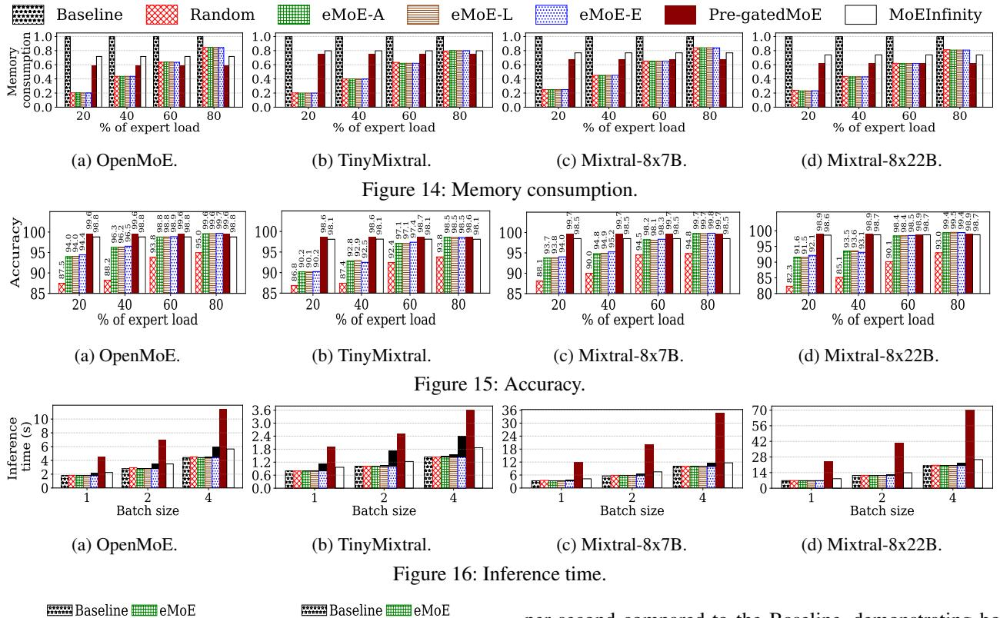
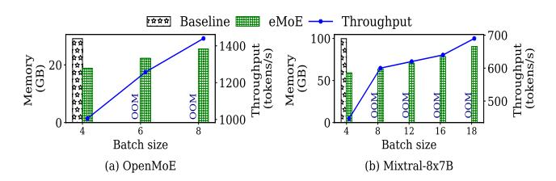
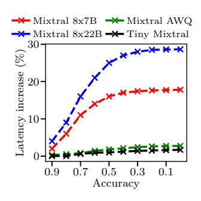

# 5.4 Inference Performance with Expert Predictor

We compared eMoE-L and eMoE-A (with only the expert predictor invoked) against Baseline, Random [44], Pre-Gated MoE [21], and MoEInfinity [22]. The Baseline method loads all experts into GPU memory without using an expert predictor. The Random [44] method randomly selects experts for tokens. The details of Pre-GatedMoE and MoEInfinity are explained in §2.2. We also tested a variant of eMoE, in which the expert predictor (eMoE-A) is called for every prompt, denoted as eMoE-E.

Memory Consumption and Accuracy. Figures 14 and 15 illustrate memory consumption and accuracy for various percentages of experts loaded into GPU memory. Baseline, which loads all experts, results in the highest memory usage. eMoE variants reduce memory consumption by 20%-80% while maintaining 93.7%-99.8% accuracy. With 60% of experts loaded, eMoE achieves 98.2%-98.8% accuracy, and with 80%, it reaches 99.6%-99.7%. This high accuracy stems from eMoE's predictive approach, which minimizes incorrect expert selection. In contrast, the Random method shows significantly lower accuracy, underperforming eMoE by 4.7%-8.6% for OpenMoE and 4.1%-6.5% for Mixtral. PregatedMoE (98.6%-99.7%) and MoEInfinity (98.1%-98.7%) show comparable accuracy to eMoE, as they employ similar expert prefetching strategies. Among eMoE variants, eMoE-E achieves slightly higher accuracy (0.1%-0.4%) than eMoE-A and eMoE-L by calling the predictor for each prompt, improving expert selection accuracy.

**Inference Time.** Figure 16 shows the average inference time for different batch sizes and the overhead for calling the

expert predictor (upper black part). A detailed analysis of time overhead is in §5.7. We can observe that the inference time increases with batch size due to the greater computational workload. Both eMoE-A and eMoE-L perform similarly to the Baseline and Random methods because they only invoke the expert predictor periodically. In contrast, Pre-GatedMoE demonstrates a 2.4x-3.5x higher inference time compared to eMoE variants. Pre-GatedMoE prefetches experts to overlap data transfer with computation at the current layer. However, expert transfers between the CPU and GPU cause memory and bandwidth contention, slowing data transfer and processing, especially when the GPU is simultaneously handling computations, leading to increased latency. MoEInfinity shows 1.25x-1.5x higher inference time compared to eMoE. MoEInfinity employs prefetching for the later layers and uses stored experts for the initial layers. Since it also employs prefetching during inference, its inference time is longer than that of eMoE. However, eMoE-E has a 9%-34% higher overhead as it calls the predictor for every prompt, resulting in longer inference time. Although eMoE-E achieves slightly higher accuracy, the trade-off between accuracy and increased inference time makes eMoE-A and eMoE-L more practical choices than eMoE-E for our system.

## 5.5 Impacts of Reducing Memory Consumption

Impact on Prompt Length. eMoE reduces GPU memory consumption, allowing it to process longer prompts. We tested eMoE-A and eMoE-L with 60% of experts loaded and gradually increased the prompt length until memory consumption matched the Baseline. Figure 17 shows memory usage for different prompt lengths. At a length of 512, the Baseline Open-MoE uses 24GB, while eMoE-A and eMoE-L use 14GB. At a length of 8192, eMoE's memory consumption matches the Baseline, allowing it to handle prompts 16x longer. Similarly, the Baseline Mixtral uses 96GB for a prompt of 512, while eMoE-A and eMoE-L use 59GB, enabling them to process prompts up to 40x longer.

**Impact on Batch Size and Throughput.** We conducted experiments to determine the maximum batch size eMoE-L and eMoE-A can handle with the saved memory. We progressively increased the batch size until its memory consumption

Figure 17: Memory consumption vs. prompt length.

1024 2048 409 Prompt length

(a) OpenMoE.

4096

100

Prompt length

(b) Mixtral-8x7B.

matches Baseline's memory consumption. Figure 18 shows memory consumption for varying batch sizes. The Baseline OpenMoE uses around 29GB for a batch size of 4, while eMoE-L and eMoE-A use about 19GB. As the batch size increases to 8, the memory consumption of eMoE-L and eMoE-A rises to 29GB, indicating that they can efficiently process up to 8 batches, handling 2x more batches than Baseline. Similarly, the Baseline Mixtral consumes about 100GB for a batch size of 4, while eMoE-L and eMoE-A use approximately 59GB. For a batch size of 18, their memory consumption matches 100GB. This demonstrates that eMoE-L and eMoE-A can efficiently handle up to 18 batches, processing 4.5x more batches than the Baseline model. We also measured throughput, which refers to the number of tokens processed per second at increased batch sizes. The blue lines in Figure 18 show eMoE's throughput increase. OpenMoE achieves 1.3x to 1.4x improvement as batch size grows from 4 to 8, while Mixtral sees a 1.3x to 1.5x boost from 4 to 18. These results show that eMoE can process up to 1.5x more tokens

per second compared to the Baseline, demonstrating both memory efficiency and improved processing speed.

Figure 18: Memory consumption vs. batch size.

Table 3: Performance comparison with Quantized model

| Methods |                | Memory (GB) | Accuracy |  |
|---------|----------------|-------------|----------|--|
| ĺ       | eMoE           | 64.504      | 98.2%    |  |
|         | Quantized-8bit | 57.814      | 95.2%    |  |
|         | Quantized-4bit | 30.487      | 91.5%    |  |

Benefits over Quantized models. We conducted experiments to evaluate the benefits of using eMoE compared to a quantized model. To assess eMoE's performance, we compared it to the 4-bit and 8-bit quantized versions of the Mixtral 8x7B model, recording both memory usage and accuracy. As shown in Table 3, the 4-bit model reduced memory by 2.2x and the 8-bit model by 1.2x compared to eMoE-A, but at the cost of a 3.06%-6.82% accuracy drop. These results demonstrate that eMoE offers a better balance of memory efficiency and accuracy, outperforming quantized models.

#### 5.6 Sensitivity Analysis

#### 5.6.1 Sensitivity To Task Classification Accuracy

Figure 19 shows the percentage change in latency with respect to the latency achieved with 100% task classification accuracy. In the experiment, we randomly introduced an inaccuracy in task label for a given task accuracy, record the average inference latency, and computed the percentage change in latency with respect to the ground truth case.

From the figure, we see that with the increase in inaccuracy in task identification, the inference latency increases for all four models. The increase in latency mainly stems from excess host-to-device expert loading. Note that eMoE uses its task-aware expert loading method to selectively load experts based on expert sensitivity. eMoE relies on accurate task type identification to achieve this objec-

Figure 19: Impact on latency under different task classification accuracy.

tive. However, with more inaccuracy, eMoE starts to load the experts from the host when it is not required to. However, even with 20% inaccuracy, the impact on the latency is less than 10% even for the largest model. When the inaccuracy becomes excessively high, eMoE loads the experts from the host most of the times, which causes the increase in latency to plateau.

#### 5.7 Time Overhead

We tested the time overhead of calling the expert predictor for eMoE-A and eMoE-L. We measured the time taken for expert prediction and moving the experts to GPU, then compute the average. The time for eMoE-A and eMoE-L averages at ~0.381s and ~1.387s for OpenMoE, and averages at ~0.334s and ~4.211s for Mixtral-8x7B. The expert predictor is called every 40 prompts, as determined empirically (Figure 10). For OpenMoE, the time overhead for eMoE-A and eMoE-L is 0.47% and 1.69% of the average inference time per request. For Mixtral, it is 0.24% and 3.11%, respectively. Mixtral incurs higher time overhead due to its 32 layers, each requiring prediction and transfer time, whereas OpenMoE has only 4 layers. The task-aware request scheduler runs on the CPU, incurring no additional overhead.

#### 6 Related Work

**Mixture-of-Expert models.** Recent research has focused on enhancing large-scale models using MoE-based architectures

[11, 44–59]. Google's Switch Transformer [10] pioneered MoE exploration, dynamically selecting different experts for different parts of the input sequence. GShard [60] scales MoE to a trillion parameters and uses expert parallelism. Other models such as PaLM [61], GaLM [9] from Google, and M6-T [62] from Alibaba have also excelled in language and multi-modal tasks. MoEfication [63] transforms conventional models into MoE models by splitting FFN parameters into multiple expert partitions. DeepSpeed Zero3 [64] collects parameters from other GPUs dynamically to support extremely large models.

MoE Training and Inference Systems. A group of methods focus on improving the performance and scalability of MoE models [12, 18, 19, 32, 33, 65–75]. Deepspeed-MoE [32] utilizes tensor slicing and expert-slicing to split parameters across multiple GPUs and to leverage memory bandwidth efficiently. Janus [66] uses a data-centric paradigm that focuses on keeping data in place and moving experts between GPUs to reduce communication workload. Tutel [12] uses adaptive parallelism switching and adaptive pipelining to manage the dynamic workloads of MoE. Faster-MoE [67] uses a shadow expert to address imbalanced workloads and a fine-grained scheduler for achieving asynchronous all-to-all communication. FastMoE [68] offers a hierarchical interface that enables flexible MoE model design and easy adaptation to various applications, including Transformer-XL [76] and Megatron-LM [77]. SMARTMoE [69] is an automatic parallelization system for distributed training for MoE-based models. Lina [33] prioritizes all-to-all over all-reduce using tensor partitioning to improve training step time. Pre-Gated MoE [21], MoEInfifnity [22] and EdgeMoE [23] leverage pipelining to overlap computation and the transfer of experts from CPU to GPU. MoE-Lightning [78] also leverages CPU-GPU pipelining and a Hierarchical Roofline Model to achieve higher throughput. Compared to these methods, eMoE significantly reduces memory consumption while preserving accuracy and also minimizes end-to-end inference latency.

#### 7 Conclusion

We present eMoE, a memory-efficient MoE inference system that uses an expert prediction model to load experts and incorporate several advanced methods to reduce latency. It has periodic expert invocation to avoid frequent expert prediction and loading. Moreover, we demonstrate that the input sensitivity to token-to-expert routing accuracy varies among tasks, prompting us to develop a task-aware expert loading method that prioritizes tasks with higher sensitivity. Additionally, we introduce a task-aware request scheduling method that optimizes request scheduling based on task-specific token generation length, task-aware expert loading latency, and latency SLO. Our experiments demonstrate that eMoE significantly outperforms existing MoE inference systems in terms of memory consumption and inference time while incurring a minimal impact on accuracy.

## References

- [1] Tom Brown, Benjamin Mann, Nick Ryder, Melanie Subbiah, Jared D Kaplan, Prafulla Dhariwal, Arvind Neelakantan, Pranav Shyam, Girish Sastry, Amanda Askell, Sandhini Agarwal, Ariel Herbert-Voss, Gretchen Krueger, Tom Henighan, Rewon Child, Aditya Ramesh, Daniel Ziegler, Jeffrey Wu, Clemens Winter, Chris Hesse, Mark Chen, Eric Sigler, Mateusz Litwin, Scott Gray, Benjamin Chess, Jack Clark, Christopher Berner, Sam McCandlish, Alec Radford, Ilya Sutskever, and Dario Amodei. Language models are few-shot learners. In H. Larochelle, M. Ranzato, R. Hadsell, M.F. Balcan, and H. Lin, editors, *Advances in Neural Information Processing Systems*, volume 33, pages 1877–1901. Curran Associates, Inc., 2020.
- [2] Jacob Devlin, Ming-Wei Chang, Kenton Lee, and Kristina Toutanova. Bert: Pre-training of deep bidirectional transformers for language understanding. *arXiv preprint arXiv:1810.04805*, 2018.
- [3] Robert A Jacobs, Michael I Jordan, Steven J Nowlan, and Geoffrey E Hinton. Adaptive mixtures of local experts. *Neural computation*, 3(1):79–87, 1991.
- [4] Sheng Shen, Zhen Dong, Jiayu Ye, Linjian Ma, Zhewei Yao, Amir Gholami, Michael W Mahoney, and Kurt Keutzer. Q-bert: Hessian based ultra low precision quantization of bert. In *Proceedings of the AAAI Conference on Artificial Intelligence*, volume 34, pages 8815–8821, 2020.
- [5] Zhen Dong, Zhewei Yao, Amir Gholami, Michael W Mahoney, and Kurt Keutzer. Hawq: Hessian aware quantization of neural networks with mixed-precision. In *Proceedings of the IEEE/CVF International Conference on Computer Vision*, pages 293–302, 2019.
- [6] Zhen Dong, Zhewei Yao, Daiyaan Arfeen, Amir Gholami, Michael W Mahoney, and Kurt Keutzer. Hawq-v2: Hessian aware trace-weighted quantization of neural networks. *Advances in neural information processing systems*, 33:18518–18529, 2020.
- [7] Rewon Child, Scott Gray, Alec Radford, and Ilya Sutskever. Generating long sequences with sparse transformers. *arXiv preprint arXiv:1904.10509*, 2019.
- [8] François Lagunas, Ella Charlaix, Victor Sanh, and Alexander Rush. Block pruning for faster transformers. In *Proceedings of the 2021 Conference on Empirical Methods in Natural Language Processing*, Online and Punta Cana, Dominican Republic, November 2021. Association for Computational Linguistics.

- [9] Nan Du, Yanping Huang, Andrew M. Dai, Simon Tong, Dmitry Lepikhin, Yuanzhong Xu, Maxim Krikun, Yanqi Zhou, Adams Wei Yu, Orhan Firat, Barret Zoph, Liam Fedus, Maarten Bosma, Zongwei Zhou, Tao Wang, Yu Emma Wang, Kellie Webster, Marie Pellat, Kevin Robinson, Kathy Meier-Hellstern, Toju Duke, Lucas Dixon, Kun Zhang, Quoc V. Le, Yonghui Wu, Zhifeng Chen, and Claire Cui. Glam: Efficient scaling of language models with mixture-of-experts. *CoRR*, abs/2112.06905, 2021.
- [10] William Fedus, Barret Zoph, and Noam Shazeer. Switch transformers: Scaling to trillion parameter models with simple and efficient sparsity. *The Journal of Machine Learning Research*, 23(1):5232–5270, 2022.
- [11] Damai Dai, Chengqi Deng, Chenggang Zhao, R. X. Xu, Huazuo Gao, Deli Chen, Jiashi Li, Wangding Zeng, Xingkai Yu, Y. Wu, Zhenda Xie, Y. K. Li, Panpan Huang, Fuli Luo, Chong Ruan, Zhifang Sui, and Wenfeng Liang. Deepseekmoe: Towards ultimate expert specialization in mixture-of-experts language models. *CoRR*, abs/2401.06066, 2024.
- [12] Changho Hwang, Wei Cui, Yifan Xiong, Ziyue Yang, Ze Liu, Han Hu, Zilong Wang, Rafael Salas, Jithin Jose, Prabhat Ram, HoYuen Chau, Peng Cheng, Fan Yang, Mao Yang, and Yongqiang Xiong. Tutel: Adaptive mixture-of-experts at scale. In D. Song, M. Carbin, and T. Chen, editors, *Proceedings of Machine Learning and Systems*, volume 5, pages 269–287. Curan, 2023.
- [13] Zhao You, Shulin Feng, Dan Su, and Dong Yu. Speech-MoE: Scaling to Large Acoustic Models with Dynamic Routing Mixture of Experts. In *Proc. Interspeech 2021*, pages 2077–2081, 2021.
- [14] Zhao You, Shulin Feng, Dan Su, and Dong Yu. 3m: Multi-loss, multi-path and multi-level neural networks for speech recognition. *arXiv preprint arXiv:2204.03178*, 2022.
- [15] Jiaqi Ma, Zhe Zhao, Xinyang Yi, Jilin Chen, Lichan Hong, and Ed H Chi. Modeling task relationships in multi-task learning with multi-gate mixture-of-experts. In *Proceedings of the 24th ACM SIGKDD international conference on knowledge discovery & data mining*, pages 1930–1939, 2018.
- [16] Woosuk Kwon, Zhuohan Li, Siyuan Zhuang, Ying Sheng, Lianmin Zheng, Cody Hao Yu, Joseph Gonzalez, Hao Zhang, and Ion Stoica. Efficient memory management for large language model serving with pagedattention. In *Proceedings of the 29th Symposium on Operating Systems Principles*, pages 611–626, 2023.
- [17] Deepspeed-fast. [https://github.com/microsoft/](https://github.com/microsoft/DeepSpeed-MII/) [DeepSpeed-MII/](https://github.com/microsoft/DeepSpeed-MII/).

- [18] Amey Agrawal, Nitin Kedia, Ashish Panwar, Jayashree Mohan, Nipun Kwatra, Bhargav Gulavani, Alexey Tumanov, and Ramachandran Ramjee. Taming {Throughput-Latency} tradeoff in {LLM} inference with {Sarathi-Serve}. In *18th USENIX Symposium on Operating Systems Design and Implementation (OSDI 24)*, pages 117–134, 2024.
- [19] Yinmin Zhong, Shengyu Liu, Junda Chen, Jianbo Hu, Yibo Zhu, Xuanzhe Liu, Xin Jin, and Hao Zhang. {DistServe}: Disaggregating prefill and decoding for goodput-optimized large language model serving. In *18th USENIX Symposium on Operating Systems Design and Implementation (OSDI 24)*, pages 193–210, 2024.
- [20] Gyeong-In Yu, Joo Seong Jeong, Geon-Woo Kim, Soojeong Kim, and Byung-Gon Chun. Orca: A distributed serving system for {Transformer-Based} generative models. In *16th USENIX Symposium on Operating Systems Design and Implementation (OSDI 22)*, pages 521–538, 2022.
- [21] Ranggi Hwang, Jianyu Wei, Shijie Cao, Changho Hwang, Xiaohu Tang, Ting Cao, and Mao Yang. Pregated moe: An algorithm-system co-design for fast and scalable mixture-of-expert inference. In *2024 ACM/IEEE 51st Annual International Symposium on Computer Architecture (ISCA)*, pages 1018–1031. IEEE, 2024.
- [22] Leyang Xue, Yao Fu, Zhan Lu, Luo Mai, and Mahesh Marina. Moe-infinity: Activation-aware expert offloading for efficient moe serving. *arXiv preprint arXiv:2401.14361*, 2024.
- [23] Rongjie Yi, Liwei Guo, Shiyun Wei, Ao Zhou, Shangguang Wang, and Mengwei Xu. Edgemoe: Fast ondevice inference of moe-based large language models. *arXiv preprint arXiv:2308.14352*, 2023.
- [24] Albert Q. Jiang, Alexandre Sablayrolles, Antoine Roux, Arthur Mensch, Blanche Savary, Chris Bamford, Devendra Singh Chaplot, Diego de las Casas, Emma Bou Hanna, Florian Bressand, Gianna Lengyel, Guillaume Bour, Guillaume Lample, Lélio Renard Lavaud, Lucile Saulnier, Marie-Anne Lachaux, Pierre Stock, Sandeep Subramanian, Sophia Yang, Szymon Antoniak, Teven Le Scao, Théophile Gervet, Thibaut Lavril, Thomas Wang, Timothée Lacroix, and William El Sayed. Mixtral of experts, 2024.
- [25] Fuzhao Xue, Zian Zheng, Yao Fu, Jinjie Ni, Zangwei Zheng, Wangchunshu Zhou, and Yang You. Openmoe: An early effort on open mixture-of-experts language models. *arXiv preprint arXiv:2402.01739*, 2024.

- [26] Jingqing Zhang, Yao Zhao, Mohammad Saleh, and Peter Liu. Pegasus: Pre-training with extracted gap-sentences for abstractive summarization. In *International conference on machine learning*, pages 11328–11339. PMLR, 2020.
- [27] Financial tweets sentiment. [https://](https://huggingface.co/datasets/TimKoornstra/financial-tweets-sentiment) [huggingface.co/datasets/TimKoornstra/](https://huggingface.co/datasets/TimKoornstra/financial-tweets-sentiment) [financial-tweets-sentiment](https://huggingface.co/datasets/TimKoornstra/financial-tweets-sentiment). Accessed: 2024- 03-30.
- [28] Squad. [https://huggingface.co/deepset/](https://huggingface.co/deepset/roberta-base-squad2) [roberta-base-squad2](https://huggingface.co/deepset/roberta-base-squad2). Accessed: 2024-03-30.
- [29] Emily Silcock, Abhishek Arora, and Melissa Dell. A massive scale semantic similarity dataset of historical english. *Advances in Neural Information Processing Systems*, 36, 2024.
- [30] Human assistant conversation. [https:](https://huggingface.co/datasets/Isotonic/human_assistant_conversation_deduped) [//huggingface.co/datasets/Isotonic/human\\_](https://huggingface.co/datasets/Isotonic/human_assistant_conversation_deduped) [assistant\\_conversation\\_deduped](https://huggingface.co/datasets/Isotonic/human_assistant_conversation_deduped). Accessed: 2024-03-30.
- [31] Matthew D Zeiler and Rob Fergus. Visualizing and understanding convolutional networks. In *Computer Vision–ECCV 2014: 13th European Conference, Zurich, Switzerland, September 6-12, 2014, Proceedings, Part I 13*, pages 818–833. Springer, 2014.
- [32] Samyam Rajbhandari, Conglong Li, Zhewei Yao, Minjia Zhang, Reza Yazdani Aminabadi, Ammar Ahmad Awan, Jeff Rasley, and Yuxiong He. Deepspeed-moe: Advancing mixture-of-experts inference and training to power next-generation ai scale. In *International Conference on Machine Learning*, pages 18332–18346. PMLR, 2022.
- [33] Jiamin Li, Yimin Jiang, Yibo Zhu, Cong Wang, and Hong Xu. Accelerating distributed {MoE} training and inference with lina. In *2023 USENIX Annual Technical Conference (USENIX ATC 23)*, pages 945–959, 2023.
- [34] Cross-correlation. [https://en.wikipedia.org/](https://en.wikipedia.org/wiki/Cross-correlation) [wiki/Cross-correlation](https://en.wikipedia.org/wiki/Cross-correlation).
- [35] Ashish Vaswani, Noam Shazeer, Niki Parmar, Jakob Uszkoreit, Llion Jones, Aidan N Gomez, Łukasz Kaiser, and Illia Polosukhin. Attention is all you need. *Advances in neural information processing systems*, 30, 2017.
- [36] Sepp Hochreiter and Jürgen Schmidhuber. Long shortterm memory. *Neural computation*, 9(8):1735–1780, 1997.
- [37] Razvan Pascanu, Tomas Mikolov, and Yoshua Bengio. On the difficulty of training recurrent neural networks. In *International conference on machine learning*, pages 1310–1318. Pmlr, 2013.

- [38] Nate Gruver, Marc Finzi, Shikai Qiu, and Andrew Gordon Wilson. Large language models are zero-shot time series forecasters. *arXiv preprint arXiv:2310.07820*, 2023.
- [39] Adam Paszke, Sam Gross, Francisco Massa, Adam Lerer, James Bradbury, Gregory Chanan, Trevor Killeen, Zeming Lin, Natalia Gimelshein, Luca Antiga, Alban Desmaison, Andreas Kopf, Edward Yang, Zachary DeVito, Martin Raison, Alykhan Tejani, Sasank Chilamkurthy, Benoit Steiner, Lu Fang, Junjie Bai, and Soumith Chintala. Pytorch: An imperative style, highperformance deep learning library. In H. Wallach, H. Larochelle, A. Beygelzimer, F. d'Alché-Buc, E. Fox, and R. Garnett, editors, *Advances in Neural Information Processing Systems*, volume 32. Curran Associates, Inc., 2019.
- [40] Thomas Wolf, Lysandre Debut, Victor Sanh, Julien Chaumond, Clement Delangue, Anthony Moi, Pierric Cistac, Tim Rault, Rémi Louf, Morgan Funtowicz, Joe Davison, Sam Shleifer, Patrick von Platen, Clara Ma, Yacine Jernite, Julien Plu, Canwen Xu, Teven Le Scao, Sylvain Gugger, Mariama Drame, Quentin Lhoest, and Alexander M. Rush. Transformers: State-of-the-art natural language processing. In *Proceedings of the 2020 Conference on Empirical Methods in Natural Language Processing: System Demonstrations*, pages 38–45, Online, October 2020. Association for Computational Linguistics.
- [41] Alec Radford, Jeff Wu, Rewon Child, David Luan, Dario Amodei, and Ilya Sutskever. Language models are unsupervised multitask learners. 2019.
- [42] Thomas Wolf, Lysandre Debut, Victor Sanh, Julien Chaumond, Clement Delangue, Anthony Moi, Pierric Cistac, Tim Rault, Rémi Louf, Morgan Funtowicz, Joe Davison, Sam Shleifer, Patrick von Platen, Clara Ma, Yacine Jernite, Julien Plu, Canwen Xu, Teven Le Scao, Sylvain Gugger, Mariama Drame, Quentin Lhoest, and Alexander M. Rush. Huggingface's transformers: Stateof-the-art natural language processing, 2020.
- [43] Zhilin Yang, Zihang Dai, Yiming Yang, Jaime Carbonell, Russ R Salakhutdinov, and Quoc V Le. Xlnet: Generalized autoregressive pretraining for language understanding. *Advances in neural information processing systems*, 32, 2019.
- [44] Simiao Zuo, Xiaodong Liu, Jian Jiao, Young Jin Kim, Hany Hassan, Ruofei Zhang, Tuo Zhao, and Jianfeng Gao. Taming sparsely activated transformer with stochastic experts. *arXiv preprint arXiv:2110.04260*, 2021.

- [45] Noam Shazeer, Azalia Mirhoseini, Krzysztof Maziarz, Andy Davis, Quoc Le, Geoffrey Hinton, and Jeff Dean. Outrageously large neural networks: The sparsely-gated mixture-of-experts layer. *arXiv preprint arXiv:1701.06538*, 2017.
- [46] Dingcheng Li, Xu Li, Jun Wang, and Ping Li. Video recommendation with multi-gate mixture of experts soft actor critic. In *Proceedings of the 43rd International ACM SIGIR conference on research and development in Information Retrieval*, pages 1553–1556, 2020.
- [47] Xiaonan Nie, Pinxue Zhao, Xupeng Miao, Tong Zhao, and Bin Cui. Hetumoe: An efficient trillion-scale mixture-of-expert distributed training system. *arXiv preprint arXiv:2203.14685*, 2022.
- [48] Zhen Qin, Yicheng Cheng, Zhe Zhao, Zhe Chen, Donald Metzler, and Jingzheng Qin. Multitask mixture of sequential experts for user activity streams. In *Proceedings of the 26th ACM SIGKDD International Conference on Knowledge Discovery & Data Mining*, pages 3083–3091, 2020.
- [49] Shwai He, Run-Ze Fan, Liang Ding, Li Shen, Tianyi Zhou, and Dacheng Tao. Merging experts into one: Improving computational efficiency of mixture of experts. *arXiv preprint arXiv:2310.09832*, 2023.
- [50] Damai Dai, Li Dong, Shuming Ma, Bo Zheng, Zhifang Sui, Baobao Chang, and Furu Wei. Stablemoe: Stable routing strategy for mixture of experts. *arXiv preprint arXiv:2204.08396*, 2022.
- [51] Mohammed Nowaz Rabbani Chowdhury, Shuai Zhang, Meng Wang, Sijia Liu, and Pin-Yu Chen. Patchlevel routing in mixture-of-experts is provably sampleefficient for convolutional neural networks. In *International Conference on Machine Learning*, pages 6074– 6114. PMLR, 2023.
- [52] Yanqi Zhou, Nan Du, Yanping Huang, Daiyi Peng, Chang Lan, Da Huang, Siamak Shakeri, David So, Andrew M. Dai, Yifeng Lu, Zhifeng Chen, Quoc V Le, Claire Cui, James Laudon, and Jeff Dean. Brainformers: Trading simplicity for efficiency. In Andreas Krause, Emma Brunskill, Kyunghyun Cho, Barbara Engelhardt, Sivan Sabato, and Jonathan Scarlett, editors, *Proceedings of the 40th International Conference on Machine Learning*, volume 202 of *Proceedings of Machine Learning Research*, pages 42531–42542. PMLR, 23–29 Jul 2023.
- [53] Mike Lewis, Shruti Bhosale, Tim Dettmers, Naman Goyal, and Luke Zettlemoyer. Base layers: Simplifying training of large, sparse models. In *International Conference on Machine Learning*, pages 6265–6274. PMLR, 2021.

- [54] Ze-Feng Gao, Peiyu Liu, Wayne Xin Zhao, Zhong-Yi Lu, and Ji-Rong Wen. Parameter-efficient mixture-ofexperts architecture for pre-trained language models. *arXiv preprint arXiv:2203.01104*, 2022.
- [55] Yaqing Wang, Subhabrata Mukherjee, Xiaodong Liu, Jing Gao, Ahmed Hassan Awadallah, and Jianfeng Gao. Adamix: Mixture-of-adapter for parameterefficient tuning of large language models. *arXiv preprint arXiv:2205.12410*, 1(2):4, 2022.
- [56] Sneha Kudugunta, Yanping Huang, Ankur Bapna, Maxim Krikun, Dmitry Lepikhin, Minh-Thang Luong, and Orhan Firat. Beyond distillation: Task-level mixture-of-experts for efficient inference. *arXiv preprint arXiv:2110.03742*, 2021.
- [57] Junmo Kang, Leonid Karlinsky, Hongyin Luo, Zhen Wang, Jacob Hansen, James Glass, David Cox, Rameswar Panda, Rogerio Feris, and Alan Ritter. Self-moe: Towards compositional large language models with self-specialized experts. *arXiv preprint arXiv:2406.12034*, 2024.
- [58] Hao Zhao, Zihan Qiu, Huijia Wu, Zili Wang, Zhaofeng He, and Jie Fu. Hypermoe: Towards better mixture of experts via transferring among experts. *arXiv preprint arXiv:2402.12656*, 2024.
- [59] Minjia Zhang, Conglong Li, Xiaoxia Wu, Zhewei Yao, and Yuxiong He. Samoe: Parameter efficient moe language models via self-adaptive expert combination. 2022.
- [60] Dmitry Lepikhin, HyoukJoong Lee, Yuanzhong Xu, Dehao Chen, Orhan Firat, Yanping Huang, Maxim Krikun, Noam Shazeer, and Zhifeng Chen. Gshard: Scaling giant models with conditional computation and automatic sharding. *arXiv preprint arXiv:2006.16668*, 2020.
- [61] Aakanksha Chowdhery, Sharan Narang, Jacob Devlin, Maarten Bosma, Gaurav Mishra, Adam Roberts, Paul Barham, Hyung Won Chung, Charles Sutton, Sebastian Gehrmann, Parker Schuh, Kensen Shi, Sasha Tsvyashchenko, Joshua Maynez, Abhishek Rao, Parker Barnes, Yi Tay, Noam Shazeer, Vinodkumar Prabhakaran, Emily Reif, Nan Du, Ben Hutchinson, Reiner Pope, James Bradbury, Jacob Austin, Michael Isard, Guy Gur-Ari, Pengcheng Yin, Toju Duke, Anselm Levskaya, Sanjay Ghemawat, Sunipa Dev, Henryk Michalewski, Xavier Garcia, Vedant Misra, Kevin Robinson, Liam Fedus, Denny Zhou, Daphne Ippolito, David Luan, Hyeontaek Lim, Barret Zoph, Alexander Spiridonov, Ryan Sepassi, David Dohan, Shivani Agrawal, Mark Omernick, Andrew M. Dai, Thanumalayan Sankaranarayana Pillai, Marie Pellat, Aitor Lewkowycz, Erica Moreira, Rewon Child, Oleksandr Polozov, Katherine Lee, Zong-

- wei Zhou, Xuezhi Wang, Brennan Saeta, Mark Diaz, Orhan Firat, Michele Catasta, Jason Wei, Kathy Meier-Hellstern, Douglas Eck, Jeff Dean, Slav Petrov, and Noah Fiedel. Palm: Scaling language modeling with pathways. *Journal of Machine Learning Research*, 24(240):1–113, 2023.
- [62] An Yang, Junyang Lin, Rui Men, Chang Zhou, Le Jiang, Xianyan Jia, Ang Wang, Jie Zhang, Jiamang Wang, Yong Li, Di Zhang, Wei Lin, Lin Qu, Jingren Zhou, and Hongxia Yang. Exploring sparse expert models and beyond. *CoRR*, abs/2105.15082, 2021.
- [63] Zhengyan Zhang, Yankai Lin, Zhiyuan Liu, Peng Li, Maosong Sun, and Jie Zhou. Moefication: Transformer feed-forward layers are mixtures of experts. *arXiv preprint arXiv:2110.01786*, 2021.
- [64] Samyam Rajbhandari, Jeff Rasley, Olatunji Ruwase, and Yuxiong He. Zero: Memory optimizations toward training trillion parameter models. In *SC20: International Conference for High Performance Computing, Networking, Storage and Analysis*, pages 1–16. IEEE, 2020.
- [65] Liang Shen, Zhihua Wu, WeiBao Gong, Hongxiang Hao, Yangfan Bai, HuaChao Wu, Xinxuan Wu, Jiang Bian, Haoyi Xiong, Dianhai Yu, and Yanjun Ma. Se-moe: A scalable and efficient mixture-of-experts distributed training and inference system, 2023.
- [66] Juncai Liu, Jessie Hui Wang, and Yimin Jiang. Janus: A unified distributed training framework for sparse mixture-of-experts models. In *Proceedings of the ACM SIGCOMM 2023 Conference*, pages 486–498, 2023.
- [67] Jiaao He, Jidong Zhai, Tiago Antunes, Haojie Wang, Fuwen Luo, Shangfeng Shi, and Qin Li. Fastermoe: modeling and optimizing training of large-scale dynamic pre-trained models. In *Proceedings of the 27th ACM SIGPLAN Symposium on Principles and Practice of Parallel Programming*, pages 120–134, 2022.
- [68] Jiaao He, Jiezhong Qiu, Aohan Zeng, Zhilin Yang, Jidong Zhai, and Jie Tang. Fastmoe: A fast mixture-of-expert training system. *arXiv preprint arXiv:2103.13262*, 2021.
- [69] Mingshu Zhai, Jiaao He, Zixuan Ma, Zan Zong, Runqing Zhang, and Jidong Zhai. {SmartMoE}: Efficiently training {Sparsely-Activated} models through combining offline and online parallelization. In *2023 USENIX Annual Technical Conference (USENIX ATC 23)*, pages 961–975, 2023.
- [70] Paul Barham, Aakanksha Chowdhery, Jeff Dean, Sanjay Ghemawat, Steven Hand, Daniel Hurt, Michael Isard, Hyeontaek Lim, Ruoming Pang, Sudip Roy, Brennan Saeta, Parker Schuh, Ryan Sepassi, Laurent Shafey,

- Chandu Thekkath, and Yonghui Wu. Pathways: Asynchronous distributed dataflow for ml. In D. Marculescu, Y. Chi, and C. Wu, editors, *Proceedings of Machine Learning and Systems*, volume 4, pages 430–449, 2022.
- [71] Trevor Gale, Deepak Narayanan, Cliff Young, and Matei Zaharia. Megablocks: Efficient sparse training with mixture-of-experts. In D. Song, M. Carbin, and T. Chen, editors, *Proceedings of Machine Learning and Systems*, volume 5, pages 288–304. Curan, 2023.
- [72] Zhuohan Li, Lianmin Zheng, Yinmin Zhong, Vincent Liu, Ying Sheng, Xin Jin, Yanping Huang, Zhifeng Chen, Hao Zhang, Joseph E. Gonzalez, and Ion Stoica. AlpaServe: Statistical multiplexing with model parallelism for deep learning serving. In *17th USENIX Symposium on Operating Systems Design and Implementation (OSDI 23)*, pages 663–679, Boston, MA, July 2023. USENIX Association.
- [73] Liang Shen, Zhihua Wu, WeiBao Gong, Hongxiang Hao, Yangfan Bai, HuaChao Wu, Xinxuan Wu, Jiang Bian, Haoyi Xiong, Dianhai Yu, et al. Se-moe: A scalable and efficient mixture-of-experts distributed training and inference system. *arXiv preprint arXiv:2205.10034*, 2022.
- [74] Shaohuai Shi, Xinglin Pan, Qiang Wang, Chengjian Liu, Xiaozhe Ren, Zhongzhe Hu, Yu Yang, Bo Li, and Xiaowen Chu. Schemoe: An extensible mixture-of-experts distributed training system with tasks scheduling. In *Proceedings of the Nineteenth European Conference on Computer Systems*, pages 236–249, 2024.
- [75] Trevor Gale, Deepak Narayanan, Cliff Young, and Matei Zaharia. Megablocks: Efficient sparse training with mixture-of-experts. *Proceedings of Machine Learning and Systems*, 5:288–304, 2023.
- [76] Zihang Dai, Zhilin Yang, Yiming Yang, Jaime Carbonell, Quoc V Le, and Ruslan Salakhutdinov. Transformerxl: Attentive language models beyond a fixed-length context. *arXiv preprint arXiv:1901.02860*, 2019.
- [77] Mohammad Shoeybi, Mostofa Patwary, Raul Puri, Patrick LeGresley, Jared Casper, and Bryan Catanzaro. Megatron-lm: Training multi-billion parameter language models using model parallelism. *arXiv preprint arXiv:1909.08053*, 2019.
- [78] Shiyi Cao, Shu Liu, Tyler Griggs, Peter Schafhalter, Xiaoxuan Liu, Ying Sheng, Joseph E Gonzalez, Matei Zaharia, and Ion Stoica. Moe-lightning: High-throughput moe inference on memory-constrained gpus. *arXiv preprint arXiv:2411.11217*, 2024.