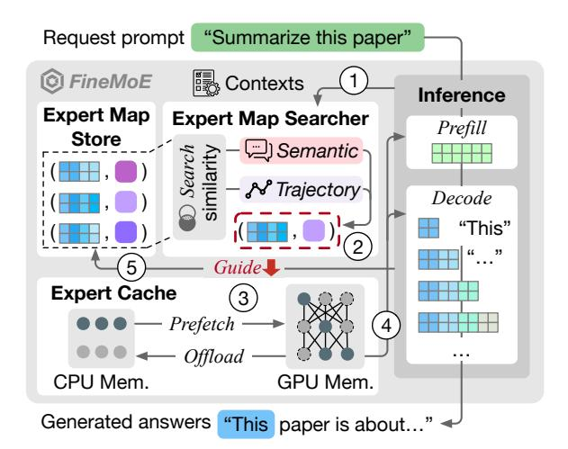
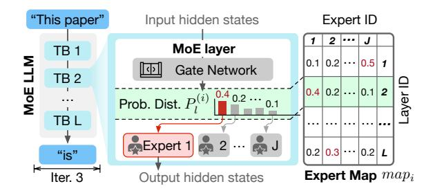
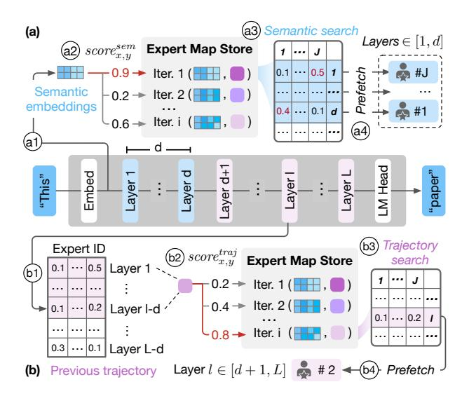

# 3 *FineMoE*'s Overview

## 3.1 Objectives and Challenges

*FineMoE* is designed to achieve the following three goals:

Memory-efficient MoE serving with minimal inference latency. We have demonstrated that existing expert offloading solutions [\[16,](#page-14-9) [51,](#page-15-8) [58\]](#page-15-9) fail to tame the latency-memory trade-off in MoE serving ([§2.3\)](#page-2-3). We aim to achieve both low memory footprint and inference latency by proposing finegrained expert offloading.

Minimize expert miss due to mispredictions in expert prefetching. Expert prefetching, involving future expert activation predictions, is an essential step in expert offloading solutions. However, a recent study [\[51\]](#page-15-8) has shown that *expert miss* due to mispredictions can cause high on-demand expert loading delay in inference. We should minimize expert miss and mitigate mispredictions in expert offloading.

Adapt to heterogeneous MoE models and prompts. MoE inference can serve heterogeneous models [\[11,](#page-14-6) [23,](#page-14-7) [50,](#page-15-5) [57,](#page-15-6) [60\]](#page-15-7) with varying prompts [\[49,](#page-15-20) [64\]](#page-15-19) in real-world scenarios. While existing solutions handle different models and prompts with a one-fits-all design, we should design our expert offloading to adapt to the heterogeneity in MoE serving.

We must address three critical challenges to realize the above objectives:

How to maximize expert hit rate when prefetching and offloading experts? Expert hit rate directly relates to the inference latency. With more experts being hit, fewer experts need to be loaded on demand. We propose a fine-grained expert offloading solution to achieve a high expert hit rate.

How to adapt to different MoE models and prompts? Heterogeneous MoE models and input prompts exhibit unique system and semantic characteristics. We should craft our solution with fine-grained optimizations to enable adaptivity.

How to avoid additional system overheads when managing experts? Our design must not introduce additional system overheads when serving existing MoE LLMs. We apply a series of system optimizations in *FineMoE* to ensure serving efficiency and minimize additional overheads.

## 3.2 Architecture and Workflow

Figure [5](#page-4-0) describes the architecture and workflow of *FineMoE*, which consists of three main components:

Expert Map Store. We record *expert maps*, a new data structure defined in *FineMoE*, to track *fine-grained* expert activation patterns from historical request prompts. expert maps provide nuance expert selection preferences over existing coarse-grained expert tracking methods (*e.g.*, Expert Activation Matrix in MoE-Infinity [\[58\]](#page-15-9)). The Expert Map

Figure 5. *FineMoE*'s architecture and workflow.

Store dynamically keeps the most useful and unique expert maps for real-time inferences.

Expert Map Searcher. When a request prompt arrives, *FineMoE* searches the Expert Map Store for appropriate expert maps to guide expert prefetching before inference. expert map search is guided by calculating similarity scores in two folds: *semantic* and *trajectory* similarity.

Expert Cache. After receiving the searched expert maps, *FineMoE* prefetches experts from CPU memory to GPU to perform computations in inference. *FineMoE* evicts and offloads low-priority expert weights to CPU memory if exceeding Expert Cache capacity.

*FineMoE* follows the five steps below to enable memoryefficient MoE serving with minimal inference latency:

Step 1 : Inference context collection. Before every inference iteration, *FineMoE* collects necessary *contexts*, such as semantic embeddings and previous expert activation trajectories ([§4.1\)](#page-5-0), and feeds them to the Expert Map Searcher for hybrid similarity searching.

Step 2 : Expert map similarity searching. After receiving iteration-level contexts, the Expert Map Searcher identifies the most similar expert maps by comparing the input context data with historical context data in the Expert Map Store ([§4.2\)](#page-6-0). The retrieved expert maps are forwarded to the Expert Cache to guide expert prefetching and offloading decisions.

Step 3 : Guided expert prefetching and offloading. We dynamically compute expert selection thresholds to determine which expert(s) to prefetch and offload in the MoE model guided by the searched expert maps ([§4.3\)](#page-7-0). Then, *FineMoE* prefetches the expert weights from CPU to GPU memory and offloads cached experts from GPU to CPU when reaching the cache limit ([§4.5\)](#page-8-0).

Step 4 : Expert serving. The whole inference process consists of one iteration in the Prefill stage and multiple iterations in the Decode stage. For each MoE layer in every iteration, FineMoE directly serves the expert required by the gating network if the corresponding weights are available in the GPU memory (defined as an expert hit). Otherwise, FineMoE on-demand loads the expert weights from CPU to GPU to perform lossless serving (defined as an expert miss).

Step (5): Expert map update. FineMoE observes new expert maps produced after each iteration and updates them in the Expert Map Store (§4.4). When reaching the store capacity (e.g., 1K expert maps), FineMoE deduplicates the Expert Map Store by identifying and dropping redundant expert maps to maintain diversity, maximizing the possibility of providing effective expert maps for any request prompts.

#### 3.3 Problem Formulation

We consider serving an MoE-based LLM with L MoE layers on a GPU cluster, where each MoE layer has one gating network and J experts. The gating network of each layer selects top  $K \in [1, J]$  experts for computation. The MoE model processes and generates answers for a workload consisting of W unique request prompts. Let  $[W] := \{1, \ldots, w, \ldots, W\}$  denote the set of all requests,  $[L] := \{1, \ldots, l, \ldots, L\}$  denote the set of all layers in a MoE model, and  $[J] := \{1, \ldots, j, \ldots, J\}$  denote the set of all experts in a layer, respectively. Each request prompt  $w \in [W]$  consists of multiple iterations processed during the prefill and decode stages. Let  $E_{l,j}^{(i)}$  denote the j-th expert at the l-th layer in the i-th iteration, where  $l \in [L]$ ,  $j \in [J]$ , and  $i \in [w]$ . During each iteration i, we can make at most  $l \in [L]$  prefetching decisions. Let  $l \in [L]$  and  $l \in [L]$  denote the set of cached experts and the set of activated experts for Iteration l, respectively. Hence, we represent the result of whether an expert  $l \in [L]$  is missed by  $l \in [L]$ .

$$R_{l,j}^{(i)} = \begin{cases} 1, & \text{if } (E_{l,j}^{(i)} \in E_{activate}^{(i)}) \wedge (E_{l,j}^{(i)} \notin E_{cache}^{(i)}), \\ 0, & \text{otherwise,} \end{cases}$$

where  $R_{l,j}^{(i)} = 1$  means  $E_{l,j}^{(i)}$  is a miss and requires on-demand loading from CPU memory. Since all experts in an MoE model are typically designed to have the same weight size, we assume experts' loading time  $T_e$  and memory footprint  $M_e$  are homogenous.4 Therefore, the total on-demand loading latency T is summed across all iterations for each expert during the inference process:

$$T := T_e \cdot \sum_{w \in [W]} \sum_{i \in [w]} \sum_{l \in [L]} \sum_{j \in [J]} R_{l,j}^{(i)}.$$

Finally, employing the above definitions, we formulate the MoE expert offloading as an integer linear programming (ILP)

**Figure 6.** Expert selections tracked by an expert map.

optimization problem:

$$\min_{\{E_{l,j}^{(i)}\}} \left( T_e \cdot \sum_{w \in [W]} \sum_{i \in [w]} \sum_{l \in [L]} \sum_{j \in [J]} R_{l,j}^i \right) 
\text{s.t. } |E_{cache}^{(i)}| \le L \cdot J, \quad \forall i \in [w], \ \forall w \in [W], \tag{1}$$

$$|E_{activate}^{(i)}| = L \cdot K, \quad \forall i \in [w], \ \forall w \in [W],$$
 (2)

$$|E_{cache}^{(i)}| \cdot M_e \le M, \quad \forall i \in [w], \ \forall w \in [W].$$
 (3)

The objective is to minimize the on-demand loading latency (ideally T=0 with perfect predictions) while limiting the total memory footprint of cached experts to satisfy the available GPU memory M. Constraint 1 denotes the total number of prefetched experts should not exceed the total number of all experts in the MoE model. Constraint 2 represents the total number of activated experts, which must be the same as the total number of top K experts summed across all L layers. Constraint 3 describes the total memory footprint of prefetched experts must be limited by the available GPU memory size. Note that solving the ILP problem is already NP-hard [10], while in reality, prefetching experts always have mispredictions that further complicate the problem. Therefore, we opt for a heuristic-based design for FineMoE.

## 4 FineMoE's Design

## 4.1 Expert Maps

We propose a new data structure, *Expert Map*, to track expert activation patterns with a fine granularity. Figure 6 depicts the structure of an expert map. During the *i*-th iteration, the *l*-th self-attention layer first calculates the attention states. The gate network receives attentions and computes a probability distribution  $P_l^{(i)} \in \mathbb{R}^J$  over all the experts at Layer l:

$$\mathbf{P}_l^{(i)} := \left\{ p_{l,1}^{(i)}, \dots, p_{l,j}^{(i)}, \dots, p_{l,J}^{(i)} \right\}, \quad \sum_{j \in [J]} p_{l,j}^{(i)} = 1, \ \forall p_{l,j}^{(i)} \geq 0.$$

Then, top  $K \in [1, J]$  experts are selected from  $P_l^{(i)}$  to compute representations for Layer l. We collect the probability distributions  $P_l^{(i)}$  across all L layers to form the expert map of Iteration i.

$$map_i := \{\mathbf{P}_1^{(i)}, \dots, \mathbf{P}_l^{(i)}, \dots, \mathbf{P}_L^{(i)}\}, \quad l \in [L].$$

&lt;sup>4We only consider selective experts. Some MoE models, such as Qwen1.5-MoE-A2.7B, have a few always-on experts that are not offloadable.

**Figure 7.** Workflow of *FineMoE*'s expert map search.

By tracking expert maps, we guide *FineMoE* to discover fine-grained expert patterns—the iteration-level expert selection preferences via probability distributions. Intuitively, analyzing probability distributions enables *FineMoE* to not only identify which experts are binarily selected or omitted, but also to assess the confidence or preference assigned to each expert from the perspective of the gate networks.

The design of expert maps has two key advantages over existing coarse-grained expert tracking methods (*e.g.*, MoE-Infinity [58] tracks the request-level expert hit counts). *First*, existing works only focus on *aggregated* request-level expert activations, whereas an expert map tracks individual iterations with detailed expert selections. *Second*, existing works only record the expert hit counts, whereas we track detailed probability distributions. Note that expert maps can easily recover coarse-grained information by applying a top *K* selection operator to the probability distributions and aggregating expert counts over iterations, therefore generalizing to existing tracking methods.

#### 4.2 Expert Map Search

Given the historical expert maps defined in §4.1, *FineMoE* searches expert maps that provide the most accurate expert activation predictions with two fine-grained metrics: semantic similarity (§4.2.1) and trajectory similarity (§4.2.2). We also show that they are both effective in searching accurate historical expert maps for prediction and offloading (§4.2.3).

Existing solutions [16, 51, 58] *cannot* observe previous expert patterns for prediction and prefetching before the target layer is ready to activate experts for the initial layers  $l \in [1, d]$ , where l represents the current layer index in an iteration and d is referred as the *prefetch distance*. When predicting and prefetching experts for MoE models, *prefetch distance* is used

to avoid impacting inference latency [51, 62]. Prefetch distance is the number of layers ahead that a prefetch instruction is issued before the target layer activates its experts, similar to the same term in memory prefetching [29]. An ideal prefetch distance should perfectly overlap the prediction and prefetching operation overheads with the inference process.

Therefore, existing approaches [16, 51, 58] typically employ coarse-grained rules to prefetch experts for initial layers  $l \in [1, d]$ . For example, MoE-Infinity [58] prefetches the most popular experts across all historical data points. Even for layers  $l \in [d + 1, L]$ , existing approaches use coarse-grained (request-level) metrics for predicting and prefetching experts, leading to low offloading accuracy.

In contrast, *FineMoE* leverages fine-grained iteration-level metrics tailored to the prefetch distance *d*, employing semantic embeddings for layers prior to the prefetch distance and expert trajectories for layers subsequent to it. Figure 7 shows that *FineMoE* employs two fine-grained search approaches to jointly search expert maps for guiding expert prefetching: *Semantic-based expert map search* compares the input embeddings with historical embeddings to find expert maps with similar inputs, whereas *trajectory-based search* observes previous expert trajectories (*i.e.*, probability distributions) and searches for similar expert maps. We combine both semantic and trajectory features to improve *FineMoE*'s map-searching and expert offloading accuracy.

4.2.1 Semantic-based Expert Map Search. Recent studies [25] demonstrate that semantic embeddings, i.e., embedding layer's output after processing raw tokens, can potentially indicate expert selection behaviors. When serving request prompts and recording their expert maps, we record the semantic embeddings for each inference iteration. Existing MoE-based LLMs all contain an embedding layer for token semantic encoding, where words or subwords that appear in similar contexts will have similar embeddings [38]. It's natural to extract the semantic embeddings using the output from the model's original embedding layer. Figure 7(a) shows the semantic-based expert map search in four steps: a1) extract semantic embeddings from the embedding layer, a2) compute similarity scores using semantic embeddings with historical data points in the Expert Map Store, a3) search similar expert maps based on similarity scores, and a4) prefetch experts with high probabilities for layers  $l \in [1, d]$ .

For any input prompts, we compute pairwise cosine similarity  $score^{sem} \in \mathbb{R}^{B \times C}$  between the semantic embedding  $sem^{new} \in \mathbb{R}^{B \times h}$  and the collection of historical semantic embeddings  $sem^{old} \in \mathbb{R}^{C \times h}$  in the Expert Map Store:

$$score_{x,y}^{sem} := \frac{sem_x^{new} \cdot sem_y^{old}}{\|sem_x^{new}\| \cdot \|sem_y^{old}\|}, \quad x \in [B], \ y \in [C], \quad (4)$$

where B is the batch size of input prompts, C is the Expert Map Store capacity, and h is the hidden dimension size. Then, for prompt x, the historical Iteration y with the highest score

**Figure 8.** Mean expert hit rates of different semantic and trajectory similarity scores with LMSYS-Chat-1M.

is selected. We use partial expert maps from the selected iteration,  $\{P_1^{(y)}, \dots, P_d^{(y)}\} \in map_u^{old}$ , to guide layers  $l \in [1, d]$ .

**4.2.2 Trajectory-based Expert Map Search.** We leverage expert probability trajectories of previous (l-d) layers to search expert maps for layers  $l \in [d+1, L]$ . Specifically, when l = d+1, we use the past expert trajectories from Layer 1 for prediction; when l = d+2, we use the past trajectories from Layers 1 and 2; and so on. When l = L (last layer), we use the past trajectories from Layers 1 to L-d for prediction. Figure 7(b) shows the trajectory-based expert search for a layer  $l \in [d+1, L]$  in four steps: b1) collect previous trajectory  $\{P_1, \ldots, P_{l-d}\}$  from Layers 1 to l-d, b2) compute similarity scores using collected trajectories with historical data points in the Expert Map Store, b3) search similar expert maps based on similarity scores, and b4) prefetch experts with high probabilities for the layer  $l \in [d+1, L]$ . We repeat this process until the last layer (Layer L) is completed.

Similar to the semantic-based search, we compute pairwise cosine similarity  $score^{traj} \in \mathbb{R}^{B \times C}$  between the observed trajectories,  $map^{new} \in \mathbb{R}^{B \times (l-d)J}$ , and the collection of historical expert maps,  $map^{old} \in \mathbb{R}^{C \times (l-d)J}$ , in the Expert Map Store:

$$score_{x,y}^{traj} := \frac{map_x^{new} \cdot map_y^{old}}{\|map_x^{new}\| \cdot \|map_y^{old}\|}, \quad x \in [B], \ y \in [C]. \tag{5}$$

We select the historical iteration with the highest score. Then, we use  $\mathbf{P}_l^{(y)} \in map_y^{old}$  from the selected expert map to guide the expert prefetching for the target layer  $l \in [d+1,L]$ .

By combining the two expert map search methods, we carefully customize the map that guides expert prefetching for every inference iteration in MoE serving. With this design, expert map search introduces negligible overhead to the end-to-end inference latency, which we demonstrate in §6.8.

## 4.2.3 Effectiveness of Semantic and Trajectory Similar-

ity. To verify how semantic and trajectory similarity scores can guide expert offloading, we run three MoE models (Mixtral-8×7B, Qwen1.5-MoE, and Phi-3.5-MoE) with two datasets (LMSYS-Chat-1M and ShareGPT). For each model and dataset, we first run prompts and record their semantic embeddings and expert trajectories, where each prompt generates one data point consisting of a semantic embedding and an expert map. Then, we exhaust all pairwise cases by calculating their

**Figure 9.** Pearson correlation coefficients between semantic and trajectory similarity scores and expert hit rates.

semantic and trajectory similarity and expert hit rate (*i.e.*, overlapped expert ratio). Figure 8 shows the mean expert hit rates of different semantic and trajectory similarity scores for three MoE models with LMSYS-Chat-1M. Both semantic and trajectory similarity can effectively indicate the accuracy of historical prompts or expert maps for offloading.

To *statistically* quantify the correlations between similarity score and expert hit rate, we calculate the Pearson correlation coefficients [9] using all paired semantic and trajectory similarity scores and corresponding expert hit rates in Figure 8. The Pearson coefficient is commonly used to measure correlations between variables, where a coefficient close to 1 indicates a strong positive correlation and a coefficient close to 0 means a weak correlation. Figure 9 shows the Pearson coefficients between similarity score and expert hit rate with three MoE models and two datasets. The results show that high similarity scores potentially relate to high expert hit rates.

#### 4.3 Expert Prefetching

Given the searched and customized expert map  $P_l^{(i)}$  for a layer  $l \in [L]$  in Iteration i, we explain how it guides FineMoE to dynamically prefetch experts in fine granularity.

**Similarity-aware expert selection.** With the different contexts collected during iterations, expert maps searched by *FineMoE* also have varying similarity scores.5 Figures 8 and 9 demonstrated that similarity scores can effectively indicate the search confidence, where high searched similarity scores potentially mean high expert hit rates. Hence, we design *FineMoE*'s expert prefetching to be similarity-aware. For a layer  $l \in [L]$  with a  $score \in [-1, 1]$  to prefetch, we first dynamically compute an expert selection threshold  $\delta_l \in [0, 1]$ :

$$\delta_l := \text{Clip}(1 - score, 0, 1) = \max(0, \min(1 - score, 1)),$$

where *score* is the cosine similarity score computed in Equations 4 and 5. Given searched  $P_l$ , we find the set of experts to prefetch  $E_{prefetch}$  by iteratively picking the expert with the highest probability from  $P_l = \{p_{l,1}, \dots, p_{l,j}, \dots, p_{l,l}\}$  until the

&lt;sup>5In the following paper, we use "similarity scores" in both search contexts for simplicity, *i.e.*, semantic similarity in semantic-based expert map search and trajectory similarity in trajectory-based search, respectively.

summed probability of  $E_{prefetch}$  exceeds  $\delta_l$ :

$$\min_{\{E_{l,j}\}} |E_{prefetch}| \tag{6}$$

s.t. 
$$\sum_{E_{l,j} \in E_{prefetch}} p_{l,j} \ge \delta_l, \ j \in [J], \ \forall l \in [L], \tag{7}$$

$$|E_{prefetch}| \ge K, K \le [J],$$
 (8)

where K is the number of experts needed to activate per layer (e.g., Mixtral-8×7B activates two experts per layer). Constraint 7 requires the total probability of selected experts to prefetch per layer to be greater than  $\delta_l$ . Constraint 8 represents the minimum number of selected experts must be larger than the number of experts to activate required by the MoE model. Intuitively, we assign a higher  $\delta$  to low-score expert maps so that more experts are prefetched to mitigate mispredictions and assign a lower  $\delta$  for high-score expert maps to reduce the memory footprint. Experts with higher probabilities are prioritized to be prefetched.

Asynchronous expert map searching and prefetching. Existing studies [16, 58] predict and prefetch experts synchronously during inference, severely hindering the inference performance. For example, MoE-Infinity [58] cannot compute forward functions before finishing expert prediction and prefetching at every MoE layer [59]. To minimize the system overhead and inference latency, we decouple the map searching and expert prefetching from the inference process using an asynchronous Publisher-Subscriber architecture (Figure 7). The Expert Map Store is a message broker that keeps messages from both the inference process and the Expert Map Searcher. As the inference proceeds, FineMoE's inference process continuously publishes and writes the inference contexts (i.e., semantic embeddings and expert probability distributions) to the Expert Map Store. At the same time, the Expert Map Searcher subscribes to the context data, searches expert maps based on new context data, and prefetches experts to the Expert Cache in an asynchronous manner.

## 4.4 Expert Map Store Management

Practically, we design *FineMoE*'s Expert Map Store to maintain a capacity *C* for storing unique expert maps. To effectively guide inference across diverse prompts, it makes sense to identify and deduplicate redundant expert maps.

**Expert map deduplication.** Since *FineMoE* uses two approaches (*i.e.*, semantic-based and trajectory-based) to compute similarity, we unify the two similarity scores to compute the pairwise redundancy scores between new iteration data and historical iteration data:

$$RDY_{x,y} := \frac{d}{L} \cdot score_{x,y}^{sem} + \frac{L-d}{L} \cdot score_{x,y}^{traj}, \ x \in [B], \ y \in [C],$$

where  $score_{x,y}^{sem} \in \mathbb{R}^{B \times C}$  and  $score_{x,y}^{traj} \in \mathbb{R}^{B \times C}$  are semantic-based and trajectory-based pairwise similarity scores calculated from Equations 4 and 5, d is the prefetch distance, L is

the total number of layers, B is the batch size of new interaction data, and C is the Expert Map Store capacity. Intuitively, as shown in Figure 7, the semantic-based and trajectory-based similarity scores contribute to the search expert map in proportion to  $\frac{d}{L}$  and  $\frac{L-d}{L}$ , respectively. Therefore, we follow the same ratio to unify and compute the redundancy score. Whenever new iterations' context data arrive at the Expert Map Store, we compute the pairwise redundancy score  $RDY_{x,y}$  to determine which old iterations to drop. Hence, we update the old iterations y (columns in  $RDY_{x,y}$ ) with new iterations x (corresponding rows in  $RDY_{x,y}$ ) in the Expert Map Store.

**Theoretical analysis.** The expert map deduplication can be formulated as a Minimum Sphere Covering problem [17]. Each expert map is a vectorized patch, and the full sphere represents all possible expert selections. The objective is to cover as much of the sphere as possible using a small number of maps, keeping storage overhead low. Studies [15, 46] have proved that maintaining at least 2L I expert maps guarantees a lower bound of 75% expert map similarity (i.e., we can find an expert map that is at least 75% similar to any new iterations), and keeping  $\frac{1}{2}LJ\ln(LJ)$  expert maps provides a lower bound of 98% similarity, where L and J are the numbers of layers and experts per layer in the MoE model, respectively. Given that modern MoE-based LLMs generally have  $L \in [8, 128]$ and  $I \in [24, 96]$ , we can approximate the Expert Map Store's maximal requirement to be less than 50K expert maps with 200 MB CPU memory [58].

#### 4.5 Expert Caching and Eviction

Similar to existing expert offloading solutions [16, 51, 58], we design *FineMoE* to maintain an Expert Cache on GPUs to reuse expert weights when serving different request prompts. Given searched expert maps from §4.2, we guide *FineMoE*'s Expert Cache to compute two priority scores for individual experts: 1) a *prefetching priority* to decide the orders to prefetch experts in the searched maps, and 2) an *eviction priority* to determine the orders to evict experts in the Expert Cache.

**Expert prefetching priority.** Recall the set of experts to prefetch  $E_{prefetch}$  is determined in Equation 6. For each expert  $E_{l,j} \in E_{prefetch}$ , we define the prefetching priority to be

$$PRI_{l,j}^{prefetch} := \frac{p_{l,j}}{l - l_{now}}, \quad l \in [L], \ j \in [J],$$

where  $p_{l,j}$  is the expert probability from the searched expert map, and  $l_{now}$  is the current layer that the inference process stays at. Intuitively, experts with a higher probability  $p_{l,j}$  to be activated should be prefetched sooner, and experts that sit closer to the current layer (*i.e.*, smaller  $l - l_{now}$ ) should also be prioritized.

**Expert eviction priority.** Similar to MoE-Infinity [58], *FineMoE*'s expert caching is based on the least frequently used (LFU) caching algorithm. We integrate the searched map to jointly determine the eviction priority. For each expert

, ∈ *cache*, we define the eviction priority to be

$$PRI_{l,j}^{evict} := \frac{1}{p_{l,j} \cdot freq_{l,j}}, \quad l \in [L], \ j \in [J],$$

where *freq*, is the cache visit frequency and , is the probability from the searched map for an expert , ∈ *cache*. Intuitively, when reaching the Expert Cache limit, we want to first evict experts who are less frequently hit and have lower probabilities of being activated. Note that similar to existing works [\[51,](#page-15-8) [58\]](#page-15-9), we do not consider the recent usage of experts as opposed to the classic least recently used (LRU) algorithm [\[16\]](#page-14-9). Since the expert usage is layer-wise sequential, *i.e.*, one layer following another, prioritizing recently used experts is against the nature of sequential forward computation.

On-demand expert loading. Mispredictions of expert prefetching lead to expert miss in the Expert Cache, as the MoE model cannot find available experts designated by the gate networks. Whenever an expert miss occurs, *FineMoE* pauses all expert prefetching tasks and immediately loads missed experts from CPU to GPU memory for fast serving.

