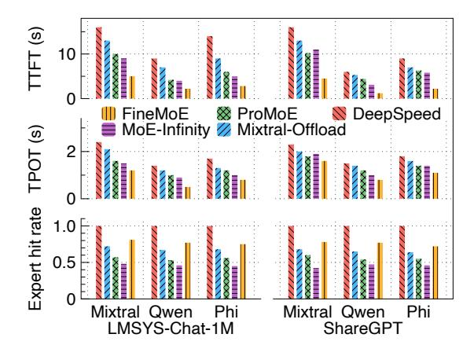
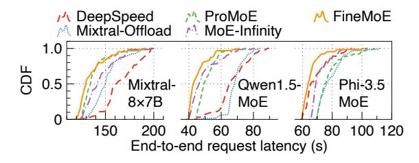
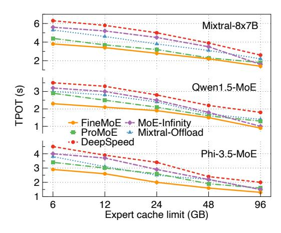
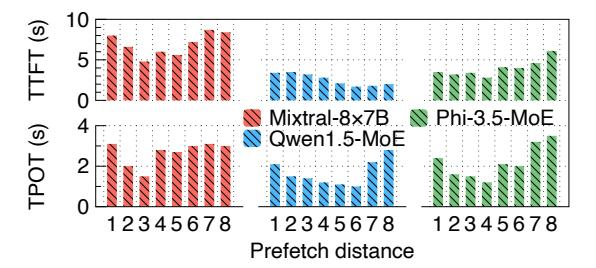
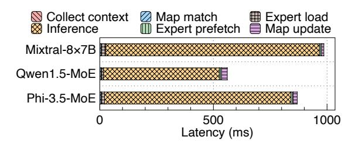
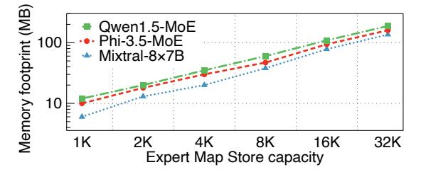

# 6 Evaluation

## 6.1 Experimental Setup

We introduce our evaluation methodology in this section.

Testbed. We conduct all experiments on a six-GPU testbed, where each GPU is an NVIDIA GeForce RTX 3090 with 24 GB GPU memory. All GPUs are interconnected using pairwise NVLinks and connected to the CPU memory using PCIe 4.0 with 32GB/s bandwidth. Additionally, the testbed has an AMD Ryzen Threadripper PRO 3955WX CPU with 32 cores and 480 GB CPU memory.

Models. We employ three popular MoE-based LLMs in our evaluation: Mixtral-8×7B [\[23\]](#page-14-7), Qwen1.5-MoE [\[60\]](#page-15-7), and Phi-3.5-MoE [\[1\]](#page-14-5). Table [1](#page-2-1) describes the parameters, number of MoE layers, and number of experts per layer for the three models. Following the evaluation of existing works [\[51\]](#page-15-8), we profile the models to set the optimal prefetch distance to three before evaluation.

Datasets and traces. We employ two real-world prompt datasets commonly used for LLM evaluation: LMSYS-Chat-1M [\[64\]](#page-15-19) and ShareGPT [\[49\]](#page-15-20). For most experiments, we split the sampled datasets in a standard 7:3 ratio, where 70% of the prompts' context data (*i.e.*, semantic embeddings and expert maps) are stored in *FineMoE*'s Expert Map Store, and 30% of the prompts are used for testing. For online serving experiments, we empty the Expert Map Store and use real-world LLM inference traces [\[43,](#page-15-13) [52\]](#page-15-27) released by Microsoft Azure to set input and generation lengths and drive invocations.

Baselines. We compare *FineMoE* against four SOTA MoE serving baselines: 1) MoE-Infinity [\[58\]](#page-15-9) uses coarse-grained request-level expert activation patterns and synchronous expert prediction and prefetching for MoE serving. We prepare the expert activation matrix collection for MoE-Infinity before evaluation for a fair comparison. 2) ProMoE [\[51\]](#page-15-8) employs a stride-based speculative expert prefetching approach for MoE serving. Since the codebase of ProMoE is not open-sourced and requires training predictors for each MoE model, we reproduced a prototype of ProMoE on top of MoE-Infinity in our best effort. 3) Mixtral-Offloading [\[16\]](#page-14-9) combines a layer-wise speculative expert prefetching and a LRU-based expert cache. 4) DeepSpeend-Inference [\[4\]](#page-14-8) employs an expert-agnostic layer-wise parameter offloading approach, which uses pure on-demand loading and does not support prefetching. We implement the offloading logic of DeepSpeed-Inference in the MoE-Infinity codebase and add an expert cache for a fair comparison. We enable all baselines to serve MoE models from HuggingFace Transformer [\[55\]](#page-15-10).

Metrics. Following the standard evaluation methodology of existing works [\[3,](#page-14-10) [51,](#page-15-8) [58,](#page-15-9) [65\]](#page-15-12) on LLM serving, we report the performance of the prefill and decode stages separately. We measure Time-to-First-Token (TTFT) for the prefill stage and Time-Per-Output-Token (TPOT) for the decode stage. Additionally, we also report other system metrics, such as expert hit rate and overheads, for detailed evaluation.

## 6.2 Offline Serving Performance

We first evaluate the offline serving performance of prefill and decode stages when running *FineMoE* and other baselines

Figure 10. Overall performance of prefill and decode stages.

Figure 11. CDF of request latency for MoE online serving.

with the three MoE models, where we report Time-To-First-Token (TTFT) and Time-Per-Output-Token (TPOT). Similar to existing works [3, 65], we measure TTFT and TPOT for individual prompts for each combination of model and dataset. For evaluation with LMSYS-Chat-1M and ShareGPT datasets, the input lengths are set to 37 and 43 tokens, and generation lengths to 127 and 122 tokens, which are the mean values calculated across datasets, respectively. For each dataset, we randomly sample 64 prompts and report average results.

Figure 10 shows the TTFT, TPOT, and expert hit rate of *FineMoE* and four baselines when serving three MoE models with LMSYS-Chat-1M and ShareGPT datasets, respectively. DeepSpeed-Inference has both the worst TTFT and TPOT due to expert-agnostic offloading and lacking expert prefetching. While Mixtral-Offloading, ProMoE, and MoE-Infinity perform better than DeepSpeed-Inference, they are underperformed by *FineMoE* because of coarse-grained offloading designs. Compared to DeepSpeed-Inference, Mixtral-Offloading, ProMoE, and MoE-Infinity, *FineMoE* reduces the average TTFT by 74%, 67%, 56%, and 53%, and reduces the average TPOT by 46%, 38%, 27%, and 22%, respectively.

For expert hit rate, DeepSpeed-Inference has no expert misses because it fetches whole layers with full experts, but with the worst latency due to pure on-demand loading. Mixtral-Offloading achieves a higher hit rate than ProMoE and MoE-Infinity because of its synchronous speculative

**Figure 12.** Performance under varying expert cache limits.

prefetching with a prefetch distance of 1. However, due to synchronous prefetching, its TTFT and TPOT are worse than others except DeepSpeed-Inference. Overall, *FineMoE* improves the average expert hit rate by 14%, 37%, and 68% over Mixtral-Offloading, ProMoE, and MoE-Infinity, respectively.

#### **6.3** Online Serving Performance

Except for the offline evaluation (*i.e.*, Expert Map Store in full capacity before serving), we also evaluate *FineMoE* against other baselines in online serving settings. We empty the Expert Map Store of *FineMoE* and the expert activation matrix collection of MoE-Infinity for the online serving experiment. The request traces are derived from Azure LLM inference traces [43, 52], with randomly sampled 256 requests (2.91 requests per second), to drive LMSYS-Chat-1M prompts for each MoE model serving. To ensure consistency, *FineMoE* and all baselines input and generate the exact number of tokens specified in the traces. Figure 11 illustrates the CDF of end-to-end request latency across three MoE models. The results demonstrate that *FineMoE* significantly reduces overall request latency compared to other baselines in online serving.

#### **6.4** Impact of Expert Cache Limits

We measure the TPOT of *FineMoE* and other baselines by limiting the expert cache memory budget to investigate their performance in the latency-memory trade-off (§2.3). We mainly focus on TPOT to show the end-to-end performance impacted by varying cache limits. Figure 12 shows the TPOT of *FineMoE* and four baselines when serving three MoE models under different expert cache limits. We gradually increase the GPU memory allocated for caching experts from 6 GB to 96 GB while employing the same experimental setting in §6.2. Similarly, DeepSpeed-Inference has the worst TPOT due to being expert-agnostic. *FineMoE* consistently outperforms Mixtral-Offloading, ProMoE, and MoE-Infinity under varying expert cache limits. As the cache limit increases, the performance gap between all baselines narrows due to the

**Figure 13.** Performance on high-end GPU testbed.

(a) Expert pattern tracking approaches. (b) Prefetch and caching.

**Figure 14.** Ablation study of *FineMoE*.

increased availability of cached experts. Nevertheless, for limited GPU memory sizes (*e.g.*, 6GB), *FineMoE* reduces the TPOT by 36%, 25%, 16%, and 29%, compared to DeepSpeed-Inference, Mixtral-Offloading, ProMoE, and MoE-Infinity, across three MoE models, respectively. With fine-grained expert offloading, *FineMoE* significantly reduces the expert on-demand loading latency while maintaining a lower GPU memory footprint, therefore achieving a better spot in the latency-memory trade-off of MoE serving.

#### 6.5 Impact of GPU Performance

To evaluate the impact of GPU performance on offloading methods, we repeat the experiments using LMSYS-Chat-1M on an NVIDIA A100 testbed equipped with 80 GB of HBM2e memory and a peak memory bandwidth of 2 TB/s. Figure 13 presents the serving performance of *FineMoE* and the baselines across the three MoE models. *FineMoE* achieves smaller performance gains on the A100 than on the 6×3090 testbed, since high-end GPUs and the lack of EP yield faster inference and lower offloading overhead. Nevertheless, *FineMoE* consistently outperforms all baselines. The expert hit rate remains largely unaffected, as GPU performance has less impact on expert predictions.

## 6.6 Ablation Study

We present the ablation study of *FineMoE*'s design.

**Effectiveness of expert map search.** One of *FineMoE*'s key designs is the expert map, which tracks expert selection

**Figure 15.** Performance with different prefetch distances.

**Figure 16.** Sensitivity analysis of *FineMoE*.

preferences in fine granularity. We evaluate the effectiveness of the expert map against five expert pattern-tracking approaches as follows. 1) Speculate: speculative prediction used by Mixtral-Offloading [16] and ProMoE [51], 2) **Hit count**: request-level expert hit count used by MoE-Infinity [58], 3) **Map** (T): expert map with only trajectory similarity search, 4) Map (T+S): expert map with both trajectory and semantic similarity search but statically select top-K experts to prefetch, and 5) **Map** (**T**+**S**+ $\delta$ ): expert map with full features enabled, including trajectory and semantic similarity search (§4.2) and dynamically selecting experts to prefetch (§4.3). We implement the above methods in *FineMoE*'s Expert Map Searcher for a fair comparison. Figure 14a shows the expert hit rate of the above expert pattern tracking methods. Speculative prediction is effective due to the widespread presence of residual connections in Transformer blocks. However, its effectiveness decreases drastically as prefetch distance increases [51]. The request-level expert activation count has the worst performance due to coarse granularity. As features are incrementally restored to FineMoE's expert map, the expert hit rate gradually increases, demonstrating its effectiveness.

Effectiveness of expert prefetching and caching. We evaluate *FineMoE*'s expert prefetching and caching against two caching algorithms: 1) **LRU** used by Mixtral-Offloading [16] and 2) **LFU** used by MoE-Infinity [58]. Figure 14b depicts the expert hit rate of *FineMoE* and two baselines. The results show that LRU performs poorly in expert offloading scenarios. Though LFU achieves a higher hit rate than LRU, *FineMoE* surpasses both, achieving the highest expert hit rate.

#### 6.7 Sensitivity Analysis

We analyze the sensitivity of prefetch distance of MoE models, Expert Map Store capacity, and inference batch size.

**Figure 17.** Latency breakdown of *FineMoE*'s one iteration.

**Prefetch distance of MoE models.** Figure 15 shows the TTFT and TPOT of *FineMoE* when serving three MoE models with different prefetch distances. We have demonstrated that the expert hit rate decreases when gradually increasing the prefetch distance (Figure 4). When the prefetch distance is small, *FineMoE* cannot perfectly hide its system delay from the inference process, such as the map searching and expert prefetching, leading to an increase in inference latency. With larger prefetch distances, *FineMoE* has worse expert hit rates that also degrade performance. Therefore, we set the prefetch distance *d* to 3, 6, and 4 for Mixtral-8×7B, Qwen1.5-MoE, and Phi-3.5-MoE, respectively.

Capacity of Expert Map Store. We measure the mean semantic and trajectory similarity scores searched in *FineMoE*'s expert map searching for MoE model serving. Figure 16(a) presents the mean semantic and trajectory similarity scores of *FineMoE* with different Expert Map Store capacity sizes. Both semantic and trajectory similarity scores improve as the store capacity increases. While the similarity scores exhibit a significant increase with capacities below 1K, further capacity expansion yields diminishing similarity gains. To minimize *FineMoE*'s memory overhead, we set *FineMoE*'s Expert Map Store capacity to 1K in evaluation.

**Inference batch size.** We investigate the impact of inference batch size on *FineMoE* and three baselines using Mixtral-8×7B with LMSYS-Chat-1M. Figure 16(b) presents the performance of *FineMoE*, Mixtral-Offloading, ProMoE, and MoE-Infinity as the batch size increases from one to eight. *FineMoE* achieves the lowest TTFT and TPOT in most cases.

#### 6.8 System Overheads

We measure and report the system overheads of *FineMoE*.

Latency overheads of *FineMoE*'s operations. Figure 17 shows the latency breakdown of one inference iteration in *FineMoE* when serving the three MoE models. We report operation overheads of *FineMoE*, including context collection, map searching, expert on-demand loading, expert prefetching, and map update after the iteration completes. Qwen1.5-MoE has lower end-to-end iteration latency than Mixtral-8×7B and Phi-3.5-MoE because of significantly fewer parameters. Note that expert prefetching, map searching, and map update tasks are executed asynchronously, aside from the inference process. Hence, they do not contribute to the end-to-end iteration latency. Excluding three asynchronous tasks, the total

**Figure 18.** CPU memory footprint of *FineMoE*'s Expert Map Store with different capacity.

delay incurred by other operations is consistently less than 50ms (1% of the iteration) across three MoE models, which is negligible compared to the inference latency.

Memory overheads of *FineMoE*'s Expert Map Store. Figure 18 shows the CPU memory footprint of *FineMoE*'s Expert Map Store when varying the store capacity from 1K to 32K maps. The memory needed to store expert maps for Qwen1.5-MoE is more than Mixtral-8×7B and Phi-3.5-MoE because it has more experts per layer over the other two models, which increases the map shape. Even for the largest capacity (32K), the Expert Map Store requires less than 200MB of memory to store the maps, which is trivial since modern GPU servers usually have abundant CPU memory (*e.g.*, p4d.24xlarge on AWS EC2 [5] has over 1100 GB of CPU memory). In evaluation, *FineMoE*'s map store capacity with 1K maps is sufficient for maintaining performance (§6.7), resulting in minimal memory overhead.

#### 7 Discussion

In this section, we compare the heuristic-based *FineMoE* with Neural Network (NN)-based predictors, analyze the impact of model parallelism on *FineMoE*'s performance, and discuss how *FineMoE* can be extended to other MoE architectures.

NN-based predictors. NN-based predictors for expert offloading are impractical due to multiple sources of overhead. First, they often introduce sub-second inference latency, comparable to MoE inference latency itself. Second, they require extensive data collection, hour-long per-layer training, and frequent retraining to adapt to workload shifts. Third, they consume substantial GPU memory, as prior work [51] reports millions of parameters per MoE layer. Moreover, they are incompatible with *FineMoE* 's fine-grained design: training on fine-grained data hinders convergence, while storing iteration-level probabilities generates large volumes that further prolong training and limit feasibility. Therefore, we adopt a heuristic-based design rather than NN-based approaches.

**Impact of EP and tensor parallelism (TP).** Higher EP distributes experts across more devices and enables greater expert replication, which can increase *FineMoE* 's offloading opportunities and memory savings. In contrast, higher TP raises the overhead of offloading operations, since dense model components are split across devices and require coordinated offloading and reloading. As noted in prior work [11, 35],

production MoE systems generally avoid high TP because its communication costs outweigh performance benefits. In large-scale deployments (*e.g.*, DeepSeek [\[35\]](#page-15-28)), MoE systems usually use low EP during prefill to maximize throughput, while adopting high EP during decode to enable higher expert redundancy. Though high-EP decode reduces per-GPU expert occupancy, the larger number of expert replicas (*e.g.*, 2× more than prefill in DeepSeek [\[35\]](#page-15-28)) creates additional offloading opportunities by allowing experts to be compacted onto fewer devices.

Adaptation to other MoE architectures.. *FineMoE* can be easily integrated with different MoE architectures. For shared experts, we treat them as always-hit during expert prediction. One of our evaluated models, Qwen1.5-MoE, includes shared experts that are used by all tokens. For multigating MoE, we can extend the expert map search by recording each gate's probability distribution and flattening the outputs into a single vector for efficient similarity computation. This enables unified handling across diverse routing schemes.

