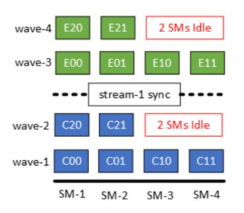

# A Framework for Fine-Grained Synchronization of Dependent GPU Kernels

Abhinav Jangda Microsoft Research United States Saeed Maleki Microsoft Research United States Maryam Mehri Dehnavi University of Toronto Canada Madan Musuvathi Microsoft Research United States

Olli Saarikivi Microsoft Research United States

Abstract—Machine Learning (ML) models execute several parallel computations including Generalized Matrix Multiplication, Convolution, Dropout, etc. These computations are commonly executed on Graphics Processing Units (GPUs), by dividing the computation into independent processing blocks, known as tiles. Since the number of tiles are usually higher than the execution units of a GPU, tiles are executed on all execution units in one or more waves. However, the number of tiles is not always a multiple of the number of execution units. Thus, tiles executed in the final wave can under-utilize the GPU.

To address this issue, we present cuSync, a framework for synchronizing dependent kernels using a user-defined fine-grained synchronization policy to improve the GPU utilization. cuSync synchronizes tiles instead of kernels, which allows executing *independent* tiles of *dependent* kernels concurrently. We also present a compiler to generate diverse fine-grained synchronization policies based on dependencies between kernels. Our experiments found that synchronizing CUDA kernels using cuSync reduces the inference times of four popular ML models: MegatronLM GPT-3 by up to 15%, LLaMA by up to 14%, ResNet-38 by up to 22%, and VGG-19 by up to 16% over several batch sizes.

Index Terms—CUDA, GPU, Generalized Matrix Multiplication, Convolution, Fine-Grained Synchronization, Machine Learning

#### I. INTRODUCTION

The trend of larger Machine Learning (ML) models has delivered remarkable results in multiple domains. These results have exploded the demand of ML models in innumerable applications. To serve this demand, the infrastructure for running inference on these large models has also scaled up exponentially. Hence, optimizing for even the last percentage in the inference can lead to huge savings in cost and energy of serving these models.

ML models are typically served using multiple GPUs because these models consist of embarrassingly parallel operations, such as Generalized Matrix Multiplication (GeMM), 2-D Convolution (Conv2D) etc. The traditional approach to execute a computation on a GPU breaks down the computation into multiple independent blocks, known as *tiles*. Each tile is computed by a fixed size block of threads, known as a *thread block*, which runs on an execution unit of the GPU known as a *Streaming Multiprocessor* (SM). Often the number of thread blocks are higher than the number of SMs. Therefore, all thread blocks are executed in one or more *waves*, with initial full waves executing thread blocks that are a multiple of the number of SMs and the final partial wave executing

TABLE I: Number of thread blocks (TBs), thread blocks per wave, waves, and GPU utilization of two dependent GeMMs in MegatronLM GPT-3 [12] on several batch sizes when executing on an NVIDIA Tesla V100 containing 80 SMs.

| Batch | GeMM     | TBs        | TBs per Wave | Waves | Utili- zation |
|-------|----------|------------|-----------------|-------|------------------|
| 256   | Producer | [1, 48, 4] | 2×80            | 1.2   | 60%              |
| 236   | Consumer | [1, 96, 2] | 2×80            | 1.2   | 60%              |
| 512   | Producer | [2, 24, 2] | 1×80            | 1.2   | 60%              |
|       | Consumer | [2, 48, 1] | 1×80            | 1.2   | 60%              |
| 1024  | Producer | [4, 24, 2] | 1×80            | 2.4   | 80%              |
|       | Consumer | [4, 48, 1] | 1×80            | 2.4   | 80%              |

less than the number of SMs thread blocks. When executing a pair of dependent operations, the traditional approach executes these operations on the same *stream*. Executing two or more operations on a stream, ensures that no thread block of a later operation can execute before the thread blocks of all former operations are finished. We call this traditional heavy-weight synchronization approach as *stream synchronization*.

However, this heavy-weight synchronization can lead to the under-utilization of GPU resources in the final wave when thread blocks are not a multiple of SMs. For example, Figure 1a shows that executing 6 tiles of two dependent GeMMs on four SMs require  $\lceil \frac{6}{4} \rceil = 2$  waves for each GeMM. With stream synchronization, no thread block of the second GeMM can execute before all thread blocks of the first GeMM are finished. Thus, as Figure 1b shows, the second partial wave of each GeMM utilizes only two out of four SMs. This under-utilization is prevalent in widely used ML models. Table I shows that during the inference of MegatronLM GPT-3 [12], the two dependent GeMMs achieves 60–80% of utilization on an NVIDIA Tesla V100 GPU because the number of thread blocks are not a multiple of the number of SMs.

The state-of-the-art technique for executing GeMM computations on GPUs, Stream-K [10], can improve the utilization of the final wave of a workload by partitioning tiles of the final wave among multiple thread blocks. However, Stream-K suffers from three issues. First, partitioning a tile among multiple thread blocks requires each thread block to update the tile elements, leading to extra global memory accesses. Second, Stream-K requires different kernel invocations for

(a) Tiled GeMM kernels: A tile  $C_{i,j}$  is computed by multiplying sub-matrices  $A_i$  and  $B_j$ . Similarly, a tile  $E_{i,j}$  is computed by multiplying  $C_i$  with  $D_j$ . Since each tile is computed by one thread block, the tile size of  $4\times 4$  gives the grid size of  $\{\frac{12}{4}, \frac{8}{4}\} = \{3, 2\}$  for both kernels. Both kernels have the occupancy of 1 thread block per SM.

(b) Stream Synchronization synchronizes all thread blocks of both kernels. Thread blocks of both producer  $(C_{i,j})$  and consumer  $(E_{i,j})$  are executed in two waves. The first wave executes four thread blocks and the second wave executes remaining two. In the second wave of both kernels, SM-3 and SM-4 are not utilized.

(c) Fine-grained Synchronization synchronizes only dependent thread blocks (shown as arrows) of both kernels and executes in only three waves. Thread blocks of the consumer-kernel waits using a semaphore until its producer-kernel's thread block has computed the dependent tile. Since in every wave all SMs are utilized, we achieve full utilization.

Fig. 1: Thread block execution with existing stream synchronization and fine-grained synchronization on 4 SMs for two dependent GeMM kernels:  $C_{12\times8} = A_{12\times8} \times B_{8\times8}$  and  $E_{12\times8} = C_{12\times8} \times B_{8\times8}$ .

initial full waves and for the final partial wave. Third, it is not straightforward to extend Stream-K's approach to other tile based computations including Dropout and Softmax.

In this paper, we present several fine-grained synchronization techniques for synchronizing tiles of dependent computations enabling the execution of *independent* tiles of both computations concurrently in the final wave. Figure 1c shows how one of our techniques, tile synchronization, obtains full utilization in our example. We invoke both kernels on separate streams and synchronize only the dependent tiles, thus thread blocks, using a semaphore stored in the GPU memory. Therefore, thread blocks of both kernels are executed in only three waves, leading to full utilization of the GPU. However, as we show in the paper, the granularity of synchronization that provides the best performance depends on computations, data sizes, and GPU architecture. To this end, we propose, cuSync, a framework to efficiently synchronize dependent computations based on user-defined synchronization policies. cuSync contains mechanisms to: (i) ensure that all thread blocks of the producer are executed before the consumer (Section III-B), (ii) allow processing of producer and consumer tiles in an order that minimizes the wait time of synchronization by consumer tiles (Section III-C), (ii) maintain the dependence between tiles of producer and consumer computations using semaphores and memory fences (Section III-D). Furthermore, we propose a DSL to describe dependencies between GPU kernels and a compiler cuSyncGen to generate synchronization policies from the DSL specification for cuSync (Section IV). We described dependencies between computations of several ML models in the DSL and generated synchronization policies for diverse GPU computations, such as GeMM, 2-D Convolutions, and Dropout, using cuSyncGen. Synchronizing GPU computations using cuSync reduces the inference time of several state-of-the-art open source ML models on 8x NVIDIA Tesla V100 GPUs: MegatronLM GPT-3 145 Billion parameter model [12] by 6–15%, LLaMA 65.2 Billion parameter model [15] by 9–14%, ResNet-38 [6] by 5–22%, and VGG-19 [13] by 6–16% (Section V).

