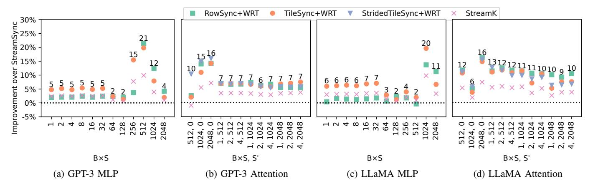
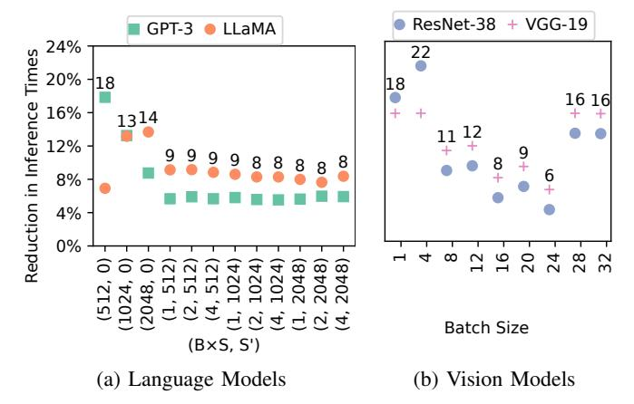

# *D. Maximum Overhead of Synchronization*

The synchronization mechanism has two sources of overhead: global memory accesses and \_\_syncthreads. The percentage of total overhead depends on the amount of computations performed by the GPU kernel. A kernel doing large amount of computations on each tile would suffer from less synchronization overhead than a kernel doing less amount of computations. We can obtain an upper bound on the overhead by having two kernels (i) doing minimum computations on each tile, (ii) execute maximum number of thread blocks per wave, and (iii) execute one full wave.

We design such an experiment where the producer kernel copies values from an input array to an intermediate output array by assigning consecutive threads to contiguous elements, and similarly the consumer kernel copies values from the intermediate array to a final output array. Thus, a thread block of the consumer depends on the same thread block of the producer. We invoke both kernels with the maximum number of thread blocks per wave on Tesla V100, i.e., Number of SMs × M ax Occupancy = 80 × 16 = 1280. We found that synchronization using cuSync leads to 2-3% overhead over StreamSync. Hence, cuSync's synchronization mechanism provides low overhead.

## *E. Large Language Model Inference Results*

We now evaluate the reduction in the inference times of GPT-3 and LLaMA with model parallelism on 8 GPUs using cuSync for both prompt processing and token generation phase (Figure [2\)](#page-2-0). In prompt processing, we consider the total number of tokens in an inference task, i.e., B×S from 512 to 2048, and in token generation, we consider batched requests, i.e., B from 1 to 4 with number of already generated tokens, i.e. S' from 512 to 2048. We used cuSyncGen to generate the following policies:

RowSync+WRT synchronizes rows and executes thread blocks in the row major order by adding our optimizations of Section [IV-C,](#page-6-0) i.e., avoiding the wait-kernel (W), avoiding custom tile order (T), and reorder tile loads (R).

TileSync synchronizes tiles and executes thread blocks in the row major order.

TileSync+WRT extends TileSync by adding our optimizations of Section [IV-C.](#page-6-0)

Strided+TileSync+WRT, only for Attention, synchronizes the first GeMM with the first GeMM of Cached mechanism using StridedSync, and all other kernels using TileSync (Figure [5b\)](#page-5-1). The policy also add our optimizations of Section [IV-C.](#page-6-0)

Fig. 6: Improvement of cuSync's policies and StreamK in MLP and Attention over StreamSync for batch sizes 1–2048. During prompt processing  $S' = 0, B \times S > 1$  and in token generation  $S' > 1, B \ge 1, S = 1$ . Numbers shows the maximum speedup out of all policies.

TABLE IV: GRID SIZE, NUMBER OF WAVES, TOTAL WAVES AND EXECUTION TIME IN STREAMSYNC AND CUSYNC FOR BOTH GEMMS OF GPT-3'S MLP. THE GRID X AND Y-DIMS ARE OBTAINED BY DIVIDING THE SIZE OF GEMM WITH THE TILE SIZE AND THE Z-DIM IS THE NUMBER OF THREAD BLOCKS USED FOR SPLIT-K.

| Batch | First GeMM             |       | Second GeMM            |       | StreamSync |          | cuSync |        |          | Decrease in |
|-------|------------------------|-------|------------------------|-------|------------|----------|--------|--------|----------|-------------|
| Size  | Grid                   | Waves | Grid                   | Waves | Waves      | Time(µs) | Waves  | Policy | Time(µs) | Runtime     |
| 1–64  | $1 \times 24 \times 4$ | 0.6   | $1\times48\times3$     | 0.9   | 2          | 378      | 1.8    | Tile   | 355      | 5-6.0%      |
| 128   | $1\times24\times3$     | 0.4   | $1\times48\times3$     | 0.9   | 2          | 530      | 1.3    | Tile   | 523      | 2%          |
| 256   | $1\times48\times4$     | 1.2   | $1\times96\times2$     | 1.2   | 4          | 862      | 2.4    | Tile   | 728      | 16%         |
| 512   | $2\times24\times2$     | 1.2   | $2\times48\times1$     | 1.2   | 6          | 1500     | 4.8    | Row    | 1196     | 21%         |
| 1024  | $4\times24\times2$     | 2.4   | $4\times48\times1$     | 2.4   | 5          | 2111     | 3.6    | Row    | 1901     | 10%         |
| 2048  | $8 \times 24 \times 1$ | 2.4   | $8 \times 48 \times 1$ | 4.8   | 8          | 3730     | 7.2    | Row    | 3574     | 4%          |

1) MLP Results: Figure 6a and 6c shows that synchronizing dependent GeMMs of the GPT-3 MLP and LLaMA MLP using cuSync decreases the execution time of both MLPs by up to 20% for different sizes. We discuss these results using Table IV that shows the number of waves for all batch sizes for GPT-3 MLP using both StreamSync and cuSync.

TileSync+WRT performs best for B $\times$ S of 1 to 256 because there is a single thread block in the  $\times$ -dimension of grid (Table IV). The improvement at size 256 is higher than small sizes because TileSync+WRT reduces the number of waves by 1 over StreamSync. On small batch sizes, even though the number of waves is not decreased, TileSync+WRT performs 7% faster because the second GeMM can overlap the loading of  $W_2$  tile into the shared memory with the computation of the first GeMM.

RowSync performs best for sizes greater than 512 because synchronizing over a row once reduces memory accesses than synchronizing over multiple tiles and more number of rows provides more opportunities for overlapping. Therefore, increasing the number of rows also increases the speedup of RowSync from 4% at 256 to 20% at 1024. However, the speedup decreases to 4% at 2048 because the fraction of waves reduced by cuSync decreases with more thread blocks in the grid.

**Effect of Overlapping Kernel Invocations** We measured the time of a kernel invocation is  $\approx 6\mu s$ , which is significantly lower

than the difference in the execution time of StreamSync and cuSync. Table IV shows that the difference in execution times with cuSync and StreamSync is significantly higher than the time to invoke a kernel. Hence, the performance improvement of cuSync is significantly higher than what would be achieved by only overlapping the invocation of the second GeMM with the first GeMM execution.

2) Attention Results: Figure 6b shows that synchronizing all kernels of Attention using cuSync provides 6-16% improvement over StreamSync for both GPT-3 and LLaMA.

During prompt processing, i.e. when S' = 0, StridedTileSync+WRT works better than both RowSync+WRT and TileSync+WRT because StridedTileSync+WRT performs less number of synchronizations than TileSync and provides larger overlapping opportunities than RowSync. During token generation, i.e. when S' = 1 and S = 1, all policies works similarly because different synchronization policies provides best performance between different kernels.

#### F. Computer Vision Model Inference Results

We now evaluate the decrease in inference times of Resnet-38 and VGG-19 by synchronizing all Conv2D kernels of each layer of both models using cuSync (Table II). We used cuSyncGen to generate the following policies:

**RowSync+WRT** synchronizes rows and execute thread blocks in a row major order with our optimizations in Section IV-C, i.e., apply avoid wait-kernel (W), avoiding custom tile ordering

Fig. 7: Performance improvement of cuSync policies for all Conv2D kernels of each layer over StreamSync in ResNet-38 and VGG-19 for different batch sizes.

(T), and reordering tile loads optimizations (R).

**Conv2DTileSync** synchronizes tiles of Conv2Ds and execute thread blocks in a row major order.

**Conv2DTileSync+WRT** extends Conv2DTileSync with our optimizations in Section IV-C.

Figure 7b shows that synchronizing all Conv2D kernels of each layer of ResNet-38 and VGG-19 using cuSync provides up to 24% improvement over StreamSync for different channels and batch sizes. For each channel, the improvement follows an oscillating behavior with increasing batch size, i.e., increases to a local maximum then decreases to a local minimum and finally increases to another local maximum. For example, for 128 channels, the improvement increases from 20% at batch size 1 to 24% at batch 4 and then decreases to 3% at batch size 8, while increasing again to 18% at batch size 12 and then again decreases to 3% at batch size 16. This oscillating behavior is due to the fact that increasing batch size increases invoked number of thread blocks leading to the oscillating behavior of fraction of waves reduced by cuSync.

Fig. 8: Reduction in end-to-end inference times of using cuSync.

#### G. End-to-End Inference of ML Models

We integrated cuSync synchronized CUDA kernels in all four ML models and then evaluate the improvement in end-to-

end inference times of these models. Figure 8 shows that using cuSync synchronized kernels decreases the inference times of GPT-3 by 6–15%, LLaMA by 9–13%, of ResNet-38 by 5–22%, and VGG-19 by 6–16%. Hence, cuSync significantly reduces the inference times of popular ML models.

#### H. Comparison with Stream-K

We also evaluated the performance of cuSync against Stream-K for GeMMs kernels. The best policy of cuSync performs up to 15% better than Stream-K in GPT-3 and LLaMA (Figure 6). The speedup of cuSync over Stream-K is because Stream-K divides the GeMM workload into two kernel calls. The first kernel computes GeMM using the traditional tiled approach for full waves while the second kernel partitions workload of the final wave among all SMs. This design requires multiple memory accesses while cuSync performs a single atomic add to post the status of a computed tile and a read to wait on the status of a producer tile. Moreover, it is not straightforward to apply the idea of Stream-K to all tile-based kernels. Currently, Stream-K only supports GeMM computations in NVIDIA CUTLASS. This is why we cannot apply Stream-K to Conv2D, while cuSync is valid for any tile based kernels.

#### I. Impact of Optimizations

We now discuss the performance improvements provided by the optimizations on top of TileSync for ResNet-38 and GPT-3's MLP. Table Va shows that applying all optimizations decreases execution times for kernels with low thread blocks.

