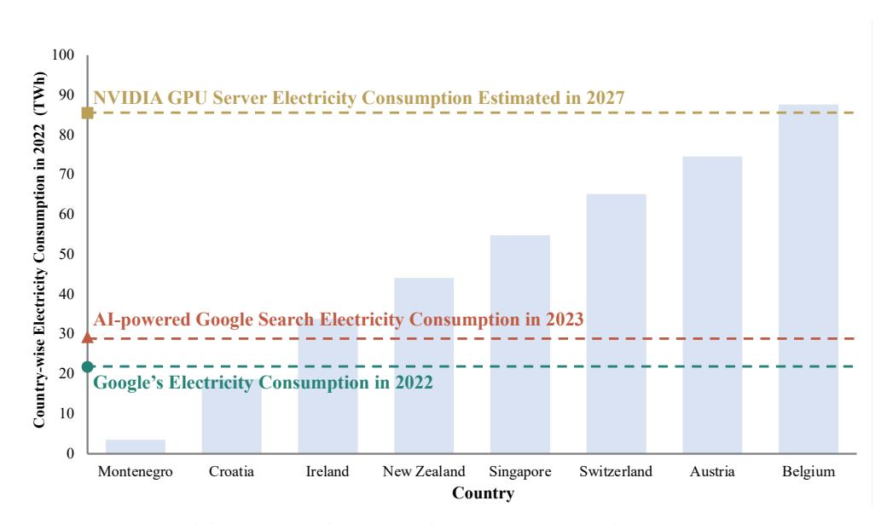
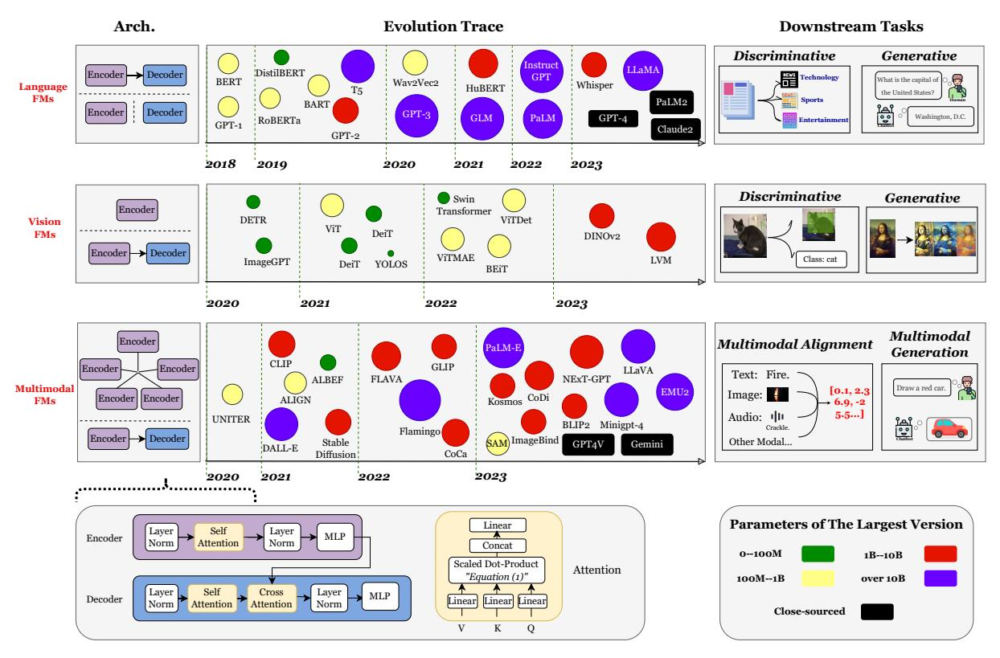
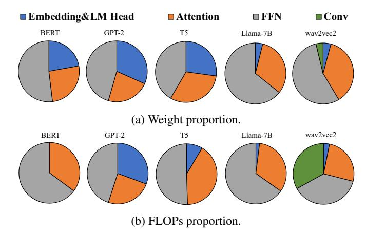
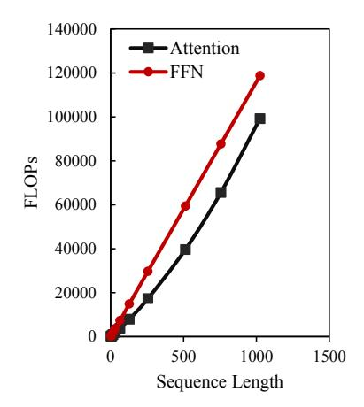

# A SURVEY OF RESOURCE-EFFICIENT LLM AND MULTIMODAL FOUNDATION MODELS

Mengwei Xu‡, Wangsong Yin†, Dongqi Cai‡, Rongjie Yi‡, Daliang Xu†, Qipeng Wang†, Bingyang Wu†, Yihao Zhao†, Chen Yang‡, Shihe Wang‡, Qiyang Zhang‡, Zhenyan Lu‡, Li Zhang‡, Shangguang Wang‡, Yuanchun Li†, Yunxin Liu†, Xin Jin†, Xuanzhe Liu†

- ♣ Beijing University of Posts and Telecommunications (BUPT)
  - ◆ Peking University (PKU)
  - **♥** Tsinghua University (THU)

Contact: mwx@bupt.edu.cn
Website: https:github.com/UbiquitousLearning/Efficient\_Foundation\_Model\_Survey

#### **ABSTRACT**

Large foundation models, including large language models (LLMs), vision transformers (ViTs), diffusion, and LLM-based multimodal models, are revolutionizing the entire machine learning lifecycle, from training to deployment. However, the substantial advancements in versatility and performance these models offer come at a significant cost in terms of hardware resources. To support the growth of these large models in a scalable and environmentally sustainable way, there has been a considerable focus on developing resource-efficient strategies. This survey delves into the critical importance of such research, examining both algorithmic and systemic aspects. It offers a comprehensive analysis and valuable insights gleaned from existing literature, encompassing a broad array of topics from cutting-edge model architectures and training/serving algorithms to practical system designs and implementations. The goal of this survey is to provide an overarching understanding of how current approaches are tackling the resource challenges posed by large foundation models and to potentially inspire future breakthroughs in this field.

**Keywords** Foundation Model · Large Language Model · Vision Transformer · Diffusion Model · Multimodal LLM · Model Compression · Machine Learning System · Serving System · Pre-training · Fine-tuning · Edge Intelligence

#### 1 INTRODUCTION

In the rapidly evolving field of artificial intelligence (AI), a paradigm shift is underway. We are witnessing the transition from specialized, fragmented deep learning models to versatile, one-size-fits-all foundation models. These advanced AI systems are capable of operating in an open-world context, interacting with open vocabularies and image pixels for unseen AI tasks, i.e., zero-shot abilities. They are exemplified by (1) Large Language Models (LLMs) such as GPTs [41] that can ingest almost every NLP task in the form as a prompt; (2) Vision Transformers Models (ViTs) such as Masked Autoencoder [141] that can handle various downstream vision tasks; (3) Latent Diffusion Models (LDMs) such as Stable Diffusion [336] that generate high-quality images with arbitrary text-based prompts; (4) Multimodal models such as CLIP [321] and ImageBind [123] that map different modal data into the same latent space and are widely used as backbone for cross-modality tasks like image retrieval/search and visual-question answering. Such flexibility and generality marks a significant departure from the earlier era of AI, setting a new standard for how AI interfaces with the world.

The success of these foundation models is deeply rooted in their scalability: unlike their predecessors, these models' accuracy and generalization ability can continuously expand with more data or parameters, without altering the underlying simple algorithms and architectures. An impressive evidence is the scaling law [177]: it describes how the performance of transformer-based models can predictably improve with more model size and data volume; until

Figure 1: The electricity consumption comparison between countries and AI. Data source: [\[81\]](#page-41-0).

today, the scaling law stands still. This scalability is not just a matter of model size; it extends to their ability to tackle increasingly complex tasks, making them a cornerstone in the journey towards artificial general intelligence (AGI).

However, the scalability comes at a cost of huge resource demand. Foundation models, by their very nature, are resource-hungry for training and deployment. These resources encompass not only the computing processors like GPUs and TPUs, but also the memory, energy, and network bandwidth. For example, the pre-training of LLaMa-2- 70B takes 1.7× millions of GPU hours and consumes 2.5×1012 Joules of energy. The estimated total emissions were 291 tons of CO2 equivalent. Beyond training, the data processing, experimentation, and inference stages consume comparable or even more electricity according to Meta AI [\[416\]](#page-60-0). A recent analysis [\[81\]](#page-41-0) reveals that, to satisfy the continuation of the current trends in AI capacity and adoption, NVIDIA needs to ship 1.5 million AI server units per year by 2027. These servers, running at full capacity, would consume at least 85.4 terawatt-hours of electricity annuall – more than what many countries like New Zealand and Austria use in a whole year, as illustrated in Figure [1.](#page-1-0) Since foundation models proceed growth in size and complexity, their resource requirements escalate, often exponentially, posing a significant challenge in their development and deployment.

The huge resource footprint of large foundation model also hinders its democratization. Till the end of 2023, there are only a few major players capable of training and deploying the state-of-the-art foundation models, who thereby have powerful control over the public and can potentially manipulate them in a way they prefer. The models are served on clouds instead of devices as many lightweight DNNs do [\[434,](#page-61-0) [476\]](#page-63-0); it makes data privacy preservation almost impossible. Though recently, smartphone vendors have been boasting about running large foundation models locally and some pioneering engines are developed for on-device LLMs [\[121,](#page-43-0) [11,](#page-38-0) [10\]](#page-38-1), the models demonstrated are limited to relatively small scale (e.g., <10B) [\[266\]](#page-51-0) and have not yet seen real-world deployment.

Thereby, a significant amount of research has been dedicated to enhance the efficiency of these foundation models. These efforts span a wide range of approaches, from optimizing algorithms to system-level innovations, focusing on reducing the resource footprint of these models without compromising their performance. This survey aims to delve into these research efforts, exploring the diverse strategies employed to make foundation models more resource-efficient. We will examine advancements in algorithmic efficiency, system optimizations, data management techniques, and the development of novel architectures that are less resource-intensive. The survey also spans from clouds to edge and devices, where the large foundation models gain dramatic attentions as well. Through this exploration, we aim to provide a comprehensive understanding of the current state and future directions of resource-efficient algorithms and systems in the realm of foundation models.

Scope and rationales. The scope of this survey is mainly defined by following aspects. (i) We survey only algorithm and system innovations; we exclude a huge body of work at hardware design, which is equally important but has been already wrapped up well [\[192,](#page-47-0) [185\]](#page-47-1). (ii) The definition of resource in this survey is limited to mainly physical ones, including computing, memory, storage, bandwidth, etc; we exclude training data (labels) and privacy that can also be regarded as resources; (iii) We mainly survey papers published on top-tier CS conferences, i.e., those included in

Figure 2: The organization of this survey.

CSRankings. We also manually pick related and potentially high-impact papers from arXiv. (iv) We mainly survey papers published after the year of 2020, since the innovation of AI is going fast with old knowledge and methods being overturned frequently.

Organization. Figure [2](#page-2-0) illustrates the organization of this survey.

Full open-source. All materials of this survey are freely available at:

[https:github.com/UbiquitousLearning/Efficient\\_Foundation\\_Model\\_Survey](https:github.com/UbiquitousLearning/Efficient_Foundation_Model_Survey)

Figure 3: The evolutionary trace of foundation models.

#### 2 FOUNDATION MODEL OVERVIEW

#### 2.1 Language Foundation Models

This section includes a discussion of both text-based and speech-based language models, highlighting their key architecture and milestone models.

#### 2.1.1 Model Architectures

**Transformer pipeline.** Vaswani et al. [388] introduced the attention-based Transformer architecture, a foundational element in the development of most Large FMs. As depicted in Figure 3, the process initiates by converting input words into high-dimensional vectors through an embedding layer. During processing, attention mechanisms assign varying weights to different segments of these input vectors. Following attention, layer normalization is applied to the output, ensuring stabilization and standardization of the activations. Subsequently, each position-wise vector undergoes transformation through a feedforward network, introducing non-linearity and enabling the model to capture complex data patterns. Through multiple layers that incorporate these components, the Transformer learns hierarchical representations of the input data. In the final stage, the output from the last Transformer layer is directed into a linear layer, culminating in the final prediction. We briefly outlines the key components of Large FMs as follows:

**Embedding.** Initially, the input word is transformed into a sequence of tokens by a tokenizer. Commonly used tokenizers, such as wordpiece and byte-pair encoding, are frequently employed in this process [380]. Following tokenization, a learned embedding layer converts these tokens into a sequence of vectors. In such sequences, the order of words is essential for meaning. To address this, position encoding is incorporated into the embeddings, infusing them with positional information. This addition is critical for capturing the sequential nature of the input, ensuring that the model accurately interprets word order and context.

**Attention.** Attention mechanisms play a crucial role in capturing the relationships between words in a sequence. The calculation of attention can be represented as:

$$A(Q, K, V) = \operatorname{softmax}\left(\frac{QK^T}{\sqrt{d_k}}\right)V \tag{1}$$

where Q, K, and V represent the query, key, and value, respectively; each derived by multiplying the input vector with a distinct weight matrix, and  $d_k$  denotes the dimension of these vectors. Self-attention, a specific form of attention where queries, keys, and values all originate from the same input sequence, enables the model to focus on different segments of the input for each position. In contrast, multi-head attention, a variation of self-attention, permits simultaneous attention to information from diverse representation subspaces at different positions. Other variants, such as sparse attention [36] and multi-query attention [346], are tailored for efficiency or various downstream tasks. These variants are further detailed in  $\S 3.1, \S 4.3.3$  and  $\S 4.3.4$ .

**Encoder-decoder architecture.** The standard Transformer architecture consists of two main components: an encoder and a decoder. Encoder processes the input sequence through self-attention mechanisms, allowing the model to assign varying weights to different segments of the input sequence based on their relative importance. This feature is crucial for discerning complex patterns and dependencies within the input data. In contrast, the decoder is responsible for generating the output sequence. Decoder utilizes self-attention mechanisms to understand the relationships within the generated output so far. Additionally, the decoder incorporates cross-attention mechanisms, focusing on the input sequence to extract relevant information for each token in the output sequence. This part of the architecture is autoregressive, generating tokens sequentially. The production of each token depends on the tokens generated previously, unlike the parallel processing approach of the encoder.

Auto-regressive decoding and KV cache. In auto-regressive decoding, the decoder function  $F_{Decoder}$  infers a new token  $x_{i+1}$  based on the input token sequence  $X = \{x_1, x_2, ..., x_i\}$ . Subsequently,  $x_{i+1}$  is added to X for the next inference step, constituting auto-regressive decoding. Key-Value (KV) cache [76] enhances efficiency by storing intermediate states of the attention mechanism at each step. This approach prevents recalculation of tokens processed in earlier steps. While mitigating re-computation, KV cache introduces additional storage or memory overhead, detailed in §2.1.3.

#### 2.1.2 Representative Models and Downstream Tasks

**Encoder-only FMs.** BERT [88] is an encoder-only Transformer model that utilizes a bidirectional masked language modeling approach during pre-training. In this approach, random words within a sentence are masked, and the model learns to predict these masked words by considering contextual clues. Fine-tuning BERT for various downstream tasks has led to SOTA performance, particularly in discriminative tasks like sentiment analysis and text classification. DistilBERT [340] is a distilled version of BERT, being 40% smaller and 60% faster, yet retaining 97% of BERT's language comprehension capabilities. RoBERTa [256] enhances BERT's efficacy through robust optimization techniques, including extended training duration, increased batch sizes, and a larger data corpus. Sentence-BERT [332] modifies BERT to generate semantically meaningful sentence embeddings. Employing siamese and triplet network structures, these embeddings can be directly compared using cosine similarity. This model has evolved into the widely utilized sentence-transformer tool1, specializing in sentence embedding.

**Encoder-decoder FMs.** T5 [325] employs an encoder-decoder architecture and is self-supervised, undergoing pretraining on the C4 dataset. This model introduces a unified framework that converts diverse text-based language problems into a text-to-text format, rendering it applicable to tasks such as summarization and question answering. BART [210] serves as a denoising autoencoder in the pretraining phase, introducing corruption to text through an arbitrary noising function. The primary objective is to learn the reconstruction of the original text.

**Decoder-only FMs.** The GPT family [323, 324, 41] utilizes a decoder-only architecture for unsupervised training. GPT-1 [323], the inaugural model in the series, features a transformer architecture with 117 million parameters and demonstrates the efficacy of pre-training on diverse internet text. GPT-2 [324], an enlarged iteration of GPT-1, undergoes unsupervised training on WebText, a dataset encompassing millions of webpages. GPT-3 [41] represents a substantial increase in model size with 175 billion parameters, highlighting the advantages of scaling up. It demonstrated exceptional zero-shot performance. Instruct tuning [300] further enhances the model's capability to accurately follow instructions using human feedback, contributing to the creation of several open-source foundation models, including LLaMA [383]. GLM [95] improves blank filling pretraining by adding 2D positional encodings and allowing an arbitrary order to predict spans, which results in performance gains over BERT and T5 on NLU tasks. PaLM [70] was trained on 6144 TPU v4 chips using Pathways to further understand of the impact of model scale on few-shot learning. Additionally, there are numerous close-sourced generative large FMs, including GPT-42, Claude23, and PaLM 24, among others.

1https://www.sbert.net/

2https://openai.com/gpt-4

3https://www.anthropic.com/index/claude-2

4https://ai.google/discover/palm2

| Year         | Model Name          | Model Arch.     | Oriented Tasks                                                 | Parameters   Pre-training Method   Pre-training Datasets |                                                                    | Testing Datasets                                                          |                                                   |
|--------------|---------------------|-----------------|----------------------------------------------------------------|----------------------------------------------------------|--------------------------------------------------------------------|---------------------------------------------------------------------------|---------------------------------------------------|
| 2018         | BERT [88]           | Encoder-Only    | Text-CLS, Token-CLS, Fill-Mask, QA, Translation, etc. | 110-340M                                                 | Self-Supervised                                                    | Bookscorpus, Enlish Wikipedia                                          | GLUE, SquAD v1.1/2.0, SWAG, IMDb         |
| 2019         | DistilBERT [340]    | Encoder-Only    | Same as BERT                                                   | 66M                                                      | Self-Supervised, Distillation                                   | Same as BERT                                                              | GLUE, SquAD, IMDb                              |
| 2019         | RoBERTa [256]       | Encoder-Only    | Same as BERT                                                   | 125-355M                                                 | Self-Supervised                                                    | Boookcorpus, CC-news, Openwebtext, Stories                       | GLUE, SQuAD, RACE                              |
| 2019         | Sentence-BERT [332] | Encoder-Only    | Text Similarity                                                | 110M                                                     | Only Fine-tuning                                                   | SNLI, Multi-Genre NLI                                                     | STSb                                              |
| 2019         | BART [210]          | Encoder-Decoder | Same as BERT                                                   | 140-400M                                                 | Self-Supervised                                                    | Boookcorpus, CC-news, Openwebtext, Stories                             | SQuAD, MNLI, ELI5, XSum, ConvAI2, CNN/DM    |
| 2019         | T5 [325]            | Encoder-Decoder | Same as BERT                                                   | 60M-11B                                                  | Self-Supervised                                                    | Colossal Clean Crawled Corpus                                          | GLUE, CNNDM, SQuAD, SGLUE, EnDe, EnFr, EnRO |
| 2018         | GPT-1 [323]         | Decoder-Only    | Same as BERT                                                   | 117M                                                     | Self-Supervised                                                    | BooksCorpus, English Wikipedia                                         | SQuAD, SNLI                                       |
| 2019         | GPT-2 [324]         | Decoder-Only    | Same as BERT                                                   | 1.5B                                                     | Self-Supervised                                                    | WebText                                                                   | SQuAD, CoQA, WMT, CNN/Daily Mail            |
| 2020         | GPT-3 [41]          | Decoder-Only    | Same as BERT                                                   | 175B                                                     | Unsupervised                                                       | Common Crawl, WebText2 Books1/2, Wikipedia                             | LAMBADA, CBT, SuperGLUE                        |
| 2021         | GLM [95]            | Decoder-Only    | Same as BERT                                                   | 110M-130B                                                | Unsupervised                                                       | BooksCorpus, English Wikipedia                                         | SuperGLUE                                         |
| 2022         | InsturctGPT [300]   | Decoder-Only    | Same as BERT                                                   | 175B                                                     | Unsupervised RLHF                                               | Common Crawl, WebText2 Books1/2, Wikipedia                             | LAMBADA, CBT, SuperGLUE                        |
| 2022         | PaLM [70]           | Decoder-Only    | Same as BERT                                                   | 54B                                                      | Unsupervised                                                       | Mixture of 780B Text Source code                                       | English NLP, BIG-bench Reasoning, Code, etc.   |
| 2020         | wav2vec2 [28]       | Encoder-Decoder | Auto Speech Recognition                                     | 227-896M                                                 | Self-Supervised                                                    | LibriSpeech, Unlabeled Audio Data                                      | LibriSpeech, TIMIT, Common Voice            |
| 2021         | HuBERT [148]        | Encoder-Decoder | Auto Speech Recognition                                     | 281M-2.8B                                                | Self-Supervised                                                    | Libri-Light, LibriSpeech                                               | LibriSpeech, TIMIT                             |
| 2023         | Whisper [322]       | Encoder-Decoder | Auto Speech Recognition                                     | 39-1150M                                                 | Self-Supervised Multi-task Learning                             | Unkown                                                                    | LibriSpeech, Multi-lingual dataset             |
| 2023         | LLaMA [383]         | Decoder-Only    | Text Generation                                                | 7-70B                                                    | Self-Supervised RLHF                                            | Common Crawl, C4, Github, Wikipedia, Books, ArXiv, StackExchange | TruthfulQA, ToxiGen, etc.                      |
| 2023         | GPT-4 [295]         | Close-Sourced   | Text Generation                                                |                                                          | MMLU, HellaSwag, ARC, WinoGrande, HumanEval, DROP, GSM-8K |                                                                           |                                                   |
| 2023 2023 | Claude2 PaLM2    | T 11 1 M'1      |                                                                | C 1.1                                                    | Close-Sourced                                                      |                                                                           |                                                   |

Table 1: Milestone language foundation models and their typical tasks.

**Speech FMs.** Speech large FMs [322, 28, 148] have been engineered to derive meaningful representations from raw audio signals. Wav2vec 2.0 [28] showcases, for the first time, that acquiring robust speech representations from unlabeled data could significantly improve performance in subsequent speech-related tasks. These models typically employ convolutional neural network to extract serial features and a transformer to capture contextual information. This approach is effective for various downstream tasks, including speech recognition and spoken language understanding. For instance, HuBERT [148] leverages a transformer-based architecture for self-supervised learning of speech representations, trained on the 960-hour LibriSpeech audio dataset [305]. Whisper [322] represents a state-of-the-art open-sourced automatic speech recognition system, trained on a vast corpus of 680,000 hours of multilingual and multitask supervised data sourced from the web.

#### 2.1.3 Cost Analysis

As depicted in Figure 4, we analyze the computational and storage costs associated with the primary components of large FMs5. The embedding component constitutes a significant portion of storage costs, approximately 25% of the total. However, during inference, the embedding functions as a lookup table, incurring minimal computational costs. The FFN layer emerges as the most computation-intensive component, primarily due to the presence of two fully connected layers in each FFN block. Im\_head, which signifies the output layer of the model, varies depending on the task. For discriminative tasks like BERT, it takes the form of a classification layer with a softmax activation function, whereas for generative tasks like GPT/T5, it manifests as a linear layer. The size of this component is directly proportional to the vocabulary size.

&lt;sup>5The analysis is conducted using the flops-profiler tool [4].

Figure 4: Weight storage and FLOPs cost of different language FMs. Input sequence length is 128.

Figure 5: Inference FLOPs with different token length on GPT-2.

Cost Analysis Under Different Token Lengths. The attention mechanism in large FMs faces significant computational bottlenecks primarily due to its quadratic complexity. This complexity stems from calculating attention scores for every pair of positions within the input sequence, posing challenges in managing long sequences and impacting both training and inference efficiency. Additionally, beyond the attention mechanism, the computation complexity of the FFN scales linearly with input length but quadratically with the model's dimension. As depicted in Figure [5,](#page-6-0) an increase in the length of the input sequence causes a substantial rise in computational demand, attributable to the quadratic nature of the attention mechanism. In quantitative terms, the computation complexity of attention is O(T 2D), while that of FFN is O(T D2 ), where T represents the sequence length and D the hidden state dimension of the model [\[244\]](#page-50-0). The decoder's attention mechanism, similar to that in the encoder, also experiences quadratic scaling with token length. This aspect becomes particularly significant in autoregressive decoding tasks, where each token's generation depends on the preceding ones, intensifying computational requirements. The implementation of a KV cache in the decoder can substantially mitigate computational costs by reusing key and value vectors across various positions. However, this comes at the expense of additional memory requirements [\[199\]](#page-48-1). Assuming that B represents the batch size, S the sequence length, D the size of the hidden dimension, and L the number of layers in the Transformer decoder, the memory required for storing the KV cache in single-precision format can be calculated as (B × S × D × L × 2 × 4) Bytes. This formula considers the dimensions of the batch, sequence, and hidden layer, as well as the number of layers in the decoder, with the factor of 2 representing the key and value in the cache and the factor of 4 accounting for the byte size of single-precision floating-point representation.

Speech-specific Considerations. In speech processing applications, CNN encoder block plays a significant role in computational complexity. The initial layers of the CNN block demand substantially more compute power, often exceeding that of each individual transformer layer by an order of magnitude. The increased requirement is attributed to the convolutional operations intrinsic to the CNN block, where a large number of calculations must be performed for each input token. For instance, despite the transformer having 19× more parameters, wav2vec 2.0 model [\[28\]](#page-39-2) incurs only 1.8× more computational load compared to the CNN block [\[117\]](#page-43-1).

