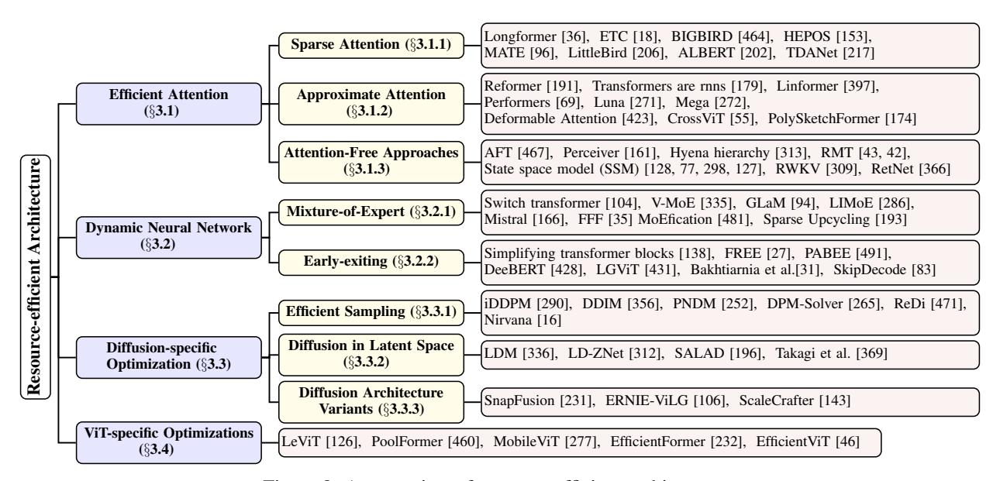

# 3 RESOURCE-EFFICIENT ARCHITECTURES

Figure 8: An overview of resource-efficient architectures.

Model architecture is the core to resource-efficient large FMs, including attention mechanisms, decoders, and their alternatives. The primary objective is to reduce computational and memory expenses. Figure 8 visually illustrates this classification of resource-efficient architecture, considering the standard core blocks and the conventional taxonomy of large FMs. Resource-efficient architecture consists of efficient attention, dynamic neural network, diffusion-specific optimization, and ViT-specific optimization.

#### 3.1 Efficient Attention

The quadratic time complexity associated with attention architectures, particularly concerning sequence length, presents significant challenges during training and inference. Previous efforts [107, 244, 185, 90, 390] has explored methods to reduce this complexity to linear or identify viable alternatives. The diverse approaches for achieving efficient attention are visually summarized in Figure 9.

