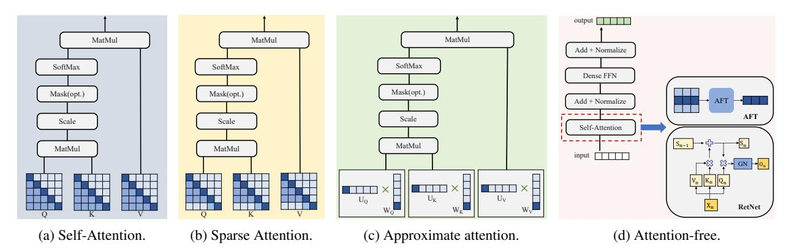

# 3.1.1 Sparse Attention

Motivated by graph sparsification, sparse attention [36, 18, 464, 153, 96, 206, 217] aims to build a sparse attention matrix. This approach aims to retain the empirical advantages of a fully quadratic self-attention scheme while employing a reduced number of inner products. For instance, Longformer [107], ETC [244], and BIGBIRD [464] decompose conventional attention into local windowed attention and task-specific global attention, effectively reducing self-attention complexity to linear. HEPOS [153] introduces head-wise positional strides. This innovation allows

Figure 9: Illustrations of efficient attentions architectures.

| Model                     | Time         | Space               |
|---------------------------|--------------|---------------------|
| Transformer [388]         | 2d) O(T   | 2 + O(T T d)  |
| AFT [467]                 | 2d) O(T   | O(T d)              |
| Reformer [191]            | O(T log T d) | O(T log T + T d)    |
| Hyena [313]               | O(T log T d) | O(T d)              |
| SSM [128]                 | O(T log T d) | O(T d)              |
| Linear Transformers [179] | O(T d2 )  | 2 O(T d + d ) |
| RetNet [366]              | O(T d)       | O(T d)              |
| RWKV [309]                | O(T d)       | O(d)                |

Table 4: The time and space comparative analysis of complexity among transformers and its variants, where T represents sequence length, and d represents hidden dimension.

each attention head to concentrate on a specific subset of the input sequence, facilitating efficient encoder-decoder handling. MATE [\[96\]](#page-42-5) transforms attention into a multi-view format, efficiently addressing either rows or columns in a table. TDANet [\[217\]](#page-49-2) emulates the human brain's top-down attention mechanism to selectively focus on the most relevant information, thereby enhancing speech separation efficiency. ALBERT [\[202\]](#page-48-5) implements parameter sharing across layers, resulting in an 89% reduction in parameter count while guaranteeing accuracy, compared to traditional BERT.

#### 3.1.2 Approximate Attention

Approximate attention, as explored in numerous works [\[191,](#page-47-4) [179,](#page-47-5) [397,](#page-59-2) [69,](#page-41-4) [271,](#page-52-0) [272,](#page-52-1) [174,](#page-46-2) [55,](#page-40-3) [423\]](#page-60-2), involves low-rank approximations of the self-attention matrix and innovative reformulations of the self-attention mechanism. These approaches avoid the direct computation of the N × N matrix, aiming to reduce computational complexity and enhance efficiency, particularly in scenarios with long sequence lengths. Linformer [\[397\]](#page-59-2) demonstrates that the effective decomposition of the attention matrix into a low-rank matrix. This technique involves projecting the length dimensions of keys and values into a lower-dimensional space, resulting in a significant reduction in memory complexity. Reformer [\[191\]](#page-47-4) utilizes locality-sensitive hashing to replace the conventional dot-product attention. Katharopoulos et al. [\[179\]](#page-47-5) introduced a kernel-based approach to self-attention, leveraging the associative property of matrix multiplication for computing self-attention weights. Polysketchforme [\[174\]](#page-46-2) employs polynomial functions and sketching techniques to approximate softmax attention outputs, providing a novel perspective on attention mechanism approximation. Mega [\[272\]](#page-52-1), featuring a single-head gated attention mechanism, incorporates exponential moving average. This addition effectively integrates inductive bias related to position-aware local dependencies into the inherently positionagnostic attention mechanism. Deformable Attention [\[423\]](#page-60-2) proposes a data-aware, deformable attention mechanism. , contributing to improved performance within the ViT architecture, This method proves especially beneficial when contrasted with traditional dense attention methods. CrossViT [\[55\]](#page-40-3) introduces linear cross-attention, empowering the ViT architecture to to efficiently handle variably-sized input tokens while mitigating computational costs.

#### 3.1.3 Attention-Free Approaches

Despite the dominance of attention-based transformer architectures in large FMs, several works [\[467,](#page-63-3) [161,](#page-46-3) [313,](#page-54-3) [43,](#page-39-5) [42,](#page-39-6) [128,](#page-44-1) [77,](#page-41-5) [298,](#page-54-4) [309,](#page-54-5) [366\]](#page-57-5) have put forth innovative architectures that hold the potential to replace the traditional transformer model. For instance, Hyena [\[313\]](#page-54-3) introduces an architecture that interleaves implicitly parametrized long convolutions with data-controlled gating. This design provides a subquadratic alternative to attention in large-scale language models, thereby enhancing efficiency in processing long sequences. Another notable trend is the substitution of the attention mechanism with state space models (SSMs), as explored in [\[128,](#page-44-1) [77,](#page-41-5) [298\]](#page-54-4). Mamba [\[127\]](#page-44-2) seamlessly integrates selective SSMs into a streamlined neural network architecture, eliminating attention and MLP blocks. This model achieves a notable 5× speed increase over traditional transformers and exhibits linear scaling with sequence length. Gu et al. [119] also offered a comprehensive restructuring of the SSM literature into an informative and cohesive format. Recurrent-Style Transformers (RMT) [\[43,](#page-39-5) [42\]](#page-39-6) adopts an recurrent neural network-based architecture, replacing attention with a RNN to achieve linear complexity. RWKV [\[309\]](#page-54-5) combines the efficient parallelizable training of Transformers with the effective inference capabilities of RNNs. RetNet [\[366\]](#page-57-5) troduces an architecture that replaces multi-head attention with a multi-scale retention mechanism. This architecture captures and retains information from prior sequence steps, utilizing varying gamma values across heads to regulate retention strength. RetNet not only maintains a constant inference cost regardless of sequence length but also outperforms Transformer models with key-value caches in efficiency. Furthermore, during training, RetNet demonstrates a 25-50% memory saving and a 7× acceleration compared to the standard Transformer.

#### 3.2 Dynamic Neural Network

#### 3.2.1 Mixture-of-Experts

Mixture-of-Experts (MoE), illustrated in Figure [10\(](#page-15-2)b), represents an efficient and sparse approach for training and deploying large FMs with extensive parameter sets. This model utilizes routed sparse parameters during inference. Switch Transformer [\[104\]](#page-43-3) introduces a switch routing algorithm, leading to models with improved efficiency and reduced computational and communication costs. Switch Transformer demonstrates the scalability and effectiveness of MoE framework by managing up to one trillion parameters, even with as many as 2,048 experts. GLaM [\[94\]](#page-42-6), a family of decoder-only language models, leverages a sparsely activated MoE design. This innovative approach substantially reduces training costs while simultaneously increasing model capacity compared to dense models. V-MoE [\[335\]](#page-56-8) presents a sparse adaptation of the ViT, scaling to 15 billion parameters, and achieves performance matching dense models while requiring less training time. LIMoE [\[286\]](#page-52-2) represents the first multimodal model to incorporate sparse MoE, significantly outperforming CLIP in various tasks. Mistral AI introduces Mistral[6](#page-14-3) , an MoE model comprising 8 experts, each with 7 billion parameters. This model outperforms the performance of LLaMA2-70B model [\[383\]](#page-58-1). MoEfication [\[481\]](#page-64-2) converts a model into its MoE variant with equivalent parameters. This technique conditionally utilizes portions of feedforward network parameters, maintaining performance levels comparable to the original dense model. Sparse upcycling [\[193\]](#page-47-6) initializes sparsely activated MoE from dense checkpoints. Sparse upcycling enables models, such as T5 Base, Large, XL, and Vision Transformer Base and Large, to significantly outperform their dense counterparts on benchmarks like SuperGLUE and ImageNet, while using only about 50% of the original dense pretraining costs. FFF [\[35\]](#page-39-7) divides the feed-forward layer into separate leaves instead of copying the entire feed-forward layer as an expert. FFF is a log-time alternative to feedforward networks, being up to 220× faster than the original feed-forward layer and up to 64× faster than MoE with about 5% accuracy loss. §[5.1](#page-31-1) will detail systematic optimizations applied to MoE models.

#### 3.2.2 Early Exiting

As illustrated in Figure [10\(](#page-15-2)c), early exiting optimization is a strategy that allows a model to terminate its computational process prematurely when it attains high confidence in the prediction or encounters resource constraints. He et al. [\[138\]](#page-44-3) investigates modifications to the standard transformer block, aiming for simpler yet efficient architectures without sacrificing performance. This model involves removing elements such as residual connections, layer normalization, and specific parameters in projection and value, along with serializing MLP sub-blocks. M4 [\[461\]](#page-62-4) introduces a multi-path task execution framework, enabling elastic fine-tuning and execution of foundational model blocks for different training and inference tasks. FREE [\[27\]](#page-39-8) proposes a shallow-deep module that synchronizes the decoding of the current token with previously processed early-exit tokens. FREE utilizes an adaptive threshold estimator for determining appropriate early-exit confidence levels. SkipDecode [\[83\]](#page-41-6) is designed for batch inferencing and KV caching, overcoming previous limitations by establishing a unique exit point for each token in a batch at every sequence position. PABEE [\[491\]](#page-64-3) enhances the efficiency of pre-trained language models by integrating internal classifiers at each layer. The inference process halts when predictions stabilize for a set number of steps, facilitating quicker predictions with reduced layer usage. DeeBERT [\[428\]](#page-61-2) augments BERT's inference efficiency by incorporating early exit points. DeeBERT allows instances to terminate at intermediate layers based on confidence levels, effectively reducing computational demands and accelerating inference. Bakhtiarnia et al. [\[31\]](#page-39-9) proposed 7 distinct architectural designs

6 https://mistral.ai/

Figure 10: Traditional and typical dynamic transformers.

for early-exit branches suitable for dynamic inference in ViTs backbones. LGViT [\[431\]](#page-61-3) presents an early-exiting framework tailored for general ViTs, featuring diverse exiting heads, such as local perception and global aggregation heads, to balance efficiency and accuracy. This approach achieves competitive performance with an approximate 1.8× increase in speed.

#### 3.3 Diffusion-specific Optimization

Generating images through diffusion models typically involves iterative process with numerous denoising steps. Recent research has focused on accelerating the denoising process and reducing the resource requirements during image generation, which fall into three main categories: (1) efficient sampling, (2) diffusion in latent space, and (3) diffusion architecture variants.

#### 3.3.1 Efficient Sampling

To enhance the denoising process of diffusion model while maintaining or improving sample quality, many efforts [\[290,](#page-53-2) [269,](#page-51-4) [356,](#page-57-1) [475,](#page-63-5) [252,](#page-50-2) [178,](#page-47-8) [265,](#page-51-3) [339,](#page-56-9) [474,](#page-63-6) [359,](#page-57-6) [406,](#page-60-3) [16,](#page-38-4) [471\]](#page-63-4) have been made to improve the sampling process. These works emphasize resource and time efficiency in their architectures. Nichol et al. [\[290\]](#page-53-2) made strides in enhancing the traditional DDPM by focusing on resource efficiency. Their improved model not only competes in log-likelihoods but also enhances sample quality. This efficiency is achieved by learning the variances of the reverse diffusion process and employing a hybrid training objective. This methodology leads to more resource-efficient sampling, requiring fewer forward passes, and shows improved scalability in terms of model capacity and computational power. DDIM [\[356\]](#page-57-1) represents a significant improvement in latency efficiency for diffusion models. By introducing a non-Markovian, deterministic approach to sampling, DDIM accelerates the generation process, allowing for faster sampling without compromising sample quality. This ordinary differential equations (ODE) variant of DDPM [\[144\]](#page-45-2) efficiently navigates through noise levels during generation, making it a more latency-efficient option compared to traditional DDPM. PNDM [\[252\]](#page-50-2) enhances the efficiency of DDPM in generating high-quality samples. The approach treats the diffusion process as solving differential equations on manifolds, greatly accelerating the inference process. This method, with a focus on latency efficiency, surpasses existing acceleration techniques such as DDIMs, particularly in scenarios that require high-speed sampling, all while maintaining sample fidelity. DPM-Solver [\[265\]](#page-51-3) focuses on improving the sampling efficiency of diffusion models. This method utilizes a high-order solver that exploits the semi-linear structure of diffusion ODEs, facilitating fast and high-quality sample generation. Remarkably, DPM-Solver achieves this with as few as 10-20 denoising steps, highlighting the latency efficiency in sample generation. ReDi [\[471\]](#page-63-4) accelerates sampling by retrieving and reusing pre-computed diffusion trajectories. Nirvana [\[16\]](#page-38-4) introduces an approximate caching technique to reduce computational cost and latency in text-to-image diffusion models by reusing intermediate noise states. This leads to significant GPU and time savings without compromising image quality.

#### 3.3.2 Diffusion in Latent Space

In traditional diffusion models, operations are usually performed within the pixel space of images. However, this approach proves to be inefficient for high-resolution images because of the considerable computational demands and significant memory requirements. In response to these challenges, researchers proposed a shift towards conducting diffusion processes in latent space through VAEs [\[336,](#page-56-0) [196,](#page-47-7) [404,](#page-59-4) [312,](#page-54-6) [343,](#page-56-10) [369,](#page-58-5) [34,](#page-39-10) [273\]](#page-52-4). This paradigm results in substantial memory-efficient advancements, allowing for the generation of high-resolution images with reduced computational resources. LDM [\[336\]](#page-56-0), also known as stable diffusion, serves as a notable example of memory-efficient image generation. By performing diffusion processes within a latent space derived from pixel data through a VAE, LDM effectively tackles scalability issues present in earlier diffusion models. This approach enables the efficient synthesis of high-resolution images and, with the incorporation of cross-attention layers interacting with text encoder inputs, facilitating the creation of detailed, text-guided visuals. LD-ZNet [\[312\]](#page-54-6) leverages the memory-efficient properties of LDM for image segmentation tasks. By training segmentation models within the latent space of LDM, LD-ZNet significantly enhances segmentation accuracy, especially for AI-generated images. This approach capitalizes on the deep semantic understanding inherent in LDM's internal features, providing a nuanced bridge between real and AI-generated imagery. SALAD [\[196\]](#page-47-7) introduces a memory-efficient methodology for 3D shape generation and manipulation. Employing a cascaded diffusion model based on part-level implicit representations, SALAD operates in high-dimensional spaces with a two-phase diffusion process. This memory-efficient design facilitates the effective generation and part-level editing of 3D shapes without the need for additional training in conditional setups. Takagi et al. [\[369\]](#page-58-5) presented a novel approach to reconstruct high-resolution images from Functional Magnetic Resonance Imaging (fMRI) brain activity using LDM. The method utilizes straightforward linear mappings to project fMRI data into the latent space of LDMs. This method not only accomplishes high-fidelity image reconstruction from brain activity but also provides a deeper understanding of LDM's internal mechanisms from a neuroscience perspective. Each of these works highlights the advantages of leveraging latent spaces in diffusion models, particularly in terms of memory efficiency, marking a clear distinction from traditional pixel-space approaches.

#### 3.3.3 Diffusion Architecture Variants

Another method for enhancing diffusion models involves the adoption of more efficient model architectures [\[231,](#page-49-3) [106,](#page-43-4) [32,](#page-39-11) [143,](#page-45-4) [267\]](#page-51-5). This strategy focuses on refining the structural framework of diffusion models to optimize their performance. Through the implementation of advanced architectural designs, these models can achieve more effective processing capabilities while potentially reducing computational complexity and resource consumption. SnapFusion [\[231\]](#page-49-3) introduces an optimized text-to-image diffusion model for mobile devices, featuring a resource-efficient network architecture. This model overcomes the computational and latency limitations of existing models through a redesigned network architecture and improved step distillation. By generating high-quality 512×512 images in under 2 seconds, SnapFusion surpasses Stable Diffusion in FID and CLIP scores. Notably, this achievement is realized with fewer denoising steps. ScaleCrafter [\[143\]](#page-45-4) addresses the generation of ultra-high-resolution images using pre-trained diffusion models with an innovative and resource-efficient network design. ScaleCrafter incorporates techniques like "re-dilation", "dispersed convolution", and "noise-damped classifier-free guidance" to dynamically adjust convolutional perception fields during inference. This model enables the generation of ultra-high-resolution images without the need for additional training or optimization. ERNIE-ViLG [\[106\]](#page-43-4) introduces a novel text-to-image diffusion model that integrates fine-grained textual and visual knowledge into a highly efficient network architecture. With a mixtureof-denoising-experts mechanism and scaling up to 24B parameters, ERNIE-ViLG outperforms the existing models on MS-COCO with a remarkable zero-shot FID-30k score of 6.75. The model significantly enhances image fidelity and text relevancy, adeptly addressing attribute confusion in complex text prompts. Each of these contributions highlights the significance of resource-efficient network architectures in advancing diffusion models, expanding their capabilities, and broadening their applicability across diverse scenarios.

#### 3.4 ViT-specific Optimizations

As a Transformer variant, ViT benefits from general optimizations aforementioned; yet, there exists also ViT-specific architecture optimizations. LeViT [\[126\]](#page-44-4) is a hybrid neural network designed for efficient image classification during inference. LeViT utilizes an increased number of convolutional layers for embedding, enhancing its ability to process pixel information. The main backbone features a pyramid architecture, progressively reducing the dimensionality of features while concurrently increasing the number of attention heads. Notably, the model introduces a learned, perhead translation-invariant attention bias, serving as a replacement for the positional embedding in ViT. LeViT achieves an impressive 80% ImageNet top-1 accuracy and demonstrates a remarkable 5× improvement in speed compared to EfficientNet when executed on CPU [\[370\]](#page-58-6). PoolFormer [\[460\]](#page-62-3) provides valuable insights by emphasizing that the success of ViTs is rooted in its overall architectural design named MetaFormer. PoolFormer employs simple pooling layers commonly found in CNNs and achieves an impressive 82.1% top-1 accuracy on the ImageNet-1K dataset.

Figure 11: A summary of resource-efficient VIT variants.

MobileViT [\[277\]](#page-52-3) adheres to the idea of utilizing CNNs to construct a more lightweight transformer architecture. Through the design of a convolution-like MobileViT block, the model achieves a lightweight and low-latency implementation, specifically tailored for practical hardware platforms. MobileViT optimization extends beyond FLOPs to include considerations for memory access, parallelism, and platform-specific features. MobileViT attains a top-1 accuracy of 78.4% on the ImageNet-1k dataset with approximately 6 million parameters. EfficientFormer [\[232\]](#page-49-4) designs a lightweight CNN-Transformer hybrid architecture, achieving more efficient on-device inference. The most rapid model, EfficientFormer-L1, attains a top-1 accuracy of 79.2% on ImageNet-1K, with a mere 1.6 ms inference latency on the iPhone 12 (compiled with CoreML). This performance matches the speed of MobileNetV2×1.4 (1.6ms, 74.7% top-1). EfficientViT [\[45\]](#page-40-5) introduces a linear attention mechanism to alleviate the computational cost linked with the high overhead of softmax in non-linear attention. In the domain of super-resolution, EfficientViT achieves a speedup of up to 6.4 × compared to Restormer [\[465\]](#page-63-7).

