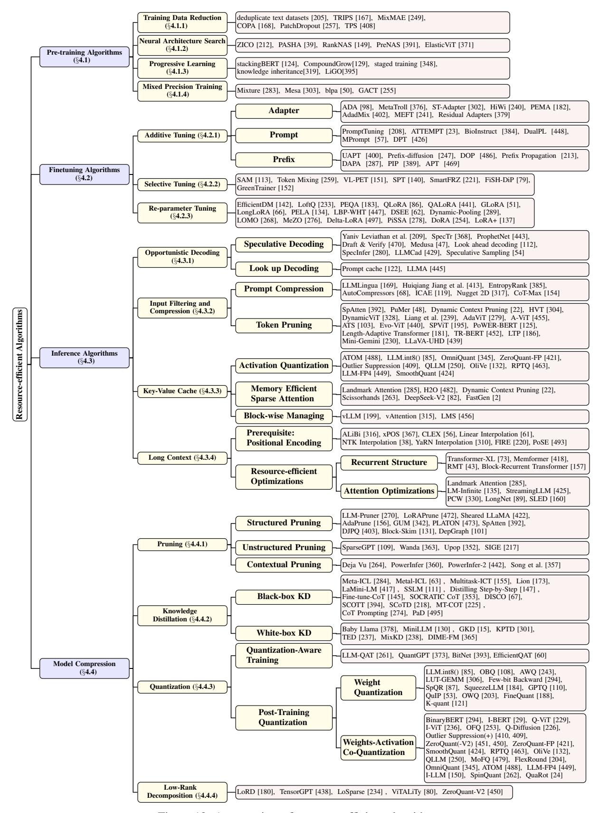

# 4.1.1 Training Data Reduction

Pre-training for large FMs needs a dataset at the trillion scale, exemplified by 0.3 trillion tokens for GPT-3-175B [\[41\]](#page-39-0) and 2 trillion tokens for LLaMa-2-70B [\[383\]](#page-58-1). More data indicates more resource expenditure. Thereby, prior literature resorts to reducing the resource cost on vast training data through two aspects: deduplicate text datasets and image patch removal.

Deduplicate text datasets [\[205\]](#page-48-6) shows training data has redundancy caused by near-duplicate examples and long repetitive substrings. The reduction of repetitions can lead to fewer training steps without compromising performance.

Image patch removal is achieved by either reducing the number of patch inputs to the model or reorganizing image tokens based on modified model architectures. For instance, TRIPS [\[167\]](#page-46-5) employs a patch selection layer to reduce image patches. This layer computes attentive image tokens through text guidance, resulting in a 40% reduction in computation resources, compared to previous pre-training vision-language models. Masked autoencoders (MAE) [\[141\]](#page-45-0)

Figure 12: An overview of resource-efficient algorithms.

as a pre-training method of ViT has been widely used. MAE mask image patches in pre-training phrase, but the large masking ratio brings significant computation resource wastage. MixMAE [\[249\]](#page-50-3) introduces a method for mixing multiple images at the patch level, thereby avoiding the need for introducing [MASK] symbols. The use of a visible image patch in lieu of [MASK] symbols contributes to a reduction in the size of the training dataset. COPA [\[168\]](#page-46-6) introduces an auxiliary pre-training task called patch-text alignment. This patch-level alignment strategy aims to decrease redundancy in image patches, and the reduction in patch sequences contributes to saving computation resources. PatchDropout [\[257\]](#page-51-6) introduces the concept of patch dropout to enhance both computation and memory efficiency. This method involves the random sampling of a subset of original image patches to effectively shorten the length of token sequences. TPS [\[408\]](#page-60-4) employs a more aggressive compression technique. TPS categorizes tokens into pruned and reserved sets based on their importance and subsequently assigns each pruned token to its associated reserved token instead of discarding the pruned set.

#### 4.1.2 Neural Architecture Search

Neural Architecture Search (NAS) is an automatic model design algorithm for optimal model efficiency and performance without human intervention. Zero-shot NAS [\[14\]](#page-38-9) introduces a concept where models predict the performance of neural network architectures without the need for actual training. By employing prior knowledge and surrogate models for architecture evaluation, this technique significantly reduces computational costs and time, facilitating efficient exploration of complex architecture spaces with minimal resource expenditure. ZICO [\[212\]](#page-48-7) introduces a zero-shot NAS proxy that outperforms traditional NAS proxies, including one-shot and multi-shot NAS methods, in terms of performance. Notably, it reduces computing resource consumption by eliminating the need to train the model during the search phase. PASHA [\[39\]](#page-39-12) allocates limited resources for initialization and increases the resource allocation as needed. With dynamic resource allocation, PASHA speeds up NAS and efficiently manages computation resources. RankNAS [\[149\]](#page-45-5) formulates the NAS problem as a ranking problem as a ranking problem and further simplifies this ranking problem to a binary classification problem. Additionally, the method evaluates promising architectures using features. PreNAS [\[391\]](#page-59-5) employs a search-free NAS approach. This approach identifies the preferred architectures by zero-shot NAS proxy. Then it only trains once on the preferred architectures. ElasticViT [\[371\]](#page-58-7) has a NAS approach to automatically design lightweight ViT models with fewer than 1 × 109 FLOPs. The method introduces two subnet sampling techniques to address gradient conflicts, leading to high accuracy and low inference latency.

#### 4.1.3 Progressive Learning

Progressive learning is a training strategy that begins by training a small model and then gradually increases the model size, continuing the training process. This approach optimizes computational resource usage by reusing the computations from the previous stage. Inspired by the insight that knowledge can be shared across models of different depths, stackingBERT [\[124\]](#page-44-5) introduces a progressive stacking algorithm. This algorithm trains a large model by sequentially stacking attention layers from smaller models. StackingBERT demonstrates that this progressive stacking approach can achieve similar performance to training a large model from scratch but with reduced computational resource consumption. CompoundGrow [\[129\]](#page-44-6) identifies the similarity between progressive training algorithms and NAS. CompoundGrow introduces a progressive training algorithm for BERT that facilitates the growth of multiple dimensions of the model, including depth, width, and input length. The method mitigates computational resource consumption by employing compound growth operators. Staged training [\[348\]](#page-56-11) adopts a strategy where a small model is pre-trained initially, and subsequently, the depth and width of the model are increased, continuing the training process. The entirety of the training state, encompassing model parameters, optimizer state, learning rate schedule, etc., is transferred to the next stage using a growth operator. This approach reuses computations from the previous stage, effectively reducing both training time and computational resource requirements. Knowledge inheritance [\[319\]](#page-55-6) suggests employing existing pre-trained language models as teacher models to provide guidance during the training of larger models. The supplementary auxiliary supervision offered by the teacher model can effectively enhance the training speed of the larger model. LiGO [\[395\]](#page-59-6) introduces small model parameters to initialize the large model through a trainable parameter linear map. LiGO achieves this by factorizing the growing transformation into a composition of linear operators at width and depth dimensions.

#### 4.1.4 Mixed Precision Training

Mixed precision training often utilizes half-precision floating-point data representation instead of single precision. This approach significantly reduces memory requirements, approximately halving the storage space needed for weights, activations, and gradients in half-precision. Mesa [\[303\]](#page-54-7) proposes the combination of activation compressed training [\[50\]](#page-40-6) with mixed precision training to further reduce the memory used by activations. The method quantifies activation based on the distribution of multi-head self-attention layers to minimize the approximation error. GACT [\[255\]](#page-51-7) introduces a dynamically adjusted compression ratio based on the importance of each gradient. This innovation allows for

Figure 13: A summary of various fine-tuning algorithms.

the reduction of compute resource and memory consumption in various model architectures, including convolutional neural networks, graph neural networks, and transformer-based models.

#### 4.2 Finetuning Algorithms

Efficient fine-tuning algorithms are designed to reduce the workload to adapt a pre-trained FM to downstream tasks. These techniques can be categorized into three groups: additive tuning, selective tuning, and re-parameter tuning.

