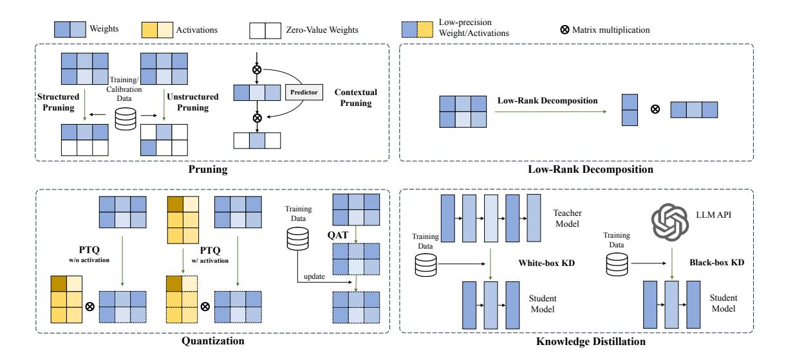

# 4.3.3 Key-Value Cache

Optimizing memory for the KV cache is a crucial aspect of the autoregressive decoder-based model inference process.

Quantizing KV cache as activation. One strategy involves treating the KV cache as an activation and applying quantization techniques for low-precision compression. The primary challenge arises from quantization errors introduced by numerous extreme outliers in the KV cache. In Figure [12,](#page-18-0) we present the key methods for KV cache quantization. A detailed introduction to these methods will be provided in §[4.4](#page-25-0) as part of the Weights-Activation Co-Quantization

Memory efficient sparse attention. An alternative approach involves leveraging sparse attention. However, it's noteworthy that most sparse attention designs, which primarily target the reduction of computational complexity [\[36,](#page-39-1) [464\]](#page-63-2), do not necessarily lead to a reduction in KV cache memory consumption. This is because achieving a reduced memory footprint for the KV cache necessitates a more stringent sparsity pattern. Specifically, tokens that are sparsified should not be dynamically accessed in subsequent steps. To address this, H2O [\[482\]](#page-64-7) introduces a KV cache eviction strategy designed for optimal memory efficiency. This strategy employs attention scores to identify and select the least important KV cache tokens in the current state for eviction. When compared to robust baselines, H2O demonstrates the capability to reduce latency by up to 1.9× and increase throughput by 29×. Dynamic Context Pruning [\[22\]](#page-38-6) learns a memory-efficient KV cache eviction strategy during the pre-training phase. This approach has demonstrated the ability to achieve up to a 2× increase in inference throughput and even greater memory savings. Scissorhands [\[263\]](#page-51-11) presents an efficient algorithm for large FM inference that utilizes a compact KV cache. This innovative approach results in a notable reduction in KV cache inference memory usage, achieving up to a 5× reduction while maintaining model quality. By employing a landmark token to demarcate a token block, Landmark Attention [\[285\]](#page-52-12) optimizes KV cache storage. This approach enables the storage of most KV cache in a slower but larger capacity memory, resulting in reduced memory requirements without compromising performance. DeepSeek-V2 [\[82\]](#page-41-10) proposes a Multi-head Latent Attention (MLA) method that refines Grouped-Query Attention (GQA) to a latent representation with stronger ability. It re-up-projects the GQA's K and V to a high-dimensional form by a matrix that can be absorbed to Wk and WV at inference time. FastGen [\[118\]](#page-43-14) identifies the attention sparsity pattern of various heads, and determines the most suitable one for each head with lightweight attention profiling.

Block-wise KV cache management. vLLM [\[199\]](#page-48-1) adopts the concept from paged memory in operating systems, and manages the KV cache susceptible to memory fragmentation as blocks. The computation results of this block-based attention mechanism are identical to those of the standard attention mechanism. We will elaborate its details in §[5.3.](#page-34-0) Although vLLM significantly reduces KV cache memory consumption through runtime reallocation, the practitioners have to rewrite the attention kernel or reuse vLLM's kernel, both of which lead to downgraded performance. To tackle this, vAttention [\[315\]](#page-55-9) directly relies on the OS/CUDA to do the reallocation on the physical memory. It further improves the end-to-end serving throughput by up to 1.29× compared to vLLM. On mobile devices, LMS [\[456\]](#page-62-11) proposes a fine-grained KV cache management method that opportunistically compresses the KV cache chunks and orchestrates swapping and recomputing to manage them. It ensures fast context switching for the on-device LLMaaS vision proposed by LMS.

Miscellaneous. Mooncake [\[318\]](#page-55-12) proposes a prefill-decode disaggregated system. The core is to optimize the heavy KV cache of the requests by caching and reusing similar content. CacheGen [\[258\]](#page-51-17) treats the KV cache as a data stream and encodes the stream via marking incremental values and arithmetic coding. InfiniGen [\[207\]](#page-48-13) compresses the KV cache via Singular Value Decomposition (SVD) and prefetch the critical KV. CachedAttention [\[116\]](#page-43-15) uses HBM swapping to cache the KV cache for multi-turn conversations.

#### 4.3.4 Long Context

To effectively process long sequences, transformers need to adapt their positional encoding to enhance their capability to capture long-range information. Notable works addressing this challenge include [\[316,](#page-55-10) [367,](#page-58-13) [56,](#page-40-13) [61,](#page-40-14) [38,](#page-39-13) [310,](#page-54-10) [220,](#page-49-8) [493\]](#page-64-8). These works serve as a prerequisite to enable transformers to handle long-context and high-resolution input. Due to the quadratic computational cost associated with attention mechanisms, various resource-efficient optimizations have been proposed to handle long inputs. These optimizations include Recurrent Structure and Attention Optimization.

Recurrent structure. Transformer-XL [\[74\]](#page-41-14) introduces a segment-level recurrence mechanism that maintains temporal coherence without disruption. This innovation results in evaluation speeds up to 1,800+ times faster than vanilla Transformers. By integrating recurrence and a fixed-size memory, aligning with the Transformer-XL concept, RMT [\[43\]](#page-39-5) incorporates a memory mechanism into the Transformer model without making modifications. This is achieved by introducing special memory tokens to the input or output sequence. Block-Recurrent Transformers [\[157\]](#page-45-10) employ a recurrent cell that processes blocks of tokens, rather than individual tokens, during training. This approach harnesses parallel computation within a block, effectively utilizing accelerator hardware. Memformer [\[418\]](#page-60-8) accomplishes a theoretically infinite temporal range of memorization while preserving linear computational complexity and constant memory space complexity.

Figure 15: Model compression techniques for LLMs.

Attention optimizations. LM-Infinite [135] introduces a  $\Lambda$ -shaped attention mechanism to handle long contexts efficiently. Characterized by computational efficiency with O(n) time and space complexity, LM-Infinite consistently demonstrates fluency and quality in text generation for sequences as long as 128k tokens on ArXiv and OpenWeb-Text2 datasets. StreamingLLM [425] facilitates large FMs trained with a finite-length attention window to generalize to infinite stream decoding without the need for any fine-tuning. PCW [330] segments a long context into chunks or "windows", constrains the attention mechanism to operate solely within each window, and reuses positional embeddings across the windows. LongNet [89] introduces dilated attention, expanding the attentive field exponentially as the distance increases. This innovation allows LongNet to scale Transformers efficiently, enabling them to handle sequences of up to 1B tokens. SLED [160], short for SLiding-Encoder and Decoder, repurposes and capitalizes on well-validated short-text pre-trained language models. Despite competing effectively with specialized models that are up to  $50 \times$  larger, SLED does not require a dedicated and expensive pretraining step.

#### 4.4 Model Compression

Model compression refers to a set of techniques aimed at reducing the size of a model without significant performance degradation. This survey investigates four main categories of model compression of large FMs: pruning, knowledge distillation, quantization, and Low-Rank decomposition, as shown in Figure 15.

#### 4.4.1 Pruning

Pruning technique removes redundant or non-essential connections, neurons, or layers from a neural network. The primary objective is to reduce the model size, subsequently decreasing computational and storage costs, while maintaining model accuracy. Structured pruning and unstructured pruning target weight reduction without modifying sparsity during inference. In contrast, Contextual Pruning dynamically selects activated neurons or layers during inference based on the sparsity of the model.

**Structured Pruning.** Structured pruning compresses large foundational models by eliminating entire structural components, such as groups of consecutive parameters or hierarchical structures. Examples of these structural components include channels or blocks of the model's weights.

Structured pruning is frequently combined with fine-tuning to mitigate accuracy losses. LLM-Pruner [270] is a task-agnostic structured pruning algorithm that utilizes a small amount of data to assess the importance of coupled structure weights. The method selectively removes non-essential model structures based on gradient information. LLM-Pruner incorporates LoRA to recover the model's accuracy after pruning LoRAPrune [472] is another structured pruning approach based on LoRA, leveraging LoRA's weights and gradients for importance estimation. This method iteratively eliminates excess channels and attention heads, achieving superior results compared to LLM-Pruner. Lagunas et al. [200] improved structured pruning techniques by incorporating blocks of variable sizes. This integration is applied

within the movement pruning framework during fine-tuning, resulting in the removal of entire model components, such as attention heads. The outcome is a pruned model that achieves a 2.4× speedup and is 74% smaller compared to the original BERT.

Structured pruning is employed in the training of large foundational models as well. Sheared LLaMA [\[422\]](#page-60-9) adopts an end-to-end approach to remove channels, encompassing layers, attention heads, intermediate layers, and hidden layers. This process dynamically loads batches and alters the model structure for each training batch based on losses in various domains. Sheared LLaMA demonstrates the capability to prune the LLaMA2-7B model down to 1.3B parameters. AdaPrune[\[156\]](#page-45-11) accelerates neural network training using transposable masks, resulting in a 2× speed-up in matrix multiplications during both inference and training. This is achieved with minimal accuracy degradation, and AdaPrune allows for a seamless transition between different structural constraints. GUM [\[342\]](#page-56-13) considers neuron specificity and introduces pruning through network component-based global mobility and local uniqueness scores. This approach aims to simultaneously maximize sensitivity and uniqueness, effectively reducing redundant parameters in large FMs weights. PLATON [\[473\]](#page-63-12) tackles the uncertainty in importance scores during model pruning by employing the upper confidence bound of importance estimation. This approach ensures stability in training and leads to improved generalization.

Structured pruning is frequently combined with quantization techniques for model compression. DJPQ [\[403\]](#page-59-11) approaches neural network compression as a unified gradient-based optimization problem. DJPQ integrates variational information bottleneck-based structured pruning and mixed-bit precision quantization into a single differentiable loss function. SpAtten [\[392\]](#page-59-10) represents an algorithm-architecture co-design for efficient attention computation in NLP. This approach leverages token and head sparsity, along with quantization. Employing novel cascade token and head pruning and progressive quantization, SpAtten achieves a significant reduction in DRAM access. This leads to impressive speedup and energy savings across various accelerators and GPUs.

There is also substantial research specifically focusing on structured pruning. Block-Skim [\[131\]](#page-44-14) enhances extractive question answering Transformers by selectively processing vital context using self-attention weights, optimizing through early pruning of unnecessary positions in lower layers. In a similar vein, DepGraph [\[101\]](#page-42-12) introduces a fully automatic method for general structural pruning in diverse architectures. This method addresses the challenge of structural coupling and consistently achieves performance improvement across various models using a norm-based criterion.

Unstructured Pruning. Unlike structured pruning, unstructured pruning does not consider the inherent structure of the model. Typically, it removes neurons with weights below a threshold, thereby reducing the computational load to compress the model. When deploying unstructured pruning, specialized techniques are required to implement model storage compression. SparseGPT [\[109\]](#page-43-10) stands as a one-shot pruning algorithm that eliminates the need for retraining. SparseGPT treats the pruning framework as a generalized sparse regression problem and employs an approximate sparse regression solver to address it. SparseGPT achieves 60% unstructured pruning on large GPT models like 175B. Wanda [\[363\]](#page-57-7) leverages the observation of emergent large-magnitude features in large FMs. Wanda introduces sparsity by pruning weights with the smallest magnitudes multiplied by corresponding input activations, on a per-output basis. UPop [\[352\]](#page-57-8) serves as a universal vision-language Transformer compression framework, which incorporates two key components: (1) unifiedly searching multimodal subnets in a continuous optimization space from the original model. This enables the automatic assignment of pruning ratios among compressible modalities and structures; (2) progressively searching and retraining the subnet, maintaining convergence between the search and the retrain to achieve higher compression ratios. SSI is a technique optimizing deep generative models during image editing by selectively computing for edited regions. Leveraging cached feature maps of the original image, SSI minimizes redundant computations, resulting in significant acceleration for various generative models, such as conditional GANs and diffusion models. SIGE [\[352\]](#page-57-8) is proposed to convert computation reduction into latency reduction on standard hardware, achieving notable accelerations for models like DDPM, Stable Diffusion, and GauGAN with minimal edits.

Contextual Pruning. Different from structured pruning and unstructured pruning, context pruning dynamically selects the sparse state of each layer, making it hardware-optimization friendly. Deja Vu [\[264\]](#page-51-13) dynamically predicts the sparsity of the next layer using the activations of the previous layer. It determines which neurons of MLP blocks and the heads of attention blocks need to be retained. To mitigate the overhead of this predictor, Deja Vu asynchronously predicts the next layer. PowerInfer [\[360\]](#page-57-9) utilizes the sparsity of activation to dynamically predict the hot-activated neurons of the next layer and computes them on the GPU, while other cold-activated neurons are computed on the CPU. In comparison to llama.cpp [\[121\]](#page-43-0), PowerInfer achieves up to 11× acceleration, enabling the 40B model to output ten tokens per second on a personal computer. PowerInfer-2 [\[442\]](#page-61-12) extends PowerInfer to smartphones by using a polymorphic neuron engine. It dynamically adjusts computation based on neuron activation and a neuron-clusterlevel pipelining technique, effectively optimizing sparse computations by grouping activated neurons into clusters, which significantly reduces overhead. Song et al. [\[357\]](#page-57-10) present precise sparse activation specifically in small language models using gradient-based attribution scores with corrections for inter-layer dependencies.

