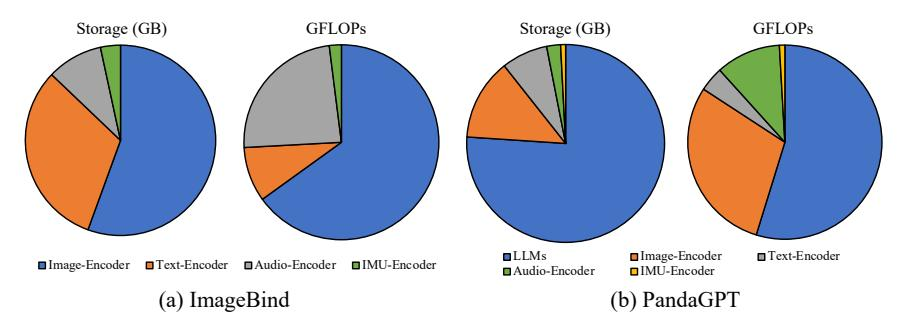
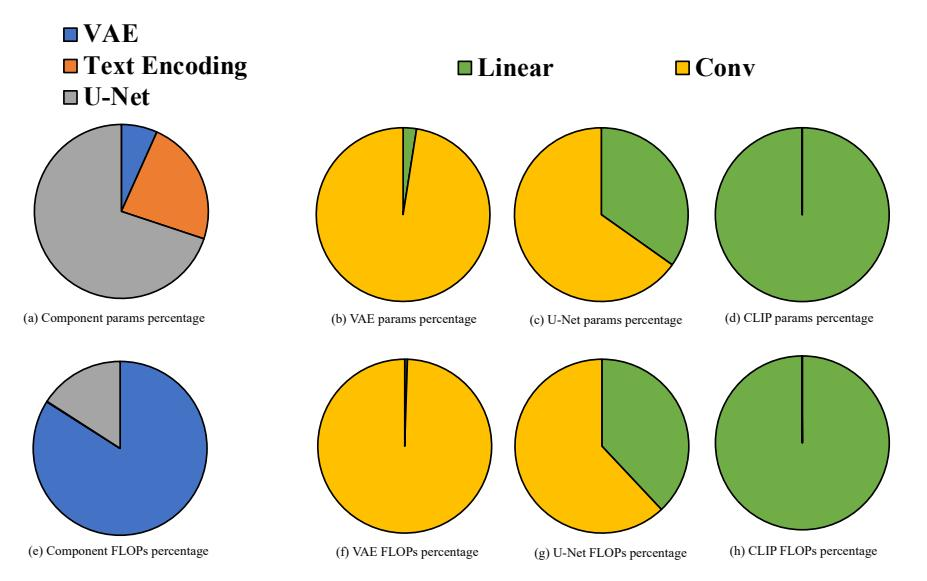

# 2.3 Multimodal Foundation Models

Multimodality is currently a hot research direction in FM research. A large FM often exhibits strong capabilities in cross-modal understanding, translation, and generation.

In general, there are two lines of research on multimodal FMs: one is to encode data in different modalities into the same latent space, mostly adopting transformer encoders; the other one is to generate data in different modalities, often using transformer decoders. Specifically, the multimodal generation mainly centers around text-based image generation, a challenging and realistic ML task that sees great advancements in recent years. The two lines of research have convergence, e.g., multimodal-to-multimodal (or even any-to-any) generation.

#### 2.3.1 Key Architectures

To ingest and align multimodal input data, existing model architectures typically consist of multiple encoders, with each modality having its own set of transformer encoders. Notably, these encoders are generally trained from scratch, utilizing paired data with the aligned modalities and current modality. Upon receiving input from diverse modalities, they initially encode this data into normalized, fixed-dimensional embeddings. By mapping these embeddings to a high-dimensional space and designing a loss function, researchers aim to minimize the distance between different modalities in the joint semantic space. This approach aligns different modalities and enhances the consistency of their representations.

With multimodal data aligned, existing research either (i) reuse the LLM that is trained on pure text corpora to generate text; (ii) or diffusion models to generate high-quality image pixels. In the first case, the LLM module is designed to comprehend, reason about, and produce output based on input data aligned with the text modality. This module typically adopts a decoder-only architecture. Due to extensive pretraining on numerous large-scale corpus datasets, LLMs are endowed with rich semantic knowledge. This enables them to effectively comprehend data embedded within the text modality and generate text-based output in an autoregressive fashion when performing specific tasks. In the second case, the diffusion module aims to generate high-quality images by eliminating redundant noise present in the input image. In the training stage, the models introduce noise into an image, transforming it into a random state. In contrast, during the inference stage, this process is reversed, gradually removing the noise. This denoising process is essential for improving image clarity, leading to images with high resolution and detailed sharpness. Stable diffusion models have significantly progressed this technology, showcasing distinctive capabilities in generating high-quality images customized to specific textual and pictorial descriptions. In addition to the multimodal embedding input, the diffusion module primarily consists of two components: an image encoder/decoder and a denoising network.

*Image Encoder/Decoder*. Diffusion model is the state-of-the-art approach for text-to-image generation. The encoder takes an input image and compresses it into a lower-dimensional latent representation. This compression is vital for reducing the computational load and enhancing the model's efficiency. The decoder operates in reverse, taking the latent representation and reconstructing it back into a high-resolution image. This process is critical for the model's capability to generate detailed visual content. Variational autoencoder (VAE) [\[189\]](#page-47-2) is a generative model that is employed to learn the latent space of the image. VAE consists of an encoder and a decoder: the encoder is responsible for mapping the image to the latent space, while the decoder is responsible for mapping the latent space to the image space. Both encoder and decoder networks are often built with convolutional neural layers. VAE is trained by minimizing the reconstruction loss and the KL divergence loss. The reconstruction loss is responsible for ensuring that the image generated by the decoder is similar to the original image, while the KL divergence loss is responsible for ensuring that the latent space is similar to the standard normal distribution. VAE is employed in the diffusion model

| Year | Model Name               | Model Arch.     | Oriented Tasks                                                                          | Parameters Pre-training Method                                                            |                               | Pre-training Datasets                                                                                                                                                                                                                                                                 | Testing Datasets                                                                                  |
|------|--------------------------|-----------------|-----------------------------------------------------------------------------------------|-------------------------------------------------------------------------------------------|-------------------------------|---------------------------------------------------------------------------------------------------------------------------------------------------------------------------------------------------------------------------------------------------------------------------------------|---------------------------------------------------------------------------------------------------|
| 2021 | DALL-E [327]             | Encoder-Decoder | Cross-Modal Generation                                                                  | 12B Supervised                                                                            |                               | MS-COCO YFCC100M                                                                                                                                                                                                                                                                   | MS-COCO CUB                                                                                    |
| 2021 | CLIP [321]               | Encoder-Only    | Cross-Modal Generation                                                                  | 400M-1.6B CLIP-ViT-B: 400M CLIP-RN50: 400M CLIP-RN101: 500M CLIP-RN50*4: 1.6B | Supervised Self-Supervised | WebImageText                                                                                                                                                                                                                                                                          | NYU-D                                                                                             |
| 2021 | Stable Diffusion [336]   | Encoder-Decoder | Image Synthesis                                                                         | LDM (LAION): 1.45B SD2.1: 1.3B                                                         | Supervised                    | CelebA-HQ FFHQ LSUN ImageNet LAION                                                                                                                                                                                                                                        | CelebA-HQ FFHQ LSUN ImageNet LAION                                                    |
| 2022 | Flamingo [19]            | Encoder-Decoder | Visual Question Answering Image Caption                                              | 3B 9B 80B                                                                           | Supervised                    | M3W ALIGN LTIP VTP                                                                                                                                                                                                                                                           | COCO, VATEX VizWiz, MSRVTTQA VisDial, YouCook2 TextVQA, HatefulMeme                               |
| 2023 | SAM [190]                | Encoder-Decoder | Edge Detection Object Proposal Generation Instance Segmentation Text-to-mask Prediction | 1B                                                                                        | Supervised                    | COCO SA-1B LVIS V1 ADE20K Open Images V5                                                                                                                                                                                                                                  | SA-1B                                                                                             |
| 2023 | ImageBind [123]          | Encoder-Only    | Modal Alignment                                                                         | 1.2B                                                                                      | Supervised                    | Image-text pairs from large-scale web data                                                                                                                                                                                                                                         | ImageNet-IN1K Places-365-P365 Kinetics400-K400 MSR-VTT, NYU-D SUN-D, AS-A, VGGS ESC, LLVIP, Ego4D |
| 2023 | CoDi [372]               | Encoder-Decoder | Cross-Modal Generation                                                                  | 3.5B                                                                                      | Supervised                    | Laion400M Freesound 500K WebVid HD-Villa-100M ACAV100M                                                                                                                                                                                                                    | AudioCaps MSR-VTT                                                                              |
| 2023 | Consistance Models [358] | Encoder-Decoder | Image Synthesis                                                                         | ImageNet: 281M LSRN: 500M Supervised                                                   |                               | ImageNet LSUN                                                                                                                                                                                                                                                                      | ImageNet LSUN                                                                                  |
| 2023 | NExT-GPT [419]           | Encoder-Decoder | Cross-Modal Generation                                                                  | 9.1B-10B                                                                                  | Supervised                    | X-caption                                                                                                                                                                                                                                                                             | MSR-VTT, AudioCaps MosIT, COCO-caption COCO, DAVIS, VCTK                                    |
| 2023 | MiniGPT-4 [494]          | Encoder-Decoder | Cross-Modal Generation                                                                  | 13B Supervised                                                                            |                               | Conceptual Caption SBU, LAION                                                                                                                                                                                                                                                      | Localized Narratives AOK-VQA, GQA                                                              |
| 2023 | GPT-4V [296]             | Close-Sourced   | Cross-Modal Generation                                                                  |                                                                                           | Close-Sourced                 |                                                                                                                                                                                                                                                                                       | COCO ADE20K Flickr30K RefCOCO DAVIS2017                                               |
| 2023 | LLaVA [248]              | Encoder-Decoder | Visual Chat Optical Character Recognition Science Question Answering              | 7B 13B                                                                                 | Supervised                    | CC LAION COCO CC3M                                                                                                                                                                                                                                                           | LLaVA-Bench (COCO) LLaVA-Bench (In-the-Wild) ScienceQA                                      |
| 2023 | Gemini [374]             | Close-Sourced   | Cross-Modal Generation                                                                  | Gemini-Nano1: 1.8B Gemini-Nano2: 3.25B  Close-Sourced                                     |                               | MMLU, GSM8K, ChartQA BIG-Bench-Hard, HumanEval NaturalZode, DROP, HellaSwag WMT23, MBPP, NaturalQuestions TydiQA, BoolQ, MGSM, XLsum AI2D, MMMU, TextVQA, DocVQA MATH, InfographicVQA, Wikilingua XM-3600, VATEX, ActivityNet-QA NextQA, Perception Test MCQA |                                                                                                   |

Table 3: Milestone multimodal FMs and their typical tasks.

to learn the latent space of the image. Another variant of VAE model that is often employed in diffusion tasks is VQ-VAE [387], to learn the latent space of the image through a vector quantization layer. The vector quantization layer applies the vector quantization technique, quantizing each pixel of the image to the nearest codebook vector. In this way, the VQ-VAE model can encode and decode the image in a more efficient way.

Denoising Network. Denoising network progressively removes noise from the encoded images by predicting the noise distribution and evicting it through sampling algorithms, such as DDPM [144] and DDIM [356]. Initially, during the training phase, the model adds noise to the images, gradually leading them to a state of pure randomness. The denoising network then learns to reverse this noise addition, step by step, during the inference phase. This gradual denoising is crucial for enhancing the clarity and quality of the final image output. U-Net [337] is often employed as the noise prediction network in diffusion models, which is a convolutional neural network model, consisting of a contracting path and an expansive path. The contracting path is responsible for capturing context information in the image by mapping the image to high-dimensional space, while the expansive path facilitates precise localization by upsampling. To retain the information on the contracting path, the expansive path is connected to the contracting path via skip connections. The U-Net model is a popular choice for image segmentation tasks and is also employed in the diffusion model to predict noise within an image.

Fusion decoder (FD). Moreover, FD module aims to enhance the understanding of images based on both the image itself and associated image prompts, and it produces outputs according to task requirements. This module typically involves designing a fusion decoder and is pre-trained on both image and text datasets, enabling it to jointly process image and text representations. This module typically encompasses the design of a fusion decoder and undergoes pre-training on both image and text datasets. This module enables it to collectively process image and text representations.

#### 2.3.2 Representative Models and Downstream Tasks

Multi-Encoder FMs: CLIP [\[321\]](#page-55-0), ALBEF [\[216\]](#page-48-2), and ALIGN [\[164\]](#page-46-1) are some earliest works to propose cross-modal alignment, aiming to learn richer image representations from text by establishing connections between images and text. While these models initially demonstrated the potential of multimodality, their performance was limited by the capabilities of the image and text encoders, as well as the quantity and quality of image-text pair data. Subsequent works like ImageBind [\[123\]](#page-44-0) and LanguageBind [\[492\]](#page-64-1) further extended modal alignment. These models employ diverse intermediate modalities as the aligned modal, effectively mapping representations from various sources into the feature space of the intermediate modal, thereby facilitating cross-modal transformations within a joint vector space. However, significant challenges arise in aligning multimodal representations with those of intermediate modalities, primarily attributed to limitations in encoder capabilities. These limitations, in turn, impact the overall performance of the model.

Encoder-Decoder FMs utilize the embedding module for modality conversion, allowing the transformed modality to be compatible with the generator.

- *(1) Encoder-Large FMs*: PandaGPT [\[361\]](#page-57-2) utilizes multiple single-modal encoders to align inputs to an intermediate modality. PandaGPT feeds the intermediate modality into large FMs for generation, followed by further transformation by the decoder of the target modality. Furthermore, BLIP-2 [\[215\]](#page-48-3) and MiniGPT-4 [\[494\]](#page-64-0) focus on cross-modal generation of text and images, by designing image modal encoders and using Q-Former to fuse these image modalities with text modalities before feeding them into multimodal large FMs for cross-modal generation. Meanwhile, mPLUG [\[453\]](#page-62-0) and LLaVA [\[248\]](#page-50-1) focus on improving the capacity of modality transformation to enhance the availability and reliability of the generated results. MobileVLM V2 [\[71\]](#page-41-3), a highly efficient vision-language model designed for resource-constrained devices, utilizes a CLIP-based encoder and MobileLLaMA-based decoder to achieve superior performance while maintaining fast inference speeds. Additionally, Flamingo [\[19\]](#page-38-2) and LLaMA-Adapter [\[478\]](#page-63-1) explore how to tune multimodal large FMs with lower costs, leading to the generation of higher-quality multimodal outputs. PaLM-E [\[93\]](#page-42-4) and HuggingGPT [\[349\]](#page-57-3) focus on Embodied Intelligence by using large FMs as a central component to incorporate Embodied data into multimodal inputs. These models further design agents to decompose tasks and leverage generative capabilities to accomplish complex tasks.
- *(2) Encoder-Diffusion FMs*: Stable diffusion [\[336\]](#page-56-0) is capable of generating high-quality images, by gradually evicting noise in images through a learned process, leading to clear and detailed visual outputs. This model is applied in various downstream tasks such as generating detailed images from text descriptions (text-to-image generation), restoring or completing parts of images (image inpainting), modifying specific aspects of existing images (image editing), and enhancing the resolution of images (image super-resolution). Stable diffusion's adaptability in these areas makes it a valuable tool in the field of image processing and generation. Consistency models [\[358\]](#page-57-0) are developed to enhance the efficiency of diffusion models in generating high-quality images, audio, and video. These models facilitate rapid single-step generation, overcoming the slow sampling speed associated with traditional diffusion models. They exhibit the capability to perform zero-shot data editing tasks such as image inpainting, colorization, and super-resolution, without necessitating specific training for these tasks. DALL-E [\[327\]](#page-55-5) is primarily employed for image generation, demonstrating the capability to create diverse and complex images based on textual descriptions. This model integrates elements of natural language understanding and computer vision, allowing it to produce images that faithfully represent a broad spectrum of textual prompts, ranging from simple descriptions to intricate scenarios.

In addition to stable diffusion, there is a notable emphasis on "any-to-any" generative models, designed to transform diverse types of inputs into a wide array of outputs. CoDi [\[372\]](#page-58-3) is designed to produce various output modalities, such as language, image, video, or audio, from different input combinations. Its uniqueness lies in the capability to concurrently generate multiple modalities, without being constrained to specific input types. CoDi aligns modalities in input and output spaces, thereby facilitating the generation of combinations not present in training data. NExT-GPT [\[419\]](#page-60-1) exhibits the capability to perceive inputs and generate outputs across various modalities, including text, images, videos, and audio. NExT-GPT integrates large FMs with multimodal adaptors and diffusion models. The system undergoes fine-tuning with minimal parameter changes, facilitating cost-effective training and straightforward modality expansion. Employing modality-switching instruction tuning and leveraging a specially curated dataset, NExT-GPT enhances cross-modal content generation and understanding, with the objective of modeling universal modalities. Similarly, M4 [\[462\]](#page-62-1) introduces a scalable mobile AI foundation model that unifies diverse AI tasks by employing multimodal embeddings and a transformer-based backbone for understanding and reasoning across inputs such as text, images, audio, and motion data, enhancing efficiency and scalability for mobile AI.

*(3) Encoder-FD FMs*: UNITER [\[64\]](#page-40-2) is one of the earliest works to propose a universal fusion of image and text in multimodal settings. It aims to combine image and text features through Transformers to obtain joint features. Building upon this, subsequent works such as FLAVA [\[354\]](#page-57-4), CoCa [\[459\]](#page-62-2), and GLIP [\[219\]](#page-49-1) delve deeper into how to use decoders to better fuse and align image and text representations, thereby enhancing multimodal reasoning.

Figure 6: The cost of different modules in multimodal FMs.

Figure 7: Parameters and FLOPs of different modules in Stable Diffusion 2.1.

Additionally, SAM [\[190\]](#page-47-3) and SAM 2 [\[331\]](#page-56-6) take a step further by leveraging a decoder to fuse prompt embeddings corresponding to images, enabling zero-shot automatic segmentation of images/videos based solely on text prompts.

