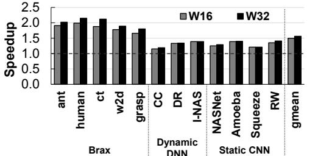

# C. Inference on Static DNNs

While our approach is designed for applications with dynamic computational graphs, we also evaluate its effectiveness in improving the concurrency of static DNNs. We depict the speedups obtained normalized to the baseline in Fig. 27. We observe an average speedup of  $1.31\times$  with ACS-HW, and a speedup of  $1.16\times$  with ACS-SW. Fig. 28 depicts the corresponding achieved occupancy. We find that ACS leads to higher GPU utilization, leading to performance improvements. As expected, we observe that CUDAGraph exhibits similar execution times as ACS-HW for static graphs. This is because the task graph needs to be constructed only once.

#### D. Sensitivity Analysis

Fig. 29 compares the speedups obtained on using scheduling window sizes of 16 and 32 for ACS-HW over baseline. We observe that the Brax simulations have higher performance

Fig. 28: Static DNNs: Achieved occupancy

(4.5% on average) with a window size of 32 compared to 16. However, the window size has less of an impact on the DNNs. This is because the simulation engines have more inter-kernel parallelism that is exposed with a larger scheduling window.

Fig. 29: Speedups on varying scheduling window size

