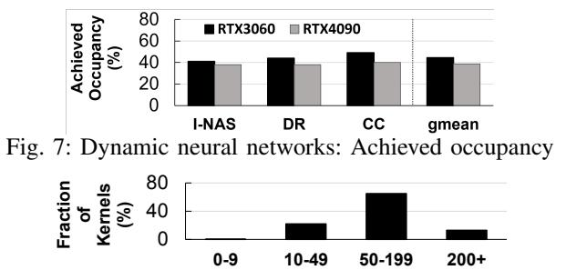
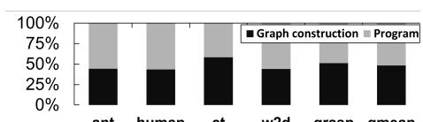
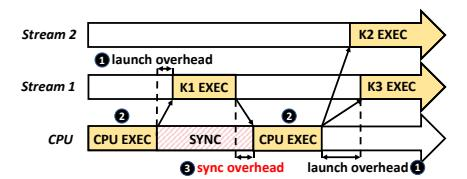
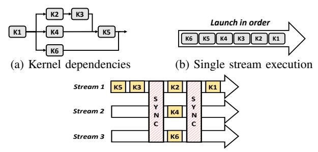
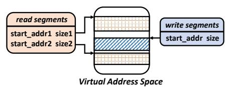
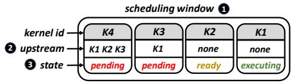
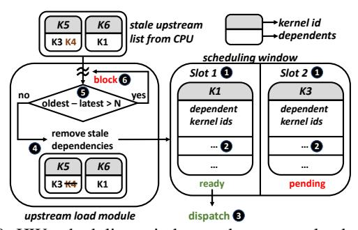

# D. Key Observations

While small-sized kernels lead to underutilization, we observe that there are typically many kernels that can be executed *concurrently*. Thus we can improve GPU utilization and reduce



Fig. 8: Kernel size distribution (in CTAs) for InstaNAS-A [10] runtimes by identifying independent kernels and scheduling them for concurrent execution. However, this is a challenging task for these classes of applications for the following reasons.

(1) Input-dependent kernel dependencies. The computational graph, and hence, the dependencies between kernels are only determined at *runtime* for each input. For example, with the instance-aware dynamic DNNs [6]–[8], [10] described in § II-C, for the classification inference task, the computational graph is different for each image. As a result, the determination of kernel dependencies and scheduling of kernels for the entire computational graph needs to be done for *each input*. This adds significant latencies to the runtime.

CUDA Graphs [32] and AMD ATMI [33] are software frameworks that allow developers to specify dependencies between different kernels as edges of a directed acyclic graph (DAG). The challenge with this approach is that the DAG needs to be constructed in full (with dependencies, kernel launches, and barriers determined) before the application is executed on the GPU, for each input. This process adds high latency in compiling the complete dependency information. We perform an experiment to measure the DAG construction and launch time on Brax [1] simulation engine (§ V) compared to the program execution time, shown in Fig. 9. We observe that the time taken to construct the graph is exceedingly high (average of 47% of overall execution time).



Fig. 9: DAG construction time as % of execution time

Similarly, recent works for DNNs [50]–[52] perform kernel scheduling, fusion, or parallelization for better GPU utilization. These works, for example, partition the computational graph into independent sub-graphs that are scheduled into multiple streams. However, this scheduling and partitioning is too time-consuming to be done for each input at runtime and thus cannot be applied to these classes of workloads.

(2) Irregular kernel dependencies. These classes of applications have *irregular* computational graphs that are challenging to easily partition into CUDA streams (§ II-C). Popular deep learning frameworks [53], [54] use a single stream by default. The stream abstraction works best if the entire graph can be partitioned into independent streams of kernels. However, these graphs with irregular dependencies would require finegrained scheduling and heavy use of synchronization (e.g.,

cudaDeviceSynchronize and cudaStreamSynchronize) when parallelizing using CUDA streams. This synchronization may lead to large overheads as it requires communication between the GPU and CPU. Fig. 10 depicts the different overheads when CUDA streams are used for fine-grained scheduling with irregular graphs: kernel launch overheads ①, CPU execution overheads ② and the synchronization overheads ③. Based on our profiling, the synchronization and launch overheads vary between 5-20us. CUDA Graphs [32] and ATMI [33] can eliminate the synchronization and kernel launch overhead. However, for input-dependent graphs, as demonstrated in (1), this benefit is lost due to DAG construction overheads.



Fig. 10: Kernel launch and synchronization overheads

#### III. APPROACH

Our **goal** in this work is to design a framework that enables efficient concurrent execution of GPU kernels (*i*) whose computational graph may only be known at runtime, (*ii*) without incurring significant synchronization overheads. To this end, we introduce ACS, a new framework that concurrently schedules independent kernels with a lightweight runtime mechanism.

#### A. Prior Mechanisms

We consider the baseline GPU architecture as described in § II-A. The GPU runtime can launch kernels into different streams. These streams are mapped to one of the command queues in the device-mapped memory of the GPU. The command processor schedules kernels at the head of these queues concurrently, thus enabling concurrent kernel execution. However, neither the command processor nor the kernel launch packets in the command queues have information on inter-kernel data dependencies. Kernels in different queues are assumed to be independent of each other and all kernels within the same queue are executed in order. Hence, in order to leverage parallelism in kernel executions, the task of checking inter-kernel dependencies and determining the kernels which can execute concurrently (and thus scheduling into different queues) has to be done by the host application. However, this is a problem, as this adds significant dependency-checking/scheduling latency to the run time. It also requires communication with the host (through a synchronization routine) to be performed each time a kernel completes execution, adding to the overhead. Several prior works describe approaches to efficiently schedule kernels into multiple streams. Fig. 11 depicts approaches to scheduling a computational graph (Fig. 11a). Fig. 11b is the baseline approach used by many existing frameworks [53], [54], where a single CUDA stream is used to execute all kernels serially. This approach leads to underutilization (§ II-C). Fig. 11c shows prior works [50], [51] that use the computational graph to identify independent kernels and the *entire graph* is scheduled ahead of time into multiple CUDA streams. However, this fine-grained scheduling and synchronization leads to large overheads.



(c) Multiple streams with synchronization between streams Fig. 11: Scheduling kernels in a computational graph

One way to avoid using a device-level synchronization (like cudaDeviceSynchronize) and enable asynchronous execution of kernels without communication with the CPU is to use events provided by the CUDA stream management API. Events serve as signaling mechanisms to indicate the occurrence of specific operations in a stream. This allows synchronization between kernels across streams through the cudaStreamWaitEvent API, facilitating asynchronous kernel execution without blocking the host. By strategically placing events and using cudaStreamWaitEvent, it is possible to orchestrate the order in which kernels are executed on the GPU without communication with host. However, this approach still requires deriving dependencies between all kernels beforehand, and thus incurs significant scheduling overhead.

Another set of approaches [51], [52], [55], define static dependencies between kernels as a DAG, which is then scheduled with DAG frameworks (CUDA Graph [32]/ATMI [33]). These approaches cannot be applied to input-dependent computation graphs, as constructing the entire computational graph is too time-consuming to be done at runtime. To convey the DAG information, ATMI sends barrier packets [56] along with kernel launch packets to the command queue. A barrier packet [57] is a 64-byte data packet that contains id information about a kernel and a set of kernels that depend on it. This packet can be inserted into the command queue by the device runtime. The barrier packet blocks the launching of dependent kernels until the independent kernel completes execution. The barrier packet however does not contain any information regarding the current status of the executing kernels in the GPU and thus cannot perform any additional runtime reordering of kernels. It simply follows the dependencies already specified by the DAG. While it is possible to devise a framework that dynamically launches barrier packets and launch commands onto the GPU command queue in memory, this would require hardware support and would still incur synchronization overheads with the CPU. Our approach is specifically designed to mitigate this scheduling cost by avoiding direct communication from the GPU to the CPU, thereby reducing potential overheads.

Persistent threads (PT) eliminate the scheduling and launch overheads but are only effective when all kernels are homogeneous [58] . CUDA dynamic parallelism [59] (CDP) or AMD's device enqueue [60] (DE) enables parent kernels to launch child kernels, only allowing data dependencies between one parent and its children. These workloads however involve kernels that depend on multiple kernels, and it is an open problem how to use CDP for these types of dependencies.

We summarize different approaches for parallel kernel scheduling in Table I, in terms of applicability (whether input-dependent irregular workloads can be effectively mapped), synchronization/launch overheads and preparation overhead (resolving dependencies, constructing, and scheduling the computational graph).

| Method                  | Applicability | Sync+Launch<br>Overhead |                           |
|-------------------------|---------------|-------------------------|---------------------------|
| Multi-Stream [50], [51] | <b>√</b>      | X                       | $\checkmark$              |
| DAG [32], [33], [52]    | <b>√</b>      | <b>√</b>                | X                         |
| PT [58], [61], [62]     | X             | <b>√</b>                | $\checkmark$              |
| CDP [59] / DE [60]      | X             | X                       | $\checkmark$              |
| ACS-SW (Our approach)   | <b>√</b>      | X                       | $\checkmark$              |
| ACS-HW (Our approach)   | <b>√</b>      | <b>√</b>                | $\overline{\hspace{1cm}}$ |

TABLE I: Comparison of ACS to other scheduling frameworks

### B. Key Idea of ACS

With ACS, the key idea is to instead perform the dependence checking and scheduling within a small window of kernels at *runtime* similar to out-of-order instruction scheduling. We perform this scheduling over a single command queue (or a single initialized stream). Fig. 12a depicts out-of-order kernel dispatch with ACS. Fig. 12b shows the corresponding high-level hardware modifications for ACS. A fixed number of kernels in the original stream (scheduling window 1) are evaluated for dependencies. When a kernel completes execution, we evaluate which kernels within the scheduling window are now ready for execution 2. All such kernels are marked ready and can be scheduled concurrently.


(a) Out-of-order kernel dispatch (b) CP scheduling kernels in out from the scheduling window of order manner

Fig. 12: ACS: Runtime out-of-order kernel scheduling

We propose two implementations of ACS: ACS-SW, a SW-only approach and ACS-HW, a hardware-software cooperative mechanism, which we describe in the following sections. ACS-SW emulates the out-of-order kernel scheduling mechanism by scheduling independent kernels into multiple streams and can be implemented with purely software changes, however the hardware support in ACS-HW is more efficient as it also alleviates synchronization overheads.

#### C. Design Overview

To design ACS to perform the runtime kernel scheduling as depicted in Fig. 12a, we need (i) a mechanism to determine inter-kernel dependencies in the scheduling window; (ii) to identify kernels that are ready for execution; and (iii) alleviate synchronization and kernel launch overheads.

Determining inter-kernel dependencies. In order to determine dependencies between kernels, the application adds additional metadata to each kernel invocation. This metadata defines the range of global memory addresses that are written to and read from by each kernel. This metadata is provided to ACS by using a kernel wrapper (described in § IV-B) and can be defined by the programmer, library-writer, or compilation tools. By checking for overlaps between read segments and write segments, we determine dependencies between kernels. The kernel wrapper defines the pointers to the read and write data segments (start\_addr) along with the size of the segments (Fig. 13). The actual virtual addresses associated with the pointers are resolved just before kernel launch in order to perform the dependence checks (§ IV-A). We refer to these memory ranges as read\_segments and write\_segments.



Fig. 13: Memory regions written to/accessed by the kernel

Tracking kernel state at runtime. Fig. 14 depicts the scheduling window (1), with the additional state required for scheduling. The kernels in the window can be ready, pending, or executing (3). Kernels in the scheduling window become ready for launch (ready) when the kernels it is dependent on (referred to as *upstream* kernels 2) complete execution. For each kernel in the scheduling window, we track a list of the corresponding upstream kernels. The upstream kernels are determined using the above dependency checks when inserting into the scheduling window. When the upstream list is empty, the kernel is marked ready for execution. After each kernel completes execution, the upstream list is updated for all kernels in the scheduling window. For ACS-SW, these checks are performed in the software runtime system (§ IV-B), and for ACS-HW, we implement them in hardware (§ IV-C).



Fig. 14: Kernels in the scheduling window with their state and corresponding upstream kernels (i.e., dependencies)

Eliminating CPU synchronization overheads. In order to eliminate synchronization and kernel launch overheads resulting from communication between the CPU and GPU, we implement the scheduling window in the GPU hardware in

ACS-HW. We design an efficient implementation of ACS-HW that reduces communication with the CPU. The management of the scheduling window is done entirely in hardware, including the determination of ready kernels. Similarly, once a kernel completes execution, the scheduling window is updated without requiring synchronization with the CPU.

### D. Mechanism Walkthrough

Fig. 15 depicts a high level walkthrough of ACS. For each GPU kernel invoked by the application ①, the read and write segments are resolved (detailed in § IV-A). All invoked kernels along with the corresponding read/write segments are entered into the input FIFO queue to await scheduling ②. Kernels are then added to the fixed size scheduling window in a FIFO manner ③. When the kernel enters the scheduling window ④, the write segments of the current kernel are compared against read and write segments of all kernels in the scheduling window. The kernels with overlap are added to the corresponding upstream kernel list and are marked pending. When an executing kernel completes execution, all corresponding upstream kernel lists are updated. Any kernel that has an empty list is marked ready for the scheduler to launch.


Fig. 15: High level overview of ACS

#### IV. DETAILED DESIGN

## A. ACS Kernel Wrappers

In order to perform runtime dependency checks, the application defines the read/write segments for each kernel. These segments are defined using a kernel wrapper, ACS\_wrapper (defined in Fig. 16). Since virtual addresses can only be resolved at runtime, the programmer instead defines a function get\_addresses which populates the \_\_read\_segments\_\_ and \_\_write\_segments\_\_ lists (lines 6 and 7 in Fig. 16). The get\_addresses function takes the kernel's launch arguments as the input arguments (lines 12 to 15). These arguments are then used to compute the read/write segments.

Just before kernel launch, the CUDA runtime calls get\_addresses function. At this point, \_read\_segments\_\_\_ and \_write\_segments\_\_ lists are populated with the resolved virtual addresses. In our implementation of ACS-SW, since the CUDA drivers are closed-source, we implement an intermediate user-level kernel launch function that calls the get\_addresses function instead. Fig. 17 depicts an example implementation of the get\_addresses function. ACS assumes that the programmer or the kernel library provider has knowledge of the memory regions accessed by the kernel from the kernel function prototype. For a wide range of commonly used kernels, such as matrix multiplication, convolution, addition, etc., which operate on data stored as contiguous regions in memory, this task is straightforward. Additionally, the get\_address function can be obtained using a static binary analysis tool like GPUOcelot [63]. However, in situations where it is not possible to determine the range of memory accessed by the kernel (for example, indirect memory accesses), our approach assumes that the entire GPU memory may be accessed by the kernel.

```
struct ACE_wrapper {
      //list of read, write segments defined as
3
       //[{start_adr1,size1},{start_adr2,size2}...]
4
      list __read_segments__;
5
      list __write_segments__;
6
       // function which gets called at kernel
7
       // launch to populate read, write segments
8
      void get_addresses(
9
            dim3 blocks, dim3 threads, ...
10
       // function declaration of the kernel
11
       static __global__ void kernel(...);
12
13
   }:
```

Fig. 16: The ACS\_wrapper definition

```
// get address function for matrix multiply
   // input matrices: input1 (mxn), input2(nxk)
3
   // output matrix: output(mxk)
   void ACE_wrapper::get_addresses(
5
        dim3 blocks, dim3 threads,
        int* input1, int* input2, int* output1,
6
7
        int m, int n, int k) {
8
       // input1 reads m*n elements
9
       // input2 reads n*k elements
10
       __read_segments__ = {
11
           { (void*) input1, m*n*sizeof(int) },
12
           {(void*)input2, n*k*sizeof(int)}
13
       // output reads m*k elements
14
15
       __write_segments__ = {
16
           {(void*)output, m*k*sizeof(int)},
17
18
```

Fig. 17: Example: get\_addresses function

## B. ACS-SW Design

ACS-SW is implemented as a user-level runtime that is called by the application. The functionalities of ACS-SW are performed by multiple independent threads that are launched simultaneously. The ACS-SW runtime performs two major tasks: (i) implementing and maintaining the scheduling window (window module); and (ii) scheduling kernels ready for execution (scheduling module).

1) The window module: The window module is implemented as a separate thread that manages the input FIFO queue and the scheduling window. All the functionalities of the scheduling window, dependency tracking, and state management are performed in software within this module. This module is called in two ways: First, when a kernel is invoked by the application thread, this module is called and the kernel is inserted into the input queue. Second, the scheduler module (implemented as a separate thread(s)) calls the window module when a kernel completes execution. At this point, the state of upstream lists is updated and the kernel is removed from the scheduling window. The window module constantly

polls the input queue and the scheduling window. When there is a vacancy in the scheduling window and a pending kernel in the input queue, the kernel is moved into the scheduling window. At this point, the window module performs the necessary dependency checks and bookkeeping. Algorithm 1 describes how the dependency check is performed.

### **Algorithm 1** Dependency check algorithm

```
Input: rslist_1, wslist_1, wslist_2
                                       > RW segments of scheduling window
kernel, w-segment of kernel in inputFIFO
Output: is\_dependent
 1:\ is\_dependent = false

    initial state of is_dependent

2: rwslist_1 \leftarrow wslist_1 \bigcup rslist_1
                                                       ▶ Read+Write segments
3: for each segment_1 in rwslist_1 do \triangleright Test for every pair of segments
       for each ws_2 in wslist_2 do
4:

    b get start and end virtual memory addresses

            start_1 \leftarrow segment_1.start
6:
            end_1 \leftarrow segment_1.start + segment_1.size
7.
            start_2 \leftarrow ws_2.start
8:
            end_2 \leftarrow ws_2.start + ws_2.size
                           > check overlaps between start and end addresses
9:
            if start_1 < end_2 and end_1 > start_2 then
10:
               is\ dependent = true
                                                                               D
11:
            end if
12:
        end for each
13: end for each
```

2) The scheduler module: This module schedules and launches ready kernels for execution. This module is implemented as a configurable fixed number of threads, each of which launches kernels into an independent CUDA stream for concurrent execution, as depicted in Fig. 18. Each stream contains only one kernel at any given time. Threads with empty streams poll the scheduling window for a ready kernel , which is then launched in its CUDA stream . The thread then waits for the kernel to complete execution using the StreamSync primitive 3. Once the kernel completes execution, the thread calls the window module as described above. This algorithm is described in Algorithm 2.


Fig. 18: ACS-SW: The scheduler module

## **Algorithm 2** The scheduler module in software

```
Input: SchedulingWindow SW, stream_id
  1: while notstop() do

⊳ poll for kernels until stop signal

                                            ACQUIRE\_LOCK(SW)
3:
                                                               SW.ready.exists()then

    b check ready kernels
    b check ready kernels
    check ready kernels
    check ready kernels
    check ready kernels
    check ready kernels
    check ready kernels
    check ready kernels
    check ready kernels
    check ready kernels
    check ready kernels
    check ready kernels
    check ready kernels
    check ready kernels
    check ready kernels
    check ready kernels
    check ready kernels
    check ready kernels
    check ready kernels
    check ready kernels
    check ready kernels
    check ready kernels
    check ready kernels
    check ready kernels
    check ready kernels
    check ready kernels
    check ready kernels
    check ready kernels
    check ready kernels
    check ready kernels
    check ready kernels
    check ready kernels
    check ready kernels
    check ready kernels
    check ready kernels
    check ready kernels
    check ready kernels
    check ready kernels
    check ready kernels
    check ready kernels
    check ready kernels
    check ready kernels
    check ready kernels
    check ready kernels
    check ready kernels
    check ready kernels
    check ready kernels
    check ready kernels
    check ready kernels
    check ready kernels
    check ready kernels
    check ready kernels
    check ready kernels
    check ready kernels
    check ready kernels
    check ready kernels
    check ready kernels
    check ready kernels
    check ready kernels
    check ready kernels
    check ready kernels
    check ready kernels
    check ready kernels
    check ready kernels
    check ready kernels
    check ready kernels
    check ready kernels
    check ready kernels
    check ready kernels
    check ready kernels
    check ready kernels
    check ready kernels
    check ready kernels
    check ready kernels
    check ready kernels
    check ready kernels
    check ready kernels
    check ready kernels
    check ready kernels
    check ready kernels
    check ready kernels
    check ready kernels
    check ready kernels
    check ready kernels
    check ready kerne
4:
                                                                    kernel \leftarrow SW.ready.pop()

5.
                                            end if
                                            RELEASE\_LOCK(SW)
                                            LAUNCH(kernel, stream id)
                                                                                                                                                                                                                                                                                                                                                                                                   ▶ launch kernel
                                            STREAM_SYNC(stream_id)

    ▶ wait for completion

9: end while
```

## C. ACS-HW Design

While ACS-SW enables concurrent execution of kernels and can be fully realized in software, it still incurs overheads from

(i) synchronization with the CPU when a kernel completes execution, i.e., the StreamSync primitive that blocks the scheduler module thread; and (ii) the kernel launch overhead when the scheduler module launches a kernel in the CPU. ACS-HW is designed to alleviate these overheads with hardware support for kernel scheduling in the GPU.

Fig. 19 depicts an overview of ACS-HW. ACS-HW comprises a software runtime system similar to ACS-SW that maintains an input FIFO queue containing the kernels that were invoked by the application **1**. The scheduling window and its management are however implemented in hardware on the GPU side 2. The input queue is essentially implemented as a CUDA stream that dispatches kernels to the GPU. In addition to the input FIFO queue, the software runtime also maintains a list of kernels in the GPU's scheduling window, which we call the scheduled list 3. To avoid frequent synchronization between the CPU and GPU, we allow this list to be stale. Before a kernel is inserted into the scheduling window, the software runtime performs dependency checks with the scheduled list to determine the upstream kernels. Note that since the scheduled list may be stale, this upstream list needs to be further updated before insertion into the scheduling window (discussed below).


Fig. 19: ACS-HW: Design overview

The hardware component **4** consists of two modules: (*i*) the scheduling window and (*ii*) the upstream load module.

The hardware scheduling window structure is depicted in Fig. 20 and comprises a fixed number of slots (N) ①. Each slot contains an 8-bit kernel identifier and (N-1) 8-bit upstream kernel identifiers that are implemented with SRAM ②. Each slot of the SRAM module is implemented as a single bank of SRAM, contaning N-1 fully associated units to store upstream kernel identifiers. These upstream identifiers are used to determine when a kernel is ready. An additional two bits are used to identify the state of each kernel (i.e., ready, pending, and executing). When a kernel completes execution, the upstream identifiers are updated and the corresponding state of each kernel is updated. The completed kernel is also removed from the scheduling window. Any kernels that are now ready are then dispatched to the GPU's kernel dispatch unit for execution ③.

The upstream load module is responsible for refining the upstream list provided by the CPU which may be stale in two ways. It may contain kernels that have (1) already completed execution and (2) may miss long-running kernels that are still executing. The first case is handled by the upstream module by checking against a list of kernels in the scheduling window 4. The second case is avoided by ensuring that the scheduled\_list (of size M) in the CPU never misses kernels that are still executing. The upstream load module



Fig. 20: HW scheduling window and upstream load module tracks the oldest scheduled kernel **5**. If the number of newer kernels exceeds M (size of the scheduled\_list), this module blocks the insertion of more kernels from the CPU **6**.

#### D. ACS Overheads

- (1) Hardware area overhead. ACS-HW introduces the hardware scheduling window which contains N slots, where N is the size of the scheduling window. Each slot contains N kernel ids of upstream data of 8 bytes each and 2 bits for status. Assuming a scheduling window of length N=32, we require 1KB of SRAM for the scheduling module (for the entire GPU). The upstream module keeps track of the oldest executing kernel with an 8-bit
- (2) Storage overheads. The read and write segments that are saved as metadata in the input FIFO and the scheduled\_list by the software runtime in the CPU require memory storage. Each read and write segment requires 48 bits to hold the start addresses and the size.
- (3) Mechanism latencies. ACS-HW requires updating all upstream kernels in each slot of the scheduling window every time a kernel completes execution. ACS-HW updates each slot in N-1 cycles (where N is the size of the scheduling window). Additionally, ACS-HW requires N cycles to insert a kernel ID with its upstream kernel IDs into the scheduling window. For a scheduling window of size 64, this operation adds 64 cycles (about 50-100ns) overhead to dispatch a ready kernel for launch. Thus, ACS-HW adds negligible runtime to the application compared to the baseline kernel launch overhead (in the order of a few microseconds).
- (4) Dependency checking overheads To determine the list of upstream kernels, the CPU checks for overlaps between the write segments of the kernel in the input queue and the read-write segments of the kernels in the scheduled\_list. As the scheduled\_list can fit completely into the cache (4KB), dependency-checking is compute-bound and dependent on the number of read and write segments. Table II presents the time required to do dependence checking. For a processor with P execution units, effective utilization requires dependency checks to be performed in no more than T/P, where T is the task execution time [34], [36]. We estimate T/P to be around Aus, which is much more than the dependency check latency.

