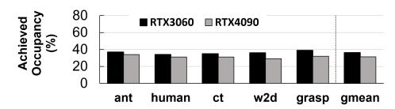
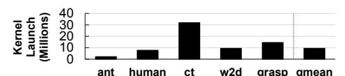
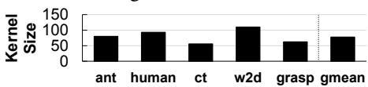
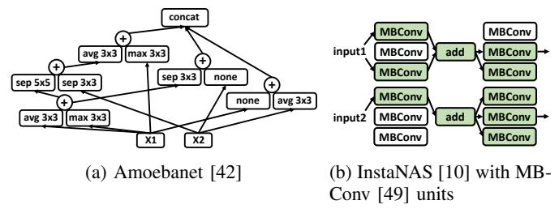

# II. MOTIVATION

## *A. Baseline GPU architecture*

Figure 1 shows an overview of the hardware model in modern GPU architectures [38]. The host communicates with the command processor (CP) of the GPU via a virtual memory region which is memory mapped to the GPU, accessible by the command processor. This enables communication between the CPU and GPU through entries in the command queue. The CPU transmits kernel launch packets to the GPU by writing them to the user mode command queue. The CP is responsible for decoding and dispatching the kernels in these command queues for execution. The CP accesses the command queue and schedules the kernels at the head for execution. This ensures that the kernels are dispatched for launch from these queues in order.

Fig. 1: Scheduling kernels from multiple streamsw

#### B. Case Study 1: Simulation Engines for Deep RL

Deep reinforcement learning (RL) has widely gained attention as a promising approach to learning control policies in robotics and dynamical systems for tasks such as locomotion on legged robots [1], [26], [28], dexterous hand manipulation [21], autonomous driving [20], [24], and drone control [22], [23], [25]. Deep RL involves training a DNN to learn policies that maximize the reward, based on the actions that the agent (e.g., four-legged robot) performs in a given environment. This training process requires data from the agent interacting with a physics simulator. Typically, each training step requires data from thousands of physics simulations. Recent works [1]-[5], [39] accelerate this data generation phase by leveraging GPUs. GPUs can accelerate data generation by performing multiple simulations simultaneously and also parallelizing within a single simulation. Hence this makes them an appropriate candidate workload for GPU execution. Despite GPU acceleration, the simulation/data generation phase is still the predominant computation in deep RL—taking about 30-70% of training time depending on the complexity of the simulated environment. Thus accelerating simulation engines is critical for deep RL performance.

To evaluate the efficiency of physics simulations, we analyzed a set of physics simulations with different environments on a GPU (parameters in § V) with the widely used Brax [1] framework. We evaluate the utilization of the GPU by measuring achieved occupancy (average ratio of active warps to the maximum supported), depicted in Fig. 2. We find that as much as 65% of the GPU cores are underutilized on average (on both GPUs). To evaluate the cause of this underutilization, we analyze the number of kernel launches required to generate one batch of training data in Fig. 3. We also present the average number of CTAs per kernel in Fig. 4 and depict the distribution of kernel sizes observed for the ant environment in Fig. 5. We observe that physics simulations in our evaluations generate a large number of small kernels that have few threads and CTAs. This is a fundamental problem because the simulation engine cannot be efficiently mapped into large kernels as the different threads will likely diverge in the execution path. This is because each thread typically simulates a different scenario in the environment. Thus the application is instead programmed as a large number of short-running kernels. This phenomenon has also been observed by recent works [39], [40].

Fig. 2: Simulation engines: Achieved occupancy.

#### C. Case Study 2: DNNs with dynamic irregular graphs

Recent research has extensively investigated specialized DNNs for edge devices with limited compute resources and

Fig. 3: Simulation engines: Kernels for 1 batch of data

Fig. 4: Simulation engines: Average kernel size (in CTAs)

Fig. 5: Kernel size distribution for the ant environment power budgets as direct deployment of large neural network architectures on these devices leads to high-inference times. Automated DNN architecture design (neural architecture search) is a promising approach to generate faster neural network architectures while retaining or improving accuracy [41]–[44]. These optimized architectures tend to have irregular elaborate connections between convolution operations. Fig. 6a depicts an example DNN with irregular structure. Additionally, an emerging trend in recent research [29] shows that dynamic inference models [6]–[8], [10], [13]–[19], [45]–[48] are very promising to significantly reduce inference latency and FLOPs. With these dynamic inference models, the path of execution through the network is determined by the input. Thus, the computational graph is not known ahead of time. For example, Fig. 6b shows an example CNN model with different paths of execution based on the input [10].

Similar to § II-B, we evaluate the efficiency of these workloads on a GPU (an NVIDIA RTX 3060 and an NVIDIA RTX 4090) and depict the resulting utilization in Fig. 7 (evaluation and workload settings are in § V). We find that the total achieved occupancy is around 39% in the InstaNAS-A [10] workload for both GPUs. Similar to the simulation engines, we root cause this underutilization to the existence of a large number of small kernels, as depicted in Fig. 8, where a large fraction of the kernels have fewer than 200 CTAs. Thus, these small kernels are unable to fully utilize the GPU. In these workloads, the small kernels are due to convolution layers that were optimized for fewer FLOPs with smaller filters.

Fig. 6: DNNs with irregular or dynamic structures

