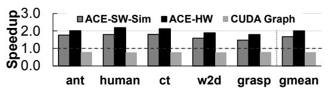
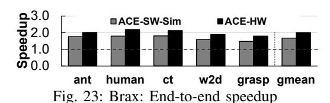
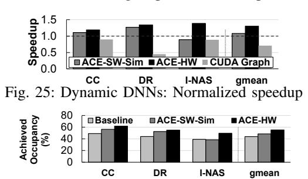

# Workloads. We evaluate ACS using:

- (1) Deep RL physics simulations. Brax [1] is a GPU accelerated simulation engine for control tasks in reinforcement learning. We evaluate ACS with the Ant (ant), Grasp (grasp), Humanoid (human), Cheetah (ct), and Walker2d (w2d) simulation environments. These environments are Mu-JoCo [65] simulations for training RL agents to perform a specific task. For example, ant contains a 3d robot (the agent) with one torso and 4 legs, each with a knee joint, and the goal is to move in a particular direction by controlling its legs.
- (2) Dynamic DNNs. We evaluate our approach for 3 dynamic DNN workloads: InstaNAS [10] (I-NAS) is a dynamic CNN for image classification. We evaluate our approach using the InstaNAS-A architecture on the CIFAR10 dataset. Dynamic routing [12] (DR) is a DNN trained for semantic segmentation of images. We evaluate our approach on the Dynamic-A 16 layer architecture using the Cityscapes dataset [66]. Conditional Convolution [46] (CC) is a mixture-of-experts CNN model for image classification where the weights of the convolutions are computed at runtime. We evaluate the version of Conditional Convolution with 4 experts that uses an efficientnet b4 [67] network as the backbone. All three dynamic DNNs are designed for a batch size of 1 and the input image defines the DNN architecture. We use Pytorch [54] implementations.
- (3) Static DNNs. CNN architectures optimized for low inference latency using neural architecture search (NAS): NASNet [41] (NASNet), AmoebaNet [42] (Amoeba), SqueezeNet [68] (Squeeze), and RandomWire [44] (RW). These CNNs have highly irregular structures with many small kernels. We evaluate ACS with a batch size of 1 on CIFAR10.

#### VI. EVALUATION

We evaluate ACS using three designs: (i) Baseline: cuDNN implementation (for DNNs) and a jax implementation [1] (for deep RL simulation), both using CUDA streams. (ii) ACS-SW: Our software-only mechanism is evaluated on real hardware. (iii) ACS-SW-Sim: Our software-only mechanism evaluated on the GPU simulator. We also include these results to compare against ACS-HW. (iv) ACS-HW: Our hardware-software cooperative mechanism evaluated on the GPU simulator. (v) CUDAGraph: Framework where the inter-kernel dependencies are prepared on the CPU as a directed acyclic graph and sent to the GPU ahead of time. We only present ACS-SW results for the deep RL workloads as the dynamic and static DNNs heavily use CuDNN libraries that do not currently allow modifications to make use of different CUDA streams. We instead model the same effect with ACS-SW-Sim.

## A. Deep RL Physics Simulations

Fig. 21 depicts the runtimes for the generation of a single batch of training data from different simulation environments using ACS-SW, normalized to the baseline approach.

Fig. 21: Deep RL physics simulations: Normalized Speedup

Fig. 22 depicts the runtimes for ACS-SW-Sim and ACS-HW normalized to the baseline implementation. We make two observations. First, ACS-SW-Sim provides similar speedups as in real hardware compared to the baseline implementation (up to  $1.79\times$  and  $1.66\times$  on average). Second, ACS-HW is able to further improve performance compared to the software-only approach by alleviating the synchronization and kernel launch overheads. We observe a slowdown with CUDAGraph due to the significant latency of constructing the kernel dependency graph and sending the information to the GPU.

Fig. 22: Deep RL physics simulations: Normalized speedup

The end-to-end speedup in training tasks (simulation + learning algorithm) as observed is shown in Fig. 23. We observe a mean speedup of  $1.42\times$  on ACS-HW, and  $1.30\times$  on ACS-SW.

In Fig. 24, we depict the achieved occupancy for the three configurations. Achieved occupancy is calculated as the number of active warps divided by the maximum number of active warps supported by the GPU averaged over all clock cycles. We observe that the ACS is able to significantly increase the achieved occupancy and thus the utilization.

Fig. 24: Deep RL physics simulations: Achieved occupancy

## B. Inference on Dynamic DNNs

Fig. 25 depicts speedup over the baseline for the dynamic DNNs described in § V. We observe that ACS is able to provide speedups of up to  $1.39\times$  on dynamic DNN workloads with ACS-HW and on average  $1.05\times$  with ACS-SW and  $1.3\times$  with ACS-HW. I-NAS suffers a slowdown with ACS-SW because this workload has significant kernel launch overheads when parallelized but are hidden in the baseline case where the kernels are simply launched serially into a single stream without synchronization. We observe that CUDAGraph exhibits a significant slowdown due to the overhead incurred during the construction and communication of the DAG dependencies.

Fig. 26 depicts the corresponding achieved occupancy. We find that the ACS configurations are able to significantly improve utilization, leading to performance improvements.

Fig. 26: Dynamic DNNs: Achieved occupancy

