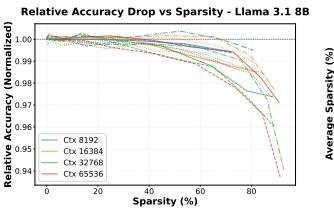
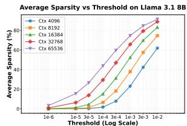

# 2 RELATED WORKS

Effectively exploiting the sparse attention property requires either reducing compute on unimportant interactions or reducing memory footprint (e.g., KV cache) without expensive selection overheads or retraining. Comparing to the following related works, BLASST addresses both dimensions simultaneously, in a training-free manner. Table [1](#page-2-0) summarizes the landscape of existing work.

#### 2.1 Compute-Optimized Sparsity

Several approaches reduce attention *compute* by selecting important interactions. Static pattern methods like Sparse Transformer [\(Child et al.,](#page-11-0) [2019\)](#page-11-0), LongFormer [\(Beltagy](#page-11-0)

<sup>1</sup>[GPU kernels and inference framework support can be found](#page-11-0) [at https://github.com/NVIDIA/TensorRT-LLM](#page-11-0)

<span id="page-2-0"></span>Table 1. Feature comparison of sparse attention methods. BLASST distinguishes itself as the only method capable of accelerating both prefill and decode phases without requiring training or costly precomputation steps.

| Method          | Accelerates<br>Prefill | Accelerates<br>Decode | No<br>Training | No Pre-<br>Computation |
|-----------------|------------------------|-----------------------|----------------|------------------------|
| H2O             | Х                      | ✓                     | <b>√</b>       | <b>✓</b>               |
| SnapKV          | X                      | ✓                     | ✓              | ✓                      |
| RocketKV        | X                      | ✓                     | ✓              | X                      |
| Quest           | X                      | ✓                     | ✓              | X                      |
| DuoAttention    | ✓                      | ✓                     | X              | ✓                      |
| DSA             | ✓                      | ✓                     | X              | ✓                      |
| MInference      | ✓                      | X                     | ✓              | X                      |
| SpargeAttention | ✓                      | X                     | ✓              | X                      |
| XAttention      | ✓                      | X                     | ✓              | X                      |
| BLASST          | ✓                      | ✓                     | ✓              | ✓                      |

et al., 2020), and BigBird (Zaheer et al., 2020) reduce complexity through local or block-based attention. Retrieval head-based methods (Wu et al., 2025; Xiao et al., 2025) accelerate model decoding by focusing compute on crucial retrieval heads. Dynamic sparsity methods like MInference (Jiang et al., 2024) use pre-computed importance scores, XAttention (Xu et al., 2025) ranks anti-diagonal blocks, and FlexPrefill (Lai et al., 2025) offers compilersupported, flexible block patterns; while effective for prefill, their pre-computation and scheduling overheads can limit realized speedups. Training-aided sparsity such as SeerAttention (Gao et al., 2025b) induces high sparsity via (pre)training gates, improving efficiency but adding training cost and showing mixed downstream model performance. FLASH-D (Alexandridis et al., 2025) leverages the mathematical properties of online softmax in a similar way as BLASST, but to improve numerical stability and parallelism on custom hardware accelerators.

SpargeAttention (Zhang et al., 2025) has the most similar design to BLASST. We differ in three key aspects: (1) BLASST optimizes both prefill and decode with specialized kernels, while SpargeAttention targets prefill only; (2) we make skip decisions directly using already-computed statistics with zero overhead, while SpargeAttention uses a separate prediction step; (3) our decode kernel skips Value loading from HBM, addressing memory-bound bottlenecks on top of compute savings. In addition, we provide automated calibration and sparsity-aware training.

## 2.2 Memory-Optimized Sparsity

Token/KV sparsity focuses on reducing *memory* footprint and decode-time cost. H2O (Zhang et al., 2023), TOVA (Oren et al., 2024), and InfLLM (Xiao et al., 2024a) discard tokens based on query patterns. StreamingLLM (Xiao et al., 2024b) retains initial and recent tokens for consistent latency and memory usage.

Quest (Tang et al., 2024) prunes tokens conditioned on the current query, Rectified Sparse Attention (Sun et al., 2025) adaptively selects tokens to maintain accuracy at high sparsity, RocketKV (Behnam et al., 2025) compresses the KV cache with selective eviction, and recent KV compression for hyper-scaling (Łańcucki et al., 2025) further extends effective context; TidalDecode (Yang et al., 2026) stabilizes decode efficiency with position-persistent patterns. We further distinguish reasoning-oriented compression methods such as RPC (Song et al., 2025), which prioritize preserving reasoning-critical information under memory constraints; non-eviction methods such as Loki (Singhania et al., 2024), which avoid explicit KV eviction while reducing effective memory/computation overhead. In general, these methods reduce memory accesses in the decode phase, whereas BLASST reduces compute and memory accesses in both prefill and decode while remaining training-free.

#### 2.3 New Attention Variants

Beyond the above methods, alternative mechanisms include Sliding Window Attention (Beltagy et al., 2020), Linear or Gated Attention (Qiu et al., 2025), and State-Space Models (SSM) (Gu & Dao, 2024). Native Sparse Attention (NSA) (Yuan et al., 2025) and DeepSeek Sparse Attention (DSA) (DeepSeek-AI, 2025), while effective in some regimes, often require architectural changes and training. By contrast, BLASST is a training-free method that accelerates both prefill and decode without proxy scores or complex pre-computation, integrating seamlessly with FlashAttention implementations.

## 3 METHODOLOGY

#### 3.1 Pruning Attention with Running Maximums

The core insight of BLASST lies in the observation that during the computation of attention scores in FlashAttention, many blocks contribute negligibly to the final output after softmax normalization. Our method identifies and skips these blocks dynamically during the forward pass, without requiring pre-computation or proxy scores.

#### 3.1.1 Key Insight

In the standard attention mechanism, the softmax operation computes:

$$\operatorname{Attention}(Q,K,V) = \operatorname{softmax}\left(\frac{QK^{\top}}{\sqrt{d_k}}\right)V \qquad (1)$$

During FlashAttention's block-wise computation, we maintain a running maximum  $m_i^{(j)}$  across blocks. If a block's local maximum  $\tilde{m}_i^{(j)}$  is significantly smaller than the current running maximum, i.e.,  $\tilde{m}_i^{(j)} - m_i^{(j)} < \ln(\lambda)$  for some

<span id="page-3-0"></span>threshold  $\lambda$ , then after exponentiation:

$$\exp(\tilde{m}_i^{(j)} - m_i^{(j)}) < \lambda \approx 0 \tag{2}$$

Since the maximum value is bounded by  $\lambda$ , the block's contribution to the final attention output will be negligible, allowing us to skip its computation entirely.

Intuitively, this criterion follows a three-step approximation. First, the ideal importance of each score  $S_{ij}$  is its value relative to the (unknown) global maximum. Second, computing the true maximum on-the-fly is too expensive, so we use the running maximum as a tractable proxy and compare  $S_{ij}$  against it. Third, to enable an efficient block-level decision inside the kernel, we replace token-level  $S_{ij}$  with the block-local maximum, which yields the inexpensive condition (block\_max - running\_max)  $< \ln(\lambda)$ .

#### 3.1.2 Algorithm Design

Algorithm 1 presents our modified FlashAttention forward pass, where the sequence is tiled into  $T_r$  query blocks and  $T_c$  KV blocks of size  $B_c$  each. The key modification is the introduction of a dynamic pruning condition that saves both computation and memory bandwidth. Where We Save: When  $\tilde{m}_i^{(j)} - m_i^{(j)} < \ln(\lambda)$  (line 7), we skip:

- 1. Compute savings (CUDA cores): The expensive  $\exp(\cdot)$  operations for computing  $\tilde{P}_{ij}$  require multiple instructions per element: MUFU.EX2 (exponential), FMUL (multiplication), and FADD (addition). We also skip the rowsum reduction operations (FADD instructions) for normalizing attention weights. For a typical block, this saves thousands of CUDA core instructions.
- 2. Compute savings (Tensor cores) The matrix multiplication  $\tilde{P}_{ij}V_j$ . In the prefill phase, where kernels are compute-bound, avoiding these MMA operations provides a substantial speedup.
- 3. **Memory bandwidth savings:** Loading the Value block  $V_j$  from HBM to SRAM. This is particularly critical in decode phase, where attention is memory-bound.

Our approach directly reduces the total amount of computation by dynamically identifying and skipping negligible attention blocks during the forward pass. This simple yet effective modification requires minimal changes to the existing FlashAttention implementation while providing significant computational savings.

## 3.2 Calibration for Optimal Sparsity

A critical challenge in deploying BLASST is selecting the appropriate threshold  $\lambda$  that balances sparsity and accuracy. To understand this relationship, we conducted experiments on Llama-3.1-8B across RULER benchmark challenging subsets (NIAH\_MULTI, VT, FWE) with context lengths from 8K to 64K tokens.

## Algorithm 1 FlashAttention with BLASST

```
Require: Query blocks \{Q_i\}_{i=1}^{T_r}, Key blocks \{K_j\}_{j=1}^{T_c}, Value blocks \{V_j\}_{j=1}^{T_c}, threshold \lambda
Ensure: Output blocks \{O_i\}_{i=1}^{T_r}
  1: for i=1 to T_r do 
2: Initialize m_i^{(0)}=-\infty,\, O_i^{(0)}=0,\, l_i^{(0)}=0
   3:
                     Compute S_{ij} = Q_i K_i^{\top}

   4:
                    \tilde{m}_i^{(j)} = \operatorname{rowmax}(S_{ij}) \rightharpoonup \operatorname{Local} \operatorname{maximum} m_i^{(j)} = \max(m_i^{(j-1)}, \tilde{m}_i^{(j)}) \rightharpoonup \operatorname{Running} \operatorname{maximum}
   5:
   6:
                     if \tilde{m}_i^{(j)} - m_i^{(j)} < \ln(\lambda) then
   7:
   8:
  9:
                    \begin{split} &\tilde{P}_{ij} = \exp(S_{ij} - m_i^{(j)}) > \text{Compute attn. weights} \\ &l_i^{(j)} = e^{m_i^{(j-1)} - m_i^{(j)}} l_i^{(j-1)} + \text{rowsum}(\tilde{P}_{ij}) \\ &O_i^{(j)} = e^{m_i^{(j-1)} - m_i^{(j)}} O_i^{(j-1)} + \tilde{P}_{ij} V_j \end{split}
10:
11:
12:
13: end for
14: O_i = O_i^{(T_c)}/l_i^{(T_c)}
15: end for
                                                                 ⊳ Final normalization
16: return \{O_i\}_{i=1}^{T_r}
```

**Sparsity Determines Accuracy.** Figure 2 (left) shows relative accuracy degradation as a function of the observed sparsity level. We normalize each curve by the full attention result for a fair comparison. Remarkably, all curves exhibit consistent degradation patterns: accuracy remains stable up to  $\sim\!60\text{--}70\%$  sparsity, beyond which accuracy drops sharply. This consistency across diverse tasks and sequence lengths reveals that **accuracy degradation is primarily determined by the sparsity ratio itself**, not the type of data set or sequence length.

Threshold Calibration is Essential. For models to achieve consistent accuracy, we must maintain a fixed sparsity ratio rather than a fixed threshold. However, Figure 2 (right) shows that achieving 75% sparsity requires  $\lambda \approx 1\mathrm{e}{-4}$  for 8K contexts but only  $1\mathrm{e}{-5}$  for 64K contexts. This necessitates adaptive calibration. Importantly, by targeting fixed sparsity through calibration, users can control and foresee the computational speedup, since accuracy gains scale predictably with the observed sparsity level.

Through empirical analysis, we find that the optimal threshold follows an **inversely proportional** relationship with context length L:

$$\lambda = \frac{a}{L} \tag{3}$$

where a is a model-specific scale factor that depends on the target sparsity level. This inverse relationship has theoretical grounding: since attention scores are row-normalized to sum to 1, longer sequences have lower average scores per token, requiring proportionally smaller thresholds. Without

<span id="page-4-0"></span>



Figure 2. (Left) Relative accuracy drop across different datasets and context lengths shows consistent degradation patterns as observed sparsity increases. All curves are normalized to their initial accuracy. (Right) Relationship between threshold and observed sparsity levels across different sequence lengths, demonstrating the need for threshold calibration to maintain fixed sparsity across varying contexts.

## Algorithm 2 BLASST Calibration

```
Require: Calibration dataset \mathcal{D} = \{(x_i, L_i)\}_{i=1}^N, threshold
      set \Lambda, sparsity bounds s_{\min}, s_{\max}
Ensure: Calibration parameters \alpha, \beta
 1: Initialize data points \mathcal{P} = \emptyset
 2: for each sample (x_i, L_i) in \mathcal{D} do
           for each \lambda_j \in \Lambda do
 3:
 4:
                 s_{ij} \leftarrow \text{MeasureSparsity}(\lambda_i, x_i)
                 if s_{\min} \le s_{ij} \le s_{\max} then \triangleright Filter unreliable
 5:
      extremes
                      Add (\lambda_j \cdot L_i, s_{ij}) to \mathcal{P}
 6:
 7:
                 end if
 8:
           end for
 9: end for
10: Fit exponential model \lambda \cdot L = \alpha \cdot \exp(\beta \cdot s) using \mathcal{P}
11: return parameters \alpha, \beta
```

calibration, fixed thresholds would cause vastly different sparsity levels across sequence lengths.

To determine a for any target sparsity, we propose the calibration procedure detailed in Algorithm 2. For each calibration sample  $x_i$  of length  $L_i$  and each candidate threshold  $\lambda_i$ , we measure the achieved sparsity  $s_{ij}$  and record the scale factor  $\lambda_i \cdot L_i$ . Since sparsity for all thresholds can be computed from the same attention scores, the entire calibration requires only a single forward pass over  $\mathcal{D}$ . We then fit an exponential model  $\lambda \cdot L = \alpha \cdot \exp(\beta \cdot s)$  to all collected data points. The exponential form reflects the heavy-tailed distribution of attention scores: small increases in threshold prune many low-scoring blocks, while further increases yield diminishing returns as only high-scoring blocks remain. In inference with target sparsity S, the threshold is  $\lambda = \alpha \cdot \exp(\beta \cdot S)/L$ , preserving the inverse relationship Eq. (3) while allowing the target sparsity to be adjusted at runtime without recalibration.

More importantly, by targeting fixed sparsity levels, our calibration ensures predictable computational speedup across

different context lengths. This is a crucial property for production deployment where consistent performance is required. We provide additional cross-dataset evidence in Appendix A (Table 12), showing that the calibrated parameter a yields stable sparsity across diverse tasks without task-specific retuning.

#### 3.3 Extensibility to Attention Variants

Because BLASST depends only on tiled online softmax, it is inherently compatible with many existing dense attention variants. MLA (DeepSeek-AI, 2025), for instance, still employs online softmax to compute attention scores within its latent space. Although MLA decoding shifts the bottleneck towards a compute-bound regime, BLASST remains effective because it eliminates both computation and memory accesses, providing benefits regardless of the primary hardware bottleneck.

#### 3.4 Sparsity-Aware Training

While BLASST is primarily designed as a training-free inference optimization, we explore sparsity-aware training as a simple extension to further improve the accuracy-sparsity trade-off. The motivation is straightforward: if models learn to concentrate important information in high-scoring attention blocks during training, they should maintain higher accuracy when those blocks are pruned during inference.

Our method is simple: during fine-tuning, we apply BLASST in the forward pass to skip negligible attention blocks based on the threshold criterion. In the backward pass, skipped blocks naturally receive no gradients since they were not computed in the forward pass. This encourages the model to adapt its attention patterns to be more compatible with sparsity, concentrating important information in blocks that pass the threshold test. This approach requires no architectural changes or auxiliary losses—it is simply training with the same sparse attention that will be used at inference time.

#### 4 KERNEL DESIGN

The BLASST kernels were designed with two primary goals: (1) minimal changes to existing FlashAttention kernel interfaces and implementation structure, and (2) minimal overhead for block skipping decision logic. Our key insight is to reuse statistics computed during the standard FlashAttention algorithm—specifically, the local maximum and running maximum values maintained in every thread during online softmax. Our optimizations are specific to BLASST and cannot be applied to typical FlashAttention kernels.

**Skip Decision Implementation.** The decision process (line 7 in Algorithm 1) requires only a few additional instructions per block: (1) setting a predicate per thread based on the


Figure 3. Prefill pipeline schedules for FlashAttention and BLASST at 50% sparsity across 4 loop iterations (L0–L3). Rows are separated based on warp/warpgroup specializations. Darker and lighter hues correspond to ops for different tile rows (T0/T1). The MMA warp's BMM1 and BMM2 ops are indicated with B1 and B2. The softmax warpgroups are primarily bottlenecked by exponentiation (EX2), but they also perform the skip check, row sum and softmax scaling (not shown). Mainloop iterations are enclosed by solid lines.

threshold comparison, (2) issuing a VOTE instruction to determine if all threads within a warp agree to skip, and (3) a single ATOMIC instruction to shared memory issued by one thread per warp to coordinate the block-level decision across the softmax warpgroup. We carefully design the kernel such that the decision-making instructions are hidden behind existing operations, adding negligible latency overhead.

Since prefill and decode phases have fundamentally different performance characteristics, we implement specialized optimizations for each.

#### 4.1 Prefill Kernel: Compute-Bound Optimization

Prefill kernels are typically compute-bound, bottlenecked by CUDA core (softmax) and tensor core (matrix multiplication) throughput rather than memory bandwidth. Therefore, our prefill kernel is designed to skip both softmax computation and MMA operations (attention-value multiplication) for pruned blocks.

Figure 3 illustrates our changes to the pipeline schedule for the BLASST prefill kernel, which is optimized for compute-bound scenarios by overlapping different compute tasks. The pipeline schedules operations across Tensor Cores (math warp/matrix multiplication) and CUDA cores (softmax and correction logic). Figure 3b shows that even as all QK<sup>⊤</sup> (BMM1) operations are computed, the kernel dynamically skips compute-heavy softmax and attention-value multiplication (BMM2) for blocks identified as negligible (e.g., loop 1 and loop 3 in Figure 3b). By skipping these compute operations, the kernel frees up execution units, allowing subsequent operations to be scheduled earlier. This compresses the entire schedule, reducing the total runtime from 18 time units in Figure 3a to 14 units in Figure 3b.

The Value blocks remain loaded from HBM in the prefill kernel because: (1) memory bandwidth is not the bottleneck, (2) the prefetching pipeline benefits from predictable memory access patterns, and (3) the latency of conditional Value loading would exceed the savings. By focusing on eliminating compute operations, we achieve speedups that scale nearly linearly with sparsity in the compute-bound regime. Our current design prioritizes the common case where prefill is compute-bound on modern GPUs; however, Value loading could be skipped in prefill if future workloads and/or hardware architectures shift to a memory-bandwidthbound regime.

## 4.2 Decode Kernel: Memory-Bound Optimization

Decode kernels are typically memory-bound, bottlenecked by the HBM bandwidth required to fetch the KV cache rather than compute, as attention involves only a single Query against all Keys. Our kernel thus focuses on skipping the memory-intensive load of the Value matrix V<sup>j</sup> for pruned blocks, directly addressing this HBM bottleneck. This optimization cuts memory traffic proportionally to the sparsity level, while we overlap the threshold and Key operations with the remaining Value loads to achieve a substantial speedup, reflecting the different performance characteristics of decode versus prefill.

A critical challenge in the decode kernel is that in a naive implementation, the value load and subsequent attentionvalue multiplication (BMM2) would be issued before the query-key multiplication (BMM1) completes and the skip decision can be made. This would result in wasted memory bandwidth loading values that will ultimately be discarded. By conditionally loading blocks of V we can save memory bandwidth; however, this introduces a scoreboard depen-


Figure 4. Decode pipeline schedules for FlashAttention and BLASST skipping in loops 1, 2, and 4. We focus on the steady state of the first 6 mainloop iterations (L0–L5). The BLASST schedule does consecutive K loads since V cannot be pre-fetched until the skip-check is computed after BMM1. V loads in Figure 4b finish more quickly because there are fewer simultaneous loads. Arrows indicate scoreboard dependencies from the skip check after BMM1. Note that the MMA warp's BMM1 and BMM2 ops are indicated with B1 and B2.

dency that stops us from issuing consecutive loads ahead of time. The pipeline becomes serialized and can introduce pipeline bubbles.

To address this, we redesign the decode kernel pipeline to use batched load scheduling. As shown in Figure 4b, instead of processing blocks end-to-end one at a time, we process multiple consecutive query-key products back-to-back  $(K_1^\top Q, K_2^\top Q \dots K_B^\top Q)$ . The tradeoff is that we must maintain B number of shared memory buffers for  $S_j$  (from  $K_j^\top Q$ ), but they are relatively small with a query sequence length of 1. This reordering allows us to issue a batch of loads for only  $V_j$  tiles that pass the threshold check, removing the possibility of pipeline bubbles. As a result, Figure 4a takes 38 time units to complete all V loads, whereas Figure 4b takes 31 units.

For attention mechanisms like Multi-head Latent Attention (MLA) (Liu et al., 2024a) that can be compute-bound even in decode, we also skip softmax operations for pruned blocks, providing further speedup beyond memory savings.

## 5 EXPERIMENTS

#### 5.1 Experimental Setup

**Models.** We evaluate BLASST on state-of-the-art language models to demonstrate its effectiveness across different architectures. Our evaluation focuses on two 8B parameter models—Llama-3.1-8B-Instruct and Qwen3-8B-Instruct—both supporting context lengths up to 128K tokens. For longgeneration reasoning tasks, we use Llama-3.1-8B-Instruct distilled from DeepSeek-R1 (Guo et al., 2025), which provides enhanced reasoning capabilities while maintaining

compatibility with our sparse attention approach.

**Baselines.** We compare BLASST against dense attention and SOTA sparse attention methods. For prefill optimization, we compare against MInference (Jiang et al., 2024), FlexPrefill (Lai et al., 2025), and XAttention (Xu et al., 2025). For decode optimization, we evaluate against Quest (Tang et al., 2024), RocketKV (Behnam et al., 2025). For each baseline, we adopt its best-performing configuration as reported in its respective paper to ensure fair comparisons.

**Datasets.** We evaluate on two categories of benchmarks: (1) **Long-context tasks**: RULER (Hsieh et al., 2024) (synthetic retrieval and reasoning from 4K-128K tokens) and LongBench v2 (Bai et al., 2025) (real-world QA, summarization, and code completion). (2) **Reasoning tasks**: MATH500 (mathematical problem solving), AIME 2024 (advanced mathematics), GPQA (graduate-level science), and LiveCodeBench (code generation). These reasoning benchmarks test whether sparse attention preserves complex multi-step reasoning capabilities. We use the NVIDIA NeMo-Skills framework<sup>2</sup> for standardized evaluation of reasoning tasks.

Implementation Details. We implement BLASST as optimized CUDA kernels integrated into TensorRT-LLM and FlashInfer (Ye et al., 2025). For calibration (Algorithm 2), we sample approximately 1000 sequences from the RULER dataset across different context lengths (4K, 8K, 16K, 32K, 64K) to fit the calibration parameters  $\alpha$  and  $\beta$  for the threshold relationship  $\lambda = \alpha \cdot \exp(\beta \cdot S)/L$ . For sparsity-aware training, we adopt the curriculum training approach from

<sup>&</sup>lt;sup>2</sup>https://github.com/NVIDIA-NeMo/Skills

Table 2. Performance of BLASST at different sparsity levels across all models and benchmarks. We evaluate on Llama-3.1-8B and Qwen3- 8B across three deployment scenarios: prefill-only optimization (long-context tasks: RULER, LongBench); decode-only optimization (reasoning tasks: MATH500, AIME 2024, GPQA); and combined prefill+decode optimization. Results show minimal accuracy degradation even at ∼75% sparsity, with occasional improvements over the dense baseline.

| Model        | Target Sparsity | Prefill Phase |           |         | Decode Phase | Prefill + Decode Phase |           |           |
|--------------|-----------------|---------------|-----------|---------|--------------|------------------------|-----------|-----------|
|              |                 | RULER-32K     | LongBench | MATH500 | AIME2024     | GPQA                   | RULER-32K | LongBench |
|              | Dense           | 92.33         | 31.40     | 73.40   | 46.66        | 46.71                  | 92.33     | 31.40     |
| Llama-3.1-8B | 50%             | 91.81         | 31.80     | 73.71   | 46.15        | 46.31                  | 91.79     | 32.40     |
|              | 75%             | 91.67         | 31.80     | 73.89   | 46.01        | 45.95                  | 91.67     | 31.80     |
|              | Dense           | 91.90         | 33.60     | 95.87   | 75.00        | 61.21                  | 91.90     | 33.60     |
| Qwen3-8B     | 50%             | 92.08         | 35.10     | 96.23   | 76.50        | 61.56                  | 92.07     | 33.30     |
|              | 75%             | 92.11         | 34.40     | 96.07   | 75.33        | 61.51                  | 91.74     | 33.10     |

ProLong [\(Gao et al.,](#page-11-0) [2025a\)](#page-11-0), applying BLASST during the finetuning phase with a fixed sparsity threshold.

For evaluation, we use different sampling strategies depending on the task type. For long-context benchmarks (RULER and LongBench), we use greedy decoding with temperature=0 and perform a single run per example to ensure deterministic and reproducible results. For reasoning tasks that benefit from sampling diversity, we use temperature=0.6 and top-p=0.95. Specifically, we generate 10 samples per problem for MATH500, GPQA, and LiveCodeBench, and 20 samples per problem for AIME 2024 due to its greater difficulty. For these reasoning tasks, we report the bestof-N performance where the final answer is selected using majority voting or self-consistency.

