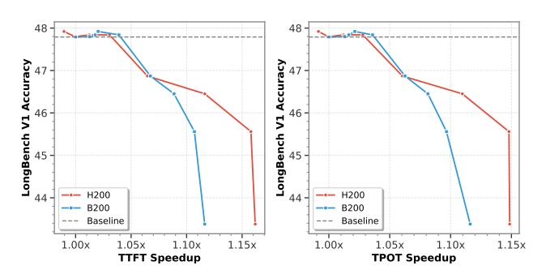
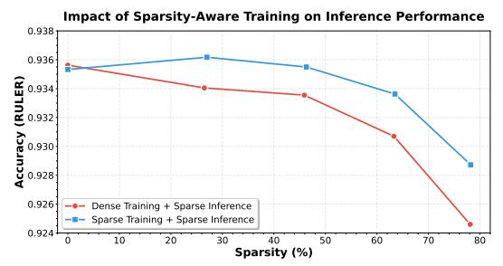
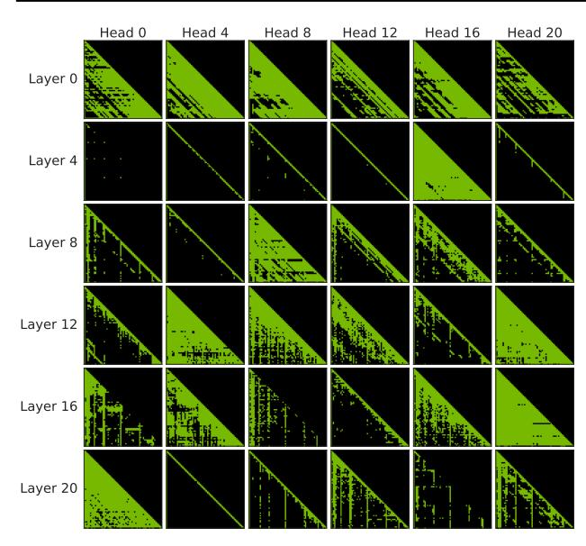

# 5.2 Main Results

Overall Performance. Table 2 presents the accuracy results of BLASST at 50% and 75% target sparsity levels on Llama-3.1-8B and Qwen3-8B across a diverse set of language benchmarks. We also evaluate larger model variants on LongBench and NIAH (Table [9](#page-14-0) and Table [10](#page-14-0) in Appendix [A\)](#page-14-0), and evaluate BLASST on DeepSeek-R1 to demonstrate compatibility with the MLA attention mechanism (Table [11](#page-14-0) in Appendix [A\)](#page-14-0). Remarkably, BLASST not only maintains accuracy with minimal degradation but occasionally *outperforms* the dense baseline. For example, on Qwen3-8B, we observe improvements on MATH500 (96.23 vs. 95.87) and AIME 2024 (76.50 vs 75.00) at 50% sparsity. This counterintuitive result can be attributed to two factors. First, in long-context tasks where information is inherently sparse, pruning low-attention blocks forces the model to concentrate probability mass on the most relevant tokens, effectively acting as implicit denoising. Second, for longgeneration reasoning tasks, some intermediate reasoning steps or tokens may be redundant or even detrimental [\(Sui](#page-12-0) [et al.,](#page-12-0) [2025\)](#page-12-0); by skipping blocks with negligible attention scores, we filter out such distractions, allowing the model to focus on essential reasoning chains. These results show

that BLASST is not only computationally efficient, but also improves response quality in certain scenarios.

Prefill Phase Comparison. Table [3](#page-8-0) compares BLASST against state-of-the-art prefill-optimized sparse attention methods on Llama-3.1-8B. Across RULER (4K–64K context lengths) and LongBench, BLASST achieves the best overall accuracy (92.87 RULER average, 31.8 LongBench) among all sparse methods, closely matching dense attention (93.21, 31.4). In particular, BLASST significantly outperforms MInference (84.15 RULER) and FlexPrefill (87.72 RULER), demonstrating the effectiveness of our thresholdbased pruning over proxy-based importance estimation.

Decode Phase Comparison. Table [4](#page-8-0) evaluates BLASST on Qwen3-8B across reasoning-intensive tasks. Targeting 50% sparsity, BLASST matches or exceeds dense baseline performance on all benchmarks, while maintaining long-context capabilities. We note that all existing methods employ different optimization strategies and target different deployment scenarios, making direct comparison challenging. We include Quest and RocketKV as reference points to contextualize BLASST's performance. For instance, RocketKV shows 87.89 RULER and 30.60 LongBench scores, illustrating the trade-offs between aggressive KV cache compression and BLASST's preservation of critical attention patterns.

## 5.3 GPU Kernel Performance

We implement and benchmark highly optimized kernels for both Blackwell (B200) and Hopper (H200) GPU architectures, demonstrating that BLASST achieves substantial real-world speedups. Table [5](#page-9-0) shows performance scaling across increasing sparsity levels for both prefill and decode phases. All speedups are measured against FlashAttention-3 BF16 baselines.

Key Results. At near-lossless accuracy (∼50% target sparsity), we achieve approximately 1.33× speedup for prefill and 1.25× speedup for decode on Blackwell. At higher sparsity (∼70%), the speedup increases to 1.52× for prefill

Table 3. Prefill phase comparison on Llama-3.1-8B-Instruct across RULER and LongBench. Best (non-dense) score in each column is denoted in bold. Targeting 50% sparsity, BLASST achieves the best accuracy among all sparse attention methods, closely matching dense attention in addition to being the easiest to use.

| Method          | RULER |       |       | LongBench |       |         |      |      |       |        |      |         |
|-----------------|-------|-------|-------|-----------|-------|---------|------|------|-------|--------|------|---------|
| 4               |       | 8K    | 16K   | 32K       | 64K   | Average | Easy | Hard | Short | Medium | Long | Overall |
| Dense Attention | 96.16 | 95.07 | 94.80 | 92.33     | 87.69 | 93.21   | 29.7 | 32.5 | 38.3  | 28.8   | 25.0 | 31.4    |
| FlexPrefill     | 95.99 | 93.67 | 92.73 | 88.14     | 81.14 | 87.72   | 28.8 | 23.8 | 24.4  | 26.5   | 26.2 | 25.7    |
| MInference      | 96.54 | 94.06 | 91.37 | 85.79     | 83.03 | 84.15   | 28.6 | 32.8 | 36.7  | 30.2   | 24.1 | 31.2    |
| XAttention      | 96.37 | 94.47 | 94.48 | 91.91     | 85.01 | 92.44   | 29.2 | 31.5 | 38.3  | 26.0   | 26.9 | 30.6    |
| BLASST (~50%)   | 96.17 | 94.70 | 94.61 | 91.81     | 87.06 | 92.87   | 30.7 | 32.5 | 38.3  | 29.8   | 25.0 | 31.8    |

Table 4. Decode phase comparison on Qwen3-8B across diverse reasoning and generation tasks. Best (non-dense) score in each column is denoted in bold. Targeting 50% sparsity, BLASST matches or exceeds dense baseline on all benchmarks, including mathematical reasoning (MATH500, AIME 2024), graduate-level science (GPQA), and code generation (LiveCodeBench), while maintaining long-context performance (RULER, LongBench).

| Method          | RULER-32K | LongBench | MATH500 | AIME 2024 | LiveCodeBench | GPQA  | Average |
|-----------------|-----------|-----------|---------|-----------|---------------|-------|---------|
| Dense Attention | 91.90     | 33.60     | 95.87   | 75.00     | 53.83         | 61.21 | 68.57   |
| Quest           | 56.23     | 30.30     | 94.18   | 71.50     | 52.17         | 60.12 | 60.75   |
| RocketKV        | 87.89     | 30.60     | 95.88   | 73.54     | 53.10         | 60.50 | 66.91   |
| BLASST ~50%     | 91.55     | 33.90     | 96.23   | 76.50     | 54.15         | 61.51 | 68.97   |

and  $1.48\times$  for decode. On Hopper, prefill achieves up to  $1.52\times$  speedup at 71.0% sparsity. These speedups scale predictably with sparsity: higher sparsity yields greater performance gains, allowing users to choose their preferred accuracy-performance trade-off.

Importantly, we observe no significant performance degradation at 0% sparsity (0.96–1.00× baseline), verifying the kernels are able to hide the skip check computation behind Tensor Core (prefill) or HBM load (decode) instructions.

For a full picture, the accuracy-performance tradeoffs in Figure 5 show how effective BLASST is in an inference serving environment. We see a 1.1× speedup in TTFT and TPOT with only a marginal drop in LongBench V1 accuracy.

Figure 5. BLASST shows meaningful end-to-end acceleration at medium to long context lengths. Data shows Qwen3-30B-A3B-Instruct-2507, evaluated on LongBench V1 with H200 and B200 GPUs, collected by stepping target sparsity from 0% to 80%. Average input sequence length is 10K; average output sequence length is 6. Performance is measured in TensorRT-LLM using in-flight batching with concurrency 64, meaning decoding requests may be piggybacked with prefilling requests.

#### 5.4 Calibration Results

A key motivation for our calibration approach is that fixed thresholds produce inconsistent sparsity across different context lengths, making deployment unreliable. Table 6 demonstrates the effectiveness of our calibration method across varying sequence lengths. For a target sparsity of 50%, the fixed threshold approach makes the observed sparsity highly unstable, ranging from 23% at 4K to 75% at 64K, making it impractical for production deployment. In contrast, our calibrated  $\lambda = a/L$  approach maintains sparsity within a tight range with an average error of only 1.2% from the target. Similar improvements are observed at 70% target sparsity. These results confirm that our calibration enables reliable, predictable sparsity control across diverse sequence lengths without manual tuning.

Beyond context-length stability, we also verify that the calibrated parameter a transfers across different task types without heavy retuning (Table 12 in Appendix A).

#### 5.5 Sparsity-Aware Training Results

Figure 6 demonstrates that sparsity-aware training improves the accuracy-sparsity trade-off on RULER benchmarks. At low sparsity levels, sparse-trained models even slightly outperform the dense baseline, suggesting the model learns more robust attention patterns. In the target sparsity range of 50-75%, sparse-trained models achieve substantially better accuracy than applying sparsity training-free, reducing accuracy degradation by up to  $1.7\times$ . These results confirm that models can be trained to concentrate information in

Table 5. BLASST speedup over dense baseline on Blackwell and Hopper GPUs. Sparsity values reported are achieved sparsity levels, obtained by varying the threshold ( $\lambda$ ). Prefill: batch size 1, 64K sequence length. B200 decode: batch size 148, 32K sequence length. H200 decode: batch size 128, 16K sequence length.

|          | ell (B200)    |          | (H200)        |  |  |  |  |  |
|----------|---------------|----------|---------------|--|--|--|--|--|
| Sparsity | Speedup       | Sparsity | Speedup       |  |  |  |  |  |
|          | Prefill Phase |          |               |  |  |  |  |  |
| 0.0%     | 1.00×         | 0.0%     | 1.00×         |  |  |  |  |  |
| 38.9%    | $1.25 \times$ | 23.8%    | $1.08 \times$ |  |  |  |  |  |
| 49.2%    | $1.33 \times$ | 49.2%    | $1.27 \times$ |  |  |  |  |  |
| 63.0%    | $1.43 \times$ | 57.3%    | $1.35 \times$ |  |  |  |  |  |
| 71.9%    | $1.52 \times$ | 71.0%    | $1.52 \times$ |  |  |  |  |  |
| 80.8%    | $1.61 \times$ | 79.5%    | $1.64 \times$ |  |  |  |  |  |
| 88.9%    | $1.71 \times$ | 88.5%    | $1.78 \times$ |  |  |  |  |  |
| 94.2%    | $1.77 \times$ | 92.0%    | $1.84 \times$ |  |  |  |  |  |
|          | Decode        | e Phase  |               |  |  |  |  |  |
| 0.0%     | 0.98×         | 0.0%     | 0.96×         |  |  |  |  |  |
| 36.9%    | $1.18 \times$ | 23.8%    | $1.08 \times$ |  |  |  |  |  |
| 46.7%    | $1.25 \times$ | 43.7%    | $1.20 \times$ |  |  |  |  |  |
| 61.2%    | $1.34 \times$ | 59.4%    | 1.31×         |  |  |  |  |  |
| 73.2%    | $1.48 \times$ | 70.5%    | $1.40 \times$ |  |  |  |  |  |
| 82.6%    | $1.64 \times$ | 78.4%    | $1.47 \times$ |  |  |  |  |  |
| 87.0%    | $1.71 \times$ | 87.5%    | $1.56 \times$ |  |  |  |  |  |
| 92.0%    | 1.79×         | _        |               |  |  |  |  |  |

high-scoring attention blocks, making them inherently more compatible with sparse attention patterns and pushing the Pareto frontier of efficient attention.

#### 5.6 Ablation Studies

Sparsity Distribution Analysis. Figure 7 illustrates how sparsity varies across layers and attention heads, revealing the attention patterns produced by the model. We observe substantial heterogeneity: different layers exhibit different sparsity levels, and individual heads within each layer also show significant variance. Crucially, BLASST naturally incorporates this heterogeneity without requiring explicit mechanisms like top-k selection or head pruning—by applying the same threshold across all layers and heads, our method automatically adapts to each layer's and head's natural attention distribution, pruning more aggressively where attention is naturally more concentrated and preserving more blocks where attention is more diffuse.

Combination with Other Sparsity Methods. Table 7 explores the combination of BLASST with other attention sparsity techniques. We find that BLASST can be effectively composed with both prefill-optimized methods (XAttention) and KV cache compression methods (RocketKV). When XAttention (prefill) is combined with BLASST (decode), accuracy degradation remains minimal, demonstrating that the methods are largely orthogonal. Similarly, combining BLASST (prefill) with RocketKV maintains strong perfor-

Table 6. Sparsity stability across context lengths: calibrated vs. fixed threshold on Llama-3.1-8B. Our calibration method maintains consistent sparsity levels across different context lengths, while fixed thresholds produce high variance. Values in parentheses indicate deviation of observed sparsity from the target.

| Method                     | 4K       | 8K           | 16K     | 32K      | 64K      |
|----------------------------|----------|--------------|---------|----------|----------|
|                            | Targe    | et Sparsity: | 50%     |          |          |
| Fixed $\lambda = 1e-3$     | 23.09    | 37.92        | 52.38   | 65.72    | 74.63    |
|                            | (-26.91) | (-12.08)     | (+2.38) | (+15.72) | (+24.63) |
| Calibrated $\lambda = a/L$ | 54.20    | 49.70        | 52.20   | 46.96    | 48.75    |
|                            | (+4.20)  | (-0.30)      | (+2.20) | (-3.04)  | (-1.25)  |
|                            | Targe    | et Sparsity: | 70%     |          |          |
| Fixed $\lambda = 3e-3$     | 42.35    | 57.54        | 69.83   | 79.36    | 84.63    |
|                            | (-27.65) | (-12.46)     | (-0.17) | (+9.36)  | (+14.63) |
| Calibrated $\lambda = a/L$ | 67.99    | 74.65        | 73.64   | 72.54    | 74.63    |
|                            | (-2.01)  | (+4.65)      | (+3.64) | (+2.54)  | (+4.63)  |

Figure 6. Sparsity-aware training pushes the accuracy-sparsity frontier. Models fine-tuned with BLASST active during training maintain higher accuracy at aggressive (observed) sparsity levels compared to training-free sparsity application. By training with sparse attention, models learn to concentrate information in high-scoring blocks, making them more robust to pruning.

mance. These results show that BLASST provides a flexible building block for end-to-end optimization in existing sparse attention pipelines, and show strong potential for composing with other fine-grained channel/head pruning methods (Xu et al., 2024).

Very Long Sequence Lengths. We evaluate BLASST on extremely long sequences using the RepoQA benchmark (Liu et al., 2024b). Table 8 presents results on Qwen3-Coder-30B at 16K and 200K context lengths. At 200K tokens, BLASST achieves a high prefill sparsity (~58%) with a minimal accuracy drop, and applying sparsity to both prefill and decode phases provides additional computational savings with negligible incremental cost. Notably, longer contexts exhibit higher natural sparsity, making our method increasingly effective for extreme-length scenarios where dense attention becomes impractical.

**Extreme Sparsity Analysis.** Figure 8 shows BLASST's behavior at higher sparsity levels (70–90%) on RULER benchmarks. Compared to XAttention, BLASST shows more stable accuracy degradation across increasing sparsity

Figure 7. Block sparsity distribution across layers and heads for Llama-8B on 8K context. Taken from NIAH benchmark sample with threshold  $\lambda=0.03$ . Substantial head-level and layer-level variance motivates adaptive thresholding strategies.

Table 7. Performance of combining BLASST with other sparsity methods on Qwen 8B. BLASST can be effectively composed with both prefill-optimized methods (XAttention) and KV cache compression methods (RocketKV), providing flexible deployment options. Numbers in parentheses show change from dense baseline.

| Prefill Method  | Decode Method   | RULER-16K     | LongBench-16K |
|-----------------|-----------------|---------------|---------------|
| Dense Attention | Dense Attention | 93.22         | 29.4          |
| XAttention      | Dense Attention | 92.99 (-0.23) | 29.1 (-0.3)   |
| XAttention      | BLASST          | 92.89 (-0.33) | 28.8 (-0.6)   |
| Dense Attention | RocketKV        | 92.72 (-0.50) | 30.0 (+0.6)   |
| BLASST          | RocketKV        | 92.60 (-0.62) | 29.4 (-0.0)   |

levels. Although XAttention shows sharper accuracy drops at high sparsity, BLASST's threshold-based pruning using actual softmax statistics (rather than proxy scores) enables more graceful degradation. This stability makes BLASST more suitable for aggressive sparsity settings where computational efficiency is critical.

**Tile Row Reordering.** We also investigate whether permuting the tile-row processing order could improve pruning accuracy by establishing a better running maximum earlier. Results in Appendix A (Figure 9) show that the effect is dataset-dependent but generally negligible, confirming BLASST's robustness to processing order.

#### 6 CONCLUSION

We presented BLASST, a simple yet effective sparse attention method that dynamically prunes attention computations by reusing online softmax statistics. BLASST is easy to

Table 8. Performance on very long sequences with RepoQA benchmark. We evaluate BLASST on code repository understanding tasks at 16K and 200K context lengths. Sparsity (P) and Sparsity (D) denote *achieved sparsity* in the prefill and decode phases.

| Context | <b>Attention Mode</b>                     | Sparsity (P)    | Sparsity (D) | Accuracy |  |  |  |  |
|---------|-------------------------------------------|-----------------|--------------|----------|--|--|--|--|
|         | Qwen3-Coder-30B-A3B-Instruct, 16K Context |                 |              |          |  |  |  |  |
| 16K     | Full (Dense)                              | 0%              | 0%           | 0.897    |  |  |  |  |
| 16K     | BLASST Prefill                            | 64.1%           | 0%           | 0.904    |  |  |  |  |
| 16K     | BLASST Prefill+Decode                     | 64.1%           | 48.4%        | 0.882    |  |  |  |  |
|         | Qwen3-Coder-30B-A                         | 3B-Instruct, 20 | 0K Context   |          |  |  |  |  |
| 200K    | Full (Dense)                              | 0%              | 0%           | 0.850    |  |  |  |  |
| 200K    | BLASST Prefill                            | 57.5%           | 0%           | 0.841    |  |  |  |  |
| 200K    | BLASST Prefill+Decode                     | 57.5%           | 40.8%        | 0.838    |  |  |  |  |

Figure 8. Accuracy-sparsity trade-off at high achieved sparsity levels on RULER-16K for Qwen3-8B. BLASST shows more stable degradation compared to XAttention, maintaining better accuracy at aggressive sparsity settings. This shows the effectiveness of using actual softmax statistics versus proxy-based importance scores.

adopt: it requires no pre-computation or training, supports both prefill and decode phases, is optimized for modern hardware, and is already integrated into multiple inference frameworks. By substantially accelerating the attention mechanism with minimal accuracy degradation, BLASST makes long-context inference significantly more practical. Our automated calibration and sparsity-aware training further enhance its robustness and flexibility, providing a practical foundation for efficient long-context transformers.

Looking forward, we believe that the combination of hardware-aware sparse patterns, learned sparsity through training, and adaptive hybrid methods will be the key to unlocking the full potential of future agentic AI systems.

#### **ACKNOWLEDGMENTS**

The authors thank InnoMatrix for providing cloud compute resources for kernel benchmarking.

#### REFERENCES

Achiam, J., Adler, S., Agarwal, S., Ahmad, L., Akkaya, I., Aleman, F. L., Almeida, D., Altenschmidt, J., Altman, S., Anadkat, S., et al. GPT-4 technical report. *CoRR*, abs/2303.08774, March 2023. doi: 10.48550/arXiv.2303. 08774.

- Alexandridis, K., Titopoulos, V., and Dimitrakopoulos, G. FLASH-D: FlashAttention with hidden softmax division. *CoRR*, abs/2505.14201, May 2025. doi: 10.48550/arXiv. 2505.14201.
- Bai, Y., Tu, S., Zhang, J., Peng, H., Wang, X., Lv, X., Cao, S., Xu, J., Hou, L., Dong, Y., et al. Long-Bench v2: Towards deeper understanding and reasoning on realistic long-context multitasks. In *Proceedings of the 63rd Annual Meeting of the Association for Computational Linguistics*, pp. 3639–3664. Association for Computational Linguistics, July 2025. doi: 10.18653/v1/2025.acl-long.183.
- Behnam, P., Fu, Y., Zhao, R., Tsai, P.-A., Yu, Z., and Tumanov, A. RocketKV: Accelerating long-context LLM inference via two-stage KV cache compression. In *Proceedings of the 42nd International Conference on Machine Learning*, July 2025. doi: 10.48550/arXiv.2502. 14051. URL [https://openreview.net/forum?](https://openreview.net/forum?id=RyOpooIxDF) [id=RyOpooIxDF](https://openreview.net/forum?id=RyOpooIxDF).
- Beltagy, I., Peters, M. E., and Cohan, A. Longformer: The long-document transformer. *CoRR*, abs/2004.05150, April 2020. doi: 10.48550/arXiv.2004.05150.
- Child, R., Gray, S., Radford, A., and Sutskever, I. Generating long sequences with sparse transformers. *CoRR*, abs/1904.10509, April 2019. doi: 10.48550/arXiv.1904. 10509.
- Comanici, G., Bieber, E., Schaekermann, M., Pasupat, I., Sachdeva, N., Dhillon, I., Blistein, M., Ram, O., Zhang, D., Rosen, E., et al. Gemini 2.5: Pushing the frontier with advanced reasoning, multimodality, long context, and next generation agentic capabilities. *CoRR*, abs/2507.06261, July 2025. doi: 10.48550/arXiv.2507. 06261.
- Dao, T., Fu, D., Ermon, S., Rudra, A., and Re, C. ´ FlashAttention: Fast and memory-efficient exact attention with IO-awareness. *Advances in Neural Information Processing Systems*, 35:16344–16359, December 2022. doi: 10.48550/arXiv.2205.14135. URL [https:](https://openreview.net/forum?id=H4DqfPSibmx) [//openreview.net/forum?id=H4DqfPSibmx](https://openreview.net/forum?id=H4DqfPSibmx).
- DeepSeek-AI. DeepSeek-V3.2-Exp: Boosting long-context efficiency with DeepSeek sparse attention, 2025. URL [https://huggingface.co/deepseek-ai/](https://huggingface.co/deepseek-ai/DeepSeek-V3.2-Exp) [DeepSeek-V3.2-Exp](https://huggingface.co/deepseek-ai/DeepSeek-V3.2-Exp).
- Gao, T., Wettig, A., Yen, H., and Chen, D. How to train long-context language models (effectively). In *Proceedings of the 63rd Annual Meeting of the Association for Computational Linguistics*, volume 1: Long

- Papers, pp. 7376–7399, Vienna, Austria, July 2025a. doi: 10.18653/v1/2025.acl-long.366.
- Gao, Y., Guo, S., Cao, S., Xia, Y., Cheng, Y., Wang, L., Ma, L., Sun, Y., Ye, T., Dong, L., So, H. K.-H., Hua, Y., Cao, T., Yang, F., and Yang, M. SeerAttention-R: Sparse attention adaptation for long reasoning. *CoRR*, abs/2506.08889, June 2025b. doi: 10.48550/arXiv.2506. 08889. URL [https://openreview.net/forum?](https://openreview.net/forum?id=c5BOcHM6J8) [id=c5BOcHM6J8](https://openreview.net/forum?id=c5BOcHM6J8).
- Gu, A. and Dao, T. Mamba: Linear-time sequence modeling with selective state spaces. In *First Conference on Language Modeling*, October 2024. doi: 10.48550/arXiv. 2312.00752.
- Guo, D., Yang, D., Zhang, H., Song, J., Zhang, R., Xu, R., Zhu, Q., Ma, S., Wang, P., Bi, X., et al. DeepSeek-R1: Incentivizing reasoning capability in LLMs via reinforcement learning. *CoRR*, abs/2501.12948, January 2025. doi: 10.48550/arXiv.2501.12948.
- Hsieh, C.-P., Sun, S., Kriman, S., Acharya, S., Rekesh, D., Jia, F., Zhang, Y., and Ginsburg, B. RULER: What's the real context size of your long-context language models? In *Advances in Neural Information Processing Systems*, volume 37, pp. 81829–81847, December 2024. doi: 10. 48550/arXiv.2404.06654.
- Jiang, H., Li, Y., Zhang, C., Wu, Q., Luo, X., Ahn, S., Han, Z., Abdi, A. H., Li, D., Lin, C.-Y., Yang, Y., and Qiu, L. MInference 1.0: Accelerating prefilling for long-context LLMs via dynamic sparse attention. In *Advances in Neural Information Processing Systems*, volume 37, pp. 52481–52515, December 2024. doi: 10.48550/arXiv.2407.02490. URL [https:](https://openreview.net/forum?id=fPBACAbqSN) [//openreview.net/forum?id=fPBACAbqSN](https://openreview.net/forum?id=fPBACAbqSN).
- Lai, X., Lu, J., Luo, Y., Ma, Y., and Zhou, X. FlexPrefill: A context-aware sparse attention mechanism for efficient long-sequence inference. *CoRR*, abs/2502.20766, February 2025. doi: 10.48550/arXiv. 2502.20766. URL [https://openreview.net/](https://openreview.net/forum?id=OfjIlbelrT) [forum?id=OfjIlbelrT](https://openreview.net/forum?id=OfjIlbelrT).
- Łancucki, A., Staniszewski, K., Nawrot, P., and Ponti, E. M. ´ Inference-time hyper-scaling with KV cache compression. *CoRR*, abs/2506.05345, June 2025. doi: 10.48550/arXiv. 2506.05345. URL [https://openreview.net/](https://openreview.net/forum?id=8ZiElzQxf1) [forum?id=8ZiElzQxf1](https://openreview.net/forum?id=8ZiElzQxf1).
- Liu, A., Feng, B., Wang, B., Wang, B., Liu, B., Zhao, C., Dengr, C., Ruan, C., Dai, D., Guo, D., et al. DeepSeek-V2: A strong, economical, and efficient mixture-ofexperts language model. *CoRR*, abs/2405.04434, May 2024a. doi: 10.48550/arXiv.2405.04434.

- Liu, J., Tian, J. L., Daita, V., Wei, Y., Ding, Y., Wang, Y. K., Yang, J., and Zhang, L. RepoQA: Evaluating long context code understanding. In *ICML 2024 Workshop on Long-Context Foundation Models (LCFM)*, Vienna, Austria, June 2024b. doi: 10.48550/arXiv.2406. 06025. URL [https://openreview.net/forum?](https://openreview.net/forum?id=hK9YSrFuGf) [id=hK9YSrFuGf](https://openreview.net/forum?id=hK9YSrFuGf).
- Oren, M., Hassid, M., Yarden, N., Adi, Y., and Schwartz, R. Transformers are multi-state RNNs. In *Proceedings of the 2024 Conference on Empirical Methods in Natural Language Processing*, pp. 18724–18741. Association for Computational Linguistics, November 2024. doi: 10. 48550/arXiv.2401.06104.
- Qiu, Z., Wang, Z., Zheng, B., Huang, Z., Wen, K., Yang, S., Men, R., Yu, L., Huang, F., Huang, S., Liu, D., Zhou, J., and Lin, J. Gated attention for large language models: Non-linearity, sparsity, and attention-sink-free. In *Advances in Neural Information Processing Systems*, volume 38, December 2025. doi: 10.48550/arXiv.2505. 06708. URL [https://openreview.net/forum?](https://openreview.net/forum?id=1b7whO4SfY) [id=1b7whO4SfY](https://openreview.net/forum?id=1b7whO4SfY). Best Paper Award.
- Roziere, B., Gehring, J., Gloeckle, F., Sootla, S., Gat, I., Tan, X. E., Adi, Y., Liu, J., Sauvestre, R., Remez, T., Rapin, J., Kozhevnikov, A., Evtimov, I., Bitton, J., Bhatt, M., Ferrer, C. C., Grattafiori, A., Xiong, W., Defossez, A., Copet, J., ´ Azhar, F., Touvron, H., Martin, L., Usunier, N., Scialom, T., and Synnaeve, G. Code Llama: Open foundation models for code. *CoRR*, abs/2308.12950, August 2023. doi: 10.48550/arXiv.2308.12950.
- Shah, J., Bikshandi, G., Zhang, Y., Thakkar, V., Ramani, P., and Dao, T. FlashAttention-3: Fast and accurate attention with asynchrony and low-precision. In *Advances in Neural Information Processing Systems*, volume 37, pp. 68658–68685, December 2024. doi: 10.48550/arXiv.2407.08608.
- Singhania, P., Singh, S., He, S., Feizi, S., and Bhatele, A. Loki: Low-rank keys for efficient sparse attention. In *Advances in Neural Information Processing Systems*, volume 37, pp. 16692–16723, December 2024. doi: 10. 52202/079017-0532.
- Song, J., Jo, D., Kim, Y., and Kim, J.-J. Reasoning path compression: Compressing generation trajectories for efficient LLM reasoning. In *Advances in Neural Information Processing Systems*, volume 38, December 2025. doi: 10.48550/arXiv.2505.13866. URL [https:](https://openreview.net/forum?id=894Yo61h1P) [//openreview.net/forum?id=894Yo61h1P](https://openreview.net/forum?id=894Yo61h1P).
- Sui, Y., Chuang, Y.-N., Wang, G., Zhang, J., Zhang, T., Yuan, J., Liu, H., Wen, A., Zhong, S., Zou, N., et al. Stop overthinking: A survey on efficient reasoning for large

- language models. *CoRR*, abs/2503.16419, March 2025. doi: 10.48550/arXiv.2503.16419.
- Sun, Y., Ye, T., Dong, L., Xia, Y., Chen, J., Gao, Y., Cao, S., Wang, J., and Wei, F. Rectified sparse attention for efficient long-sequence generation. *CoRR*, abs/2506.04108, June 2025. doi: 10.48550/arXiv.2506. 04108. URL [https://openreview.net/forum?](https://openreview.net/forum?id=mtg9P13kOc) [id=mtg9P13kOc](https://openreview.net/forum?id=mtg9P13kOc).
- Tang, J., Zhao, Y., Zhu, K., Xiao, G., Kasikci, B., and Han, S. Quest: Query-aware sparsity for efficient long-context LLM inference. In *Forty-first International Conference on Machine Learning*, July 2024. doi: 10.48550/arXiv. 2406.10774.
- Wu, W., Wang, Y., Xiao, G., Peng, H., and Fu, Y. Retrieval head mechanistically explains long-context factuality. In *The Thirteenth International Conference on Learning Representations*, 2025. URL [https://openreview.](https://openreview.net/forum?id=EytBpUGB1Z) [net/forum?id=EytBpUGB1Z](https://openreview.net/forum?id=EytBpUGB1Z).
- Xiao, C., Zhang, P., Han, X., Xiao, G., Lin, Y., Zhang, Z., Liu, Z., and Sun, M. InfLLM: Training-free long-context extrapolation for LLMs with an efficient context memory. In *Advances in Neural Information Processing Systems*, volume 37, pp. 119638–119661, December 2024a. doi: 10.48550/arXiv.2402.04617.
- Xiao, G., Tian, Y., Chen, B., Han, S., and Lewis, M. Efficient streaming language models with attention sinks. In *The Twelfth International Conference on Learning Representations*, May 2024b. doi: 10.48550/arXiv.2309.17453.
- Xiao, G., Tang, J., Zuo, J., Guo, J., Yang, S., Tang, H., Fu, Y., and Han, S. DuoAttention: Efficient long-context LLM inference with retrieval and streaming heads. In *Proceedings of the 13th International Conference on Learning Representations*, April 2025. doi: 10.48550/arXiv.2410. 10819. URL [https://openreview.net/forum?](https://openreview.net/forum?id=cFu7ze7xUm) [id=cFu7ze7xUm](https://openreview.net/forum?id=cFu7ze7xUm).
- Xu, R., Xiao, G., Huang, H., Guo, J., and Han, S. XAttention: Block sparse attention with antidiagonal scoring. *CoRR*, abs/2503.16428, March 2025. doi: 10.48550/ arXiv.2503.16428.
- Xu, Y., Jie, Z., Dong, H., Wang, L., Lu, X., Zhou, A., Saha, A., Xiong, C., and Sahoo, D. Think: Thinner key cache by query-driven pruning. *CoRR*, abs/2407.21018, 2024.
- Yang, A., Li, A., Yang, B., Zhang, B., Hui, B., Zheng, B., Yu, B., Gao, C., Huang, C., Lv, C., et al. Qwen3 technical report. *CoRR*, abs/2505.09388, May 2025. doi: 10.48550/arXiv.2505.09388.

- Yang, L., Zhang, Z., Chen, Z., Li, Z., and Jia, Z. TidalDecode: Fast and accurate LLM decoding with position persistent sparse attention. In *The Fourteenth International Conference on Learning Representations*, April 2026. doi: 10.48550/arXiv.2410.05076. URL [https:](https://openreview.net/forum?id=EkfLaCJ7bk) [//openreview.net/forum?id=EkfLaCJ7bk](https://openreview.net/forum?id=EkfLaCJ7bk).
- Ye, Z., Chen, L., Lai, R., Lin, W., Zhang, Y., Wang, S., Chen, T., Kasikci, B., Grover, V., Krishnamurthy, A., and Ceze, L. FlashInfer: Efficient and customizable attention engine for LLM inference serving. In *Proceedings of the 8th Conference on Machine Learning and Systems*, May 2025. doi: 10.48550/arXiv.2501.01005.
- Yuan, J., Gao, H., Dai, D., Luo, J., Zhao, L., Zhang, Z., Xie, Z., Wei, Y., Wang, L., Xiao, Z., et al. Native sparse attention: Hardware-aligned and natively trainable sparse attention. *CoRR*, abs/2502.11089, February 2025. doi: 10.48550/arXiv.2502.11089.
- Zadouri, T., Hoehnerbach, M., Shah, J., Liu, T., Thakkar, V., and Dao, T. FlashAttention-4: Algorithm and kernel pipelining co-design for asymmetric hardware scaling. *CoRR*, abs/2603.05451, March 2026. doi: 10.48550/ arXiv.2603.05451.
- Zaheer, M., Guruganesh, G., Dubey, K. A., Ainslie, J., Alberti, C., Ontanon, S., Pham, P., Ravula, A., Wang, Q., Yang, L., et al. Big Bird: Transformers for longer sequences. In *Advances in Neural Information Processing Systems*, volume 33, pp. 17283–17297, December 2020. doi: 10.48550/arXiv.2007.14062.
- Zeng, A., Lv, X., Zheng, Q., Hou, Z., Chen, B., Xie, C., Wang, C., Yin, D., Zeng, H., Zhang, J., et al. GLM-4.5: Agentic, reasoning, and coding (ARC) foundation models. *CoRR*, abs/2508.06471, August 2025. doi: 10. 48550/arXiv.2508.06471.
- Zhang, J., Xiang, C., Huang, H., Wei, J., Xi, H., Zhu, J., and Chen, J. SpargeAttn: Accurate sparse attention accelerating any model inference. *CoRR*, abs/2502.18137, February 2025. doi: 10.48550/arXiv. 2502.18137. URL [https://openreview.net/](https://openreview.net/forum?id=UZggtUfsJV) [forum?id=UZggtUfsJV](https://openreview.net/forum?id=UZggtUfsJV).
- Zhang, Z., Sheng, Y., Zhou, T., Chen, T., Zheng, L., Cai, R., Song, Z., Tian, Y., Re, C., Barrett, C., and Wang, Z. H2O: ´ Heavy-hitter oracle for efficient generative inference of large language models. In *Advances in Neural Information Processing Systems*, volume 36, pp. 34661–34710, December 2023. doi: 10.48550/arXiv.2306.14048.

