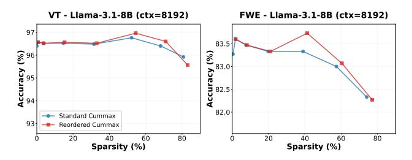

# A ADDITIONAL EXPERIMENTAL RESULTS

## A.1 Large Model Evaluations

To evaluate the scalability and robustness of our method, we measured performance across long-context summarization and retrieval tasks. As shown in Table 9 and Table 10, our method maintains baseline accuracy at extreme sparsity (70– 80%) using larger models like Qwen3-30B-A3B-Instruct and Llama-3.1-70B-Instruct.

Table 9. Impact of sparsity on LongBench performance using Qwen3-30B-A3B-Instruct. BLASST maintains accuracy comparable to the dense baseline (0.0 sparsity) even as sparsity increases to 70%, demonstrating robustness in long-context summarization.

| Target Sparsity | LongBench V1 Overall Accuracy | LongBench V2 Overall Accuracy |  |
|-----------------|----------------------------------|----------------------------------|--|
| 0%              | 47.77                            | 36.28                            |  |
| 50%             | 47.43                            | 38.14                            |  |
| 60%             | 47.47                            | 39.53                            |  |
| 70%             | 47.21                            | 39.53                            |  |
| 80%             | 46.50                            | 37.21                            |  |
| 90%             | 45.97                            | 37.21                            |  |

Table 10. Accuracy on the RULER hard subset using Llama-3.1- 70B-Instruct. The method retains > 97% accuracy on needle-ina-haystack tasks even at aggressive sparsity levels (up to 80%), confirming effective information retention.

| Target Sparsity | RULER-hard-8k | RULER-hard-16k |
|-----------------|---------------|----------------|
| 0%              | 97.40%        | 99.06%         |
| 20%             | 97.38%        | 98.98%         |
| 40%             | 97.31%        | 98.80%         |
| 60%             | 97.20%        | 98.59%         |
| 80%             | 97.07%        | 98.28%         |

## A.2 MLA Compatibility

Table 11 demonstrates that BLASST is highly compatible with Multi-Head Latent Attention (MLA). When evaluating DeepSeek-R1 NVFP4 on GPQA Diamond, MMLU Pro, and LiveCodeBench, the model maintains near-baseline accuracy even at 60% sparsity.

Table 11. DeepSeek-R1 NVFP4 using BLASST evaluated on GPQA Diamond, MMLU Pro, and LiveCodeBench at different *target sparsity* levels. Minimal accuracy degradation demonstrates that BLASST is compatible with MLA.

| Sparsity | GPQA Diamond | MMLU Pro | LiveCodeBench |
|----------|--------------|----------|---------------|
| 0%       | 0.7071       | 0.8302   | 0.5735        |
| 50%      | 0.7121       | 0.8283   | 0.5691        |
| 60%      | 0.7109       | 0.8266   | 0.5677        |

## A.3 Calibration Stability Across Datasets

We evaluate whether the calibrated parameter a transfers across different task types. Table 12 reports the achieved sparsity when calibrating on individual dataset subsets with a target sparsity of 50%; this per-dataset breakdown is for illustration purposes only, as in practice we calibrate on a combined, diverse sample dataset. For prefill, all datasets maintain similar achieved sparsity levels, confirming crosstask stability. For decode, two datasets (niah single and qa) yield noticeably lower a values; both tasks involve retrievalfocused decoding where the model attends narrowly to specific relevant spans, producing inherently more concentrated attention distributions that require a smaller threshold to reach the target sparsity. Despite this task-dependent variation in a, the achieved sparsity remains close to 50% across all datasets, confirming that a single calibration on a mixed dataset is sufficient for robust deployment across diverse workloads.

Table 12. Calibration stability across diverse datasets on Llama-3.1-8B with a target sparsity of 50%. We report the calibrated parameter a (where λ = a/L) and the resulting *achieved sparsity* for both prefill and decode phases. Similar parameter values across tasks confirms that BLASST generalizes without task-specific tuning.

| Dataset         |      | Prefill  | Decode |          |  |
|-----------------|------|----------|--------|----------|--|
|                 | a    | sparsity | a      | sparsity |  |
| niah single     | 920  | 49.98%   | 4.6    | 49.11%   |  |
| niah multikey   | 1099 | 46.89%   | 11.4   | 47.87%   |  |
| niah multivalue | 1012 | 47.82%   | 11.7   | 48.17%   |  |
| niah multiquery | 1100 | 46.38%   | 9.3    | 48.15%   |  |
| cwe             | 1020 | 46.69%   | 10.8   | 51.04%   |  |
| qa              | 900  | 48.68%   | 5.4    | 50.97%   |  |

#### A.4 Tile Row Reordering

We investigated whether permuting the tile-row processing order could improve pruning accuracy. This is motivated by the phenomenon observed in StreamingLLM [\(Xiao et al.,](#page-12-0) [2024b\)](#page-12-0), where recent tokens at the end (local window) and sink tokens at the beginning of the sequence tend to have high attention scores. By processing tiles containing the local window first, the running maximum mi can be quickly populated with these high-scoring tokens, establishing a better proxy for the global maximum earlier in the computation. This enables more accurate skip decisions for subsequent blocks. Importantly, BLASST supports such reordering flexibility at the kernel scheduling level with negligible overhead.

Figure [9](#page-15-0) compares standard sequential processing against reordered processing on VT and FWE tasks. The results show dataset-dependent behavior: reordering yields similar performance on VT but provides noticeable improvements on FWE. This suggests that the effectiveness of reordering largely depends on the specific attention patterns of each dataset. Nevertheless, this demonstrates a valuable property of BLASST: the algorithm is robust to different processing orders and can accommodate various optimization strategies. The flexibility to support tile reordering shows the potential for dataset-specific optimizations without requiring fundamental algorithmic changes.

Figure 9. Effect of tile row reordering on the accuracy-sparsity trade-off for Llama 3.1 8B (ctx=8192). We compare Standard Cummax (processing tiles sequentially) with Reordered Cummax (processing tiles in reverse order). The plots for both VT and FWE benchmarks show that reordering has a negligible impact on model accuracy at a given sparsity level.

## **B** ERROR BOUND ANALYSIS

We derive an error bound for the output approximation introduced by skipping attention blocks in BLASST.

Consider a single query token with attention output

$$y = \frac{\sum_{j=1}^{T_c} \sum_{k=1}^{B_c} \exp(s_{jk} - M) v_{jk}}{Z},$$

where  $B_c$  is the KV block size,  $s_{jk}$  are the attention scores,  $M = \max_{j,k} s_{jk}$  is the global maximum,  $Z = \sum_{j,k} \exp(s_{jk} - M)$  is the softmax normalization constant, and  $v_{jk}$  are the value vectors.

**Per-block mass bound.** When BLASST skips block j, the criterion  $\tilde{m}^{(j)} - m^{(j)} < \ln \lambda$  guarantees  $\exp(\tilde{m}^{(j)} - m^{(j)}) < \lambda$ , where  $\tilde{m}^{(j)}$  is the block-local maximum score and  $m^{(j)}$  is the running maximum. Since  $m^{(j)} \leq M$ , every score in a skipped block satisfies

$$\exp(s_{jk}-M) \leq \exp(\tilde{m}^{(j)}-M) \leq \exp(\tilde{m}^{(j)}-m^{(j)}) < \lambda.$$

Summing over all  $B_c$  tokens in the block, the total unnormalized attention mass of a single skipped block is

$$\sum_{k=1}^{B_c} \exp(s_{jk} - M) < B_c \cdot \lambda.$$

**Output error bound.** Let S denote the set of skipped blocks and let  $V_{\max} = \max_{j,k} \|v_{jk}\|$ . Since  $Z \ge 1$  (the element

achieving the global maximum contributes  $\exp(0) = 1$ ), each skipped token's softmax weight satisfies

$$p_{jk} = \frac{\exp(s_{jk} - M)}{Z} < \lambda.$$

The output error equals the total contribution of skipped tokens:

$$\|y - \hat{y}\| = \left\| \sum_{j \in \mathcal{S}} \sum_{k=1}^{B_c} p_{jk} v_{jk} \right\| \le \underbrace{\left( \sum_{j \in \mathcal{S}} \sum_{k=1}^{B_c} p_{jk} \right)}_{\mathcal{S}} V_{\text{max}}.$$

Each skipped token contributes at most  $\lambda V_{\max}$  to this sum. Aggregating over all  $|\mathcal{S}|$  skipped blocks,

$$||y - \hat{y}|| \le \delta V_{\text{max}} < |\mathcal{S}| B_c \lambda V_{\text{max}}.$$

In practice, because the approximate output  $\hat{y}$  is renormalized over non-skipped blocks only (denominator  $Z-Z_{\mathcal{S}}$  instead of Z), a correction of order  $\delta^2 V_{\rm max}$  arises; this is negligible since  $\delta \ll 1$ .

## C ARTIFACT APPENDIX

#### C.1 Abstract

This artifact evaluation provides the framework and code necessary to reproduce the kernel-level performance benchmarks for BLASST. The repository focuses on evaluating our custom kernels against a SOTA baseline across both prefill and decode phases. Utilizing automated sweeps across various threshold scale factors, the provided scripts systematically measure exact attention sparsity percentages, execution times, memory bandwidth, and speedups compared to dense baselines. Our work has been integrated into TensorRT-LLM and FlashInfer, and we pull the relevant code from these sources for evaluation. The framework is designed to target and benchmark performance on NVIDIA Hopper (H200) and Blackwell (B200) architectures within a containerized Docker or Singularity environment, handling all necessary installation and measurement.

#### **C.2** Artifact check-list (meta-information)

• Algorithm: BLASST (Skip-Softmax)

• Compilation: CUDA nvcc builds for kernel templates

• Binary: Some closed binaries used to measure sparsity

• Run-time environment: Docker

 Hardware: H200 and B200 GPUs, many-core x86 CPU, SSD

• Execution: Python and bash scripts

 Metrics: Skipping threshold, sparsity, throughput, memory bandwidth

- Output: Standard output (stdout)
- Experiments: Single GPU kernel benchmarks and sparsity data collection.
- How much disk space required: 100 GB
- How much time is needed to prepare workflow: 45 minutes
- How much time is needed to complete experiments: 1 hour

• Publicly available: Yes

• Code licenses: Apache 2.0

• Workflow framework used: TensorRT-LLM, FlashInfer

• Archived: TBD

#### C.3 Description

## *C.3.1 How delivered*

The artifact is delivered as an open-source GitHub repository. It can be obtained by cloning the repository and its external submodules via git clone [git@github.com:](git@github.com:cameronshinn/blasst-ae-mlsys26.git) [cameronshinn/blasst-ae-mlsys26.git](git@github.com:cameronshinn/blasst-ae-mlsys26.git) --recursive.

#### *C.3.2 Hardware dependencies*

The evaluation requires a host machine equipped with a many-core x86 CPU, an NVIDIA Hopper (H200) GPU, or an NVIDIA Blackwell (B200) GPU (depending on which kernels you want to evaluate). The host system should also have an SSD with approximately 100 GB of available storage space to accommodate the required container images, compiled binaries, and generated benchmark data.

## *C.3.3 Software dependencies*

The artifact relies on a containerized run-time environment. The host system must have either Docker (with the NVIDIA Container Toolkit installed) or Singularity available. The provided startup scripts automatically pull and utilize the official TensorRT-LLM release container ([nvcr.io/](nvcr.io/nvidia/tensorrt-llm/release:1.3.0rc6) [nvidia/tensorrt-llm/release:1.3.0rc6](nvcr.io/nvidia/tensorrt-llm/release:1.3.0rc6)). A compatible Linux host distribution with up-to-date NVIDIA drivers supporting the target Hopper or Blackwell architectures is required.

