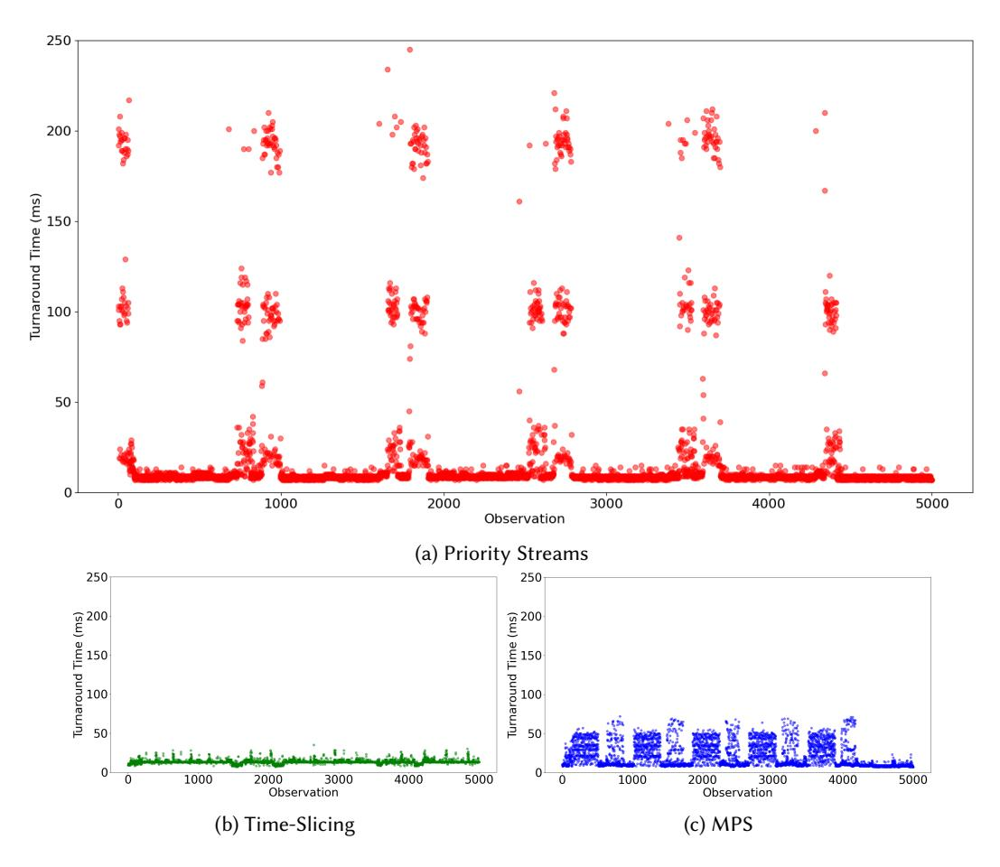
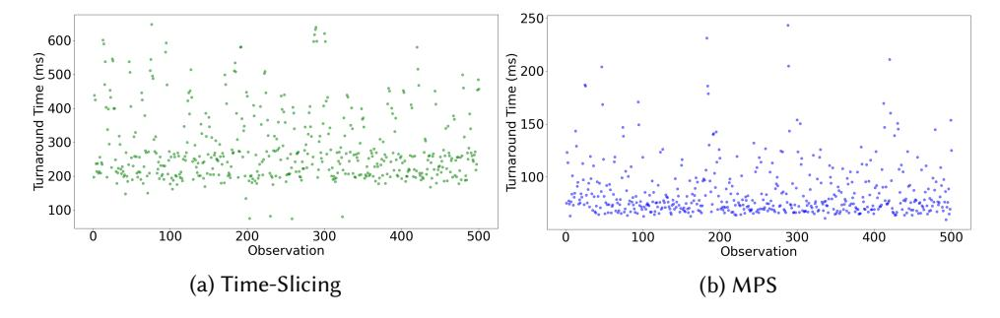
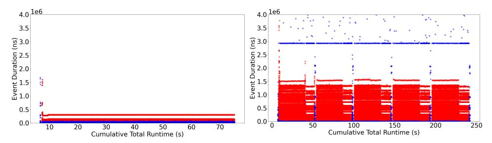
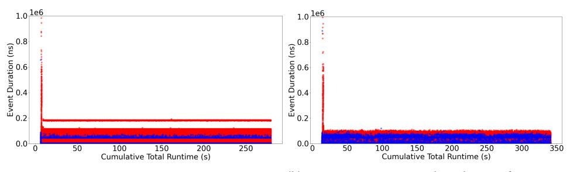

# 4.1 Priority Streams

When using priority streams, the kernels of the two applications are launched from within the same process on different streams using threads. Streams can be assigned one of three priorities

Fig. 2. The variance of the turnaround times for the ResNet-50 model. Other models' variance results were omitted for space, but resemble these.

ranging from -2 to 0. The thread block scheduler will always pick blocks from the highest-priority stream first when scheduling, but it will not interrupt any thread blocks currently being executed on the GPU. We implemented application-level concurrency by putting both applications within the same OS process, but launching them onto separate CUDA streams, with the kernels of the inference task being on higher-priority streams than those of the training task.

Observation 1 ([O1\)](#page-6-0). Priority streams cannot preempt executing thread blocks in the middle of execution, and this resulted in compounded delay and resource contention leading to high and less predictable turnaround times.

When a kernel from a higher-priority stream arrives at the GPU, its thread blocks will take precedence over any unscheduled blocks of any lower-priority kernels. However, the high priority kernel cannot interrupt the execution of a lower priority kernel's already-executing thread blocks. In other words, the higher-priority kernel must wait for any currently-executing blocks from a lower-priority stream to finish.

Fig. 3. The average turnaround times and utilization for each of the three mechanisms on the MLPerf models. Note that the turnaround times are the averages of 5000 consecutive inference requests in milliseconds in the single-stream (ss) scenario, and 500 requests which arrive via a Poisson process in the server mode. Additionally, the measurement of training execution time is the average of 10 runs in seconds. The baseline is the time taken when run in isolation.

Fig. 4. The variance of the turnaround times for the ResNet-34 model, in the consecutive 5000 inference requests scenario. Other models' variance results were omitted for space, but resemble these.

Fig. 5. The variance of the turnaround times for the ResNet-34 model, in the MLPerf server scenario. Other models' variance results were omitted for space, but resemble these.

This led to a phenomenon we term compounded delay.[2](#page-7-0) As described in the previous section, all of our examined models were structured as a sequence of consecutive kernels. In our experiments, when a high priority kernel finished executing, there was a window of time before the next kernel could reach the GPU. In this timeframe, there were no inference kernels ready to execute, so the

2Compounded delay as we have described it here can be though of as an instance of the convoy effect [\[4\]](#page-18-5).

lower-priority training kernel would resume executing and fill the GPU with its thread blocks. Shortly after resuming the training kernel, the next inference kernel would arrive. As the priority streams mechanism does not support preemption of executing thread blocks, the inference kernel had to wait for the currently-executing training blocks to finish.

We can see the effects of this delay in the results from the ResNet-50, ResNet-152, VGG-19, and DenseNet-201 models in Figure [1a,](#page-5-1) where the turnaround times were approximately 2X, 3X, 4X, and 1.75X compared to the baseline, respectively. The impact of the compounded delay was dependent on the characteristics of the training kernels. For example, the ResNet models and VGG-19 saw some of the worst turnaround times as the inference task, as these models spent about half of their training task's time on executing large or long-running kernels. Intuitively, long-running kernels resulted in more compounded delay. In effect, we can see that compounded delay essentially canceled out any benefits one might expect to gain from placing the inference kernels on a higherpriority stream. In particular, priority streams' turnaround times were comparable to that of MPS in almost all cases, despite MPS having no notion of priorities. Compounded delay also reduced the predictability in turnaround time as seen in Figure [2a.](#page-6-1) We observed spikes in turnaround time during the time the training epochs were executing on the GPU, as the kernels of the inference task are interacting with and being delayed by those of the training task.

It is additionally worth noting that some of the performance degradation can be explained by the effects of resource contention when the thread blocks of the two applications are colocated on the same SM. For example, the blocks from the two kernels may contend for the SM's warp scheduler. Official documentation does not describe how the warp scheduler interacts with priority streams. If the warp scheduling policy does not prioritize the blocks from the higher priority stream, such as if the warp scheduler uses a greedy-then-oldest or loose round-robin policy [\[23\]](#page-19-8), then the warp scheduler would effectively de-prioritize the higher priority thread blocks.

## 4.2 Time-Slicing

When two applications are run as separate processes and MPS is not being used, the CUDA application-level scheduler will alternate between the processes over time, yielding the GPU's computational resources (e.g., the warp scheduler and computational units) completely to one process for the duration of a time-slice [\[6,](#page-18-2) [23\]](#page-19-8). Only one application's kernels are executing on the GPU during any given time slice. We implemented application-level concurrency by launching each application as a separate process.

Observation 2 ([O2\)](#page-8-0). Time-slicing tended to exhibit predictable and low turnaround times for models with relatively low baseline turnaround times (unless there is memory transfer contention; see Observation [4\)](#page-10-0), due to a lack of interference from the training task. This came at the cost of poor utilization, as the two tasks never actually executed on the GPU at the same time.

As demonstrated in Figure [2b,](#page-6-1) time-slicing offers the most predictable performance of the three. We attribute this high predictability to two factors. The first is that the training and inference tasks never execute at the same time, so there is no contention for SM resources during block execution. Second, executing blocks can be preempted (although this preemption is coarse-grained and yields the entire GPU to the preempting task), so the inference kernel does not need to wait for any blocks of the training task to finish executing before being scheduled to the GPU, i.e. compounded delay is not a problem.

The primary factor that influences turnaround time is the number of other GPU applications that are being executed concurrently, as this changes the amount of time that any one job must wait for access to the GPU's resources. The reason for this is that time slices are a fixed size and are assigned round-robin to each process. The precise behavior of the time-slicing mechanism is not well-documented. However, we determined in our empirical setup that time slices were fixed-length and assigned round-robin across processes. Empirically, we determined that the time slice length is fixed to approximately 2ms. These observations are consistent with those made in previous work about the earlier Turing microarchitecture [\[6,](#page-18-2) [23\]](#page-19-8). As far as we could determine, the time slice size and priority assigned to each process cannot be configured.[3](#page-9-0) This means that there is no way for one application to be prioritized over another, either by extending an application's time on the GPU or the frequency with which their time slices are scheduled.

Therefore, the trade-off inherent in using time-slicing is predictability at the cost of utilization, which was frequently the worst of the three surveyed mechanisms. In particular, extra computational GPU resources remain idle during each time slice. For kernels which do not fully occupy the GPU in terms of threads, registers, shared memory, and grid size, time-slicing does nothing to occupy those resources.

The lack of spatial sharing is the major limitation of time-slicing, as it does not truly solve the GPU resource utilization problem being addressed by concurrently executing training and inference tasks. For the ResNet models and particularly for DenseNet-201, the training time increased to over 100 seconds more than the baseline in Figure [1a.](#page-5-1) The reason VGG-19 and AlexNet did not see such an increase is due to the shorter lengths of their inference tasks; they completed earlier, allowing the training task to then utilize the GPU resources in isolation.

Observation 3 ([O3\)](#page-9-1). Time-slicing is limited by the fact that the two tasks can only be launched together if the sum total of the resources required by both is less than the total available on the GPU, despite the fact that they never execute on the GPU at the same time.

While the inference task is the only application executing during its time slice, our observations suggest that it still has to share certain resources such as registers and shared memory with the other process. We determined empirically that the resource requirements of any tasks being run simultaneously as separate processes cannot together exceed the resource limitations of the GPU, or an error will be thrown. For instance, the GPU had 64KB of registers per SM. When we launched two applications that each used 40KB of registers per block, with exactly enough blocks for one per SM, it caused the second process to reach the GPU for scheduling to crash with an out-of-memory error. We empirically observed similar behavior for shared and global memory, as well. We hypothesize that this is the case because resources such as shared memory, registers, and global memory that are used by a process are not transferred on and off the GPU between time slices, and we suspect the reason is to avoid prohibitively high context-switching overheads when swapping between applications across time slices.

This has performance implications for the training task, which had to be scaled down from its maximum batch size in order to allow space for the inference task. In other words, despite the fact that the two tasks never execute on the GPU at the same time, neither task can fully utilize the GPU during their time slice without running into this error. The implication is that we have to be conservative when setting the batch size for the training task, as that is what determines how many resources each individual kernel is going to use. Since it cannot be known a priori which inference kernels will be running alongside which training kernels, it must be based on the worst-case scenario.

This problem is compounded by the fact that in some systems, it may be difficult to know ahead of time precisely how many resources the inference task will require. Given that the rate at which inference requests will be received will be unknown, we can either perform inference for a single image at a time, choose a fixed batch size to use for performing inference, or perform inference using

3 Jetson devices do allow time slice configuration [\[6\]](#page-18-2).

(a) ResNet-34 Kernel and Transfer Times (Baseline) (b) ResNet-34 Kernel and Transfer Times (Time-Slicing)

Fig. 6. Kernel execution times (red) and memory transfer operation times (blue) for the ResNet-34 inference task in both the baseline and time-slicing scenarios.

(a) DenseNet-201 Kernel and Transfer Times (Baseline) (b) DenseNet-201 Kernel and Transfer Times (Time-Slicing)

Fig. 7. Kernel execution times (red) and memory transfer operation times (blue) for the DenseNet-201 inference task in both the baseline and time-slicing scenarios.

variable-sized batches. Single image inference has predictable resource usage, so an out-of-memory error can be avoided; however, this will add queueing delay (i.e., one image now has to wait for the previous request to be serviced first). Fixed batch sizes also have predictable resource usage as they are just the generalized case of single-image inference, so we can tune the training task to accommodate that while minimizing queueing delay. However, if we do not fill up the batch for a particular run, then we will have even lower utilization.

Observation 4 ([O4\)](#page-10-0). Contention due to memory transfers can adversely impact predictability and turnaround time.

Time-slicing performed much worse with the RNNT training task for both BERT and ResNet-34 than it did with the Pytorch training and inference combinations, as seen in Figure [3.](#page-7-1) One reason for this is that time-slicing tends to perform worse when the tasks take longer due to having to perform more context switches overall, and all three of these tasks were longer-running than the PyTorch models were on average. However, in addition to this, ResNet-34 possessed some attributes that would increase execution times by greater amounts when run concurrently with another application. The ResNet-34 inference task spent orders of magnitude more time on memory transfers than other models performing inference did. Figure [6](#page-10-1) shows the kernel execution times and memory operation times of the Resnet-34 inference task in both the baseline and time-slicing cases, and Figure [7](#page-10-2) shows the same for the DenseNet-201 inference task. ResNet-34 showed a significant increase in the

amount of time spent on memory transfer tasks during the time-slicing case, while DenseNet-201 did not, suggesting that memory transfer interference contributed to its higher turnaround times. These results align with previous findings that applications run as separate processes on NVIDIA devices can experience interference from memory transfer commands, despite being isolated as separate processes [\[23\]](#page-19-8). Like Observation [3,](#page-9-1) this is another way in which time-slicing does not actually isolate the two processes from each other.

## 4.3 Multi-Process Service

MPS allows applications run as separate processes to execute on a GPU at the same time. An MPS server is responsible for scheduling kernels from each process to the GPU. This differs from time-slicing in that the thread blocks of kernels from separate processes can spatially share the GPU, i.e., execute on the GPU at the same time, possibly even sharing an SM. While spatial sharing is also possible when using priority streams, MPS allows the kernels to be from separate processes[4](#page-11-0) but does not include any notion of task prioritization. Instead, the MPS server can be configured to limit the number of threads that can be used by any one application; for example, the MPS server can be set so that each client can use no more than 50% of the total amount of threads offered by the GPU. NVIDIA recommends that this limit be set to 100%/0.5n, where n is the number of clients to allow the GPU to potentially colocate kernels from separate applications on the same SM whenever there are idle resources. MPS is perhaps best suited to cases where the kernels utilize less than the total available resources of the GPU. We implemented application-level concurrency by launching an MPS server and then launching both the inference and training tasks as separate MPS client processes.

In our experiments, we set the thread limit for both applications to 100%. In addition to this being the recommended setting, limiting the training application to only using some portion of the threads at any given time would defeat the purpose of using the training task to utilize spare GPU resources whenever they are available.

Observation 5 ([O5\)](#page-11-1). While MPS increased utilization overall, it also caused intra-SM resource contention that added to the execution times of both the training and inference tasks.

MPS saw consistent results in terms of utilization, as measured by the training execution time in Figure [1b.](#page-5-1) The additional 5000 inference requests increased the time it took to train the model, usually by 20-30 seconds. In contrast, using priority streams frequently increased the training task execution time by 30-40 seconds and using time-slicing by up to 50 seconds. MPS can achieve good utilization primarily because it makes it possible to colocate blocks from different kernels. Priority streams was also able to colocate blocks, but it still took longer for the training task to complete because the inference task would be prioritized.

MPS additionally performs better when potential contention due to colocation is low. Colocation of blocks from different applications allows for finer-grained resource assignment, but it can also create contention for resources when the blocks that are sharing an SM require the same resource, leading to significant performance degradation. Furthermore, unless it is clear what effects contention will have on the runtimes of the kernels, it is challenging to predict the performance of colocated kernels [\[8,](#page-19-9) [28\]](#page-19-6). The increases in turnaround times compared to time-slicing observed in Figure [1a](#page-5-1) are partially explained by the presence of this resource contention. Minimizing contention is thus important for MPS to achieve increased utilization with less significant degradation in turnaround times.

4To be more precise, they are launched from separate CUDA contexts.

Observation 6 ([O6\)](#page-12-1). MPS balances between the progress of the training and inference tasks, but it is unable to adequately prioritize one over the other. More of the degradation is seen on the part of the inference task due to the scheduling policies used.

While MPS can allow two kernels to spatially share the GPU, it is not able to explicitly prioritize the execution of one application over another. Thus, both the training and inference tasks are likely to make progress that is more balanced between the two applications than with priority streams. This is the main reason that the MPS training task execution times in Figure [1](#page-5-1) are typically better than the priority streams times. Given that at least half of all of the models' inference and training kernels are small, MPS can employ this load-balancing during a significant portion of the tasks' execution, and there are frequently enough leftover resources from one application to share with the second.

The extent to which the GPU can be shared between applications is limited by the thread block scheduling policy. Kernels are still scheduled on essentially a first-come, first-served basis (up to the thread limit for each process). More specifically, our experiments suggest that the blocks are scheduled according to the leftover policy, which dictates that all of the blocks from the most recently-arrived kernel must first be dispatched and executed on the GPU before any other kernels' blocks can be scheduled [\[3\]](#page-18-1). Unlike priority streams, all of the blocks of the current kernel will be scheduled, and a later-arriving kernel is not able to schedule any before that. This presents a problem for the kernel that arrives at the GPU later, especially if that kernel is from the inference task, as the running time of the second task is needlessly throttled.

Due to these issues, MPS causes a greater degree of degradation for the inference tasks than the training tasks in Figure [1.](#page-5-1) For instance, ResNet-152 saw the turnaround time increase 2X, but the training task execution time only increased by a few seconds, which was the shortest training task time observed for the three mechanisms. The DenseNet-201 training and inference tasks both had, on average, smaller proportions of long-running kernels with larger grid sizes. This was the model where MPS performed the best in terms of both turnaround time, with an increase of 9.6ms, and utilization, which increased by only 11 seconds. For the other four Pytorch models that averaged longer-running training and inference kernels, the inference task was more often starved for resources, forced to make progress with what was leftover.

Unlike the Pytorch training tasks examined, RNNT had virtually no large kernels during its runtime, meaning that there was almost always space on the GPU for other tasks to use more of the resources. This is one reason why MPS tended to perform more consistently well in terms of turnaround time than with the Pytorch models, which consisted of training tasks that more frequently occupied the GPU with large kernels. However, RNNT's execution time increased more drastically than the Pytorch training tasks' execution times did using MPS, as seen in Figure [3,](#page-7-1) due to the high amount of large kernels and the longer runtimes of the inference tasks.

Note that MPS's resource assignment issue is distinct from the compounded delay problem discussed in Section [4.1.](#page-5-2) The latter is caused by the gap between kernel launches where the training kernel uses the free resources. However, with a 100% thread limit, the compounded delay problem is also an issue for MPS. Thus, colocation and compounded delay also caused variance in turnaround time, as seen in Figure [2c.](#page-6-1) This variance was not as large as that observed in the priority streams case, as inference request satisfaction is partially dependent on the degree to which the training task is utilizing the GPU's resources.

