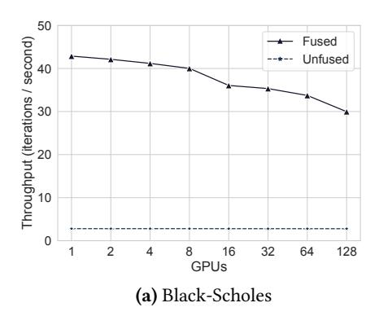
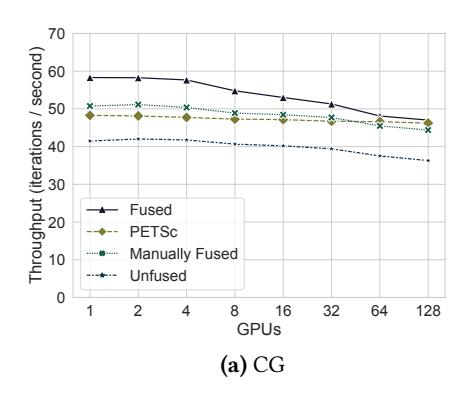
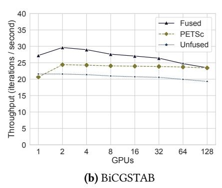
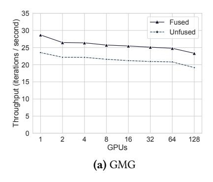
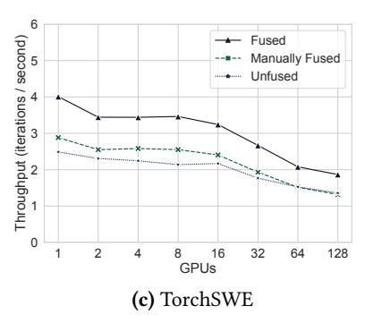

# 7 Evaluation

Experimental Setup. We evaluate the performance of Diffuse on a cluster of NVIDIA A100 DGX SuperPOD nodes. Each node has 8 A100 GPUs with 80GB of memory, connected by NVLink and NVSwitch connections, and a dual socket, 128 core AMD 7742 Rome CPU with 2TB of memory. Each node is connected via an InfiniBand connection through 8 NICs.

For each experiment, we perform a weak-scaling study, and report the throughput achieved per processor. A weakscaling study increases the problem size as the size of the target machine grows to keep the problem size per processor constant. Each reported value is the result of performing 12 runs, dropping the fastest and slowest runs, and then computing the average of the remaining 10 runs. In weak-scaling experiment (Section [7.1\)](#page-9-0), we exclude a set of warmup iterations from timing to measure the steady-state performance with and without Diffuse. We separately evaluate the overhead that Diffuse imposes due to compilation in Section [7.2.](#page-11-1)

Overview. We evaluate Diffuse on unmodified, open source cuPyNumeric and Legate Sparse applications, from microbenchmarks to full applications. Many of these applications have appeared in prior publications [\[12,](#page-13-0) [60\]](#page-15-0), and range from tens to thousands of lines of Python. The unique capabilities of cuPyNumeric and Legate Sparse enable these pure Python applications with dynamic and data-dependent behavior to be scaled across multiple nodes of multiple GPUs. An overview of each application is in Figure [9.](#page-9-1) We compare each application's performance when run with and without Diffuse — no changes to the application are needed to enable Diffuse. For some applications, a suitable baseline written in the industry-standard PETSc [\[8\]](#page-13-8) library for distributed sparse linear algebra already exists, and we compare against those baselines. For other applications, we compare against manually optimized implementations by the original authors. However, some full cuPyNumeric applications have no baseline other than when run without name—these applications are sufficiently complex that developing an independent high-performance distributed, multi-GPU implementation is not feasible. We show that when fusion opportunities are available, Diffuse can exploit them to find speedups in unmodified, distributed applications. Diffuse enables highlevel programs to equal, and in many cases improve on, the performance of hand-optimized code.

We do not ablate on the optimizations in Section [5,](#page-6-5) as temporary elimination is essential for speedup with kernel fusion and memoization is a requirement for a practical implementation. We do not compare against the work of Sundram et al. [\[51\]](#page-14-7), which performs only task-fusion, as the version of cuPyNumeric they used is older and would not be a fair comparison. However, we have evaluated Diffuse with only task fusion and found that it did not yield speedups on our benchmarks. Task fusion alone can only reduce runtime overhead, and the task granularity of our benchmarks is larger than the minimum effective task granularity [\[49\]](#page-14-10) of Legion (1ms per task). The window sizes shown in Figure [9](#page-9-1) were selected automatically by Diffuse through a process that increases the window size when all tasks in the current window size were fused. As a result, these window sizes enable the maximum amount of fusion possible in each application. Finally, our

| Benchmark     | Tasks per Iteration | Tasks per Iteration (Fused) | Avg Task Length (ms) | Window Size |
|---------------|------------------------|--------------------------------|-------------------------|----------------|
| Black-Scholes | 67                     | 1                              | 5.3                     | 70             |
| Jacobi        | 3                      | 2                              | 5.3                     | 5              |
| CG            | 12.1                   | 4.1                            | 1.9                     | 10             |
| BiCGSTAB      | 27.1                   | 8.1                            | 1.7                     | 15             |
| GMG           | 24.1                   | 11.1                           | 1.8                     | 15             |
| CFD           | 378                    | 40.7                           | 1.1                     | 30             |
| TorchSWE      | 276.5                  | 152.8                          | 1.4                     | 30             |

Figure 9. Index tasks per iteration with and without fusion. Task count is not always whole as iterations may launch different tasks, or fusion occurs across iteration boundaries. Reported task granularities are from unfused single-GPU executions. Window size was selected by Diffuse.

benchmarks issue index tasks that have one point per GPU, so computations are not over-decomposed.

## 7.1 Weak Scaling Experiments

Black-Scholes. The Black-Scholes option pricing benchmark is a trivially-parallel micro-benchmark that contains a sequence of 67 data-parallel, and thus fusible, operations. It is a micro-benchmark that provides a reference point on potential improvement when the entire application is amenable to fusion. Figure [10a](#page-10-0) shows that Diffuse achieves a 10.7x speedup over the unfused program on 128 GPUs, as the fused program is a single task containing a single GPU kernel making one pass over the data, greatly increasing the arithmetic intensity of the computation.

Dense Jacobi Iteration. Unlike Black-Scholes, dense Jacobi iteration has negligible potential benefit from fusion. Jacobi iteration consists of a dense matrix-vector multiplication and two fusible vector operations that are negligible in runtime. This benchmark shows that our analyses do not have a significant negative impact on performance when there is no fusion. Diffuse achieves 0.93–1.08x of the performance of the unfused Jacobi iteration in Figure [10b,](#page-10-0) where we believe the slight improvement is due to experimental variability.

Sparse Krylov Solvers. We evaluate sparse Krylov solvers implemented with cuPyNumeric and Legate Sparse, namely Conjugate Gradient (CG) and Bi-Conjugate Gradient Stabilized (BiCGSTAB). The PETSc benchmark implementations are implemented in MPI+C using PETSc's API. To perform a controlled comparison against PETSc, we modify Legate Sparse to perform a similar optimization as PETSc, where the non-zero coordinates in each sparse matrix partition are stored as 32-bit integers instead of 64-bit integers.[1](#page-9-2)

The original implementation of CG in Legate Sparse had been optimized manually to perform many of the optimizations that Diffuse does automatically. As a result, the implementation no longer resembled the high-level description of CG. We compare against this manually fused implementation, a naturally written implementation using cuPyNumeric

1PETSc stores coordinates in 32-bit integers even when 64-bit integers are requested at build time, affecting the performance of the SpMV kernel.

Figure 10. Microbenchmark weak scaling (higher is better).

**Figure 11.** Weak scaling of linear solvers (higher is better).

and Legate Sparse, and PETSc. Figure 11a shows that Diffuse automatically optimizes the naturally written CG so that it runs faster than both the manually optimized version and PETSc. Diffuse finds additional fusion opportunities by fusing AXPY's and dot-products from different iterations.

We implement an unfused version of BiCGSTAB in cu-PyNumeric and Legate Sparse and compare against PETSc. Figure 11b shows that Diffuse accelerates the high-level implementation of BiCGSTAB to outperform the unfused version by 1.31x on average (geo-mean) and PETSc by 1.15x on average (geo-mean). PETSc exposes several fused kernels to users for use in building iterative solvers, but these kernels can quickly become complicated and esoteric2. In contrast, Diffuse enables users to write high-level programs in cu-PyNumeric and Legate Sparse and then derives optimized kernels for efficient execution.

Geometric Multi-Grid Solver (GMG). Moving from smaller benchmarks to full applications, we apply Diffuse to a Geometric Multi-Grid (GMG) solver developed in Legate Sparse. The GMG solver is a CG-based iterative solver with a V-cycling preconditioner, the injection restriction operator, and a weighted Jacobi smoother. As with the previous benchmarks, using Diffuse with the more complex solver required no changes to user-facing code, and results in a 1.2x speedup over the original implementation, as seen in Figure 12a.

Computational Fluid Dynamics (CFD). We apply Diffuse to a cuPyNumeric application that solves the Navier-Stokes equations for 2D channel flow [10]. The application performs element-wise operations on aliasing slices of distributed arrays, exposing opportunities for fusion. Diffuse finds between 1.8x–2.3x speedup over the original implementation, as shown in Figure 12b. Diffuse achieves higher speedup on a single GPU than on multiple GPUs. On a single GPU, data is not partitioned, enabling longer sequences of tasks to satisfy fusion constraints. On multiple GPUs, the dependencies caused by aliasing data reduce the opportunities for fusion.

Shallow Water Equation Solver (TorchSWE). Our final benchmark application is also our most complex: the cuPyNumeric port of the TorchSWE shallow-water equation solver [25]. We compare against the original cuPyNumeric port, as well as a version that the cuPyNumeric developers manually optimized using numpy.vectorize. The vectorize utility JIT-compiles a user-defined element-wise operator, doing some of the optimizations that Diffuse performs automatically. Figure 12c shows the performance of TorchSWE with Diffuse compared to these baselines. Diffuse achieves a 1.61x speedup on average (geo-mean) over the unfused TorchSWE, and a 1.35x speedup on average (geo-mean) over the manually vectorized version (labeled with "Manually Fused" in

 $^2 Such$  as VecAXPBYPCZ in BiCGSTAB (https://petsc.org/main/manualpages/Vec/VecAXPBYPCZ/).

Figure 12. Weak scaling of full applications (higher is better).

| Benchmark     | Standard (s) | Compiled (s) | Breakeven Iterations |
|---------------|--------------|--------------|----------------------|
| Black-Scholes | 0.38         | 0.06         | N/A                  |
| Jacobi        | 0.53         | 0.43         | N/A                  |
| CG            | 0.67         | 1.30         | 99.44                |
| BiCGSTAB      | 1.26         | 2.19         | 80.43                |
| GMG           | 0.49         | 1.38         | 118.75               |
| CFD           | 5.10         | 10.89        | 25.21                |
| TorchSWE      | 0.97         | 8.82         | 43.88                |

Figure 13. Warmup times on 8 GPUs.

Figure 12c). Since Diffuse is analyzing the entire application, it can find fusion opportunities missed by developers optimizing the program by hand.

## 7.2 Compilation Time

We measure the overhead that Diffuse's compilation imposes on overall runtime. When evaluating our benchmarks, we compute the throughput after warmup iterations have concluded. To measure the effect of compilation, we measure the warmup time with and without compilation, using the window sizes reported in Figure 9. We then compute the number of iterations required for the fused version to be faster than the unfused version of the application when including the warmup compilation time. The results are shown in Figure 13; Diffuse's compilation times are modest, requiring 25-119 iterations to amortize the cost of compilation. The fused Black-Scholes computation is so much faster than the unfused version that a single iteration is sufficient to amortize compilation. For Jacobi, compilation time was overlapped with expensive dense matrix-vector multiply kernel, and thus not exposed in the warmup. As seen in Figure 10b, due to experimental variation, the fused and unfused versions of Jacobi are slightly faster or slower than each other on different GPU counts. These costs are especially reasonable as scientific applications like the ones we evaluated would be run in production for thousands to millions of iterations. In the future, a production-grade implementation of Diffuse could maintain a cache of compiled kernels on disk, rather than in memory, and pay the compilation cost only the first time the application is run.

## 8 Related Work

Task Fusion. Task fusion is a widely applied technique in parallel computing to reduce the overheads of parallelism [28, 29, 43, 47, 55, 61]. Most prior work considers the fusion of individual tasks—in this work, we consider a more complex variant of task fusion, the fusion of groups of distributed tasks, which is challenging due to the dependencies that exist between distributed tasks. The most related work is that of Sundram et al. [51], which identifies the problem and provides an initial solution for detecting when fusion of index tasks is possible. We improve on this work by developing a formal model for reasoning about distributed tasks, identifying new constraints on fusion, and proving that the set is sufficient. We then pair task fusion with a JIT compiler to fuse the task bodies, enabling Diffuse to achieve significantly larger speedups than just task fusion, as more potential benefits than runtime overhead removal are possible.

Kernel Fusion. Nested loop fusion in imperative, arraybased programs is well-studied [4, 20, 27, 35]. Our work combines loop fusion with the data and computational models of a tasking runtime to enable kernel fusion in a distributed environment. Kernel fusion has also been explored heavily in different domains. Deforestation approaches aim to remove temporary lists and trees in functional programs [54]. Fusion in collection-oriented languages combines operations like map and reduce into single passes over data structures [22, 23, 31, 32, 56]. Various compilers have been developed to generate fused code for operations over dense [24, 46, 53] and sparse tensors [17, 36]. Machine learning frameworks perform operator fusion within neural networks [21, 34, 40, 42, 48]. Our work provides a domain-agnostic framework for identifying fusion in streams of distributed tasks, and could leverage these techniques for kernel fusion.

Efficient Composition of Parallel Software. Diffuse aims to efficiently compose operations within and across distributed libraries. Some recent projects have tackled the problem of efficient composition; we discuss each in turn. Weld [44] provides a loop-based IR in which users can define single-node library computations, and a runtime system that optimizes

the IR to enable cross-function and cross-library optimizations. Split Annotations [\[45\]](#page-14-2) provides partitioning annotations for users to attach to library functions, and uses these annotations to run cache-sized batches of the functions to maximize data reuse. Both Weld and Split Annotations target a similar problem as Diffuse, but would require a model of distributed data like the one we propose to safely perform optimizations in a distributed setting. DaCe [\[16\]](#page-13-25) is a compiler that leverages an IR called Stateful Dataflow MultiGraphs to perform optimizations like fusion on Python/NumPy programs. Distributed programs in DaCe are explicitly parallel, including manual communication with libraries like MPI, which requires different kinds of analyses.

Jax [\[21\]](#page-13-10) and PyTorch [\[6\]](#page-12-5) are machine-learning systems that compile NumPy-like descriptions of neural networks to perform optimizations like fusion and automatic differentiation. Systems like Jax and PyTorch accept structured program representations (neural network graphs) and apply optimizations that leverage domain-specific knowledge, many of which are not possible for Diffuse to perform. In contrast, Diffuse only leverages the privilege information about tasks to perform optimizations, and allows for description of programs with complex aliasing and mutation that are not possible to represent in ML systems, like the CFD or TorchSWE simulations. We consider Diffuse to be a different point in the design space than these ML systems, focusing on fusion in a more general setting without application-specific knowledge.

Distributed Runtime Systems. Diffuse uses a scale-free IR to efficiently perform distributed dependence and alias analyses. This is similar to Index Launches [\[50\]](#page-14-6), a representation of distributed tasks that compresses the degree of parallelism. Diffuse's model of distributed data supports content-based coherence, meaning that the same data may be referred to in multiple different ways. Legion [\[15\]](#page-13-5), which Diffuse builds upon, is a system that supports content-based coherence of distributed data. Legion exposes a more general interface for partitioning data, allowing a partition to contain arbitrary subsets. Legion then uses sophisticated algorithms for computing dependencies between tasks and maintaining coherence of distributed data [\[14\]](#page-13-9). Legion's flexible data model and support for precise dependence analysis at scale are critical features for building libraries like cuPyNumeric and Legate Sparse. Supporting Legion's flexible data model is a key challenge in Diffuse, as libraries that target Legion depend on this capability. Diffuse's restricted data representation and goal of only fusion enable compact analyses for the dependence and coherence problems. In systems without content-based coherence, simpler approaches than ours may suffice, as aliasing distributed data is no longer a concern.

