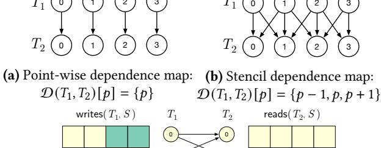
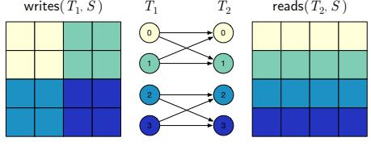

# <span id="page-1-5"></span>2 Motivating Example

Figure [1](#page-1-0) shows how Diffuse optimizes the cuPyNumeric program in Figure [1a](#page-1-0) that performs a 5-point stencil computation. The cuPyNumeric library is a drop-in replacement for NumPy [\[33\]](#page-14-5) that scales unmodified NumPy programs

to distributed machines by targeting the Legion [15] runtime system. cuPyNumeric maps NumPy arrays to Legion's regions, and maps NumPy functions to task launches operating on regions that are partitioned across the machine. As the cuPyNumeric program executes, it issues a stream of tasks to the Legion runtime, which dynamically discovers the necessary communication and synchronization required to execute the tasks on the target machine. The program execution on a four-by-four grid with four nodes is visualized in Figure 1b, where each node owns an element of each aliasing view of the grid array. The dotted arrows represent the communication required to propagate updates to the center array to the other aliasing views of grid. Figure 1c is a simplified representation of the task stream that cuPyNumeric issues during execution of the inner loop (lines 10−14 of Figure 1a), and Figure 1e contains pseudocode for each of the task implementations. This stream of operations creates multiple temporary distributed arrays for the results of individual operations, and separate tasks for each corresponding addition and multiplication. The combination of temporary arrays and separate tasks of loops is an inefficient execution strategy. Diffuse speeds this program up by four times by creating a new fused task that computes the work array (lines 11-13) in a single operation and removes the temporary arrays, including avg, resulting in the stream of operations in Figure 1d and the generated fused task in Figure 1f. Interestingly, Diffuse does not fuse the task that performs center[:] = work (line 14 of Figure 1a).

To understand these decisions, we must introduce the distributed aspect of the tasks and data collections in Figure 1c. Each task in Figure 1c actually represents a group of parallel tasks launched over partitioned arrays, where each parallel task operates on a subset of the partitioned data. Dependencies and communication that arise from parallel tasks operating on the same distributed data affect when fusion is possible. In our example, the arrays center, north, east, west, and south are aliasing views of the array grid, meaning that they share logical array entries. Because these distributed arrays alias, Diffuse does not fuse the task group that computes center[:] = work into the task group that reads from north, east, west and south, as the fusion would create a task group that concurrently reads and writes to aliasing data. Similarly, the center[:] = work task group issued at iteration *i* cannot be fused into the avg computation (line 11 of Figure 1a) at iteration i + 1 because communication is required to propagate updates to center. To reason about distributed computations over partitioned data, we develop a scale-free intermediate representation (Section 3) that models tasking runtime systems which support aliased views of distributed data. We then develop a dynamic analysis for task fusion (Section 4) that reasons about dynamically known communication patterns in distributed computations to fuse groups of parallel tasks.

#### Syntax

```
Unique ID
              Point
                                   (\mathbb{Z},\ldots)
              Store
                       S
                                   Store(id, p)
Projection Function
                       F
                                   Projection(id, Point \rightarrow Point)
                                   None | Tiling(p, p, F)
          Partition
          Privilege
                                   Read (R) | Write (W) |
                       Pr
                                   Reduce (Rd) | Read-Write (RW)
        Index Task
                       T
                                   IndexTask(p, (S, P, Pr) list)
     Task Window
                                   T stream
                       W
```

#### **Constructs for Reasoning**

Sub-Store  $S^p \triangleq \text{SubStore}(S, P, p)$ Point Task  $T^p \triangleq \text{PointTask}((S^p, Pr) \text{ list})$ 

(a) Diffuse's intermediate representation.


(b) Relationships between components of Diffuse's IR.

**Figure 2.** Diffuse's IR exposes a distributed data model and a model for distributed computation on distributed data.

## <span id="page-2-0"></span>3 Intermediate Representation

The first contribution of Diffuse is an IR that enables scalable fusion analyses through a scale-free representation of distributed programs, meaning that the size of the representation is independent of the total number of processors in the target system. Diffuse's IR is an abstraction over the collections of concrete tasks and distributed data structures of a lower-level task-based programming system, like Legion, that usually have scale-aware representations. We have modified cuPyNumeric and Legate Sparse to dynamically generate programs in Diffuse's IR instead of targeting Legion directly. Diffuse's IR, presented in Figure 2, is designed to make it inexpensive to perform the analyses required for fusion, while still being able to express sophisticated computations. The IR contains a data model to represent distributed data, and a computational model to define distributed computations over distributed data. The syntax of the IR is in Figure 2a, and a visualization of the IR's structure is shown in Figure 2b.

## 3.1 Data Model

Diffuse represents distributed data as *stores*, which are distributed arrays. Each store has a unique ID and a rectangular shape defined by a tuple of non-negative integers, representing the upper bound of each dimension of the store. We refer

to these rectangular shapes as *domains*, which are also used to describe the decomposition of data and compute across processors. Stores are partitioned across the target machine into *sub-stores*, which are subsets of a store.

Partitions of stores are first-class objects in Diffuse. A *partition* is a mapping from points in a domain to sub-stores, where each point in the domain represents a processor. This mapping is represented by Diffuse in a structured manner, breaking different kinds of mappings into different syntactic groups. For simplicity of presentation, we consider two kinds of partitions, sufficient to explore the analyses used in Diffuse. Our implementation supports more partition kinds with no additional technical insights. The main requirement on partitions is that two partitions of the same kind can be checked for inequality without examining each sub-store within each partition. This requirement is critical for a scalable analysis, as discussed in Section 4.

The first partition kind None represents the replication of a store, where all points in the partition's domain are mapped to the entire store. The second partition kind Tiling represents an *n*-dimensional affine tiling of a store. A Tiling contains an *n*-dimensional tile shape and an offset from the origin, which are used to compute the sub-store associated with each point in the partition's domain. For example, Figure 3a shows a tiling of a two-dimensional store using 2x2 tiles over a 2x2 domain, while Figure 3b shows a row-based tiling (i.e., tiles of size 1x4) of the same store over a 4x1 domain. Figure 3c shows a partition of a subset of the store beginning at the point (1, 1). Tiling partitions also contain a projection function that applies a transformation to each point in the partition's domain before computing the subset with the tile size and offset. Projection functions enable Tiling partitions to express aliased and replicated data. For example, Figure 3d shows a vector tiled over a two-dimensional domain by a projection function that discards the second dimension of each point in the partition's domain, resulting in a partially aliased partition. The formula that defines the sub-store bounds for each point of a Tiling partition is shown in Figure 3e. The representations of None and Tiling partitions are scale-free as the mapping of points to sub-stores is implicit in the partition, rather than explicitly storing the bounds of each sub-store in the partition.

To reason about the sub-store referenced by each point of a partition, we include an explicit SubStore(S, P, p) construct, representing the sub-store associated with point p of store S using partition P. As a short-hand, we let S[P,p] = SubStore(S,P,p), and refer to S as the *parent* store of S[P,p]. The indices contained within the sub-store S[P,p] are directly computable in cases when P is None or Tiling, but may depend on runtime values held by stores when more complex partitioning operators are introduced. Our later definitions assume that it is possible to find the intersection between two sub-stores, but our fusion algorithm in Section 4 does not require explicit computation of these intersections.

<span id="page-3-0"></span>

sub-store-bounds(Tiling(shape, offset, proj), p) = [proj(p) \* shape, proj(p + 1) \* shape) + offset

**(e)** Function that computes a bounding-box within the store that a Tiling partition maps point *p* to.

**Figure 3.** Examples of Tiling partitions. Partitions maps points in the denoted domain to sub-stores. Each color refers to the sub-store associated with a each point in the domain.

#### 3.2 Computational Model

Diffuse models computation as a stream of *index tasks* [50] issued in program order. An IndexTask(d, A) represents a group of parallel tasks over points in a rectangular domain d, referred to as the launch domain. An index task operates on the list A of stores, partitions, and privileges, using the denoted privilege to access the requested partition of each store. We refer to each privilege with the abbreviations noted in parentheses. Each parallel task within the group reads from, writes to, or reduces to the sub-stores referred to by the stores and partitions at each point. The parallel tasks within an index task group may perform arbitrary computation on argument stores that respects the requested privilege on each argument store. For the simplicity of presentation, we assume that the Reduce privilege refers to a single reduction function being applied (such as addition). This representation is explicitly parallel as tasks are annotated with their launch domain and partitions of distributed data structures. However, the representation is scale-free as the size of the representation is independent of the degree of parallelism only the symbolic size of the launch domain increases.

Similar to sub-stores, Diffuse's IR has a notion of a *point task*, which is one point in an index task's launch domain. Given an index task T = IndexTask(d, A), let  $T^p$  be the point task at point  $p \in d$ , operating on the list of stores  $[(S[P, p], pr) : \forall (S, P, pr) \in A]$ . Point tasks operate on the sub-stores corresponding to their index point.

We define the predicates R(T, (S, P)), W(T, (S, P)) and Rd(T, (S, P)) to be true when the task T correspondingly reads from, writes to, or reduces to the store S using partition P. When (S, P) has the privilege Read-Write, both R(T, (S, P)) and W(T, (S, P)) are true. We also overload these

predicates for point tasks and sub-stores, where  $R(T^p, S)$  is true when point task  $T^p$  reads sub-store S.

The dynamic semantics of Diffuse's IR are defined by a translation to an underlying task-based runtime system such as Legion [15]. Stores are mapped to the distributed data structures of the underlying runtime system, and Diffuse's first-class, structured partitions are mapped onto lower-level, unstructured partitions. Finally, index tasks are translated to tasks in the lower-level runtime system and issued for execution.

#### <span id="page-4-0"></span>4 Distributed Task Fusion

Diffuse leverages this IR to fuse distributed computations through task fusion, enabling the fusion of kernels within fused tasks (Section 6). Applications submit index tasks to Diffuse, which buffers the tasks into a *window* of tasks to be analyzed before submission to the underlying runtime. A distributed task fusion algorithm finds a fusible prefix of tasks in the window, and replaces the prefix with a fused task. To be fusible, the prefix of index tasks must be executable in sequence without cross-processor communication. We define when communication may occur between index tasks and describe when a sequence of index tasks is fusible. We then give an algorithm for finding fusible index task sequences.

## 4.1 Dependencies

Dependencies are well-studied—we discuss how to define dependencies between Diffuse's index tasks. We adopt the terminology of Aho et al. [3] when possible. Communication is required between point tasks that have a dependence. The dependence implies synchronization and potentially data movement between the point tasks. A dependency exists between two point tasks that access the same data unless both tasks read from or reduce to the data with the same associate and commutative operator. Recall that for an index task T, we refer to the point task at point p as  $T^p$ . We define  $dep(T_1^p, T_2^{p'})$  to be true if  $T_2^{p'}$  depends on  $T_1^p$ .

<span id="page-4-3"></span>**Definition 1.** Given point tasks  $T_1^p$ ,  $T_2^{p'}$  where index task  $T_1$  is issued before index task  $T_2$ ,  $dep(T_1^p, T_2^{p'})$  if  $\exists$  sub-stores S, S' with the same parent such that  $S \cap S' \neq \emptyset$  and either

true-dep:  

$$W(T_1^p, S) \wedge \left( R(T_2^{p'}, S') \vee W(T_2^{p'}, S') \vee Rd(T_2^{p'}, S') \right)$$
anti-dep:  

$$R(T_1^p, S) \wedge \left( W(T_2^{p'}, S') \vee Rd(T_2^{p'}, S') \right)$$
reduction-dep:  

$$Rd(T_1^p, S) \wedge \left( R(T_2^{p'}, S') \vee W(T_2^{p'}, S') \right).$$

The dependencies between two index tasks  $T_1$  and  $T_2$  are defined by the pairwise dependencies of their point tasks. We capture these dependencies through a mapping between the points of  $T_1$  and  $T_2$  that represents all of the point tasks in

<span id="page-4-1"></span>



(c)  $\mathcal{D}(T_1, T_2)$  of writing to, then reading from different partitions.

**Figure 4.** Visualization of dependence maps  $\mathcal{D}(T_1, T_2)$ .

 $T_2$  that depend on point tasks in  $T_1$ . Figure 4 shows different dependence maps over the launch domain (4,).

**Definition 2.** For two index tasks  $T_1$  and  $T_2$ , the *dependence map*  $\mathcal{D}(T_1, T_2)$  is a function of type domain $(T_1) \to \mathcal{P}(\text{domain}(T_2))$ , where  $\forall p \in \text{domain}(T_1), \mathcal{D}(T_1, T_2)[p] = \{p' \in \text{domain}(T_2) : \text{dep}(T_1^p, T_2^{p'})\}.$ 

Having characterized the dependencies between two distributed index tasks  $T_1$  and  $T_2$ , we can now define when fusion of  $T_1$  and  $T_2$  is valid.  $T_1$  and  $T_2$  may be fused if the only dependencies that exist between their point tasks are at most point-wise, as the processor that executes each point task does not need to communicate with any other processors.

<span id="page-4-2"></span>**Definition 3.** Index tasks  $T_1$  and  $T_2$  are fusible if  $\forall p, \mathcal{D}(T_1, T_2)[p] \subseteq \{p\}$ .

While Definition 3 admits a simple dependency structure, there are several subtleties in what tasks are fusible and the identification of fusible tasks. First, tasks with at most pointwise dependencies is a broader set than just tasks that perform point-wise array operations. Point-wise dependencies allow for simultaneous reads and writes of different stores (Section 2) and multiple reductions to the same store. While task dependencies may be at most point-wise, the computations within the tasks are arbitrary computations that may be more complex than point-wise operations. Next, identifying when at most point-wise dependencies exist between two index tasks is non-trivial as tasks operate on arbitrarily aliasing distributed data. We provide a framework to reason about fusion in this setting, allowing for fusion to be performed between components within and across libraries.

#### 4.2 Fusion Algorithm

A naïve algorithm for fusion might fully materialize  $\mathcal{D}(T_1, T_2)$  to check that the condition in Definition 3 holds. However, the computation required to materialize  $\mathcal{D}(T_1, T_2)$  scales with the number of processors. Even runtime systems like Legion

do not materialize all of  $\mathcal{D}$ , but instead leverage sophisticated algorithms to compute only the portion of  $\mathcal{D}$  needed by each node [14]. However, a key insight in our work is that to perform distributed task fusion effectively, our analysis only needs to rule out cases where  $\exists p, \mathcal{D}(T_1, T_2)[p] \not\subseteq \{p\}$ . Diffuse's intermediate representation enables this analysis to be performed in a scale-free manner. Our algorithm for distributed task fusion identifies when index tasks have pointwise dependencies through greedy application of a set of *fusion constraints* to identify a fusible prefix of the task window. We then build a fused task from the identified prefix. We describe each of these components in turn, and then sketch a correctness proof in the next section.

**4.2.1 Fusion Constraints.** Diffuse uses four constraints to identify when communication may occur between distributed index tasks, i.e., when  $\exists p, \mathcal{D}(T_1, T_2)[p] \not\subseteq \{p\}$ . The launch-domain-equivalence and true-dependence constraints have been described at a high level by prior work [51]. We generalize these constraints from prior work, present formal definitions, and prove the correctness of our fusion algorithm. Diffuse's fusion constraints are sound, but not complete—for example, leveraging application knowledge could result in fusion opportunities that are out of scope for Diffuse. Figure 5 presents each of the constraints used by Diffuse by defining when a provided sequence of tasks satisfy the constraint.

Launch Domain Equivalence. The first constraint checks that the tasks to be fused have the same launch domain. Applications targeting Diffuse may decompose their computations across different launch domains, and data movement is generally required between different decompositions.

True Dependence. The next constraint utilizes the partitions of stores and the privileges with which they are accessed to identify communication between index tasks caused by readafter-write dependencies. The true-dependence constraint checks that if a task  $T_i$  writes to a store S through partition P, then it cannot be followed by a task  $T_j$  that reads or writes to S with an aliasing partition P', as  $T_j$  requires communication of the updated values written by  $T_i$ . However, operating on the same partition P is permitted, preserving point-wise dependencies between  $T_i$  and  $T_j$ .

Our analysis relies on the ability to check whether two partitions alias, which Diffuse does through a constant-time equality check between partitions. Constant-time alias checking is possible through the scale-free structure of Diffuse's IR and the syntactic grouping of partitions into structured kinds. Diffuse does not need to compute pairwise intersections of the sub-stores accessed by the point tasks of considered index tasks, a computation that scales quadratically with the number of processors. Additionally, the alias analysis does not depend on the structure of the partitions, as the constraints are defined without knowing the syntactic kinds of each partition. Finally, this aliasing check is not too coarse,

```
launch-domain-equivalence([T_1, \ldots, T_n]) = \forall i, domain(T_i) = domain(T_i) true-dependence([T_1, \ldots, T_n]) = \forall T_i s.t. W(T_i, (S, P)), \nexists T_j s.t. (R(T_j, (S, P')) \forall W(T_j, (S, P'))) \land i < j \land P \neq P' anti-dependence([T_1, \ldots, T_n]) = \forall T_i s.t. R(T_i, (S, P)), \land i < j \land P \neq P' reduction([T_1, \ldots, T_n]) = \forall T_i s.t. Rd(T_i, (S, P)), \not f f s.t. Rd(f, (f, f)), f f f s.t. (R(f, f, f, f)) f f f s.t. (R(f, f, f, f)) f f f s.t. (R(f, f, f, f, f)) f f f s.t. (R(f, f, f, f, f)) f f f s.t. (R(f, f, f, f, f)) f f f s.t. (R(f, f, f, f, f)) f f f f f f f f f f
```

**Figure 5.** Fusion constraints employed by Diffuse to identify potential communication between index tasks.

since partitions of different syntactic kinds nearly always alias in practice.

Anti-Dependence. The anti-dependence constraint ensures that  $\mathcal{D}$  does not contain write-after-read dependencies. The constraint enforces that if a task T reads a store S, then any tasks that write to S must write to the same distributed view as the read to be fused with T. Thus, a fused task may read from multiple different distributed views of a store (like the offset views of the stencil computation in Figure 1a), but then cannot write to any of the views, as such an operation would require communication of the written data.

Reduction. The reduction constraint makes sure that viewing a partially reduced value is not allowed. It does not permit a task that reads from or writes to a store to be fused with a task performing a reduction to any view of the same store.

**4.2.2 Fused Task Construction.** Our fusion algorithm greedily applies the fusion constraints on the input task window to find its longest fusible prefix. The true-dependence and anti-dependence constraints are verified through a forwards dataflow analysis on the task window. The analyses iterate through the candidate prefix of tasks, and track the effects that each task applies to its argument stores. Once a suitable prefix of the task window has been identified, Diffuse builds a fused task that has all store arguments and executes the same computation as the identified prefix of tasks. The fused task's store arguments are constructed by reading all stores read by tasks in the prefix, and similarly for the written to and reduced to stores. Stores that are both read from and written to are promoted to the Read-Write privilege. Diffuse constructs the body of the fused task by composing the bodies of each task in the prefix in program order—we further discuss this process in Section 6.

#### 4.3 Proof of Correctness

We now show that our algorithm correctly fuses sequences of distributed index tasks. We prove the following statement: **Theorem 1.** Given a window of tasks  $[T_1, \ldots, T_n]$ , our task fusion algorithm identifies a prefix  $[T_1, \ldots, T_f]$  and produces a fused task F such that

- 1.  $[T_1, \ldots, T_f]$  are fusible, and
- 2. *F* preserves all dependencies of the task sequence  $[T_1, \ldots, T_f]$ .

We provide a proof sketch for each component of the theorem. To prove that  $[T_1, \ldots, T_f]$  are fusible, we must show that for each pair of tasks  $T_i, T_j, i < j$  in  $[T_1, \dots, T_f]$ ,  $\forall p, \mathcal{D}(T_i, T_j)[p] \subseteq \{p\}$ . The launch-domain-equivalence constraint ensures that the dependence map is between points of the same dimensionality. For the sake of obtaining a contradiction, suppose  $\exists p, p'$  such that  $p \neq p'$  and depends  $(T_i^p, T_i^{p'})$ . Then one of the three dependencies in Definition 1 must exist. Suppose that the condition for true-dep is satisfied, meaning that  $\exists S, P, P'$  such that  $S[P, p] \cap S[P', p']$ and  $W(T_i, (S, P))$  and one of  $R(T_i, (S, P'))$ ,  $W(T_i, (S, P'))$  or  $Rd(T_j, (S, P'))$  is true.  $R(T_j, (S, P'))$  or  $W(T_j, (S, P'))$  are contradictions, as the true-dependence constraint would disallow fusion.  $Rd(T_i, (S, P'))$  is a contradiction due to the reduction constraint. Similar logic can be applied to other dependence cases. Here, we show that our algorithm is sound by identifying cases where fusion is possible—we do not claim completeness by proving the converse.

We have shown that all dependencies between index tasks are at most point-wise, so any  $T_j^p$  can only depend on  $T_i^p$ , where i < j. Since the fused task body is the composition of each task in  $[T_1, \ldots, T_f]$  in program order, all dependencies in  $[T_1, \ldots, T_f]$  are preserved.

#### 4.4 Discussion

Fusion at Diffuse's middle layer of abstraction is key for a domain-agnostic analysis, and for analysis scalability as the size of the machine increases. We compare against fusion on high-level domain-specific libraries, and against fusion within lower-level runtime systems like Legion.

Domain-specific algorithms for fusion [1, 21, 52, 58, 59] are effective optimizations for individual distributed libraries. Approaches that perform fusion on a set of domain-specific computations use algorithms and analyses that are tied to the domain of computations being optimized, especially analyses related to distributed memory. As a result, these techniques do not readily generalize across libraries. Diffuse targets fusion in the more general case after computations have been decomposed into tasks in a domain-specific manner, enabling domain-agnostic analyses to find optimizations across function and library boundaries. We expect that domain-specific techniques may be used in conjunction with the analyses performed by Diffuse.

While generality is lost when fusing operations within individual libraries, scalability becomes a concern when analyzing lower-level program representations. A key design

```
1 import cupynumeric as np
                                  1 # Partitions and launch
2 x, y = np.zeros(n), np.ones(n) 2 # domains excluded.
3 flush_window()
4 z = 2.0 * x
                                  4 MULT([(x, R), (z, W)])
5 w = y + z
                                  5 ADD([(y, R), (z, R, (w, W)])
6 v = w ** 2
                                  6 POW([(w, R), (v, W)])
7 norm = np.linalg.norm(
                                  8 NORM([
   w[len(w)//2:])
9 del x, y, z, w
                                  9 (w[len(w)//2:], R), (norm, Rd)
10 flush_window()
                                 10 ])
```

<span id="page-6-2"></span>(a) cuPyNumeric code fragment.

(b) Emitted task stream.

Figure 6. Example of distributed temporaries.

decision in Diffuse's IR is that it is scale-free, as the representation of parallel task groups and partitions of distributed data are independent of the degree of parallelism. This design enables Diffuse to symbolically compute a conservative estimate of the aliasing relationships between distributed data structures through constant-time queries, which are heavily used when defining the fusion constraints in Figure 5. In contrast, lower-level systems like Legion represent partitions by explicitly mapping points to arbitrary sets of indices into the distributed data, scaling with the number of pieces the data is partitioned into. These representations are more flexible than Diffuse's, but result in the aliasing relationship queries needed by a fusion algorithm to scale with the degree of available parallelism.

