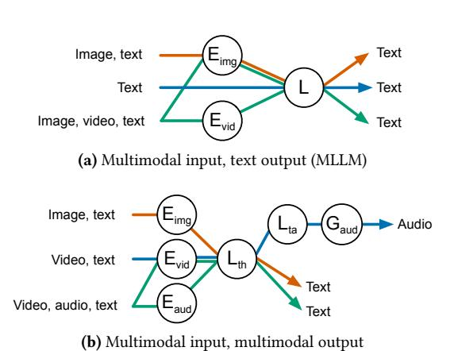
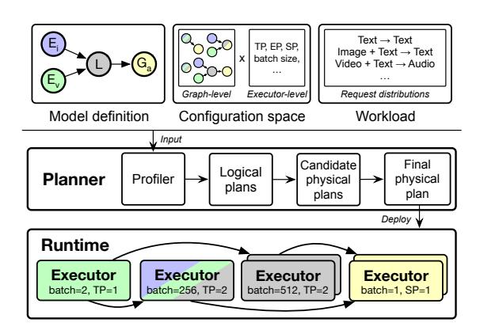

# 1 Introduction

Going beyond text-only Large Language Models (LLMs), we see a rapid proliferation of multimodal models that process and generate not just text, but also images, video, and audio. These Any-to-Any models, with over 11,000 variants on Hugging Face as of March 2026 [\[14\]](#page-12-0), can (1) understand multimodal inputs and/or (2) generate multimodal outputs alongside text. For instance, Multimodal LLMs (MLLMs) like Qwen VL [\[7,](#page-12-1) [27\]](#page-12-2) and InternVL [\[46\]](#page-13-0) process multimodal inputs and generate text (Figure [1a\)](#page-0-1); Qwen Image [\[26,](#page-12-3) [34\]](#page-13-1) and GLM Image [\[41\]](#page-13-2) produce images using diffusion from text embedded by an LLM; LTX-2 [\[12\]](#page-12-4) generates video and audio; DeepSeek Janus [\[8,](#page-12-5) [35\]](#page-13-3) understands and generates both text and images; and Qwen Omni [\[28,](#page-12-6) [37,](#page-13-4) [38\]](#page-13-5) accepts combinations of text, image, video, and audio as input and generates text and audio (Figure [1b\)](#page-0-2). In essence, text-only LLMs or diffusion models that generate images and videos are special cases of Any-to-Any multimodal models.

The computations of Any-to-Any (A2A) models are defined as a graph of heterogeneous components that handle different modalities: multimodal encoders, autoregressive

Figure 1. Requests invoking (a) a multimodal input model (InternVL [\[46\]](#page-13-0)) and (b) a multimodal input and output model (Qwen Omni [\[28,](#page-12-6) [37,](#page-13-4) [38\]](#page-13-5)). Different requests invoke different components of the model in different paths. stands for Encoder, for LLM, and for Generator. th and ta stand for thinker and talker LLMs, respectively.

components like LLMs, and multimodal generators. The execution of A2A models is distinguished from that of traditional special cases by two new types of heterogeneity ([§2.1\)](#page-1-0). First, different request types traverse different computation paths through the graph. Figure [1](#page-0-3) illustrates this with MLLMs and Qwen Omni as examples. Particularly, in Qwen Omni (Figure [1b\)](#page-0-2), image, video, and audio encoders feed embeddings into a thinker LLM for text generation; then, if audio output was requested by the user, the thinker's output is further passed to a talker LLM and then a vocoder, producing audio waveforms. Requests with different input and output modalities therefore invoke different subsets of components, leading to uneven per-component request rates. Second, different components have vastly different resource requirements and computational characteristics. As we show in Section [2.1,](#page-1-0) in Qwen 3 Omni, for instance, the thinker LLM achieves nearly 30× higher request throughput than the talker LLM on A100. Without well-balanced resource allocation to heterogeneous components, the overall throughput of inference serving will be bottlenecked by the slowest component.

Existing works have handled component heterogeneity in large model serving by disaggregating computation into separate executors [\[2,](#page-12-7) [3,](#page-12-8) [25,](#page-12-9) [30\]](#page-12-10). On the one hand, systems like vLLM-Omni [\[3\]](#page-12-8) and SGLang-Omni [\[2\]](#page-12-7) provide mechanisms to disaggregate and run inference of generic A2A models, but require human experts to manually search for

∗Equal contribution.

1<https://github.com/cornserve-ai/cornfigurator>

a good deployment plan. On the other hand, systems like ModServe [25] and EPD [30] are designed for special cases of A2A models (e.g., MLLMs) and do not generalize to generic A2A models. Neither category of systems provides an automated planner for generic A2A models, and building such a planner is non-trivial; the best strategy can be complex and model-dependent, and finding the best strategy requires navigating a large and complex search space (§2.2).

To fill this gap, we build Cornfigurator, an automated deployment planner for generic A2A model inference serving (§3). Cornfigurator is designed to make the right colocation and disaggregation decisions for A2A models based on model and workload characteristics, instead of prescribing fixed strategies based on model architecture. The key insight of Cornfigurator is that we should reason about each request type, instead of lumping all requests together. This is because different request types invoke different amounts of computation and serve different purposes within an application, even though they are served by a *shared* model. For instance, an audio response and a text response may have different latency expectations. Thus, Cornfigurator's optimization objective is to maximize the throughput of each request type constrained by each type's own latency target, or in other words, to maximize the *goodput* of each request type.

To do so, Cornfigurator's planning algorithm (§4) systematically explores colocation and disaggregation combinations for a given model, rather than prescribing a fixed strategy. The planner enumerates *logical subplans* (graph topologies) that may each *specialize* for different subsets of request types, merges subplans that share nodes into *compound subplans*, and composes them into *logical plans*. Logical plans are annotated with per-node executor configurations and routing probabilities to produce *physical plans*, which are concrete specifications of how to deploy and run the model. Then, the planner evaluates the per-request-type goodput of each physical plan through coarse-to-fine statistical evaluation: network flow for throughput ceiling, Monte Carlo sampling for latency, and a request-level simulator for accurate serving dynamics modeling, with pruning at each stage.

Cornfigurator is runtime-agnostic by design. We implement and evaluate it on top of Cornserve [1, 9], a distributed serving runtime for generic A2A models (§5). On a variety of recent A2A models including Qwen 3 Omni [38], Qwen 3 VL [27], InternVL 3 [46], and Qwen Image [34], Cornfigurator's plans either match or deliver 1.12×–6.32× higher goodput compared to plans used by existing systems (§6).

To summarize, our contributions are as follows:

- We identify a gap in automated deployment planning for generic Any-to-Any model serving.
- We present Cornfigurator, an automated planner for generic Any-to-Any models that maximizes goodput by reasoning about each request type and navigating deployment strategies and resource allocations.

| Model                                  | Input      | Output |
|----------------------------------------|------------|--------|
| Qwen 2.5/3/3.5 Omni [28, 37, 38]       | T, I, V, A | T, A   |
| Qwen 2.5/3 VL [7, 27], InternVL 3 [46] | T, I, V    | T      |
| DeepSeek Janus [8, 35]                 | T, I       | T, I   |
| LTX-2 [12]                             | T, I       | V, A   |
| Qwen Image [34], GLM Image [41]        | T          | I      |

**Table 1.** Input and output modalities of recent Any-to-Any multimodal models. Modalities (Text, Image, Video, Audio) supported by a model can vary significantly.

| Model         | Image input | Video input | Audio input |       | Audio output | Image output |
|---------------|----------------|----------------|----------------|-------|-----------------|-----------------|
| Qwen 3 Omni   | 5.43           | 2.93           | 21.43          | 2.15  | 0.12            |                 |
| Qwen 2.5 Omni | 15.64          | 1.28           | 34.04          | 1.09  | 0.28            |                 |
| Qwen 3 VL     | 8.95           | 0.97           |                | 1.56  |                 |                 |
| Qwen 2.5 VL   | 12.04          | 0.89           |                | 1.63  |                 |                 |
| InternVL 3    | 1.13           | 0.74           |                | 0.59  |                 |                 |
| Qwen-Image    |                |                |                | 15.67 |                 | 0.20            |

**Table 2.** Per-component throughput (requests/s) of various Any-to-Any models on A100-80GB GPU. Empty cells mean the model does not have that component.

 We evaluate Cornfigurator on a variety of recent Anyto-Any models and show that its plans match or deliver higher goodput compared to plans in existing systems.

### 2 Background and Motivation

We provide background on Any-to-Any multimodal models (§2.1), and discuss the deployment configuration space that motivates the need for an automated planner (§2.2).

#### 2.1 Any-to-Any Multimodal Models

Recent models embrace multimodality at their core, naturally so because our world is full of multimodal information and interactions. This gave rise to a new class of models called *Any-to-Any* (A2A) multimodal models. As Figure 1 shows, A2A model computations form a graph of heterogeneous components. In essence, traditional text-only Large Language Models (LLMs) and Diffusion Transformer (DiT) models are *special cases* of A2A models where all requests traverse the same path through a linear pipeline of components.

When it comes to deployment and inference, the graph-based computation structure of A2A models introduces new sources of heterogeneity. Table 1 summarizes the input and output modalities supported by recent A2A models. Requests with different combinations of input and output modalities invoke different subgraphs—we call each combination with a unique subgraph a *request type*. An incoming inference workload contains a mix of request types, leading to each component experiencing a different request rate. Furthermore, different components have vastly different resource requirements and computational characteristics. Table 2 shows the per-component throughput of recent A2A models on an

**Figure 2.** Graph-level deployment strategies for a four-component Any-to-Any model. The leftmost graph shows the model's component graph definition:  $(E_{img}, E_{vid}) \rightarrow LLM \rightarrow G_{aud}$ . Graphs to the right show various example graph-level deployment strategies, which differ in how they group or split components into nodes (circles). Strategies shown are non-exhaustive.

A100-80GB GPU.2 Component throughput can differ by orders of magnitude within the same model: in Qwen 3 Omni, the throughput difference between audio input and output components is nearly 200×. Together with request type heterogeneity, component heterogeneity leads to even more uneven per-component load.

#### 2.2 Deployment Strategies and Configurations

The heterogeneity of A2A models motivates specialized deployment strategies—namely, grouping components into *nodes* (a colocated set of components; graph-level), and configuring each node's execution (executor-level). These decisions are associated with complex tradeoffs and lack any silver bullet strategy optimal for all models and workloads.

Graph-level decisions. At the graph-level, the main decision is how to group components into graph nodes. Prior works focused on MLLMs, a special case of A2A models that consist of an LLM and one or more multimodal encoders. The simplest strategy deploys the entire model in a single monolithic executor (e.g., vLLM [18]), but this couples the execution and scaling of all components, making the slowest component the bottleneck for the entire model. Disaggregated strategies decouple the execution and scaling of different components by placing them on separate devices. For MLLMs, we may disaggregate just the encoders (e.g., Mod-Serve [25]) or further disaggregate the LLM into separate Prefill and Decode phases (e.g., EPD disaggregation [30]). Going further, systems like vLLM-Omni [3] and SGLang-Omni [2] provide generalized component-wise and/or phase-wise disaggregation for A2A models. Figure 2 shows graph-level strategies for an example four-component A2A model.

**Executor-level decisions.** After we make graph-level decisions, we know which components are grouped together in an executor. Each executor exposes its own configuration knobs that control its throughput, latency, and GPU resource consumption. For instance, nearly all executors can be configured with a maximum *batch size* and a *parallelism degree* with different parallelism strategies available depending on the executor and component (e.g., tensor/expert parallelism for LLMs [18], sequence parallelism for DiTs [20]).

**Figure 3.** InternVL 3 [46] (a) throughput and (b) p90 latency under different deployment strategies and workloads3 on 8× A100-80GB GPUs. Each row uses a graph-level strategy from prior work; numbers before **E/L/P/D** indicate executor instances. LLM (**L/D**) tensor parallel degree (TP) and batch size (BS) are shown in row labels; disaggregated encoders (**E**) and prefill (**P**) always use TP1 BS1 and TP2 BS1, respectively.

No silver bullet. Disaggregation, while proposed by many prior works, is not universally beneficial. Placing a component on its own GPU lets it scale independently, but it also consumes GPU resources that could otherwise be used by other components. For instance, disaggregating a multimodal encoder from the LLM allows independent scaling, but the GPUs allocated to the encoder can no longer store the KV cache for the LLM, which may reduce the LLM's throughput. At the executor-level, increasing parallelism degree reduces per-request latency by distributing compute across more GPUs, but may hurt throughput (and eventually latency) due to communication overhead. Similarly, increasing batch size improves throughput until the GPU saturates, but it may hurt latency [19]. Navigating these tradeoffs and determining graph- and executor-level configuration knobs is highly dependent on the workload and model architecture, as shown by prior work on LLM serving [6, 45], DiT serving [20], and configuration tuning [23, 39]. Figure 3 quantifies this for InternVL 3 38B [46]. The heatmap shows the throughput and latency of different graph- and executor-level configurations under different workloads on 8× A100-80GB GPUs. Even for this relatively simple single-encoder MLLM, there is no

&lt;sup>2Requests are from ServeGen [36]. We use executor default configurations, except for LLMs larger than 30B for which we use tensor parallel degree 2.

&lt;sup>3Workloads are specified as (input length, output length, image resolution, number of images per request): W1=(100, 100, 1920×1080, 1), W2=(1000, 100, 896×896, 1), W3=(100, 300, 896×896, 1), W4=(100, 300, 896×896, 2).

Figure 4. Planning and deployment with Cornfigurator. The planner takes as input the model definition, configuration space, and workload; the profiler benchmarks model components and the planner produces a physical plan. Cornfigurator assumes an existing serving runtime that deploys executors on GPUs and runs requests as planned.

silver bullet strategy; the best-throughput and best-latency configurations vary across workloads.

Automated planning. Navigating the vast configuration space of A2A model deployment (order of millions; [§6.8\)](#page-11-0) to find the best strategy is non-trivial, and existing works are limited. They either are designed for special cases of A2A models and prescribe fixed deployment strategies based on model architecture [\[25,](#page-12-9) [30\]](#page-12-10), or only provide mechanisms to disaggregate and run specific A2A models [\[2,](#page-12-7) [3\]](#page-12-8). Building an efficient automated planner that can search for good deployment plans for generic A2A models is the goal of this paper.

