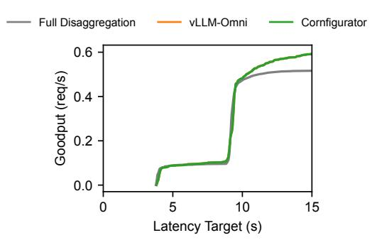

# B Qwen 3 Omni Per-Type Goodput vs. Latency Target

Figure 16 shows the goodput vs. latency target curves for all 8 request types (Section 6.2 Figure 9 highlights TIVA→T and TIVA→A). Cornfigurator achieves higher goodput compared to both baselines across all request types and latency targets. The gap is especially pronounced for text-output types (top four), where Cornfigurator's colocation decisions reduce encoder interference and improve LLM throughput. Audio-output types (bottom four) exhibit much longer latencies than text-output types due to the talker's iterative generation, and Cornfigurator's advantage comes from better allocation of talker-vocoder replicas.

**Figure 16.** Goodput of all 8 request types in Qwen 3 Omni vs. latency targets under 1/3 audio workload on 16 GPUs. (a)–(d): text output. (e)–(h): audio output.

Figure 18. Cornfigurator's deployment plans for InternVL 3 38B ( and ) on 16 GPUs under workload drift in terms of image request type fraction.

**Figure 17.** Goodput of requests in Qwen-Image with text input and image output vs. latency targets on 16 GPUs.

