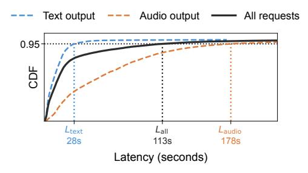
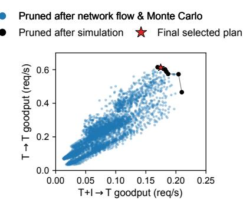

# <span id="page-3-0"></span>3 Cornfigurator Overview

Cornfigurator is a deployment planner for Any-to-Any model inference serving. This section presents the planner's location and role in the serving stack ([§3.1\)](#page-3-1) and the planning objective ([§3.2\)](#page-3-2). Section [4](#page-4-0) describes the planning algorithm.

### <span id="page-3-1"></span>3.1 Planning and Deployment Architecture

Figure [4](#page-3-3) shows how the planner fits into the serving stack. The planner supplies an existing serving runtime with a physical plan derived from the following inputs:

- Model definition: A directed acyclic graph whose nodes are model components and edges are data dependencies.
- Configuration space: The set of all executor types the runtime can instantiate, each specifying which model component(s) it handles, from which other executor types it can receive input, and available executor-level configurations. This determines the feasible graph-level and executor-level configurations ([§2.2\)](#page-2-0).
- Workload: A representative set of requests that follows the expected distribution of request types , with pertype fractions ( Í <sup>∈</sup> = 1).

<span id="page-3-4"></span>

Figure 5. Latency CDFs of text-output requests (blue), audiooutput requests (orange), and all requests together (black). Audio-output requests require more computation as they must go through the talker LLM and vocoder. A global latency constraint all binds only on the heavier audio-output requests, while per-type latency targets text and audio ensure each request type is individually constrained.

• Parameters: Number of homogeneous GPUs available and latency targets for each request type.

Given these inputs, the profiler ([§5.1\)](#page-7-1) benchmarks each model component under the target workload, recording the throughput and latency of each component on the target hardware. Using these profiles, the planner ([§4\)](#page-4-0) produces a set of physical plans, each specifying the nodes, the number of executors for each, their configurations, and routing probabilities when multiple paths are available for a request type. The final physical plan ([§3.2\)](#page-3-2) is deployed to the serving runtime, which instantiates executors on the GPUs and serves requests according to the plan.

#### <span id="page-3-2"></span>3.2 Planning Objective

The planner's goal is to maximize throughput subject to latency constraints. A common formulation is to constrain a single global statistic of request latency, but this can be problematic for A2A models. First, with input and/or output modality differences between request types, the application context within which the request's response is used may differ, leading to different latency expectations per type. For instance, users may tolerate longer waits for videos than for images. Furthermore, in generic A2A models, requests of different types take different paths through the model, leading to widely different computation costs and latency distributions. Figure [5](#page-3-4) illustrates such a case, where an example A2A model has two request types: text output (blue; lighter) and audio output (orange; heavier). When a single global latency target all (black) is used, it binds only on the heaviest request type (audio), while the lighter type (text) faces no effective constraint; nothing stops the planner from freely degrading the latency of text requests.[4](#page-3-5) Therefore, Cornfigurator instead imposes latency constraints on each request type independently, ensuring that the latency of each

<span id="page-3-5"></span><sup>4</sup>Lighter types with less compute requirement are especially vulnerable. Since their latency is far below the global threshold, they can absorb substantial degradation before ever pressuring the global constraint.

type is constrained according to its own requirements and computation cost, and that the planner cannot arbitrarily degrade the latency of lighter request types.

**Latency constraints.** Cornfigurator allows user to set latency targets  $L_t$  per type in any way that reflects their needs. One natural default/starting point is to set  $L_t$  proportionally to the computation cost of type t, so that a request requiring twice the computation gets twice the latency budget. Appendix A proves that this choice factors out scale differences between types, making the constraint equally tight for all types when their latency distributions have similar shapes.

**Maximizing goodput.** Per-type latency constraints motivate a per-type metric that captures both throughput and latency compliance. We define the *goodput* of request type *t* for a physical plan as the throughput of type-*t* requests that meet their latency target. Goodput has desirable properties. A plan that violates latency targets gets penalized even if its raw throughput is high, and when a plan cannot handle incoming load, queue build-up increases latency and goodput tends to zero. For each candidate plan, the planner produces a vector of per-type goodput estimates. The planner's goal is to find the plan that maximizes overall goodput, summed across all request types.

## <span id="page-4-0"></span>4 Planning Algorithm

This section describes the planning algorithm. We first walk through the process at a high level (§4.1), then describe the two big stages: enumerating valid plans (§4.2), and evaluating them to find the best one (§4.3). Finally, we discuss how the planner can adapt to deployment scenario changes (§4.4).

#### <span id="page-4-1"></span>4.1 Planning Overview

The goal of the planner is to explore diverse graph- and executor-level configurations and *mixtures* of them to find smoother tradeoffs that strike the right balance for the given model, workload, and GPU budget.

Executor-level configurations can only be decided after the *topology* of the graph is determined. As such, the planner begins at the graph-level. First, the planner enumerates *simple logical subplans* by exploring colocation and disaggregation decisions on the model definition graph, and then merges simple subplans that share nodes into *compound logical subplans* with internal parallelism and routing. These simple and compound logical subplans are building blocks, and each may specialize for different subsets of request types. Logical subplans are then composed into full *logical plans* with parallel paths that collectively cover all request types. These are then refined into *physical plans* with concrete GPU allocations, configurations, and routing probabilities (§4.2).

Each physical plan is then evaluated for per-request-type goodput (§4.3): a cheap statistical estimate prunes unpromising candidates, and a more accurate request-level simulator

```
Input: Model G = (C, E), colocatable edges E_c \subseteq E
Config space \mathcal{K}_v for each possible node v
Request types T, GPU budget N
Subplan merge limit k_c, composition limit k_s
Output: Physical plans \mathcal{P}
```

```
▶ Simple subplans: colocation/disaggregation decisions
1 \mathcal{L}_{\text{simple}} \leftarrow \emptyset
   ▶ Valid: covers ≥ 1 request type, all components are used
2 for each valid subgraph G' = (C', E') \subseteq G do
        ▶ One decision per colocatable edge in the subgraph
        for each \mathbf{m} \in \{KEEP, MERGE\}^{|E' \cap E_c|} do
3
             L \leftarrow fully disaggregated plan for G'
             for each edge e = (c_i, c_j) \in E' \cap E_c do
 5
             if m_e = MERGE then Merge c_i, c_j into c_{ij}
            Add L to \mathcal{L}_{\text{simple}}
   ▶ Compound subplans: merge subplans with shared nodes
8 \mathcal{L} \leftarrow \mathcal{L}_{\text{simple}}
9 for each subset \{L_1, \ldots, L_j\} \subseteq \mathcal{L}_0, 2 \le j \le k_c do
    if share nodes then Add overlay(L_1, ..., L_i) to \mathcal{L}
   ▶ Logical plans: compose subplans into supergraphs
11 S \leftarrow \emptyset
12 for each multiset S over \mathcal{L} where |S| \leq k_s do
    if covers all request types then Add S to S
   ▶ Physical plans: allocate executors, configs, routing
14 P ← Ø
15 for each S \in S do
        ▶ Valid: uses \leq N GPUs, at least 1 executor per node
        for each valid executor partition do
             ▶ Valid: sums to 1.0 per request type
             for each routing probability assignment do
17
                 Add (S, executors, routing) to \mathcal{P}
19 return P
```

<span id="page-4-8"></span><span id="page-4-7"></span><span id="page-4-6"></span>Algorithm 1: Plan enumeration.

<span id="page-4-3"></span>evaluates the survivors. Finally, the physical plan that maximizes overall goodput is selected for deployment.

#### <span id="page-4-2"></span>4.2 Plan Enumeration

Algorithm 1 summarizes the plan enumeration stage, and Figure 6 provides a running example. Given inputs (Figure 6a; §3.1), the planner enumerates candidates from logical subplans, to logical plans, and finally to physical plans. Logical (sub)plans define empty *variables* for GPU allocations, executor configurations, and routing probabilities. Physical plans *fill in* all such variables, producing complete specifications that can be deployed and served by a runtime.

**Simple logical subplans.** A *logical subplan* is a directed acyclic graph, where each node handles one or more model

<span id="page-5-1"></span><span id="page-5-0"></span>

<span id="page-5-2"></span>**Figure 6.** Running example for the plan enumeration phase. (a) Definition of a four-component model ( $(E_{img}, E_{vid}) \rightarrow L \rightarrow G_{aud}$ ) with three request types ( $\boxed{1}I+V+T\rightarrow T$ ,  $\boxed{2}I+T\rightarrow A$ , and  $\boxed{3}V+T\rightarrow A$ ). (b) Example subplans (not exhaustive). Simple:  $E_{img}+E_{vid}+LLM$  with disaggregated  $G_{aud}$ , full disaggregation, and  $E_{img}+E_{vid}+LLM$  without  $G_{aud}$  (specialized to type  $\boxed{1}$ ). Compound: merging the left two simple subplans sharing  $G_{aud}$ . (c) An example logical plan composing the compound subplan and the text specialization simple subplan into a supergraph. Audio-output types ( $\boxed{2}$  and  $\boxed{3}$ ) must go to the compound subplan (only path with  $G_{aud}$ ); type  $\boxed{1}$  can go to either. Arrows that send text data to LLM executors are omitted for simplicity. (d) An example physical plan based on the logical plan in (c), allocating 8 GPUs, with per-node executors and their configurations, and per-type routing probabilities at the compound subplan entrypoint and across the two subplans.

components. The planner first constructs *simple* subplans by selecting a subgraph of the model definition that (1) covers at least one request type (not necessarily all types), and (2) has no unused components (i.e., every component in the subgraph is used by at least one covered request type). Each pair of adjacent components connected by a *colocatable* edge, as determined by the runtime, has a choice of whether to Keep as separate nodes or Merge into a single colocated node. The Cartesian product of these binary decisions (Algorithm 1, line 3) across all colocatable edges produces all valid node topologies for that subgraph—from fully disaggregated (all Keep) to monolithic (all Merge).

**Compound logical subplans.** The planner then generates *compound* subplans (Algorithm 1, line 9) by merging up to  $k_c$  simple subplans (default  $k_c = 2$ ) that share one or more nodes. Requests still follow one subplan end-to-end, and per-type routing probabilities at the entrypoint of the compound subplan determine how traffic is split between merged subplans. Figure 6b shows example simple and compound subplans.

Constructing logical plans. A single logical subplan covers a subset of request types and occupies a portion of the GPU budget. This design is intentional; it allows the planner to include subplans that are specialized to different request types. For instance, one subplan may be optimized for text-output requests, while another handles audio-output requests (Figure 6b). By having subplans that specialize for different subsets of request types, the planner can mix and match them as appropriate to produce smoother tradeoffs. Given all subplans, the planner composes up to  $k_s$  subplans (default  $k_s = 2$ ) into a *logical plan* (Algorithm 1, line 12): a supergraph with common entry and exit nodes, where each

<span id="page-5-4"></span><span id="page-5-3"></span>subplan forms an alternative parallel path. A logical plan covers every request type with at least one path (Figure 6c).

Constructing physical plans. A physical plan (Figure 6d) is a logical plan annotated with concrete GPU allocations, executors and their configurations, and routing probabilities—it can be deployed to and run by a runtime.

First, for each node, the planner decides how many executors to run and what configuration (e.g., parallelism degree, batch size) each executor uses. This enumeration is analogous to the coin change problem: each executor type is a "coin" whose denomination is its GPU cost, and allocating executors to nodes is equivalent to finding all ways to spend between 1 to N GPUs. Unlike standard coin change, however, coins are not fungible even when they have the same denomination: two executors that cost the same number of GPUs but differ in other configurations (e.g., batch size) are considered different. The planner enumerates all physical plans (Algorithm 1, line 16) satisfying:

$$\sum_{v \in S} \sum_{k \in \mathcal{K}_v} a_{v,k} n_{v,k} \le N \qquad \text{(Within GPU budget)}$$

$$\sum_{k \in \mathcal{K}_v} n_{v,k} \ge 1 \quad \forall v \in S \qquad (\ge 1 \text{ executor per node)} \tag{1}$$

where v is a node in logical plan S,  $\mathcal{K}_v$  is its set of feasible configurations (determined by Configuration space in §3.1),  $a_{v,k}$  is the GPU cost of node v using configuration k, and  $n_{v,k}$  is the number of executors with config k assigned to node v.

<span id="page-5-5"></span><sup>&</sup>lt;sup>5</sup>The concrete parallelism strategy depends on the component type: tensor parallelism (TP) for LLMs and Vision Transformers, expert parallelism (EP) for MoE models, and sequence parallelism (SP) for Diffusion Transformers.

Input: Physical plans P

```
Executor throughput and latency profiles
         Workload W with request type fractions { }
         Latency targets { } and headroom 
  Output: Selected physical plan 
                                 ∗
  ⊲ Phase 1: Flow-based throughput estimation
1 Sort P by increasing executor capacity per node
2 for each  ∈ P do
3 Find bottleneck node in 
4  ← aggregate rate that saturates the bottleneck
5 Drop plans with redundant capacity from P
  ⊲ Phase 2: Latency estimation with Monte Carlo
6 for each  ∈ P do
7 Sample  requests from W
8 for each request type  do
9 Route type- requests through 
10 , ← CDF of accumulated latencies
         ⊲  
                incoming rate, , ( ) met latency target
11 , ←  
                       · , ()
12 Drop Pareto-suboptimal plans from P
  ⊲ Phase 3: Request-level simulation
13 for each  ∈ P do
14 {,, , } ∈ ← simulate  at rate  · 
15 , ← , · , () for each 
16 Drop Pareto-suboptimal plans from P
  ⊲ Select: Default Policy is sum of goodput across types
17 
   ∗ ← arg max Policy(1,, . . . ,| |, )
18 return 
           ∗
```

<span id="page-6-7"></span><span id="page-6-6"></span><span id="page-6-5"></span><span id="page-6-1"></span>Algorithm 2: Three-phase evaluation and selection.

Finally, the planner assigns per-type routing probabilities (Algorithm [1,](#page-4-3) line [17\)](#page-4-8) at two levels: between executors in the same node and between alternative parallel paths in the logical plan. At each level, routing probabilities for each request type sum to 1. By default, routing probabilities are discretized with a step size of 0.1 (10%), but finer granularities are supported at the cost of more physical plans to evaluate ([§6.7\)](#page-10-0). The final result is a list of physical plans, each a complete specification for the runtime for deployment and execution.

Time complexity. Enumeration is exponential in the number of model components and colocatable edges, but since these are in practice at most tens (Qwen Omni has 6 components), enumeration time is manageable ([§6.8\)](#page-11-0). The maximum number of subplans to merge ( ) and to compose ( ) bound the explosion—we vary these in Section [6.7.](#page-10-0)

## <span id="page-6-0"></span>4.3 Plan Evaluation and Selection

Plan enumeration produces a large set of candidate physical plans. The planner evaluates them in a coarse-to-fine pipeline (Algorithm [2\)](#page-6-1). For all enumerated physical plans, a cheap network flow-based estimate provides accurate aggregate throughput estimates, and Monte Carlo sampling adds pertype latency estimates. Pruning rules discard unpromising plans after each phase, and survivors are evaluated with a more expensive request-level simulator that refines the accuracy of per-type goodput estimates to select the final plan. The pruning rules are exact; they only drop plans that are guaranteed to be redundant or suboptimal.

Network flow-based throughput estimation. Offline profiling provides the maximum throughput of each executor for each request type, and each node's throughput (i.e., capacity) is the sum of its executors' throughput. Given the workload's per-type fractions , each type contributes · to a node's load, split across executors according to routing probabilities. Prior works have used (max) flow-based throughput analysis for a single request type [\[21,](#page-12-18) [45\]](#page-13-7). However, for A2A models, multiple request types flow through the graph simultaneously and share node capacity; at each node, the demands of all types passing through it are summed and compared against the node's capacity. The node whose aggregate demand first reaches its capacity is the bottleneck, and the aggregate request rate at which this occurs is plan 's maximum throughput (Algorithm [2,](#page-6-1) line [3\)](#page-6-2). Plans that configure a node with more capacity than the node's aggregate demand are redundant, as they won't improve throughput or latency; all such plans are pruned (Algorithm [2,](#page-6-1) line [5\)](#page-6-3).

 is an ideal upper bound; system overheads and request bursts prevent it from being achieved in practice. The planner therefore scales it down to · (we find that the planner is robust to the setting of ; [§6.7\)](#page-10-0), which is used as the incoming aggregate request rate for subsequent phases.

Latency estimation with Monte Carlo. The planner estimates request latency by Monte Carlo simulation (Algorithm [2,](#page-6-1) line [9\)](#page-6-4): it randomly samples requests from the Workload, routes each through the plan, and accumulates per-executor processing latencies (sampled from profiling results) to produce per-type latency CDFs. This is cheap because each request's latency is independent of others (i.e., queuing not modeled), but still provides a reasonable estimate because for well-balanced plans, queuing delay is bounded and latency is dominated by processing time. After latency estimation, plans whose per-type goodput vectors are Pareto-dominated are pruned (Algorithm [2,](#page-6-1) line [12\)](#page-6-5).

Request-level simulation. Earlier phases reasoned about aggregate flow and independent requests to provide good estimates for aggregate goodput, but they are less precise for each request type because they do not precisely model queuing dynamics and inter-type interactions at shared nodes. Candidates that survived earlier phases are therefore evaluated with a request-level simulator (Algorithm [2,](#page-6-1) line [14\)](#page-6-6) that models the full request processing pipeline, refining

<span id="page-7-3"></span>

**Figure 7.** Illustration of how physical plan evaluation, pruning, and selection work. Each dot represents a physical plan, and the two axes are goodput for two request types. Plans are progressively pruned after each phase (network flow, Monte Carlo, and simulation), reflected by the dots' color.

accuracy to the individual request type-level. The simulator runs the workload at rate  $\alpha \cdot R_d$  through a physical plan and produces (1) a throughput estimate and (2) a latency CDF for each request type, from which goodput estimates per request type can be derived. Plans that are Pareto-dominated on their goodput vector are pruned, and the final plan is selected (Algorithm 2, line 17) according to a policy, which maximizes aggregate goodput by default. Section 6.5 evaluates the accuracy of the pipeline.

Figure 7 visualizes the goodput of physical plans of a model with two request types, with colors showing at which phase the plan was pruned. The plans pruned by network flow *overlap* in goodput values with their non-redundant counterparts as they have the same bottleneck node, so it reduces the number of candidate plans significantly but not the visible point cloud. Monte Carlo and request-level simulation eliminates Pareto-suboptimal plans.

**Time complexity.** Network flow and Monte Carlo are both linear in the number of candidate physical plans, and cheap per plan; the expensive request-level simulation runs only on the small set of survivors after pruning. Section 6.8 breaks down the number of plans and time spent in each phase.

### <span id="page-7-2"></span>4.4 Adapting to Changes

Three types of changes can occur in a deployment scenario, each requiring progressively more work to adapt.

**GPU budget changes.** If the GPU budget N changes but the workload distribution and model remain the same, the planner can simply re-run with the new N. Profiling results remain valid, and the plan enumeration and evaluation phases are fast enough to re-run semi-online (§6.8).

**Workload changes.** If request types fractions  $\pi_t$  change, profiling results can be reused because the profiler records per-request latency measurements. Changing the request type distribution is a matter of re-weighting existing samples. The planner re-runs enumeration and evaluation with the

updated workload fractions. On the other hand, if new request types are added, or when the characteristics of existing request types change (e.g., significantly different sequence lengths), the new/updated type needs to be re-profiled. We show this in Section 6.6.

Model or hardware changes. If the model architecture changes (e.g., a new component is added) or the hardware changes (e.g., migrating to a different GPU type), profiling must be re-run from scratch, as per-component throughput and latency characteristics are no longer valid. This is the most expensive adaptation, but it would also be the least frequent in practice.

### <span id="page-7-0"></span>5 Implementation

Cornfigurator is designed to be runtime-agnostic; it works with runtimes ranging from those supporting only a single executor type to fully generic A2A serving runtimes. As a proof of concept, we implemented Cornfigurator on top of Cornserve [1, 9], a distributed A2A model serving platform.

#### <span id="page-7-1"></span>5.1 Profiler

The profiler benchmarks each supported executor under the workload to collect the throughput and latency data that the planner uses. The profiler deploys executors on the target hardware via the runtime and sends requests, sweeping over configuration knobs (e.g., batch sizes, parallelism degrees). Profiling is performed at a saturating request rate and measured only during the *steady state* window of the engine, excluding ramp up and down periods. In order to extract pure processing time, queuing delay is subtracted from end-to-end latency measurements using runtime traces.

#### 5.2 Planner

The planner is implemented in about 5K lines of Rust. The plan evaluation phases (§4.3) implement the following extra optimizations to improve accuracy. The accuracy of Cornfigurator's planner is evaluated in Section 6.5.

Occupancy-aware latency scaling. Flow-based estimation finds the bottleneck node in the plan that bounds the whole plan's throughput. All other nodes are non-bottlenecks, and likely operate at a batch size smaller than its *configured* batch size, which lead to lower latency than what the profiler measured at the configured batch size. Therefore, during Monte Carlo simulation, the planner scales latency numbers for non-bottleneck nodes to reflect their effective batch size.

Modeling CPU-GPU overlap. Multimodal encoders perform CPU-GPU pipelining: the CPU preprocesses input data (e.g., image decoding) while the GPU runs the encoder model. When a request arrives at an idle multimodal encoder executor, it experiences the full CPU + GPU time. However, when the encoder is already busy, CPU preprocessing happens while the request is in the queue, and processing time

reduces to GPU time alone. This difference is significant especially when batch size is small. Thus, the simulator checks whether the executor is idle or busy and applies the corresponding processing time (CPU + GPU, or GPU alone).

Accounting for communication overhead. Intermediate tensors must be transferred between disaggregated executors. In our setup, the median transfer latency across representative tensor sizes and traffic rates is approximately 10 ms. While this transfer latency is not the bottleneck as computation dominates, the planner can account for it by adding this median delay at each disaggregated edge in the plan.

