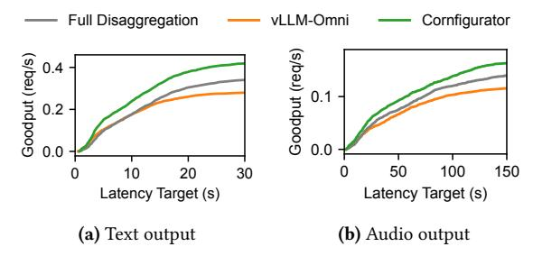
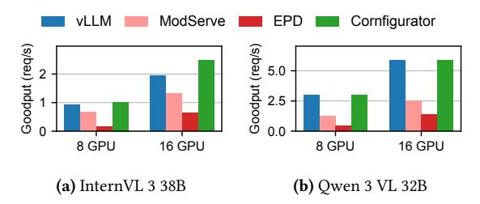
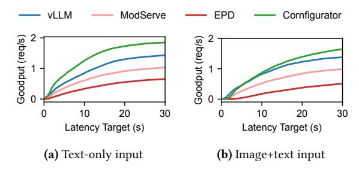

# 6 Evaluation

We plan the deployment of recent A2A models with diverse architectures, modalities, and request types with Cornfigurator and compare with state-of-the-art baselines. We find:

- Cornfigurator produces high-quality deployment plans for generic A2A models that achieve 1.24×–2.73× higher goodput than baselines ([§6.2\)](#page-8-1).
- Cornfigurator produces plans that match or deliver 1.12×– 6.32× higher goodput over baselines for special case A2A models: multimodal input ([§6.3\)](#page-9-0) and output ([§6.4\)](#page-10-3) models.
- Cornfigurator's planner estimates goodput with high accuracy ([§6.5\)](#page-10-1), supports adapting to workload drift ([§6.6\)](#page-10-2), is robust to parameter choices ([§6.7\)](#page-10-0), and produces plans with reasonable overhead ([§6.8\)](#page-11-0).

#### 6.1 Common Evaluation Setup

Different A2A models have different input and output modalities, and thus different representative workloads and baselines. We describe common setup across all evaluations here, and architecture-specific setup in respective subsections.

Testbed. All experiments are run on two AWS p4de.24xlarge instances, each with 8×NVIDIA A100-80GB GPUs connected via NVSwitch and 400 Gbps cross-node bandwidth.

Baselines. Baselines include plans generated by experts/ developers of vLLM [\[18\]](#page-12-13), vLLM-Omni [\[3\]](#page-12-8), ModServe [\[25\]](#page-12-9), and EPD [\[30\]](#page-12-10).[6](#page-8-2) Cornfigurator is a strict superset of all baselines, so the plans that come with each baseline system can be expressed as a Cornfigurator plan. We deploy and evaluate all plans on Cornserve [\[1,](#page-12-11) [9\]](#page-12-12), a generic A2A serving platform that natively supports Cornfigurator's plan space to remove performance differences due to implementation differences [\[5\]](#page-12-19).

Metric. Our primary performance metric is goodput ([§3.2\)](#page-3-2): the throughput of requests that meet their per-type latency targets. We compare the maximum achievable goodput of each plan, which is the goodput achieved by the highest request rate that the plan can support.

Figure 8. Maximum achievable goodput of Qwen 3 Omni under the ServeGen workload on 8 and 16 GPUs with (a) 1/3 and (b) 2/3 audio output requests.

Latency targets. We set the latency target of each request type ([§3.2\)](#page-3-2) in a manner that reflects the raw amount of computation requirements of that type, while still being achievable by a shared deployment plan that serves all types simultaneously. Unless mentioned otherwise, we identify the highest-throughput configuration for each request type served in isolation from offline profiling results and take its p25 latency as the target for that type. We show the sensitivity of goodput to the choice of percentile in Section [6.7.](#page-10-0)

## 6.2 Multimodal Input, Multimodal Output

Setup. We evaluate Qwen 3 Omni 30B [\[38\]](#page-13-5) with the Serve-Gen [\[36\]](#page-13-6) workload, which includes request timestamps. The workload has 8 request types: {T+I, T+I+V, T+I+A, T+I+V+A} → {T, A}, where inputs always include text and image, and include video and/or audio input half of the time. We evaluate two audio output fractions (1/3 and 2/3) to study how the workload's modality mix affects plans and goodput.

Baselines. We compare against two baselines. First is vLLM-Omni [\[3\]](#page-12-8), which uses an expert-tuned but fixed deployment strategy. Second is Full Disaggregation, which is a restricted version of Cornfigurator; its graph-level configuration space is fixed to fully disaggregated (i.e., each model component running in a separate executor), but otherwise follows the full Cornfigurator planning pipeline to optimize executorlevel configurations and GPU allocation.

Goodput comparison. Figure [8](#page-8-3) compares goodput across systems on 8 and 16 GPUs under both audio output fractions. Cornfigurator achieves 1.24×–1.84× higher goodput than baselines across both GPU budgets with 1/3 audio output (Figure [8a\)](#page-8-4), and the gains widen to 1.25×–2.73× with 2/3 audio (Figure [8b\)](#page-8-5). As the audio generator becomes a heavier bottleneck, Cornfigurator's ability to allocate resources proportionally to component demand becomes more valuable.

Scaling from to 16 GPUs, both Cornfigurator and Full Disaggregation achieve super-linear scaling because the larger budget allows better component balance. However, Full Disaggregation still falls short of Cornfigurator because it disaggregates all components including those with less load, leading to underutilized GPU resource. In contrast, Cornfigurator automatically finds efficient colocation strategies.

6SGLang-Omni [\[2\]](#page-12-7) is not included as it is in early development stage, falling short on stability, model support, and deployment plans at the moment.

**Figure 9.** Goodput of requests in Qwen 3 Omni with T+I+V+A input with (a) text output and (b) audio output vs. latency targets under 1/3 audio workload on 16 GPUs.

**Figure 10.** (a) Qwen 3 Omni definition graph and (b) Cornfigurator's deployment plan under 2/3 audio workload on 16 GPUs. The planner prepared a video-only subplan (with a disaggregated video encoder) for heavy video-input requests.

**Per-type goodput vs. latency target.** Figure 9 shows the goodput of two request types in Cornfigurator with 1/3 audio, 16 GPU deployment (remaining six types are in Appendix B). Cornfigurator's plans achieve higher goodput than baselines across the full range of latency targets, from tight to relaxed.

**Physical plans.** We examine the plans generated by Cornfigurator to understand its planning decisions. On the 1/3 audio workload (executor configs are similar and thus omitted):

• 8 GPUs: 
$$1 \times (E_{img}) + 2 \times (E_{vid} + E_{aud} + L_{th}) + 5 \times (L_{ta} + G_{aud})$$

• 16 GPUs: 
$$1 \times (E_{aud}) + 4 \times (E_{img} + E_{vid} + L_{th}) + 11 \times (L_{ta} + G_{aud})$$

Cornfigurator switches from disaggregating the image encoder on 8 GPUs to disaggregating the audio encoder on 16 GPUs, as the additional GPU budget allowed it to realize better balance. On the 2/3 audio workload, the 8 GPU plan is  $1\times (E_{\rm img}+E_{\rm vid}+E_{\rm aud}+L_{\rm th})+6\times (L_{\rm ta})+1\times (G_{\rm aud}),$  reflecting that increased audio output load promoted talker LLM and vocoder disaggregation. With 16 GPUs (Figure 10), Cornfigurator has more GPUs to express higher degrees of specialization: the plan originates from a compound logical subplan (§4.2) that merges two simple subplans sharing  $13\times (L_{\rm ta}+G_{\rm aud}).$  One

**Figure 11.** Maximum achievable goodput of two MLLMs under the ServeGen workload on 8 and 16 GPUs.

Figure 12. Cornfigurator's deployment plan for InternVL 3 38B (♠→♠) under 50% image workload on 16 GPUs.

subplan serves all heavy video-input requests with a disaggregated video encoder, while the other subplan serves the rest of the requests with a monolithic configuration.

### 6.3 Multimodal Input, Text Output

**Setup.** MLLMs are a special case of A2A models with multimodal input and text-only output. We evaluate on two MLLMs, InternVL 3 38B [46] and Qwen 3 VL 32B [27], under the ServeGen [36] workload, which includes request timestamps. Half of the requests have image input by default, and we vary this portion in controlled experiments (§6.6).

**Baselines.** We compare Cornfigurator plans with vLLM [18] and EPD [30], which are restricted versions of Cornfigurator with fixed graph-level configurations (monolithic for vLLM, encoder–prefill–decode disaggregation for EPD) and follow the full Cornfigurator planning pipeline for executor-level configurations and GPU allocation, and ModServe [25] (TP=4, equal encoder/LLM GPU split).7

**Goodput comparison.** Figure 11 compares goodput on 8 and 16 GPUs. For InternVL 3 (Figure 11a), Cornfigurator achieves  $1.12\times-6.06\times$  higher goodput compared to baselines on 8 GPUs and  $1.27\times-3.95\times$  on 16 GPUs. Figure 12 illustrates the 16 GPU physical deployment plan: the planner disaggregates the large 6B image encoder onto dedicated GPUs. For Qwen 3 VL (Figure 11b), Cornfigurator matches or exceeds all baselines  $(1.00\times-6.32\times)$ , correctly identifying that disaggregation does not help for this model's small encoder. EPD performs poorly because its advantages generally show with short output lengths [30].

 $^{7}\mathrm{vLLM}\text{-Omni}$  is built for multimodal  $\mathit{output}$  models, so it is not included.

Figure 13. Goodput of requests in InternVL 3 with (a) textonly input and (b) image+text input vs. latency targets under 50% image workload on 16 GPUs.

Figure 14. Maximum achievable goodput of Qwen-Image under the DiffusionDB workload on 8 and 16 GPUs.

Per-type goodput vs. latency target. Figure [13](#page-10-4) shows that Cornfigurator achieves higher goodput than baselines for both InternVL 3 request types across most latency targets.

### 6.4 Text Input, Multimodal Output

Setup and baseline. We evaluate Qwen-Image [\[34\]](#page-13-1) using DiffusionDB [\[33\]](#page-13-9) prompts with a mixture of low (512×512) and high (1024×1024) resolution requests [\[20\]](#page-12-14), submitted with Poisson intervals. Cornfigurator's plan is compared against Full Disaggregation and vLLM-Omni [\[3\]](#page-12-8)'s plan.

Goodput comparison. Figure [14](#page-10-5) compares goodput of Qwen-Image on 8 and 16 GPUs. Qwen-Image is a simple twocomponent model, and the first component (LLM prefill) is computationally lightweight compared to the second component (DiT). As such, disaggregating the two components does not yield benefits as the first component underutilizes its dedicated GPUs, so Cornfigurator correctly identifies and uses a monolithic deployment plan. Appendix [C](#page-15-0) shows the goodput vs. latency target curve for this model.

### 6.5 Planner Accuracy

We evaluate the accuracy of the goodput predictions of the plan evaluation pipeline ([§4.3\)](#page-6-0), namely the cheap flow-based throughput estimation + Monte Carlo latency estimation (F&M) and the more expensive request-level simulator (Simulator), by comparing predictions with real serving measurements. Table [3](#page-10-6) reports prediction accuracies across Qwen 3 Omni experiments on 8 and 16 GPUs. F&M is sufficient for pruning based on aggregate goodput because it is accurate when it comes to aggregate goodput across all request

| Input      | Output | Mean Abs. Err. (%) |           | Median Abs. Err. (%) |           |
|------------|--------|--------------------|-----------|----------------------|-----------|
|            |        | F&M                | Simulator | F&M                  | Simulator |
| T+I        | T      | 13.0               | 5.8       | 8.5                  | 4.9       |
| T+I+V      | T      | 17.5               | 5.4       | 17.2                 | 4.0       |
| T+I+A      | T      | 12.9               | 6.5       | 11.5                 | 4.4       |
| T+I+V+A    | T      | 16.9               | 9.3       | 11.6                 | 7.2       |
| T+I        | A      | 9.6                | 5.7       | 3.1                  | 4.6       |
| T+I+V      | A      | 12.0               | 5.7       | 5.9                  | 3.2       |
| T+I+A      | A      | 15.6               | 5.1       | 14.5                 | 3.4       |
| T+I+V+A    | A      | 12.2               | 4.9       | 6.8                  | 4.0       |
| Aggregated |        | 10.7               | 4.1       | 8.6                  | 3.3       |

Table 3. Per-type and aggregate goodput prediction error (%) for Qwen 3 Omni on 8 and 16 GPUs. F&M is flow-based throughput estimation & Monte Carlo latency estimation phases combined, and Simulator is request-level simulation.

| Image prob. | vLLM | ModServe | EPD  | Cornfigurator |
|-------------|------|----------|------|---------------|
| 25%         | 2.49 | 1.92     | 0.89 | 3.60          |
| 50%         | 1.95 | 1.33     | 0.63 | 2.48          |
| 75%         | 1.75 | 1.71     | 0.35 | 1.75          |

Table 4. InternVL 3 goodput (req/s) under ServeGen with varying image probability on 16 GPUs.

types (mean absolute error 10.7%, median 8.6%). However, it has overall higher error for per-request-type goodput as it does not model queuing effects and inter-type contention at shared executors. On the other hand, Simulator is not only more accurate in aggregate goodput (mean absolute error 4.1%, median 3.3%), but also significantly more accurate for individual request types, making it essential for refining the evaluation of plans that are closer to the final plan.

### 6.6 Workload Drift

Cornfigurator helps runtimes to adapt to workload drift ([§4.4\)](#page-7-2). To demonstrate this, we vary the image input probability of the ServeGen workload for InternVL 3 from 25% to 75% on 16 GPUs, and let Cornfigurator re-plan for each workload. Table [4](#page-10-7) shows that Cornfigurator consistently matches or outperforms baselines across all image probabilities by adapting to the changing workload. As expected, the planner does not require any re-profiling to adapt to ratio changes, so re-planning takes single- to at most double-digit seconds. Appendix [D](#page-15-1) provides visualizations of Cornfigurator's plans at different image probabilities.

#### 6.7 Sensitivity Analysis

Cornfigurator's planner has several parameters as part of its design. In this section, we vary these parameters to understand their effect on goodput and the planning process.

Throughput headroom. After flow-based throughput estimation, the planner scales down the ideal maximum throughput by a headroom factor ([§4.3\)](#page-6-0). Table [5](#page-11-1) shows that the

| α   | Goodput (req/s) | Prediction error |
|-----|-----------------|------------------|
| 0.5 | 1.08            | -0.6%            |
| 0.6 | 1.59            | -1.8%            |
| 0.7 | 1.83            | +0.8%            |
| 0.8 | 1.89            | -1.6%            |

**Table 5.** Effect of throughput headroom  $\alpha$  on goodput and planner accuracy.  $\alpha$  scales down the rate-matched maximum throughput  $R_d$  to  $\alpha \cdot R_d$  before latency estimation (§4).

**Figure 15.** Sensitivity analysis with Qwen 3 Omni on 16 GPUs. Each plot shows planner goodput (left y-axis) and planning time (right y-axis) as one parameter is varied.

planner's prediction error remains within  $\pm 2\%$  across all tested values of  $\alpha$ , demonstrating robustness.

**Latency target percentile.** Figure 15a shows goodput as the latency target percentile is swept from p10 (tight) to p50 (relaxed). As the target loosens, the planner can find higher throughput plans with weaker latency constraints, increasing goodput without increasing planning time. Our default p25 (§6.1) represents a practical middle ground.

Routing probability discretization. When annotating the logical plan with routing probabilities, the planner discretizes probabilities into fixed steps (§4.3). A finer step size would unlock higher goodput plans but also increases planning time, as shown by Figure 15b. We observe that a step size of 0.1 (10% increments) is sufficient to capture goodput benefits without increasing planning time excessively.

**Subplan merge and composition limits.** During logical plan enumeration, up to  $k_c$  simple subplans are merged into compound subplans and up to  $k_s$  subplans into a logical plan (§4.2). Figures 15c and 15d confirm that our default  $k_c = k_s = 2$  captures most of the benefits of composition with manageable planning overhead.

| Phase                       | Time (s) | Survivors | Fraction |
|-----------------------------|----------|-----------|----------|
| Plan enumeration            | 77.25    | 483.41M   | 100%     |
| Network flow for throughput | 3.48     | 1.95M     | 0.40%    |
| Monte Carlo for latency     | 34.23    | 25        | < 0.01%  |
| Request-level simulation    | 0.83     | 5         | < 0.01%  |

**Table 6.** Planning time breakdown (Qwen 3 Omni, 16 GPUs). Each phase prunes candidates before moving on to the next.

#### 6.8 Cornfigurator Overhead

Profiling and planning are one-time costs per (model, work-load) pair, amortized over the deployment lifetime.

**Profiling.** Profiling averages 4.2 hours on a single node per (model, workload) pair across our evaluation suite. Qwen-Image is the cheapest to profile (27 configurations, 2.6 node-hours) due to its simpler two-component architecture, while Qwen 3 Omni is the most expensive (128 configurations, 9.9 node-hours) due to the number of components and types.

**Planning.** Table 6 shows how long each phase of the planning pipeline takes for Qwen 3 Omni on 16 GPUs, and how many candidates survive after each phase. This is the most complex planning case in our evaluation suite, and the planner produces a final set of 5 plans from an initial candidate space of nearly 500 million. Without pruning, running request-level simulation on all candidates would take over 4,400 hours; the coarse-to-fine pipeline reduces this to under 2 minutes of total planning time, with only 25 plans (<0.01%) reaching simulation.

#### 7 Related Work

Serving generic and special cases of A2A models. vLLM-Omni [3] and SGLang-Omni [2] are serving runtimes that support generic A2A models, but they do not provide an automated planner. Cornfigurator fills this gap by automatically searching over the space of colocation, disaggregation, and configuration decisions. On the other hand, a large body of work targets special cases of A2A models. For LLM and MLLM serving, many provide serving engines, disaggregation mechanisms, and/or deployment planners [6, 10, 18, 19, 21, 23-25, 30, 39, 42, 44, 45, 47], but do not generalize to generic A2A models. For multimodal generation, existing works on serving optimize inference within a single engine for a single component [4, 11, 20]. Each of these promote a specific deployment strategy for its target model family. Cornfigurator instead treats these strategies as points in a search space and selects the best combination for the given model and workload.

Resource allocation and parallelization for training. Cornfigurator's deployment planning problem is analogous to large model parallelization for training. Early systems [13, 22, 29] relied on manual, expert-designed strategies, akin to monolithic or fixed disaggregated strategies in serving. Automated planners emerged to search over parallelization

strategies [15–17, 31, 32, 40, 43], analogous to Cornfigurator's planner that automatically explores the space of deployment strategies rather than unilaterally prescribing one.

#### 8 Conclusion

We present Cornfigurator, the first automated deployment planner for generic Any-to-Any model inference serving. Cornfigurator surfaces the characteristics and requirements of each request type, instead of lumping them together into a single, aggregate objective and constraint. To do so, Cornfigurator systematically explores the vast space of deployment configurations and uses coarse-to-fine statistical evaluation to select the final plan. As more models aim to align with the multimodal nature of human perception and interaction, we believe Cornfigurator's automated planner will facilitate efficient model development and deployment at scale.

#### References

- [1] Cornserve. https://github.com/cornserve-ai/cornserve.
- [2] SGLang-Omni. https://github.com/sgl-project/sglang-omni.
- [3] vLLM-Omni. https://github.com/vllm-project/vllm-omni.
- [4] Shubham Agarwal, Subrata Mitra, Sarthak Chakraborty, Srikrishna Karanam, Koyel Mukherjee, and Shiv Kumar Saini. Approximate caching for efficiently serving text-to-image diffusion models. In Proceedings of the 21st USENIX Symposium on Networked Systems Design and Implementation, NSDI'24, USA, 2024. USENIX Association.
- [5] Amey Agrawal, Nitin Kedia, Anmol Agarwal, Jayashree Mohan, Nipun Kwatra, Souvik Kundu, Ramachandran Ramjee, and Alexey Tumanov. On evaluating performance of LLM inference serving systems. arXiv preprint arXiv:2507.09019, 2025.
- [6] Amey Agrawal, Nitin Kedia, Ashish Panwar, Jayashree Mohan, Nipun Kwatra, Bhargav Gulavani, Alexey Tumanov, and Ramachandran Ramjee. Taming throughput-latency tradeoff in LLM inference with Sarathi-Serve. In OSDI, 2024.
- [7] Shuai Bai, Keqin Chen, Xuejing Liu, Jialin Wang, Wenbin Ge, Sibo Song, Kai Dang, Peng Wang, Shijie Wang, Jun Tang, Humen Zhong, Yuanzhi Zhu, Mingkun Yang, Zhaohai Li, Jianqiang Wan, Pengfei Wang, Wei Ding, Zheren Fu, Yiheng Xu, Jiabo Ye, Xi Zhang, Tianbao Xie, Zesen Cheng, Hang Zhang, Zhibo Yang, Haiyang Xu, and Junyang Lin. Qwen2.5-VL technical report. arXiv preprint arXiv:2502.13923, 2025
- [8] Xiaokang Chen, Zhiyu Wu, Xingchao Liu, Zizheng Pan, Wen Liu, Zhenda Xie, Xingkai Yu, and Chong Ruan. Janus-pro: Unified multimodal understanding and generation with data and model scaling. arXiv preprint arXiv:2501.17811, 2025.
- [9] Jae-Won Chung, Jeff J. Ma, Jisang Ahn, Yizhuo Liang, Akshay Jajoo, Myungjin Lee, and Mosharaf Chowdhury. Cornserve: A distributed serving system for any-to-any multimodal models. In ACM CAIS, 2026.
- [10] Kuntai Du, Bowen Wang, Chen Zhang, Yiming Cheng, Qing Lan, Hejian Sang, Yihua Cheng, Jiayi Yao, Xiaoxuan Liu, Yifan Qiao, Ion Stoica, and Junchen Jiang. PrefillOnly: An inference engine for prefillonly workloads in large language model applications. In SOSP, 2025.
- [11] Jiarui Fang, Jinzhe Pan, Xibo Sun, Aoyu Li, and Jiannan Wang. xDiT: an inference engine for diffusion transformers (DiTs) with massive parallelism. arXiv preprint arXiv:2411.01738, 2024.
- [12] Yoav HaCohen, Benny Brazowski, Nisan Chiprut, Yaki Bitterman, Andrew Kvochko, Avishai Berkowitz, Daniel Shalem, Daphna Lifschitz, Dudu Moshe, Eitan Porat, Eitan Richardson, Guy Shiran, Itay Chachy, Jonathan Chetboun, Michael Finkelson, Michael Kupchick, Nir Zabari, Nitzan Guetta, Noa Kotler, Ofir Bibi, Ori Gordon, Poriya Panet, Roi

- Benita, Shahar Armon, Victor Kulikov, Yaron Inger, Yonatan Shiftan, Zeev Melumian, and Zeev Farbman. LTX-2: Efficient joint audio-visual foundation model. *arXiv preprint arXiv:2601.03233*, 2026.
- [13] Yanping Huang, Youlong Cheng, Ankur Bapna, Orhan Firat, Mia Xu Chen, Dehao Chen, HyoukJoong Lee, Jiquan Ngiam, Quoc V. Le, Yonghui Wu, and Zhifeng Chen. GPipe: Efficient training of giant neural networks using pipeline parallelism. In *NeurIPS*, 2019.
- [14] Hugging Face. Any-to-any models on hugging face. https:// huggingface.co/models?pipeline\_tag=any-to-any, 2025. Accessed: 2025-06-27
- [15] Insu Jang, Runyu Lu, Nikhil Bansal, Ang Chen, and Mosharaf Chowdhury. Efficient distributed mllm training with cornstarch. arXiv preprint arXiv:2503.11367, 2025.
- [16] Insu Jang, Zhenning Yang, Zhen Zhang, Xin Jin, and Mosharaf Chowdhury. Oobleck: Resilient distributed training of large models using pipeline templates. In SOSP, 2023.
- [17] Chenyu Jiang, Zhenkun Cai, Ye Tian, Zhen Jia, Yida Wang, and Chuan Wu. DCP: Addressing input dynamism in long-context training via dynamic context parallelism. In SOSP, 2025.
- [18] Woosuk Kwon, Zhuohan Li, Siyuan Zhuang, Ying Sheng, Lianmin Zheng, Cody Hao Yu, Joseph Gonzalez, Hao Zhang, and Ion Stoica. Efficient memory management for large language model serving with PagedAttention. In SOSP, 2023.
- [19] Jiachen Liu, Jae-Won Chung, Zhiyu Wu, Fan Lai, Myungjin Lee, and Mosharaf Chowdhury. Andes: Defining and enhancing Quality-of-Experience in LLM-Based text streaming services. arXiv preprint arXiv:2404.16283, 2024.
- [20] Runyu Lu, Shiqi He, Wenxuan Tan, Shenggui Li, Ruofan Wu, Jeff J. Ma, Ang Chen, and Mosharaf Chowdhury. TetriServe: Efficiently serving mixed DiT workloads. In ASPLOS, 2026.
- [21] Yixuan Mei, Yonghao Zhuang, Xupeng Miao, Juncheng Yang, Zhihao Jia, and Rashmi Vinayak. Helix: Serving large language models over heterogeneous gpus and network via max-flow. In ASPLOS, 2025.
- [22] Deepak Narayanan, Mohammad Shoeybi, Jared Casper, Patrick LeGresley, Mostofa Patwary, Vijay Korthikanti, Dmitri Vainbrand, Prethvi Kashinkunti, Julie Bernauer, Bryan Catanzaro, Amar Phanishayee, and Matei Zaharia. Efficient large-scale language model training on GPU clusters using Megatron-LM. In SC, 2021.
- [23] NVIDIA. Nvidia dynamo. https://github.com/ai-dynamo/dynamo,
- [24] Pratyush Patel, Esha Choukse, Chaojie Zhang, Aashaka Shah, Íñigo Goiri, Saeed Maleki, and Ricardo Bianchini. Splitwise: Efficient generative llm inference using phase splitting. In ISCA, 2024.
- [25] Haoran Qiu, Anish Biswas, Zihan Zhao, Jayashree Mohan, Alind Khare, Esha Choukse, Íñigo Goiri, Zeyu Zhang, Haiying Shen, Chetan Bansal, Ram Ramjee, and Rodrigo Fonseca. ModServe: Modality- and stageaware resource disaggregation for scalable multimodal model serving. In SoCC, 2026.
- [26] Qwen Team. Qwen-Image 2.0. https://qwen.ai/blog?id=qwen-image-2.0, 2025.
- [27] Qwen Team. Qwen3-VL technical report. arXiv preprint arXiv:2511.21631, 2025.
- [28] Qwen Team. Qwen3.5-Omni: Scaling up, toward native omni-modal agi. https://qwen.ai/blog?id=qwen3.5-omni, 2026.
- [29] Jeff Rasley, Samyam Rajbhandari, Olatunji Ruwase, and Yuxiong He. Deepspeed: System optimizations enable training deep learning models with over 100 billion parameters. In Proceedings of the 26th ACM SIGKDD International Conference on Knowledge Discovery & Data Mining, pages 3505–3506, 2020.
- [30] Gursimran Singh, Xinglu Wang, Yifan Hu, Timothy Tin Long Yu, Linzi Xing, Wei Jiang, Zhefeng Wang, Bai Xiaolong, Yi Li, Ying Xiong, Yong Zhang, and Zhenan Fan. Efficiently serving large multimodal models using EPD disaggregation. In ICML, 2025.

- [31] Foteini Strati, Zhendong Zhang, George Manos, Ixeia Sánchez Périz, Qinghao Hu, Tiancheng Chen, Berk Buzcu, Song Han, Pamela Delgado, and Ana Klimovic. Sailor: Automating distributed training over dynamic, heterogeneous, and geo-distributed clusters. In SOSP, 2025.
- [32] Zheng Wang, Anna Cai, Xinfeng Xie, Zaifeng Pan, Yue Guan, Weiwei Chu, Jie Wang, Shikai Li, Jianyu Huang, Chris Cai, , Yuchen Hao, and Yufei Ding. WLB-LLM: Workload-balanced 4d parallelism for large language model training. In OSDI, 2025.
- [33] Zijie J Wang, Evan Montoya, David Munechika, Haoyang Yang, Benjamin Hoover, and Duen Horng Chau. Diffusiondb: A large-scale prompt gallery dataset for text-to-image generative models. In ACL, 2023.
- [34] Chenfei Wu, Jiahao Li, Jingren Zhou, Junyang Lin, Kaiyuan Gao, Kun Yan, Sheng ming Yin, Shuai Bai, Xiao Xu, Yilei Chen, Yuxiang Chen, Zecheng Tang, Zekai Zhang, Zhengyi Wang, An Yang, Bowen Yu, Chen Cheng, Dayiheng Liu, Deqing Li, Hang Zhang, Hao Meng, Hu Wei, Jingyuan Ni, Kai Chen, Kuan Cao, Liang Peng, Lin Qu, Minggang Wu, Peng Wang, Shuting Yu, Tingkun Wen, Wensen Feng, Xiaoxiao Xu, Yi Wang, Yichang Zhang, Yongqiang Zhu, Yujia Wu, Yuxuan Cai, and Zenan Liu. Qwen-Image technical report. arXiv preprint arXiv:2508.02324, 2025.
- [35] Chengyue Wu, Xiaokang Chen, Zhiyu Wu, Yiyang Ma, Xingchao Liu, Zizheng Pan, Wen Liu, Zhenda Xie, Xingkai Yu, Chong Ruan, et al. Janus: Decoupling visual encoding for unified multimodal understanding and generation. arXiv preprint arXiv:2410.13848, 2024.
- [36] Yuxing Xiang, Xue Li, Kun Qian, Yan Zhang, Wenyuan Yu, Ennan Zhai, Xin Jin, and Jingren Zhou. ServeGen: Workload characterization and generation of large language model serving in production. In NSDI, 2026.
- [37] Jin Xu, Zhifang Guo, Jinzheng He, Hangrui Hu, Ting He, Shuai Bai, Keqin Chen, Jialin Wang, Yang Fan, Kai Dang, Bin Zhang, Xiong Wang, Yunfei Chu, and Junyang Lin. Qwen2.5-Omni technical report. arXiv preprint arXiv:2503.20215, 2025.
- [38] Jin Xu, Zhifang Guo, Hangrui Hu, Yunfei Chu, Xiong Wang, Jinzheng He, Yuxuan Wang, Xian Shi, Ting He, Xinfa Zhu, Yuanjun Lv, Yongqi Wang, Dake Guo, He Wang, Linhan Ma, Pei Zhang, Xinyu Zhang, Hongkun Hao, Zishan Guo, Baosong Yang, Bin Zhang, Ziyang Ma, Xipin Wei, Shuai Bai, Keqin Chen, Xuejing Liu, Peng Wang, Mingkun Yang, Dayiheng Liu, Xingzhang Ren, Bo Zheng, Rui Men, Fan Zhou, Bowen Yu, Jianxin Yang, Le Yu, Jingren Zhou, and Junyang Lin. Qwen3- Omni technical report. arXiv preprint arXiv:2509.17765, 2025.
- [39] Tianhao Xu, Yiming Liu, Xianglong Lu, Yijia Zhao, Xuting Zhou, Aichen Feng, Yiyi Chen, Yi Shen, Qin Zhou, Xumeng Chen, Ilya Sherstyuk, Haorui Li, Rishi Thakkar, Ben Hamm, Yuanzhe Li, Xue Huang, Wenpeng Wu, Anish Shanbhag, Harry Kim, Chuan Chen, and Junjie Lai. AIConfigurator: Lightning-fast configuration optimization for multi-framework llm serving. arXiv preprint arXiv:2601.06288, 2026.
- [40] Yuanzhong Xu, HyoukJoong Lee, Dehao Chen, Blake Hechtman, Yanping Huang, Rahul Joshi, Maxim Krikun, Dmitry Lepikhin, Andy Ly, Marcello Maggioni, et al. GSPMD: general and scalable parallelization for ML computation graphs. arXiv preprint arXiv:2105.04663, 2021.
- [41] Z.AI Team. GLM-Image. <https://z.ai/blog/glm-image>, 2025.
- [42] Chen Zhang, Kuntai Du, Shu Liu, Woosuk Kwon, Xiangxi Mo, Yufeng Wang, Xiaoxuan Liu, Kaichao You, Zhuohan Li, Mingsheng Long, Jidong Zhai, Joseph Gonzalez, and Ion Stoica. Jenga: Effective memory management for serving LLM with heterogeneity. In SOSP, 2025.
- [43] Lianmin Zheng, Zhuohan Li, Hao Zhang, Yonghao Zhuang, Zhifeng Chen, Yanping Huang, Yida Wang, Yuanzhong Xu, Danyang Zhuo, Eric P. Xing, Joseph E. Gonzalez, and Ion Stoica. Alpa: Automating inter- and Intra-Operator parallelism for distributed deep learning. In USENIX OSDI, 2022.
- [44] Lianmin Zheng, Liangsheng Yin, Zhiqiang Xie, Chuyue Sun, Jeff Huang, Cody Hao Yu, Shiyi Cao, Christos Kozyrakis, Ion Stoica, Joseph E. Gonzalez, Clark Barrett, and Ying Sheng. Sglang: Efficient

- execution of structured language model programs. arXiv preprint arXiv:2312.07104, 2023.
- [45] Yinmin Zhong, Shengyu Liu, Junda Chen, Jianbo Hu, Yibo Zhu, Xuanzhe Liu, Xin Jin, and Hao Zhang. DistServe: Disaggregating prefill and decoding for goodput-optimized large language model serving. In OSDI, 2024.
- [46] Jinguo Zhu, Weiyun Wang, Zhe Chen, Zhaoyang Liu, Shenglong Ye, Lixin Gu, Hao Tian, Yuchen Duan, Weijie Su, Jie Shao, Zhangwei Gao, Erfei Cui, Xuehui Wang, Yue Cao, Yangzhou Liu, Xingguang Wei, Hongjie Zhang, Haomin Wang, Weiye Xu, Hao Li, Jiahao Wang, Nianchen Deng, Songze Li, Yinan He, Tan Jiang, Jiapeng Luo, Yi Wang, Conghui He, Botian Shi, Xingcheng Zhang, Wenqi Shao, Junjun He, Yingtong Xiong, Wenwen Qu, Peng Sun, Penglong Jiao, Han Lv, Lijun Wu, Kaipeng Zhang, Huipeng Deng, Jiaye Ge, Kai Chen, Limin Wang, Min Dou, Lewei Lu, Xizhou Zhu, Tong Lu, Dahua Lin, Yu Qiao, Jifeng Dai, and Wenhai Wang. InternVL3: Exploring advanced training and test-time recipes for open-source multimodal models. arXiv perprint arXiv:2504.10479, 2025.
- [47] Kan Zhu, Yufei Gao, Yilong Zhao, Liangyu Zhao, Gefei Zuo, Yile Gu, Dedong Xie, Tian Tang, Qinyu Xu, Zihao Ye, Keisuke Kamahori, Chien-Yu Lin, Ziren Wang, Stephanie Wang, Arvind Krishnamurthy, and Baris Kasikci. NanoFlow: Towards optimal large language model serving throughput. In OSDI, 2025.

## A Compute-Proportional Deadlines

For each request type t, let  $\ell_t$  denote the sum of per-component compute latencies along the computation path of type t. This quantity is determined by the model architecture and hardware, independent of the deployment plan. Any request's latency can be written as  $\ell_r = \ell_t \cdot X_t$ , where  $X_t = \ell_r/\ell_t$  captures queuing delay, load-dependent effects, and distributional shape. Per-type deadlines are set as  $L_t = L \cdot \ell_t/\ell_{\rm max}$ , where  $\ell_{\rm max} = \max_t \ell_t$ .

**Theorem A.1.** Under per-type deadlines  $L_t = L \cdot \ell_t / \ell_{max}$ , the per-type CDF at the deadline threshold is

$$\Pr(\ell_r \le L_t \mid t_r = t) = F_{X_t}(L/\ell_{\max}),\tag{2}$$

where  $F_{X_t}$  is the CDF of  $X_t$ . That is, all types evaluate their shape CDF at the same argument  $L/\ell_{max}$ , independent of their scale  $\ell_t$ .

*Proof.* Substituting  $\ell_r = \ell_t \cdot X_t$  and  $L_t = L \cdot \ell_t / \ell_{\text{max}}$ :

$$\Pr(\ell_r \le L_t \mid t_r = t) = \Pr\left(\ell_t \cdot X_t \le L \cdot \frac{\ell_t}{\ell_{\text{max}}}\right)$$

$$= \Pr(X_t \le L/\ell_{\text{max}})$$

$$= F_{X_t}(L/\ell_{\text{max}}). \tag{3}$$

The scale  $\ell_t$  cancels, leaving only the shape distribution  $X_t$ .

Without per-type deadlines (i.e., a single global threshold L for all types), the per-type CDF is  $F_{X_t}(L/\ell_t)$ , where the argument  $L/\ell_t$  varies across types by an order of magnitude (e.g., L/4.5 vs. L/18 for text and audio output). Per-type deadlines eliminate this scale dependence entirely.

**Corollary A.2.** If all request types share the same distributional shape  $(X_t \stackrel{d}{=} X \text{ for all } t)$ , then all per-type CDFs evaluated at their respective deadlines are identical, and the percentile constraint binds equally on every request type.

