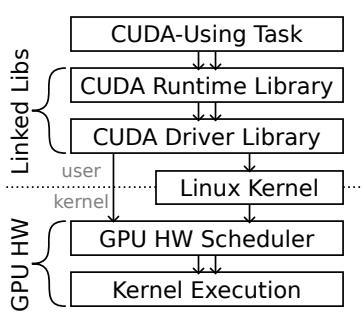
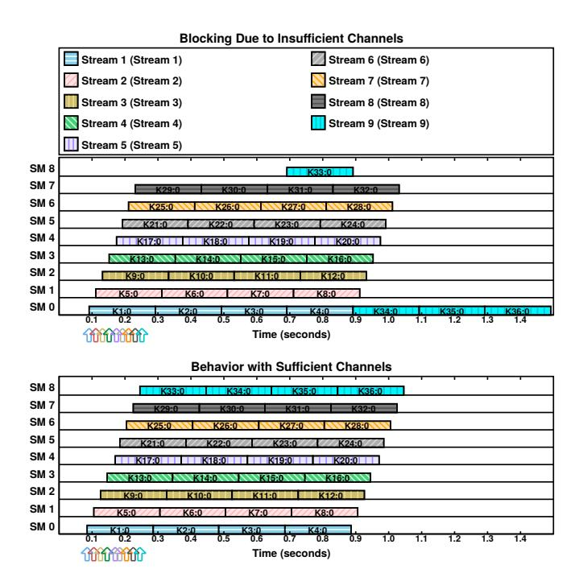
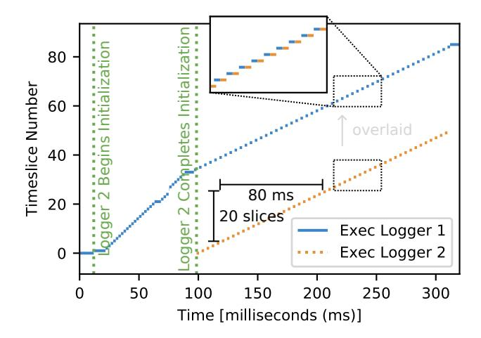

# Demystifying NVIDIA GPU Internals to Enable Reliable GPU Management\*

Joshua Bakita and James H. Anderson
Department of Computer Science, University of North Carolina at Chapel Hill
Email: {jbakita, anderson}@cs.unc.edu

Abstract—As GPU-dependent artificial intelligence and machine learning workloads increasingly come to embedded, safety-critical systems—such as self-driving cars—real-time predictability for GPU-using tasks becomes essential. This paper identifies flaws in three different real-time GPU management approaches that are largely the result of incomplete information about NVIDIA GPU internals. Details concerning this missing information are elucidated via experiments. Based on this information, key rules of GPU scheduling are identified and shown necessary for safe GPU management.

#### I. INTRODUCTION

Over the past decade, GPUs have enabled a revolution in artificial intelligence and machine learning (AI/ML) [1]. This revolution has led to ever-more-capable autonomous systems, including safety-critical systems such as self-driving cars. In order to deploy such safety-critical systems with GPUs, real-time predictability must be ensured. Canonically, this is done by bounding the *response times* of GPU-using tasks by applying real-time GPU *management* and *analysis* techniques.

Unfortunately, the response-time bounds provided by most real-time GPU management and analysis frameworks are unreliable. For each of three different approaches—mutual-exclusion-based management [2], preemption-based management [3], and management-free response-time analysis [4]—Fig. 1 illustrates a scenario in which each makes a false assumption about GPU behavior. In all cases, these false assumptions lead to the failure of analytical response-time bounds—a harbinger of catastrophe.

This paper is directed at elucidating the reasons for these failures. Through deep hardware investigation, we uncover that all these failures are due to overlooked rules of NVIDIA GPU scheduling. We experimentally frame and unveil the missing scheduling rules, as well as evaluate their necessity for safe GPU-management-and-analysis techniques.

**Prior work.** Understanding GPU scheduling rules has long been a known prerequisite for accurate GPU response-time analyses. All the works [2]–[4] mentioned in Fig. 1 come from groups with a strong history of elucidating and publishing GPU scheduling rules [5]–[8]. Our work broadens these efforts by providing heretofore hidden details concerning key GPU functionality.

\*Work supported by NSF grants CPS 2038960, CPS 2038855, CNS 2151829, and CPS 2333120.


<span id="page-0-0"></span>Fig. 1. Real-time GPU management and analysis techniques make dangerous assumptions about GPU behavior.

#### **Contributions.** In this work, for NVIDIA GPUs, we:

- 1) Experimentally derive rules of scheduling behavior that span from GPU library to on-engine-dispatch.
- Provide context to allow delineating current and prior scheduling rules as hardware- or software-enforced.
- 3) Build and open-source a tool—nvdebug—for directly examining GPU hardware scheduling state (bypassing user- and kernel-space libraries or drivers).
- 4) Demonstrate the necessity of our scheduling rules for real-time GPU management and response-time analysis.

**Organization.** We provide key terms in Sec. II, before more thoroughly discussing prior work in Sec. III. We then frame and present our experimentally-derived scheduling rules in Sec. IV and Sec. V. The necessity of these rules for real-time GPU management is evaluated in Sec. VI. We conclude in Sec. VII, and provide supplementary details about our new GPU-scheduling-examination tool in Appx. A.


<span id="page-1-1"></span>Fig. 2. Functional blocks of a recent NVIDIA discrete GPU.

### II. BACKGROUND

<span id="page-1-0"></span>We begin with a cursory overview of GPU architecture and programming paradigms. We focus exclusively on NVIDIA GPUs due to their commonality and industry-leading architecture.

GPU architecture. GPUs are often thought of and referred to as singular accelerators. This is a significant simplification. GPUs, since the very beginning, have been composed of many different functional units. On modern NVIDIA GPUs, these units are referred to as *engines*. Fig. [2](#page-1-1) illustrates the engines available on a recent NVIDIA GPU. The largest and most critical one is the Compute/Graphics Engine, which contains all the general-purpose processing cores. Five copy engines support this by asynchronously handling data movement between GPU DRAM, CPU DRAM, and other GPUs. Supplemental special-purpose engines include three video encode, one video decode, and one JPEG decode engine.

All engines are connected to GPU DRAM via the internal crossbar bus. This bus also connects to the PCIe lanes, allowing engines to optionally, but slowly, access CPU memory.

NVIDIA's embedded "Tegra" GPUs differ by sharing a die with the CPU and by replacing the GPU DRAMs with a bridge to a CPU-shared DRAM controller. For the purposes of this work, the internal topology and architecture of NVIDIA's embedded GPUs can otherwise be considered identicallypatterned as discrete GPUs from the same architectural family.

GPU programming model. Common GPU programming APIs include Vulkan, OpenCL, and CUDA. These are all supported by NVIDIA GPUs, and leverage the same underlying components. We focus on CUDA due to its simplicity and common use in real-time literature.

In Alg. [1,](#page-1-2) we illustrate a CUDA-using program that adds two vectors in parallel on the GPU. All of the shown operations are in respect to a single, implicit GPU virtual address space called a *context*, which is created per-GPUusing task.[1](#page-1-3) Lines [4](#page-1-2) and [6](#page-1-2) in our example transfer input to, and output from, the GPU context via a copy engine. Inbetween, Line [5](#page-1-2) launches the vector-add operation on the GPU's Compute/Graphics Engine; such operations are known as *kernels*. In processing this kernel, the GPU will invoke one instance of VECADD for each element of the vector. Given a sufficiently many-core GPU, the addition of each element will be calculated and completed simultaneously.

As the memory copies and kernel execution occur asynchronously relative to the CPU, most CPU time in this program will be spent implicitly waiting for the GPU engines to complete their operations. To ensure ordering of asynchronous GPU operations, CUDA implicitly creates and enqueues these in a CUDA *stream*, which enforces FIFO ordering. For calls that would explicitly result in a CPU-visible side effect, CUDA will implicitly block inside the call until all prior asynchronous operations complete. The call on Line [6](#page-1-2) in this example is one such case; it will block until both the kernel execution dispatched on Line [5,](#page-1-2) and the memory copy, complete.

<span id="page-1-3"></span><sup>1</sup>Multiple contexts per-task are possible, but discouraged [\[6\]](#page-10-6). We assume a one-to-one task-to-context mapping unless otherwise noted.

#### <span id="page-1-2"></span>Algorithm 1 Vector Addition in CUDA.

```
1: procedure MAIN
2: cudaMalloc(d_A, len) ▷ (i) Allocate GPU ("device") memory for arrays A (shown), B, and C (not shown)
3: . . . ▷ (ii) Allocate and load input data into arrays A and B (not shown)
4: cudaMemcpy(d_A, h_A, len) ▷ (iii) Copy data from CPU ("host") to GPU memory for arrays A (shown) and B (not shown)
5: vecAdd<<<numBlocks, threadsPerBlock>>>(d_A, d_B, d_C, len) ▷ (iv) Launch the "vecAdd" CUDA kernel on-GPU
6: cudaMemcpy(h_C, d_C, len) ▷ (v) Copy results from GPU to CPU memory for array C
7: cudaFree(d_A) ▷ (vi) Free GPU memory for arrays A (shown), B, and C (not shown)
8: . . . ▷ (vii) Output array C, an element-by-element sum of arrays A and B (not shown)
9: end procedure
10: kernel VECADD(A: ptr to int, B: ptr to int, C: ptr to int, len: int)
11: i := blockDim.x * blockIdx.x + threadIdx.x ▷ Calculate index based on built-in thread and block information
12: if i >= len then
13: return ▷ Exit thread if out of vector bounds
14: end if
15: C[i] := A[i] + B[i]
16: end kernel
```

For kernels enqueued in CUDA streams, scheduling behavior with respect to competing streams is difficult to analyze, as the path from task to GPU core is convoluted. After a kernel is launched into a stream, it is processed through two userspace libraries before reaching the GPU hardware (HW)



<span id="page-2-2"></span>Fig. 3. Path from launch to execution for a CUDA kernel.

scheduler. This scheduler makes the final determination about when, and on what part of the GPU, blocks of the kernel will be executed. We illustrate this process in Fig. [3.](#page-2-2) (Note that the userspace library can communicate directly with the GPU. This avoids the overhead of a system call, but also makes kernel launches challenging to monitor.)

#### III. RELATED WORK

<span id="page-2-0"></span>Researchers have investigated the temporal predictability of GPUs since early in their application towards general-purpose computation. Unfortunately, as GPU complexity rivals, if not exceeds, that of high-end CPUs, it has taken exceptionally long to answer even basic questions of GPU arbitration and scheduling. The extreme secrecy of GPU hardware has only exacerbated this problem.[2](#page-2-3) We only touch on particularly relevant works in this section; for more, see a recent, extensive survey of GPU use in safety-critical systems [\[12\]](#page-10-7).

To bypass the unknowns of GPU scheduling, a common approach involves minimizing its role. Two exemplars of this approach are TimeGraph [\[13\]](#page-10-8) and GPUSync [\[14\]](#page-10-9), which avoid unpredictable arbitration by only giving the GPU one piece of work at a time.

TimeGraph [\[13\]](#page-10-8) functions by queuing GPU work on the CPU, releasing one item at a time to the GPU in priority order. GPU-to-CPU interrupts are used to indicate the completion of each piece of work, triggering the selection and release of the next item. S <sup>3</sup>DNN [\[15\]](#page-10-10) is a more recent, special-purpose example of this approach, but with the added ability to release groups of GPU work, rather than just one item at a time.

GPUSync [\[14\]](#page-10-9) and extensions [\[2\]](#page-10-1) take a different approach to ensure mutual exclusion. To improve real-time analyzability, these works treat the GPU as a resource and require applications to hold a mutual-exclusion lock while using the GPU. This easier-to-implement approach has seen increasing adaptation in real-time systems, from TimeWall [\[16\]](#page-10-11), to NVIDIA's DRIVE OS System Task Manager.[3](#page-2-4) While this does ensure safety, it suffers from a capacity-loss problem; few applications are able to consistently fully utilize the GPU while holding the mutual-exclusion lock, resulting in lost capacity.

In search for a system that is easy to analyze and implement, but which avoids the capacity-loss problem of mutual exclu-


Fig. 4. High-level GPU cross-context scheduling pipeline.

<span id="page-2-5"></span>sion, many recent papers have worked to dissect the native scheduling capabilities of GPUs. Otterness *et al.* [\[17\]](#page-10-14), Amert *et al.* [\[5\]](#page-10-4), Olmedo *et al.* [\[7\]](#page-10-15), and Bakita and Anderson [\[8\]](#page-10-5) elucidated the arbitration and dispatch order of intra-context CUDA calls, while Otterness and Anderson have done similarly for AMD GPUs [\[18\]](#page-10-16), [\[19\]](#page-10-17).

More efficient management and analysis approaches have been built on these details. Examples span from granular locking (or reservations [\[20\]](#page-11-0)) based on hardware partitioning of compute [\[8\]](#page-10-5) and memory [\[21\]](#page-11-1), to preemptive EDF based on creative use of hardware capabilities [\[3\]](#page-10-2), to analysis for unmanaged GPU-using tasks [\[4\]](#page-10-3). Unfortunately, these works make inconsistent assumptions about NVIDIA GPU behavior.

For example, consider copy engine behavior. Capodieci *et al.* [\[3\]](#page-10-2) assume and manage copy engines as though they are coscheduled with compute, but Elliot *et al.* [\[2\]](#page-10-1), [\[14\]](#page-10-9) assume and manage copy engines as though they operate asynchronously of compute (and each other). Given these seemingly incompatible assumptions, how do we build a coherent model of GPU scheduling?

To reconcile this tension and build a model, we provide a framing of NVIDIA GPU hardware scheduling that subsumes and extends prior work, coupled with specific, experimentallyderived rules.

#### IV. HIGH-LEVEL FRAMING

<span id="page-2-1"></span>We begin our contributions with a high-level framing of NVIDIA GPU scheduling. We focus on the start of the pipeline: from command launch, through cross-context scheduling, to engine hand off. This complements prior work on the subsequent steps for the compute engine [\[7\]](#page-10-15), [\[8\]](#page-10-5).

The numbered steps in Fig. [4](#page-2-5) guide our explaination of the high-level flow. We forgo digressing into caveats; such lowlevel details are for the rules to come in Sec. [V.](#page-3-0)

Our information comes from a combination of open-source GPU drivers [\[22\]](#page-11-2)–[\[24\]](#page-11-3), NVIDIA patents [\[25\]](#page-11-4), our experiments in Sec. [V,](#page-3-0) and other sources.

① Scheduling initialization. Tasks initialize their scheduling state via the GPU kernel driver. This includes a *pushbuffer* (a

<span id="page-2-4"></span><span id="page-2-3"></span><sup>2</sup>For example, even NVIDIA GPU instruction encodings are secret [\[9\]](#page-10-12)–[\[11\]](#page-10-13). <sup>3</sup>See *Compute Graph and Constraints* in the *DRIVE OS System Task Manager SDK Reference* for more, version 5.10 as of writing.

TABLE I GPUS TESTED IN OUR EXPERIMENTS

<span id="page-3-3"></span>

| GPU Name      | Compute<br>Capability5 | Year | Architecture      |
|---------------|------------------------|------|-------------------|
| GTX 1060 3 GB | 6.1                    | 2016 | Pascal            |
| GTX 1080 Ti   | 6.1                    | 2017 | Pascal            |
| Jetson TX2    | 6.2                    | 2017 | Pascal (embedded) |
| Titan V       | 7.0                    | 2017 | Volta             |
| Jetson Xavier | 7.2                    | 2018 | Volta (embedded)  |
| RTX 2080 Ti   | 7.5                    | 2018 | Turing            |
| A100 40 GB    | 8.0                    | 2020 | Ampere            |
| Jetson Orin   | 8.7                    | 2022 | Ampere (embedded) |
| RTX 6000 Ada  | 8.9                    | 2022 | Ada Lovelace      |

queue detailed in [\[8\]](#page-10-5)), encapsulated with bookkeeping information as a *channel*. All a task's channels are encapsulated with context information into a *Time-Slice Group* (TSG). A TSG is made runnable via insertion into one of the GPU's *runlists* (detailed later), and a user-accessible pointer to the pushbuffer is passed to userspace.

- ② Commands to streams to channels. As GPU operations are requested, the associated commands are enqueued into streams, and these streams are mapped onto pushbuffers. Commands may consist of kernel launches, copy commands, and various other operations.[4](#page-3-2) If not explicitly using a stream, a default or implicit stream is constructed. As channel pushbuffers are mapped into user-writable memory, command enqueueing does not require a syscall.
- ③ Channels to runlists. Commands accumulate in pushbuffers until the GPU HW scheduler (also known as the "Host Interface") selects a channel for scheduling. Selection works in two levels: the GPU globally round-robin timeslices across tasks' TSGs, and all channels in the currently active TSG are cyclically scanned for pushbuffers with pending commands.
- ④ Runlists to engines. Once the GPU HW scheduler identifies a channel with pending commands, it leverages a hardware Pushbuffer DMA (PBDMA) unit to pull commands from CPU to GPU. From here, they are parsed and passed off for enginespecific scheduling (as detailed for the compute engine in prior work [\[8\]](#page-10-5)).

## V. LOW-LEVEL RULES

<span id="page-3-0"></span>We now provide rules for channel-, runlist-, and enginelevel scheduling (steps ②, ③, and ④ in the prior section) after an overview of our methodology and tooling.

## *A. Methodology and Tools*

We perform our experiments on x86\_64 and aarch64 Linux systems with a sampling of GPUs from the past seven years, as listed in Table [I.](#page-3-3) We guarantee that our rules hold for all these devices, even though we only show a sampling of the results. (We also test on some older GPUs, but find the differences too extensive for easy inclusion.)

For all our experiments, we disable background GPU work.[6](#page-3-4) For tools, we leverage cuda\_scheduling\_examiner by Otterness *et al.* [\[17\]](#page-10-14), and develop two new tool suites: nvdebug and gpu-microbench. [7](#page-3-5)

**nvdebug**. nvdebug is a kernel module that exposes an interface in /proc for transparently monitoring and controlling GPU scheduling state. That includes the capability to view internal GPU topology, such as the number and types of engines. Our tool mirrors open-source NVIDIA GPU kernel drivers [\[22\]](#page-11-2), [\[23\]](#page-11-5), [\[26\]](#page-11-6) in how it accesses GPU registers, enabling reliability across a wide range of GPUs and kernels (including Tegra platforms). For more details on this tool and its capabilities, see Appx. [A.](#page-9-1)

**gpu-microbench**. Utilizing the detailed information available from nvdebug, we built a library of microbenchmarks that intricately monitor or benchmark specific GPU engines. These carefully-targeted benchmarks allow for compositional experimentation on scheduling behavior. Two key tools in this suite are exec\_logger and copy\_monitor. These utilize the compute and copy engines respectively while recording at microsecond granularity when each engine is active. Many of the tools in this suite are the result of years of expert tuning and bug fixing, so please consider reusing them.

We now apply our tools to derive low-level rules of GPU scheduling behavior.

#### *B. Rules for Channels*

Channels (and their encapsulated pushbuffers) are closest to streams, thus closest to tasks, and therefore are a natural starting point for our rules.

R1. *Every GPU-engine-using op. goes through a channel.*

Without channels, no GPU-using operations are possible. We verify this by using nvdebug's disable\_channel interface to disable all channels associated with a task, and then attempt to launch kernels or copies via a variety of APIs. (Disabled channels are skipped by the GPU HW scheduler.[8](#page-3-6) ) We find that any type of kernel launch, copy launch, or devicemapped memory allocation is unable to complete until the channels are re-enabled.

<span id="page-3-7"></span>R2. *A task's number of channels limits intra-task parallelism.*

As all GPU-using operations require a channel, problems emerge for work enqueued while all channels are busy. Specifically, *false dependencies* will occur between work in unrelated streams. Normally, streams are supposed to be independent, with the head of each stream being equivalently accessible to the GPU HW scheduler for dispatch. When a false dependency emerges, the head of one stream becomes dependent on queued

<span id="page-3-2"></span><sup>4</sup>The GPU supports arbitrary commands via the "software" engine that interrupts into the kernel driver.

<span id="page-3-1"></span><sup>5</sup>Compute capability distinguishes variants within an architectural family.

<span id="page-3-4"></span><sup>6</sup>On the Jetson TX2, after disabling all background GPU-using tasks, some entries remained on the GPU runlist. We disabled these entries in the runlist using nvdebug to ensure no unexpected interference.

<span id="page-3-5"></span><sup>7</sup>Both available online at [https://www.cs.unc.edu/~jbakita/rtas24-ae/.](https://www.cs.unc.edu/~jbakita/rtas24-ae/)

<span id="page-3-6"></span><sup>8</sup> In [\[24\]](#page-11-3), [manuals/ampere/ga100/dev\\_pbdma.ref.txt,](https://nvidia.github.io/open-gpu-doc/manuals/ampere/ga100/dev_pbdma.ref.txt) line 3803.



<span id="page-4-2"></span>Fig. 5. Nine streams in-use on GTX 1060 3GB with eight compute channels (top) versus nine compute channels (bottom).

work in another stream to complete before it can be dispatched by the GPU. Such false dependencies can prevent kernels at the head of their stream queue from reaching idle GPU cores. By default, through at least CUDA 12.2 on x86\_64, only eight channels are created per-context for compute. This is as low as two-per-context on NVIDIA's embedded "Jetson" boards.

We experimentally demonstrate how a lack of channels triggers false dependencies and compromises parallelism in Fig. 5 (top). This figure presents a timeline of when and where blocks of 36 kernels execute on the GPU. We launch four kernels into each of nine streams. The kernel launch times are indicated by arrows at the bottom left for each stream, and each thread block is annotated with the kernel name and thread block index, separated by a colon. Streams are indicated by color/pattern. Note that, as launches into each stream complete from time 0 to 0.26 s, the head of each stream near-immediately begins executing on the GPU—up until Stream 9. At this point, a false dependency emerges. All eight compute channels are in-use, and so no channel is available for Stream 9. This condition persists until all work in Stream 1 is fully dispatched at time 0.7.

In Fig. 5 (bottom), we repeat the same experiment, but with an increased number of channels. 11 As expected, no false dependencies occur—all nine streams are executed concurrently.

**Implications for real-time systems.** Our findings add nuance to rule **G2** from the work of Amert *et al.* [5], which claims



<span id="page-4-6"></span>Fig. 6. Timeline of timeslice intervals for two instances of exec\_logger concurrently running on the GTX 1060 3GB. Inset collapses vertical space to show that each task executes in mutually exclusive intervals of time.

that the kernel at the head of a stream queue is enqueued for execution. Instead, the kernel at the head of a stream queue is enqueued for execution *only if the number of streams used is less than the number of channels*. Functionally, this means that no more than eight streams should be used, or the number of channels must be reconfigured (for prior rules to hold).

#### C. Rules for Runlists

For a channel, and its wrapped pushbuffer of commands, to be scheduled, it is normally inserted into a runlist (often via an optional TSG). Is this the only way?

<span id="page-4-8"></span>**R3.** To be scheduled, channels must be part of a runlist.

A runlist is a hard prerequisite to launching work from a channel. NVIDIA source code implies this. <sup>12</sup> We also observe this behavior using nvdebug to watch channel and runlist statuses—every enabled channel is associated with a runlist. How many of these channels may be active simultaneously?

<span id="page-4-7"></span>**R4.** A runlist may have up to one task active per associated engine. <sup>13</sup>

Before explaining this rule, we must explain what we mean by a task being active. For tasks using a TSG, this refers to the TSG being active. For tasks directly inserting channels on the runlist without a TSG, this refers to at least one of the task's channels being active.

For cases when only one engine is associated with a runlist (as we commonly find in Sec. V-D) the rule simplifies to: *each runlist has up to one task active*. We demonstrate this for compute, then copy tasks.

For compute, we co-run two exec\_logger tasks, and plot the execution intervals in Fig. 6. Logger 1 is started first,

<span id="page-4-0"></span><sup>&</sup>lt;sup>9</sup>Reported by nvdebug; also mentioned at https://forums.developer.nvidia.com/t/how-many-streams-maximum-number-of-streams/6571/6.

<span id="page-4-1"></span><sup>&</sup>lt;sup>10</sup>Observed as two on the Jetson Xavier with CUDA 10.2, and four on the Jetson Orin with CUDA 11.4. Double this number of channels are created, but CUDA appears to have a bug where only half are used on Jetson boards.

<span id="page-4-3"></span><sup>&</sup>lt;sup>11</sup>Via the environment variable CUDA\_DEVICE\_MAX\_CONNECTIONS.

<span id="page-4-5"></span><span id="page-4-4"></span><sup>&</sup>lt;sup>12</sup>In [22], src/common/sdk/nvidia/inc/ctrl/ctrla06f/ctrla06fgpfifo.h line 67.
<sup>13</sup>When using NVIDIA Multi-Process Service (MPS), **this does not apply**—it breaks our assumption that there is only one task per context. On GPUs since Volta, when MPS is enabled, each application runs as a *subcontext* of an MPS-created context. Our rules still likely apply if you consider all MPS-using tasks together as a single task, but we have not verified this.


<span id="page-5-0"></span>Fig. 7. Progress of two co-running copies in separate contexts over time on the GTX 1060 3GB.

and Logger 2 after Logger 1 is initialized. In this timeline, each consecutive execution—timeslice—of each application is plotted at a differing y-value to allow for more easily distinguishing the boundaries between intervals. Furthermore, the slope of this line thus indicates how rapidly timeslicing is happening. For example, in the right of the figure, each task is receiving approximately 20 timeslices per 80 ms. The slice lengths are largely consistent, at about 2 ms each.

First, observe the mutually-exclusive execution intervals (inset). Only one task executes instructions at any given time, despite each task requiring only a fraction of the GPU.

Second, note that Logger 1's execution is interrupted several times before Logger 2 completes initialization and launches its kernel (area between the vertical dashed lines). This indicates that initializing a CUDA context generates compute-engine interference; this lasts about 100 ms in our case.

Returning to justification for our rule, we now experiment with co-running copies via two instances of copy\_monitor. (This benchmark is carefully crafted to only utilize and monitor the copy engines; it launches no compute work.) We plot the progress of each copy over time in Fig. [7.](#page-5-0) The behavior here mirrors what we saw with compute tasks—only one copy progresses at a time, and the copies trade off about every 1 ms.

This demonstrates that individual uses of an engine are mutually-exclusive, but a further implication of our rule is that two tasks may co-run on a runlist, if they use different engines. We demonstrate this case as part of justification for our next rule.

