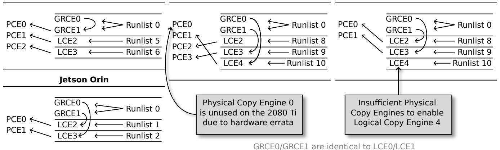

# VI. EVALUATION

We evaluate our rules in the context of three GPU management and analysis approaches: management-free analysis by Yang *et al.* [\[4\]](#page-10-3), preemptive EDF via runlist management by

Fig. 11. Interconnectedness between Runlists, Logical Copy Engines (LCEs), Graphics Copy Engines (GRCEs), and Physical Copy Engines (PCEs) for a variety of GPUs 2016–2022. Only PCEs can actually perform the copy. The GTX 1080 Ti configuration (not shown) is identical to the GTX 1060 3GB configuration (shown).

Capodieci *et al.* [3], and mutual-exclusion-based management by Elliott *et al.* [14].

Our goal in this section is to demonstrate that our rules are a prerequisite to safe GPU management. We cannot demonstrate that our rules are sufficient, but we can show that they are necessary. We do this by showing that prior approaches fail without the consideration of our rules.

#### A. Necessity for Management-Free Analysis [4]

Yang et al. [4] have developed response-time analysis for GPU-using directed-acyclic-graph (DAG) tasks, without requiring any GPU-management middleware. They substantially limit the programming and system model to simplify the analysis—a defensible choice, as they target OpenVX tasks for whom these limits are insignificant.

By **R2**, any GPU management approach should not use more streams than channels, or risk compromised parallelism and undefined behavior. In the work by Yang *et al.* [4], one stream is used per-job, and the total number of co-running jobs is not limited. If our rule is necessary, Yang *et al.*'s analysis should be compromised by ignoring our rule.

**Problematic assumptions.** In [4], jobs are restricted from launching more than one kernel. This allows for them to use a simplified derivative of the scheduling rules from Amert *et al.* [5] in their analysis. The simplified ruleset is as follows: (i) a kernel is enqueued on the EE queue when launched; (ii) a kernel at the head of the EE queue is dequeued from that queue once it becomes fully dispatched; and (iii) a block of the kernel at the head of the EE queue is eligible to be assigned if its resource requirements are met. "Fully dispatched" means that all blocks of the kernel have begun or completed execution; "EE queue" is a first-in-first-out (FIFO) queue whose behavior is defined by the above rules; and "resource requirements" are GPU cores and shared memory.

We now show that, as this ruleset ignores **R2**, it is incorrect. This requires defining some of the specific behavior that occurs when **R2** is violated before we can give our counter-example to the ruleset of Yang *et al.*.

#### Implications of our rules.

**Corollary 1.** A channel is not guaranteed to be available until the last kernel in the currently-active stream is fully dispatched.

In Fig. 5 we show that the last kernel must be at least partially dispatched before a channel is freed. In supplemental experiments, we add more blocks to the kernels and observe that all blocks must be dispatched before a channel is reliably freed.

**Corollary 2.** Streams waiting for channels are not assigned channels in FIFO order.

We repeat the experiment of Fig. 5 with ten streams and a longer K3, finding that Stream 10 is assigned a channel before Stream 9—even though kernels are launched in Stream 9 before Stream 10.

**Counter-example.** Consider 10 different GPU jobs which release in order, each consisting of a single large kernel launched in a single-use CUDA stream.

Under the ruleset of Yang *et al.*, by rule (i) they are all immediately put on the EE queue by order of arrival, and per (ii) and (iii) they are progressively dequeued and executed on the GPU in FIFO order as resources become available.

Under our rules, the ordering can be different. The first 8 streams and their kernels will be assigned channels and executed, but kernels 9 and 10 will have to wait until a channel is freed, per Corollary 1. Once one of the first 8 kernels is fully dispatched and its channel becomes free, that channel may be assigned to either kernel 9 or kernel 10 per Corollary 2—this is the key point where a problem emerges. If kernel 10 is assigned a channel first, it will execute before kernel 9, resulting in a non-FIFO order of execution.

In Yang *et al.*, the response-time bound (Theorem 3) for a job omits consideration of all jobs released after that job, dependent on GPU kernels being dequeued in FIFO order. Our above counter-example shows that later-released kernels may cut-ahead, adding unaccounted-for delays, breaking the

response-time bound proof of [\[4\]](#page-10-3). If [R2](#page-3-7) were taken into account, and fewer streams used than channels, this problem would have been avoided.

