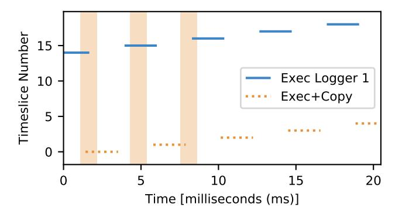
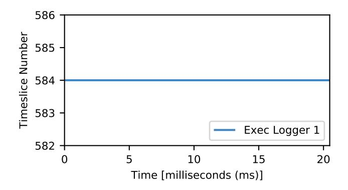
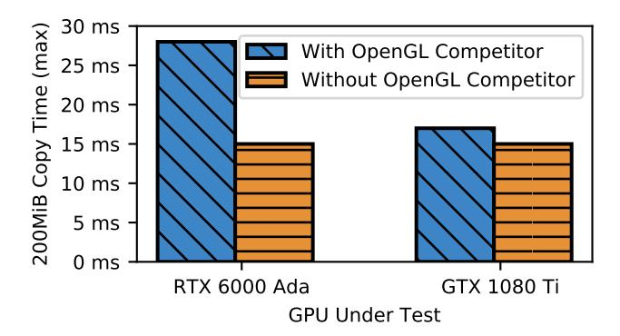

# R5. *A GPU's number of runlists limits independent inter-task parallelism*

In justifying this rule, we show two sub-rules: (i) that runlists enable independent inter-task parallelism; (ii) that independent inter-task parallelism is not possible without multiple runlists. By "independent inter-task parallelism" we mean that the active task on a runlist is only a function of other tasks on the same runlist using the same engine, and is unrelated to tasks active (or inactive) on any other runlist.

We begin with two experiments for subrule (i). Using nvdebug, we determine that our GTX 1060 3 GB has separate runlists for compute and copy tasks. We investigate their independence by co-running exec\_logger and

(a) Compute intervals.

Fig. 8. Times when copy and compute operations complete for four tasks compute-only, exec+copy, copy-only, and copy-only—on the GTX 1080 Ti (similar results on RTX 6000 Ada). Initialization omitted. Shaded regions indicate times exec+copy task is making copy progress.

copy\_monitor instances. We find that these tasks execute continuously, unhindered by one another, confirming that the two runlists operate at least somewhat independently.[14](#page-5-1)

Does this independence persist if a copy-and-computeusing task is added? We tested this by running such a task alongside an instance of exec\_logger and two instances of copy\_monitor. If runlists are scheduled independently, our copy-and-compute-using task may use the compute and copy engines at unsynchronized times. This is exactly what occurs, as shown in Fig. [8.](#page-5-2) These figures are formatted similarly to past figures and show identical time periods. We add shaded regions to both figures for the intervals during which the copyand-compute task makes copy progress.

Note how the copy-and-compute task executes on the compute cores (Fig. [8a\)](#page-5-3) at times unrelated to when copies progress (Fig. [8b\)](#page-5-4). Consider its second shaded copy interval; during its entirety a completely unrelated task—the exec\_logger executes on the compute cores. This supports our first experiment by demonstrating that runlists operate independently, even in complex scenarios.

We now justify sub-rule (ii): that independent inter-

14With the exception that compute is still hindered during context initialization (as in Fig. [6\)](#page-4-6); curiously, it is also briefly interrupted when copy\_monitor does large, GPU-device-mapped memory allocations.

(a) Compute interval (continues uninterrupted during copy).

Fig. 9. Times when copy and compute operations complete for two corunning tasks—exec\_logger and copy\_monitor—on the Jetson TX2. Initialization omitted. Shaded regions indicate times copy\_monitor is making progress, and are 1049 µs wide, whereas the gaps are 1024 µs wide.

task parallelism is not possible without multiple runlists. Using nvdebug, we identify that the Jetson TX2 contains two engines that share a single runlist. We demonstrate non-independence by co-running exec\_logger and copy\_monitor, and plot the results in Fig. [9.](#page-6-1)

Compute work appears to run continuously (Fig. [9a\)](#page-6-2), but copies appear timesliced (Fig. [9b\)](#page-6-3)—even though exec\_logger does not execute copies. At first, we suspected experimental error or a missed background task as to blame for the unusual copy engine interference, but after extensive experimentation, we verified that the TX2's single runlist is to fault for this strange interference.

Key to this conclusion is a subtle difference: 1024 µs for a timeslice on compute-associated channels, versus 1049 µs for copy-exclusive channels [\[26\]](#page-11-6). We discover that the time that our copy is interrupted for is *not* the time required to run another copy, but the time for a compute timeslice. Why then is compute not interrupted while the copy runs (shaded in Fig. [9\)](#page-6-1)? Based on how the GPU is documented to handle semaphores,[15](#page-6-4) the runlist scheduling system must snoop each runlist independently of the currently-running task, preempt only once the next channel has been identified, and only pre-

TABLE II ENGINES ON GTX 1060 3GB

| Engine Name                           | Runlist   |
|---------------------------------------|-----------|
| Graphics/Compute 0                    |           |
| [Graphics] Copy Engine 0 (GRCE0/LCE0) | Runlist 0 |
| [Graphics] Copy Engine 1 (GRCE1/LCE1) |           |
| Video Decoder 0 (NVDEC0)              | Runlist 1 |
| Video Encoder 0 (NVENC0)              | Runlist 2 |
| Sequencer                             | Runlist 3 |
| N/A                                   | Runlist 4 |
| Copy Engine 2 (LCE2)                  | Runlist 5 |
| Copy Engine 3 (LCE3)                  | Runlist 6 |
|                                       |           |

TABLE III ENGINES ON JETSON ORIN

| Engine Name                           | Runlist   |
|---------------------------------------|-----------|
| Graphics/Compute 0                    |           |
| [Graphics] Copy Engine 0 (GRCE0/LCE0) | Runlist 0 |
| [Graphics] Copy Engine 1 (GRCE1/LCE1) |           |
| Copy Engine 2 (LCE2)                  | Runlist 1 |
| Copy Engine 3 (LCE3)                  | Runlist 2 |
| Graphics/Compute 1                    | Runlist 2 |

empt the engines needed by the next channel. Whereas copyexclusive channels never need the compute engine, computeassociated channels may optionally include copy commands. This appears to cause copy engines that share a runlist with compute tasks to be timesliced across both compute- and copy-using tasks.[16](#page-6-5) This demonstrates that when tasks share a runlist, they are at best semi-independent—fully independent scheduling requires multiple runlists.

Note that, by demonstrating two tasks simultaneously active on a single runlist, this experiment also supports [R4](#page-4-7).

Implications for real-time systems. Our findings both challenge and support assumptions made for prior real-time management systems. Works that claim and manage only a single runlist [\[3\]](#page-10-2) risk overlooking significant interference channels from unmanaged access to other GPU engines via other runlists. Furthermore, prior per-engine-granularity locking approaches [\[2\]](#page-10-1) appear risky if multiple engines share a runlist. On the other hand, such locking techniques seem safe in circumstances where there are at least as many runlists as engines, but is this a common configuration?

#### *D. Rules for Runlist to Engine Mappings*

In the previous section, we noted that the number of engines associated with a runlist is core to runlist behavior ([R4](#page-4-7)). We now explore and give rules for how runlists map to engines.

## R6. *A runlist may be bound to more than one engine.*

As evidenced by the experiments supporting [R5](#page-5-5), a single runlist can serve multiple engines. This configuration is not

16For those familiar with NVIDIA's terminology, our specific understanding is that the PBDMA units (desc. in [\[8\]](#page-10-5)) each snoop different *runqueues* in the runlist, where each channel is associated with one or more different runqueues. Each runqueue is restricted in the types of commands it may run. While compute-associated channels may optionally use the copy runqueue, copyexclusive channels only use the copy runqueue. The result is round-robin arbitration among all runqueue-using channels, for each runqueue in a runlist.

15Obliquely documented in [\[24\]](#page-11-3), [manuals/ampere/ga100/dev\\_pbdma.ref.txt,](https://nvidia.github.io/open-gpu-doc/manuals/ampere/ga100/dev_pbdma.ref.txt) section "Semaphore switch option" (line 3797).

TABLE IV ENGINES ON RTX 6000 ADA

| Engine Name                           | Runlist    |
|---------------------------------------|------------|
| Graphics/Compute 0                    |            |
| [Graphics] Copy Engine 0 (GRCE0/LCE0) | Runlist 0  |
| [Graphics] Copy Engine 1 (GRCE1/LCE1) |            |
| Copy Engine 2 (LCE2)                  | Runlist 1  |
| Copy Engine 3 (LCE3)                  | Runlist 2  |
| Copy Engine 4 (LCE4)                  | Runlist 3  |
| Video Decoder 0 (NVDEC0)              | Runlist 4  |
| Video Decoder 1 (NVDEC1)              | Runlist 5  |
| Video Decoder 2 (NVDEC2)              | Runlist 6  |
| N/A                                   | Runlist 7  |
| Video Encoder 0 (NVENC0)              | Runlist 8  |
| Video Encoder 1 (NVENC1)              | Runlist 9  |
| Video Encoder 2 (NVENC2)              | Runlist 10 |
| JPEG Decoder 0 (NVJPG0)               | Runlist 11 |
| JPEG Decoder 1 (NVJPG1)               | Runlist 12 |
| JPEG Decoder 2 (NVJPG2)               | Runlist 13 |
| JPEG Decoder 3 (NVJPG3)               | Runlist 14 |
| Optical Flow Accelerator              | Runlist 15 |
| Sequencer                             | Runlist 16 |
|                                       |            |

unique to the TX2. All NVIDIA GPUs we have experimented with have a runlist supporting both compute and copy operations. Despite this, we have not observed the TX2's problematic behavior on other GPUs—we suspect this is because CUDA always prefers to use the commonly-available copy-only runlists instead.

[R6](#page-6-6) follows from the experiments supporting [R5](#page-5-5), but we further support it with GPU topology data provided by nvdebug's device\_info interface. We include the experimentally-extracted information for a sampling of GPUs in Table [II,](#page-6-7) Table [III,](#page-6-8) and Table [IV.](#page-7-1) Each row corresponds to a single runlist (right) with all associated engines (left). Copy engines are numbered sequentially by the hardware, even though the first two have special graphics-related capabilities and are also known as GRCEs.

All runlists adhere to [R6](#page-6-6), and—with the exception of Runlist 0—every runlist is associated with only one engine. This results in many runlists on modern GPUs such as the RTX 6000 Ada—a significant opportunity for parallelism. Building off the patterns presented in the tables, we draw a further conclusion about how engines are configured.

#### R7. *Each engine is bound to only one runlist.*

Note how no engine names are repeated in any of the tables—this is a hardware restriction. The device topology (PTOP) registers used by nvdebug's device\_info interface map each engine to one runlist. Without nvdebug, this rule is very difficult to derive, as it is not always experimentally evident—we explain why in our next rule.

R8. *Copy engines may appear to violate [R7](#page-7-2) due to copyengine-specific shared hardware.*

An obscure layer of indirection can compromise scheduling independence for copy engines. We demonstrate this via the experiment plotted in Fig. [10.](#page-7-3) In this figure, we plot how long a repeating GPU-to-CPU CUDA copy takes on two

Fig. 10. OpenGL texture uploads can block CUDA copies *in the opposite direction*, even if channels, runlists, and LCEs are mutually exclusive.

GPUs in two circumstances: alone, and co-run with a textureuploading OpenGL task. On paper, these two systems should behave identically: CUDA reports the same number of copy engines for both, nvdebug shows that both have at least two copy engines with independent runlists, and both act similarly when executing only CUDA tasks. If anything, the six-year-newer (and 24× more expensive) RTX 6000 Ada should perform better—but this is not the case. While our OpenGL task is executing, we observe copies to the GPU slowed approximately 2× on the RTX 6000 Ada, but barely slowed (perhaps by DRAM interference) on the GTX 1080 Ti.

Up to this point in the paper, "copy engines" have been synonymous with NVIDIA's Logical Copy Engines (LCEs). Unfortunately, LCEs are not sufficient to execute a copy operation; they rely on a lower-level unit, the Physical Copy Engines (PCEs) [\[27\]](#page-11-7)—this is where we find an explanation for the surprising result in Fig. [10.](#page-7-3)

A set of GPU registers controls how LCEs map to PCEs. We extract and plot these seemingly-constant mappings for a selection of GPUs in Fig. [11.](#page-8-0) The register structure restricts copy configurations in two ways: (i) each PCE may be associated with up to one LCE or GRCE; and (ii) only GRCEs may share a PCE associated with another GRCE or LCE. When PCE sharing is utilized for GRCEs, copies from Runlist 0 can interfere with copies in other runlists—this is exactly what we see happening in Fig. [10.](#page-7-3) As shown in Fig. [11,](#page-8-0) the default copy engine configuration for the RTX 6000 Ada maps both GRCEs onto LCEs. From our experiments, we surmise that whichever GRCE handles texture uploads has been mapped onto the LCE that handles GPU-to-CPU CUDA copies.

Implications for real-time systems. Generally, scheduling for each GPU engine is fully independent—only the GRCEs compromise isolation for any engine. This strongly supports a per-engine locking approach, but not k-exclusion locking one copy engine may not at all be like another, depending on GRCE and PCE configuration.

