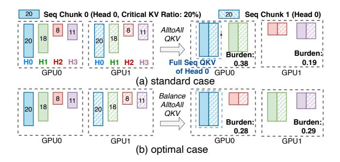

# **6.2 Optimizing Sparse Attention with Query Grouping**

Suboptimal sparse attention kernel performance. Implementing sparse attention naively where each query relies on distinct critical KV pairs yields limited speedups (about 1.4×; see Figure 12), primarily due to uncoalesced memory access patterns and diminished hardware utilization (e.g., underusing tensor cores). Since each query can fetch disjoint KV entries, data reuse decreases dramatically, hindering parallel efficiency and overall performance gains.

**Query grouping.** As indicated by Obs.5 in §3, adjacent queries within the 3D spatial-temporal domain often share a large fraction of critical KV pairs. We capitalize on this property by clustering nearby queries into groups based on their proximity in 3D cubes (e.g., 2×2×2 or 2×4×4 voxels), enabling the reuse of KV pairs across queries in the same group. We further apply an adaptive grouping mechanism that profiles the input video scenes to keep the overlap ratio high (e.g., above 80%) despite variations across different datasets. Within each group, a single proxy query determines the shared critical KV pairs, reducing both the estimation overhead and memory traffic.

### 6.3 Performance Impact

With these optimizations, we implement the kernel design illustrated in Figure 12 and achieve the targeted speedup.

Figure 13: An example shows load imbalance in HCP with four attention heads in a sparse setting. The full video sequence is split into two chunks each hold by a GPU. The length of each chunk represents its critical KV ratio and computational burden in different head.

By fusing matrix multiplication and top-K selection, we substantially cut down memory usage and alleviate the top-K bottleneck, while query grouping improves data locality and ensures effective sparse attention computation. Together, these measures address the core practical challenges and unlock the computational advantages of sparsity.

## 7 Hybrid Sparsity-Aware Context Parallelism

Sparse attention workloads introduce unique challenges for context parallelism (CP), where traditional CP paradigms fail to capture the computation-communication trade-offs arising from heterogeneous sparsity. In this section, we analyze two distinct CP paradigms in sparse settings to understand their strengths, limitations, and trade-offs. Building on these insights, we propose a hybrid sparsity-aware CP paradigm that dynamically adapts to varying sparsity levels, achieving an optimal balance between computation and communication.

