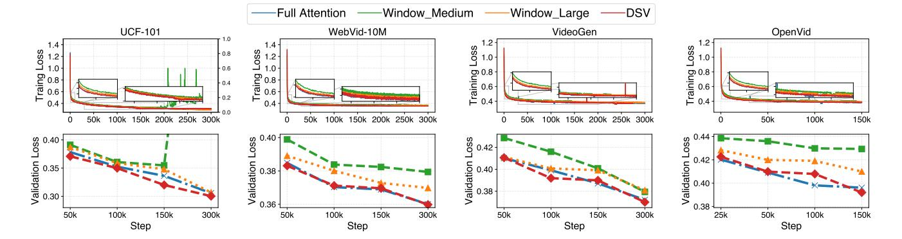
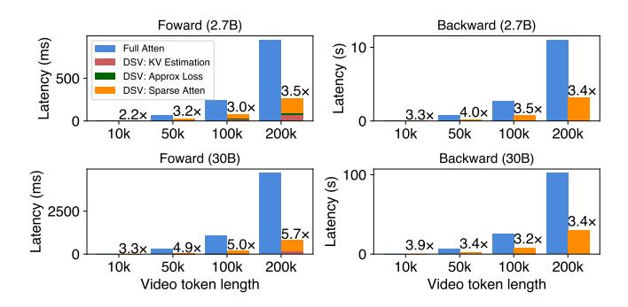

# 7.1 Modeling for Different Context Parallelism with Sparsity

We first model and analyze two CP paradigms in sparse attention workloads to evaluate their computation, communication, and memory characteristics. In these analyses, we consider N GPUs, where each GPU initially processes a partial sequence and holds the corresponding Q, K, and V matrices with a shape of [H, S/N, D], representing the number of attention heads, sequence length, and head dimension, respectively.

7.1.1 **Head-wise Context Parallelism with Sparsity.** HCP redistributes the computation workload through all-to-all operations. After that, each GPU transitions from handling a sequence partition for all attention heads to processing

the complete sequence with a subset of heads. The heterogeneous sparsity levels across attention heads introduce an additional dimension to HCP, requiring careful consideration.

Computation efficiency and load imbalance. Due to the head-wise split for attention computation in HCP and the observed attention sparsity heterogeneity, the computational burden may differ across devices after standard redistribution, as illustrated in Figure 13. In this figure, the attention heads are placed across devices according to their index. The naive allocation would cause an evident straggler in GPU0, which would delay the end-to-end time by 35.7% compared to the optimal case. This reveals the need for a more careful head-wise burden allocation across different GPUs given the sparsity heterogeneity. To decide the optimal head allocation (i.e. the balance alltoall operation), an optimization problem could be formulated to minimize the maximum computational burden after allocation, which can be solved using optimization techniques or heuristic approaches like Longest Processing Time [22].

Near constant communication volume. In sparse HCP, balanced QKV allocation could be performed to balance the computation workload. Consequently, the communication cost may deviate from that of full attention, as each GPU's allocated heads would incur different communication costs. Let  $H_i^r$  denote the final allocated number of heads for a GPU. The communication involves four balanced all-to-all operations for each GPU, and its cost is given by:

$$comm_i^{hcp} = 4 \cdot H_i^r \cdot S/N \cdot (N-1)/N \cdot D.$$

This cost remains nearly constant with increasing device scale, making HCP communication robust to sparsity patterns.

**Near constant memory consumption.** Similar to communication, the memory consumption for QKV of each GPU could slightly differ due to the potential uneven head allocation. It is given by:

$$mem_i^{hcp} = 4 \cdot H_i^r \cdot S/N \cdot D.$$

7.1.2 Sequence-wise Context Parallelism with Sparsity. Unlike HCP, SCP does not reallocate the computation burden. Instead, it computes the attention output for the locally held query with the local KV and additional KV gathered from other GPUs in the CP group.

Constant load balance. In SCP, each GPU holds a portion of the total sequence but spans the entire set of attention heads. By fetching the required KV from other GPUs to perform attention computation, the heterogeneity in headwise sparsity does not induce computational load imbalances across GPUs, ensuring a consistently even distribution of workload.

Figure 14: An example shows redundant communication of SCP in the same setting as in Figure 13. The width of each chunk represents the held KV size for that chunk. For simplicity, only GPU 0 is shown here after the KV gathering; GPU 1 should have a similar situation.

**Dynamic communication volume.** In SCP, each GPU must gather the non-local critical KV from other devices to perform sparse attention. The communication volume is determined by the sparsity ratio  $\alpha$  and the proportion of critical KV residing on remote devices, denoted as  $\sigma$ . The communication cost can be expressed as:

$$comm_i^{scp} = 2 \cdot H \cdot (1 - \alpha) \cdot \sigma \cdot S \cdot D.$$

**Dynamic memory consumption.** The memory consumption for additional non-local critical KV varies with the sparsity ratio  $\alpha$  and remote critical KV ratio  $\sigma$  as well. It can be expressed as:

$$mem_i^{scp} = 2 \cdot H \cdot (1-\alpha) \cdot \sigma \cdot S \cdot D.$$

## 7.2 Hybrid Sparse Context Parallelism

The analysis of HCP and SCP reveals their complementary strengths and limitations in sparse settings. HCP ensures near-constant communication and memory overhead but suffers from load imbalances due to head-wise sparsity heterogeneity, necessitating workload reallocation. Conversely, SCP balances computation across GPUs while incurring dynamic communication and memory costs based on the sparsity ratio and critical KV distribution.

Moreover, HCP and SCP can be naturally combined, with HCP redistributing workloads across attention heads and SCP further dividing workloads across sequences within an HCP group. By flexibly partitioning workloads along both dimensions, this combination promises to achieve optimal computation and communication balance under diverse sparsity patterns. These insights highlight the need for a comprehensive, sparsity-aware approach that carefully considers both computation and communication costs to minimize end-to-end execution time and strike a balanced trade-off.

**Problem formulation.** Based on the above insights, we formulate the problem as follows:

$$\mathbf{minimize} \max_{i} \{T_{i}^{comm}(G_{hcp},G_{scp}) + T_{i}^{comp}(G_{hcp},G_{scp})\},$$

s.t. 
$$mem_i \le M, \ \forall i \in \{G_{hcp} \cup G_{scp}\},$$
 (a)

$$1 \le |G_{hcp}|, \ 1 \le |G_{scp}| \le H, \ |G_{hcp}| \cdot |G_{scp}| = N.$$
 (b)

The objective is to minimize the maximum wall time for any GPU in a CP group under a given GPU allocation. Constraint (a) ensures that memory does not overflow under a given training setting, while constraint (b) limits the different group sizes, where the HCP group size is limited by the model's head number, and the product of HCP and SCP group sizes should equal the GPU number for the CP group. We fit the expected computation time for a sparse attention operation with different input lengths and sparsity levels and the communication time with varying communication sizes under different inter-GPU bandwidths. Given the limited search space (determined by the number of CP group sizes) and the stable sparsity patterns over training intervals, the optimization can be periodically solved using tools like Gurobi [4].

When deploying the hybrid CP strategy on a GPU cluster, we prioritize HCP groups within a server node to maximize the efficiency of all-to-all communication, which has higher constant traffic demands. SCP, with its selective sparse KV gathering, is less communication-intensive and better suited for inter-node communication over slower links.

### 8 Implementation

We implement DSV on top of PyTorch's FSDP framework, extending it with tensor and context parallelism. Kernels are developed in Triton [10] for sparse attention and CUDA [2] for critical KV estimation.

**Seamless integration.** DSV provides a non-invasive module that seamlessly integrates into any training framework and DiT model. All tasks of DSV are conducted transparently, requiring only the replacement of the attention API in the original models. DSV's trainable parameters are decoupled from the main model, ensuring replication across devices regardless of the model's parallelism setting, and their computation and gradient synchronization are manually managed.

Asynchronous CPU offloading for large KV indices. For long video tokens and relatively low sparsity ratios, sparse computation can generate large KV index tensors (e.g., approximately 2GB for a 50K video token length at 80% sparsity). To mitigate GPU memory limitations, we employ asynchronous CPU offloading to transfer the KV index after attention computation and pre-fetch it during the backward pass of its next block, if necessary.

| Model | #Layer | #Head | Head size | Activation       | Norm Type          |
|-------|--------|-------|-----------|------------------|--------------------|
| 0.8B  | 28     | 12    | 96        | GeGLU            | AdaLayerNormSingle |
| 2.7B  | 32     | 16    | 128       | GeGLU            | AdaLayerNormSingle |
| 30B   | 42     | 24    | 256       | GeLU-approximate | AdaLayerNormSingle |

Table 1: The configuration of evaluated models.

Estimation kernel. We perform matrix multiplication on CUDA cores rather than tensor cores due to its memory-bound 'slim' shape. Unlike standard tiling in matrix multiplication, each Streaming Multiprocessor (SM) conducts the multiplication for multiple full rows and selects the top-K indices online by Bitonic Select. However, large top-K sizes (e.g. 20K per query) can burden the SM's shared memory and reduce parallelism. To address this, we split the process into two stages: first, we perform multiplication and determine the top-K threshold for each query; second, we select indices based on the threshold.

#### 9 Evaluation

**Setup.** We conduct evaluations on servers with 8 NVIDIA H100 GPUs, interconnected via 900 GB/s NVLink bi-directional links. For cross-node communication, we use InfiniBand with RoCE, providing 200 Gbps bandwidth per cross-node GPU pair. We employ BF16 for computation and FP32 for gradient communication and distributed optimizer updates.

**Datasets.** We use four video generation datasets: UCF-101 [41], Webvid-10M [14], VideoGen [43], and OpenVid [36]. UCF-101 and Webvid-10M are popular and widely-adopted datasets in various video generation tasks. VideoGen and OpenVid are recently released datasets featuring high-definition video quality and more precise and fine-grained text descriptions. Models. The models' configuration is lised in Table 1. Their architectures are similar to Meta MoiveGen [39], consist of DiT blocks with 3D full self-attention and cross-attention modules, akin to other SOTA models [5, 6, 39]. We use the VAE [12] from stability-ai for video compression, reducing spatial resolution by 8×8. The CLIP text encoder [1] is utilized for UCF-101 and WebVid-10M datasets, while the T5-xxl text encoder [13] is used for VideoGen and OpenVid datasets. The models are trained using the Adam optimizer with a learning rate of 1e-4. Gradient checkpointing [17] is enabled by default. Flow matching [32] is employed as the generative modeling paradigm due to its advanced performance and widely adoption in recent SOTA models [5, 9, 39].

**Baselines.** We compare DSV with the following baselines, mainly differing in the attention computation mode:

- Vanilla 3D full attention. It adopts the naive 3D full attention (FA) computation mode, with the implementation based on FlashAttention-2 [3, 18].
- 3D window-based sparse attention. It employs a widely used heuristic sparse pattern in video models, where each

query attends only to KV pairs within a 3D window centered on itself. To evaluate its impact, we explore two different window sizes: Window-Attention Medium (WA-M), which uses a window equal to 1/3 of the original size, and Window-Attention Large (WA-L), which expands the window to 2/3 of the original size.

For context parallelism, we prioritize head-wise context parallelism for the baselines due to its consistently better performance in our testbed. However, if the CP degree exceeds the head size, a combination of head-wise and sequence-wise CP is employed.

**Metrics.** We evaluate DSV on both model quality metrics and system efficiency metrics.

- Quality metrics: We compare training and validation loss to assess convergence and model capability, as the loss in the flow matching paradigm effectively indicates model improvement [39]. For generated videos, we measure quality using Frechet Video Distance (FVD)[44], which quantifies the difference between generated and original videos. Additionally, we utilize VBench[26], a video generation benchmark, to evaluate quality and consistency through advanced model-based methods, as FVD alone may not fully capture model progression [39].
- System efficiency metrics: We primarily focus on training throughput and latency speedup for kernels or inference process.

### 9.1 Overall Performance on Model Quality

We evaluate the training convergence and model quality of DSV against other baselines under varying configurations. Specifically, UCF-101 and WebVid-10M are trained using an 0.8B model with a latent input size of 16×16×16 (4k length), whereas VideoGen and OpenVid utilize 2.7B models with latent input sizes of 32×32×32 (32k length) and 40×56×56 (125k length), respectively. And all the video token length here are the total length of the latent input size.

Training and validation loss comparison. Figure 15 compares the training and validation loss trends across different attention mechanisms on multiple datasets, highlighting DSV's superior performance. Using flow matching as the training loss provides a direct reflection of the model's capability and training progress, as noted in [39]. DSV exhibits faster convergence and achieves lower final loss values compared to WA-M and WA-L, while remaining comparable to the full attention paradigm across all datasets and models. Notably, WA-M paradigms fail to converge on certain datasets as training progresses.

Moreover, for validation loss, DSV also closely matches full attention while outperforming both window-based methods. **Performance across different datasets and tasks.** Table 2 presents the video generation quality of DSV compared to

Figure 15: Comparison of training loss and validation loss throughout the training process for different methods across four datasets.

|             |        | Quality |                |                  |  |
|-------------|--------|---------|----------------|------------------|--|
| Dataset     | Method | FVD↓    | Quality Score↑ | Semantic Score ↑ |  |
|             | WA-M   | 700.98  | 69.18%         | 55.03%           |  |
| UCF-101     | WA-L   | 520.92  | 70.70%         | 55.84%           |  |
| UCF-101     | FA     | 440.32  | 71.00%         | 56.23%           |  |
|             | DSV    | 438.02  | 71.08%         | 56.60%           |  |
|             | WA-M   | 580.12  | 71.10%         | 40.10%           |  |
| WebVid-10M  | WA-L   | 530.38  | 73.23%         | 40.56%           |  |
| webvia-iowi | FA     | 409.24  | 73.79%         | 42.56%           |  |
|             | DSV    | 414.56  | 73.66%         | 42.88%           |  |
|             | WA-M   | 1395.23 | 77.33%         | 53.08%           |  |
| VideoGen    | WA-L   | 1100.72 | 78.82%         | 53.32%           |  |
| videoGen    | FA     | 908.91  | 79.39%         | 55.34%           |  |
|             | DSV    | 834.32  | 79.14%         | 54.99%           |  |
|             | WA-M   | 884.15  | 78.78%         | 55.98%           |  |
| OnenVid     | WA-L   | 826.43  | 79.47%         | 56.51%           |  |
| OpenVid     | FA     | 838.52  | 79.54%         | 56.07%           |  |
|             | DSV    | 782.22  | 79.63%         | 56.36%           |  |

Table 2: Comparison of model quality metrics across different methods on four datasets. The FVD score metric is averaged over five runs, while the Semantic and Quality scores are obtained from VBench [26]. WA-M, WA-L, and FA denote Window Attention Medium, Window Attention Large, and Full Attention, respectively.

WA-M, WA-L, and FA across various datasets and evaluation metrics. In terms of FVD, DSV consistently achieves the lowest values or performs comparably to FA, indicating its ability to generate videos that closely resemble the ground truth (FA). In contrast, WA-M consistently exhibits poor performance. Similarly, for semantic and quality scores in VBench, DSV continues to demonstrate superior performance.

### 9.2 System Efficiency of DSV

Here, we evaluate the system efficiency of DSV, primarily comparing it with 3D FA and WA-L. We exclude WA-M from our comparisons due to its consistently poor performance relative to others.

9.2.1 Training. In distributed training, DSV exhibits a significant advantage over both vanilla 3D FA and WA in terms of training throughput and total training time. The vanilla 3D FA baseline suffers from high computational overhead due to its quadratic complexity in both spatial and temporal dimensions, leading to slower per-step throughput. While WA mitigates some of this overhead by restricting attention to a fixed local window for each query, it only achieves a fixed sparsity ratio (around 70% for WA-L) and cannot effectively identify critical KV pairs.

In contrast, DSV dynamically adjusts the sparsity pattern across different attention heads based on learned structures, achieving up to 98% sparsity in certain heads. Furthermore, it leverages optimized parallelism strategies designed for sparse attention workloads, reducing communication overhead and enhancing computational efficiency.

As a result, DSV outperforms FA by  $2.73-3.02\times$  and WA by  $1.51-1.71\times$  in training throughput on 32 GPUs (CP=4, DP=8) with input token lengths of up to 130K. Similarly, on 64 GPUs (CP=8, DP=8) with token lengths of up to 260K, DSV achieves a  $2.41-2.93\times$  speedup over FA and a  $1.34-1.62\times$  speedup over WA.

9.2.2 Inference. DSV benefits from the learned sparsity acquired during training, significantly enhancing inference efficiency. While vanilla 3D FA remains computationally expensive due to its full spatial-temporal token interactions, WA-L provides a limited speedup due to its fixed sparsity pattern. In contrast, DSV dynamically leverages learned sparsity, achieving a 2.0-3.5× speedup over 3D FA and a 1.4-2.6× speedup over WA-L, enabling faster inference without compromising performance.

### 9.3 Deep Dive

*9.3.1 Critical KV prediction accuracy.* We evaluated the effectiveness of our sparsity prediction method in estimating

Figure 16: Critical KV prediction Figure 17: The speedup accuracy across different training over different sparsity of steps.

2.7B model.

Figure 18: DSV's sparse attention module speedup and overhead breakdown with 90% sparsity with different video token length.

critical KV pairs across different blocks for a 2.7B model trained with VideoGen. As shown in Figure 16, the prediction consistently achieves over 90% accuracy for most blocks. Moreover, as training progresses, the accuracy gradually improves. By computing the attention score using the estimated KV pairs, we find that they contribute more than 98% of the total attention score compared to the ground truth critical KV pairs. This high accuracy is due to the fact that the most critical KV pairs are easily distinguishable from those with much smaller magnitudes. While the latter are more challenging to identify precisely, their negligible influence on the overall output ensures that this limitation does not significantly impact model performance.

9.3.2 **DSV's kernel speedup and overhead breakdown.** Figure 18 presents the speedup and overhead breakdown of DSV's sparse attention module with 90% sparsity in both forward and backward. We evaluate multiple settings with video token lengths ranging from 10K to 200K. As illustrated, DSV sparse attention achieves speedups of 2.2-5.7× in the forward pass and 3.3-4.0× in the backward pass compared to the full attention baseline in end-to-end execution time. This demonstrates the efficiency of DSV's sparse attention approach when processing long sequences.

We further analyze the overhead of each component in DSV. The overhead primarily occurs during the forward pass, where DSV incurs additional computation for estimating critical KV pairs and computing the approximation loss to update the predictor parameters. However, this overhead remains acceptable. In contrast, the backward pass introduces no additional overhead.

Additionally, Figure 17 illustrates DSV's attention speedup at different sparsity levels compared to Full Attention for an input length of 100K, where DSV achieves more than 15× speedup at 98% sparsity.

#### 10 Limitations and Future Work

Finer-grained query-specific sparsity. We currently use a uniform top-K threshold for all queries in an attention head, as the critical KV ratio distribution is relatively concentrated for sparse heads. Assigning each query a specific sparsity level may enable more precise attention approximation but introduces implementation challenges. These include more intricate and irregular memory access patterns, as well as computational and communication complexities.

Dynamic sparsity on pipeline parallelism. Contemporary video DiTs, typically comprising fewer than 30 billion parameters, are smaller than LLMs, which can scale up to several hundred billion parameters. Consequently, tensor parallelism is sufficient. However, as these models grow in size, pipeline parallelism across multiple devices may become essential. This introduces challenges in sparse training, notably load imbalances across pipeline stages on different devices due to dynamic sparsity across blocks. The efficient management of pipeline-parallel load balancing in sparse training, including flexible runtime handling and block reallocation, presents an intriguing and promising avenue for future research.

#### 11 Related Work

Video DiT training and inference. Several studies have explored novel attention mechanisms to enhance modeling capabilities, including expert transformers with 3D attention[51] and hybrid approaches that combine spatio-temporal and full 3D attention[5]. Other efforts have focused on improving the efficiency of video DiTs by introducing specialized architectures and modules, such as window-based local attention, video token pruning, and merging techniques [40, 46]. In contrast, DSV distinguishes itself by preserving the integrity of existing models while seamlessly integrating with any architecture by replacing only the attention mechanismwithout requiring structural modifications. Furthermore, in the context of inference, several studies [30, 42, 53] have optimized computation by leveraging activation similarities across consecutive generation iterations, enabling the reuse of cached activations. This optimization is orthogonal to the efficiency gains achieved through the inherent sparsity in DSV.

Attention sparsity exploration. FlashAttention [\[18,](#page-14-11) [19\]](#page-14-12) has significantly accelerated attention computation by introducing I/O-aware optimizations, enabling on-chip operation fusion within the attention module. While FlashAttention supports block-level sparse attention, it relies on a static sparsity pattern, limiting its adaptability. Previous research on LLMs has primarily explored sparsity during inference, particularly for long-context processing. Methods such as sliding window attention [\[8\]](#page-14-16) and StreamingLLM [\[49\]](#page-15-7) leverage data locality patterns to identify critical KV pairs during decoding. Minference [\[28\]](#page-15-28) employs pre-defined, profile-based attention patterns, applying them selectively across attention heads. Similar techniques have been explored in recent attempts at video DiT inference [\[48\]](#page-15-29). However, these methods often impose constraints or assumptions on attention patterns and are primarily applied to well-trained models to facilitate inference. In contrast, DSV dynamically learns and leverages sparse attention patterns directly during the training process, enabling efficient sparse computation that accelerates both training and inference without compromising performance.

## 12 Conclusion

We present DSV, a training framework designed to leverage the inherent sparsity within the attention mechanism of video DiTs. DSV employs a two-stage algorithm to address the attention bottleneck, seamlessly integrating online estimation of critical key-value pairs with efficient, adaptive sparse computation through dedicated kernels. Additionally, DSV implements hybrid sparsity-aware context parallelism to enhance both computational and communication efficiency, enabling it to adapt to varying sparsity levels across different attention heads and blocks. Collectively, these optimizations significantly enhance efficiency in sparse settings, enabling DSV to achieve up to 3.02× speedup in end-to-end training throughput without compromising model quality.

## References

- [1] 2024. CLIP. [https://github.com/openai/CLIP.](https://github.com/openai/CLIP) (2024).
- [2] 2024. CUDA ToolKit. [https://developer.nvidia.com/cuda-toolkit](https://developer.nvidia.com/cuda-toolkit-archive)[archive.](https://developer.nvidia.com/cuda-toolkit-archive) (2024).
- [3] 2024. FusedAttention. [https://triton-lang.org/main/getting-started/](https://triton-lang.org/main/getting-started/tutorials/06-fused-attention.html) [tutorials/06-fused-attention.html.](https://triton-lang.org/main/getting-started/tutorials/06-fused-attention.html) (2024).
- [4] 2024. GUROBI. [https://https://www.gurobi.com/.](https://https://www.gurobi.com/) (2024).
- [5] 2024. HunyuanVideo. [https://github.com/Tencent/HunyuanVideo.](https://github.com/Tencent/HunyuanVideo) (2024).
- [6] 2024. kling. [https://kling.kuaishou.com/.](https://kling.kuaishou.com/) (2024).
- [7] 2024. Llama 3.1. [https://ai.meta.com/blog/meta-llama-3-1/.](https://ai.meta.com/blog/meta-llama-3-1/) (2024).
- [8] 2024. Mistral-7B. [https://mistral.ai/news/announcing-mistral-7b/.](https://mistral.ai/news/announcing-mistral-7b/) (2024).
- [9] 2024. Open-Sora. [https://github.com/hpcaitech/Open-Sora.](https://github.com/hpcaitech/Open-Sora) (2024).
- [10] 2024. Openai Triton. [https://github.com/triton-lang/triton.](https://github.com/triton-lang/triton) (2024).
- [11] 2024. Sora. [https://openai.com/sora/.](https://openai.com/sora/) (2024).
- [12] 2024. stabilityai-stable-diffusion-2-1-base. [https://huggingface.co/](https://huggingface.co/stabilityai/stable-diffusion-2-1-base/tree/main) [stabilityai/stable-diffusion-2-1-base/tree/main.](https://huggingface.co/stabilityai/stable-diffusion-2-1-base/tree/main) (2024).
- [13] 2024. T5\_v1\_1-xxl. [https://huggingface.co/google/t5-v1\\_1-xxl.](https://huggingface.co/google/t5-v1_1-xxl) (2024).
- [14] Max Bain, Arsha Nagrani, Gül Varol, and Andrew Zisserman. 2021. Frozen in Time: A Joint Video and Image Encoder for End-to-End Retrieval. In IEEE International Conference on Computer Vision.
- [15] Fan Bao, Chendong Xiang, Gang Yue, Guande He, Hongzhou Zhu, Kaiwen Zheng, Min Zhao, Shilong Liu, Yaole Wang, and Jun Zhu. 2024. Vidu: a highly consistent, dynamic and skilled text-to-video generator with diffusion models. arXiv preprint arXiv:2405.04233 (2024).
- [16] Junsong Chen, Jincheng Yu, Chongjian Ge, Lewei Yao, Enze Xie, Yue Wu, Zhongdao Wang, James Kwok, Ping Luo, Huchuan Lu, et al. 2023. Pixartalpha : Fast training of diffusion transformer for photorealistic text-to-image synthesis. arXiv preprint arXiv:2310.00426 (2023).
- [17] Tianqi Chen, Bing Xu, Chiyuan Zhang, and Carlos Guestrin. 2016. Training deep nets with sublinear memory cost. arXiv preprint arXiv:1604.06174 (2016).
- [18] Tri Dao. 2023. Flashattention-2: Faster attention with better parallelism and work partitioning. arXiv preprint arXiv:2307.08691 (2023).
- [19] Tri Dao, Dan Fu, Stefano Ermon, Atri Rudra, and Christopher Ré. 2022. Flashattention: Fast and memory-efficient exact attention with io-awareness. In Advances in Neural Information Processing Systems.
- [20] Alexey Dosovitskiy. 2020. An image is worth 16x16 words: Transformers for image recognition at scale. arXiv preprint arXiv:2010.11929 (2020).
- [21] Patrick Esser, Sumith Kulal, Andreas Blattmann, Rahim Entezari, Jonas Müller, Harry Saini, Yam Levi, Dominik Lorenz, Axel Sauer, Frederic Boesel, et al. 2024. Scaling rectified flow transformers for highresolution image synthesis. In Forty-first International Conference on Machine Learning.
- [22] R. L. Graham. 1971. Bounds on multiprocessing anomalies and related packing algorithms. In Proceedings of the May 16-18, 1972, Spring Joint Computer Conference.
- [23] Diandian Gu, Peng Sun, Qinghao Hu, Ting Huang, Xun Chen, Yingtong Xiong, Guoteng Wang, Qiaoling Chen, Shangchun Zhao, Jiarui Fang, et al. 2024. Loongtrain: Efficient training of long-sequence llms with head-context parallelism. arXiv preprint arXiv:2406.18485 (2024).
- [24] Jonathan Ho, Ajay Jain, and Pieter Abbeel. 2020. Denoising diffusion probabilistic models. Advances in neural information processing systems 33 (2020), 6840–6851.
- [25] Wenyi Hong, Ming Ding, Wendi Zheng, Xinghan Liu, and Jie Tang. 2022. Cogvideo: Large-scale pretraining for text-to-video generation via transformers. arXiv preprint arXiv:2205.15868 (2022).

- [26] Ziqi Huang, Yinan He, Jiashuo Yu, Fan Zhang, Chenyang Si, Yuming Jiang, Yuanhan Zhang, Tianxing Wu, Qingyang Jin, Nattapol Chanpaisit, et al. 2024. Vbench: Comprehensive benchmark suite for video generative models. In Proceedings of the IEEE/CVF Conference on Computer Vision and Pattern Recognition. 21807–21818.
- [27] Sam Ade Jacobs, Masahiro Tanaka, Chengming Zhang, Minjia Zhang, Shuaiwen Leon Song, Samyam Rajbhandari, and Yuxiong He. 2023. Deepspeed ulysses: System optimizations for enabling training of extreme long sequence transformer models. arXiv preprint arXiv:2309.14509 (2023).
- [28] Huiqiang Jiang, Yucheng Li, Chengruidong Zhang, Qianhui Wu, Xufang Luo, Surin Ahn, Zhenhua Han, Amir H Abdi, Dongsheng Li, Chin-Yew Lin, et al. 2024. Minference 1.0: Accelerating pre-filling for long-context llms via dynamic sparse attention. arXiv preprint arXiv:2407.02490 (2024).
- [29] Peng Jin, Bo Zhu, Li Yuan, and Shuicheng Yan. 2024. Moh: Multi-head attention as mixture-of-head attention. arXiv preprint arXiv:2410.11842 (2024).
- [30] Kumara Kahatapitiya, Haozhe Liu, Sen He, Ding Liu, Menglin Jia, Michael S Ryoo, and Tian Xie. 2024. Adaptive caching for faster video generation with diffusion transformers. arXiv preprint arXiv:2411.02397 (2024).
- [31] Jian Li, Baosong Yang, Zi-Yi Dou, Xing Wang, Michael R Lyu, and Zhaopeng Tu. 2019. Information aggregation for multi-head attention with routing-by-agreement. arXiv preprint arXiv:1904.03100 (2019).
- [32] Yaron Lipman, Ricky TQ Chen, Heli Ben-Hamu, Maximilian Nickel, and Matt Le. 2022. Flow matching for generative modeling. arXiv preprint arXiv:2210.02747 (2022).
- [33] Hao Liu, Matei Zaharia, and Pieter Abbeel. 2023. Ring attention with blockwise transformers for near-infinite context. arXiv preprint arXiv:2310.01889 (2023).
- [34] Nanye Ma, Mark Goldstein, Michael S. Albergo, Nicholas M. Boffi, Eric Vanden-Eijnden, and Saining Xie. 2024. SiT: Exploring Flow and Diffusion-based Generative Models with Scalable Interpolant Transformers. (2024). arXiv[:cs.CV/2401.08740](https://arxiv.org/abs/cs.CV/2401.08740)
- [35] Xin Ma, Yaohui Wang, Gengyun Jia, Xinyuan Chen, Ziwei Liu, Yuan-Fang Li, Cunjian Chen, and Yu Qiao. 2024. Latte: Latent diffusion transformer for video generation. arXiv preprint arXiv:2401.03048 (2024).
- [36] Kepan Nan, Rui Xie, Penghao Zhou, Tiehan Fan, Zhenheng Yang, Zhijie Chen, Xiang Li, Jian Yang, and Ying Tai. 2024. Openvid-1m: A large-scale high-quality dataset for text-to-video generation. arXiv preprint arXiv:2407.02371 (2024).
- [37] OpenAI. 2023. GPT-4 Technical Report. arXiv preprint arXiv:2303.08774 (2023).
- [38] William Peebles and Saining Xie. 2023. Scalable diffusion models with transformers. In Proceedings of the IEEE/CVF International Conference on Computer Vision. 4195–4205.
- [39] Adam Polyak, Amit Zohar, Andrew Brown, Andros Tjandra, Animesh Sinha, Ann Lee, Apoorv Vyas, Bowen Shi, Chih-Yao Ma, Ching-Yao Chuang, et al. 2024. Movie gen: A cast of media foundation models. arXiv preprint arXiv:2410.13720 (2024).
- [40] Yifan Pu, Zhuofan Xia, Jiayi Guo, Dongchen Han, Qixiu Li, Duo Li, Yuhui Yuan, Ji Li, Yizeng Han, Shiji Song, et al. 2024. Efficient diffusion transformer with step-wise dynamic attention mediators. In European Conference on Computer Vision. Springer.
- [41] K Soomro. 2012. UCF101: A dataset of 101 human actions classes from videos in the wild. arXiv preprint arXiv:1212.0402 (2012).
- [42] Xibo Sun, Jiarui Fang, Aoyu Li, and Jinzhe Pan. 2024. Unveiling Redundancy in Diffusion Transformers (DiTs): A Systematic Study. arXiv preprint arXiv:2411.13588 (2024).

- [43] Zhiyu Tan, Xiaomeng Yang, Luozheng Qin, and Hao Li. 2024. Vidgen-1m: A large-scale dataset for text-to-video generation. arXiv preprint arXiv:2408.02629 (2024).
- [44] Thomas Unterthiner, Sjoerd Van Steenkiste, Karol Kurach, Raphael Marinier, Marcin Michalski, and Sylvain Gelly. 2018. Towards accurate generative models of video: A new metric & challenges. arXiv preprint arXiv:1812.01717 (2018).
- [45] Jesse Vig and Yonatan Belinkov. 2019. Analyzing the structure of attention in a transformer language model. arXiv preprint arXiv:1906.04284 (2019).
- [46] Jing Wang, Ao Ma, Jiasong Feng, Dawei Leng, Yuhui Yin, and Xiaodan Liang. 2024. Qihoo-T2X: An Efficiency-Focused Diffusion Transformer via Proxy Tokens for Text-to-Any-Task. https://arxiv.org/abs/2409.04005 (2024).
- [47] A Waswani, N Shazeer, N Parmar, J Uszkoreit, L Jones, A Gomez, L Kaiser, and I Polosukhin. 2017. Attention is all you need. In NIPS.
- [48] Haocheng Xi, Shuo Yang, Yilong Zhao, Chenfeng Xu, Muyang Li, Xiuyu Li, Yujun Lin, Han Cai, Jintao Zhang, Dacheng Li, et al. 2025. Sparse VideoGen: Accelerating Video Diffusion Transformers with Spatial-Temporal Sparsity. arXiv preprint arXiv:2502.01776 (2025).
- [49] Guangxuan Xiao, Yuandong Tian, Beidi Chen, Song Han, and Mike Lewis. 2023. Efficient streaming language models with attention sinks. arXiv preprint arXiv:2309.17453 (2023).
- [50] Guangxuan Xiao, Yuandong Tian, Beidi Chen, Song Han, and Mike Lewis. 2023. Efficient streaming language models with attention sinks. arXiv preprint arXiv:2309.17453 (2023).
- [51] Jiaqi Xu, Xinyi Zou, Kunzhe Huang, Yunkuo Chen, Bo Liu, MengLi Cheng, Xing Shi, and Jun Huang. 2024. EasyAnimate: A High-Performance Long Video Generation Method based on Transformer Architecture. arXiv preprint arXiv:2405.18991 (2024).
- [52] Zhuoyi Yang, Jiayan Teng, Wendi Zheng, Ming Ding, Shiyu Huang, Jiazheng Xu, Yuanming Yang, Wenyi Hong, Xiaohan Zhang, Guanyu Feng, et al. 2024. Cogvideox: Text-to-video diffusion models with an expert transformer. arXiv preprint arXiv:2408.06072 (2024).
- [53] Zhihang Yuan, Hanling Zhang, Pu Lu, Xuefei Ning, Linfeng Zhang, Tianchen Zhao, Shengen Yan, Guohao Dai, and Yu Wang. 2024. DiT-FastAttn: Attention Compression for Diffusion Transformer Models. arXiv preprint arXiv:2406.08552 (2024).
- [54] Zhenyu Zhang, Ying Sheng, Tianyi Zhou, Tianlong Chen, Lianmin Zheng, Ruisi Cai, Zhao Song, Yuandong Tian, Christopher Ré, Clark Barrett, et al. 2023. H2o: Heavy-hitter oracle for efficient generative inference of large language models. Advances in Neural Information Processing Systems (2023).
- [55] Yanli Zhao, Andrew Gu, Rohan Varma, Liang Luo, Chien-Chin Huang, Min Xu, Less Wright, Hamid Shojanazeri, Myle Ott, Sam Shleifer, et al. 2023. Pytorch fsdp: experiences on scaling fully sharded data parallel. arXiv preprint arXiv:2304.11277 (2023).