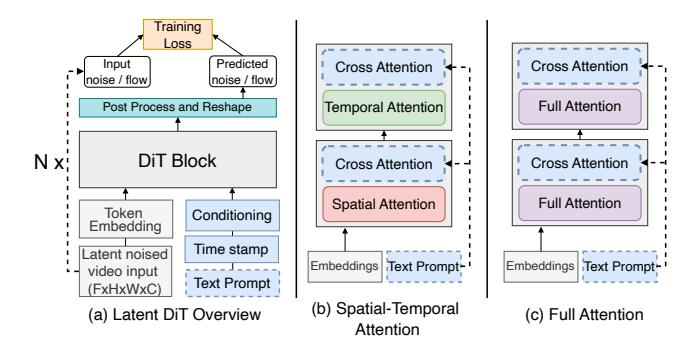

## DSV: Exploiting Dynamic Sparsity to Accelerate Large-Scale Video DiT Training

Xin Tan1, Yuetao Chen1, Yimin Jiang3, Xing Chen2, Kun Yan2, Nan Duan2, Yibo Zhu2, Daxin Jiang2, Hong Xu1

1The Chinese University of Hong Kong, 2StepFun, 3Unaffiliated

### **Abstract**

Diffusion Transformers (DiTs) have shown remarkable performance in modeling and generating high-quality videos. However, the quadratic computational complexity of 3D full attention mechanism presents significant challenges in scaling video DiT training, especially for high-definition and lengthy videos, where attention can dominate up to 95% of the end-to-end time and necessitate specialized communication paradigms to handle large input sizes.

This paper introduces DSV, a novel framework designed to accelerate and scale the training of video DiTs by leveraging the inherent dynamic attention sparsity throughout the training process. DSV employs a two-stage training algorithm that exploits sparsity patterns, focusing on critical elements supported by efficient, tailored kernels. To accommodate the new sparsity dimension, we develop a hybrid sparsity-aware context parallelism that effectively scales to large inputs by addressing the heterogeneity of sparsity across attention heads and blocks, resulting in optimized sparse computation and communication. Extensive evaluations demonstrate that DSV achieves up to  $3.02\times$  gain in training throughput with nearly no quality degradation.

### 1 Introduction

Text-to-video generation has experienced significant break-throughs recently, and received widespread interest from diverse industries [5, 6, 15, 16, 21, 35, 38, 39]. Behind these advancements is the introduction of Diffusion Transformers (DiTs) [11, 35, 38], which have emerged as state-of-the-art architectures for video generation tasks [11, 38]. DiTs function through a dual-phase mechanism: during the training phase, the model learns to reverse a predetermined noising process applied to video frames, while the inference phase entails generating high-quality videos by denoising from random inputs through multiple iterations.

In contrast to large language models (LLMs) [7, 37], which retain a transformer-based architecture and can scale to hundreds of billions of parameters, DiTs are comparatively smaller, typically ranging from several million to tens of billions of parameters [5, 9, 25, 39, 52]. This reduced scale alleviates some of the challenges associated with training large models. Nevertheless, DiTs still face a critical hurdle:

processing long, high-resolution video inputs. This challenge has become increasingly urgent due to the escalating demand for large-scale video generation, fueled by the exponential growth of datasets and industrial applications such as film post-production and multi-camera event capture [11, 39]. For example, even when utilizing compressed latent video representations derived from Variational Autoencoders (VAEs) [12], the number of tokens required for high-definition or extended-frame sequences can rapidly escalate to hundreds of thousands.

The primary computational bottleneck lies within the attention module [47], which exhibits quadratic time complexity relative to input length. As illustrated in Figure 2, this module can easily account for over 80% of the total training time. The computational burden is further exacerbated when the number of tokens in latent spaces exceeds hundreds of thousands. As context lengths increase, it becomes infeasible for a single device to store the entire sequence in memory. This necessitates the adoption of *context parallelism* [23, 27], distributing the input across multiple devices for concurrent processing. While this strategy addresses memory limitations, it introduces additional complexities related to inter-device communication.

Fortunately, our observations indicate that attention computations in video DiTs exhibit salient sparsity similar to that in LLM inference [49, 54], despite differing attention patterns. Specifically, the distribution of attention scores in each attention module follows a power-law distribution, where a small subset of critical key-value (KV) pairs contribute greatly to the total attention score. Notably, the positions of these critical KV pairs do not follow a predictable pattern. Furthermore, we find that such a sparsity is pervasive across most attention blocks and intensifies progressively during training. These findings suggest that *leveraging dynamic attention sparsity* could effectively alleviate the attention bottleneck in video DiT training, particularly for large-scale inputs.

A natural solution to exploit such dynamic sparsity is to identify the critical KV pairs by computing the attention scores matrix within each attention computation. However, such a solution suffers from two problems. First, modern attention computation paradigms are designed to be I/O-aware and rely on fused kernels for efficiency [18, 19]. Extracting

the full attention matrix disrupts these fused optimizations, introducing substantial performance overhead. Second, even if critical KV pairs are identified through such a computation, most of the attention computation (the softmax score) would already be completed by that point, leaving only the score and value matrix multiplication that offers limited performance gains. Moreover, despite the dynamic sparsity introduced, existing context parallelism cannot capture and leverage such property, which may lead to inefficient communication and suboptimal end-to-end optimization.

Based on these insights, we present DSV, a framework that accelerates the video DiT training by exploiting dynamic sparsity patterns in attention while maintaining generation quality. The core idea of DSV is to approximate attention scores using distinct predictors for each attention module. This facilitates the pre-identification of critical KV pairs prior to attention computation, enabling fully sparse attention on these critical pairs, as well as the development of context parallelism paradigms tailored to sparsity. Specifically, DSV comprises three key components:

Firstly, DSV preserves a two-stage training algorithm to explore and exploit the dynamic sparsity. In the first stage, DSV would focus on training the predictors to learn to approximate the attention score for each attention head and would not interfere the DiT model's training. Once the predictors are well-trained, DSV progresses to the second stage, dynamically assessing the cost-benefit trade-off of applying sparse computation to individual blocks based on their sparsity levels. It then determines which blocks should undergo sparse computation. Then, the predictors are used to approximate attention scores and identify critical KVs, facilitating efficient sparse attention computation.

Secondly, to address the overhead of estimating critical KV pairs—a process that inherently involves materializing an approximated attention score matrix of size(\_2 )— DSV implements a kernel fusion strategy. This strategy integrates the approximation and estimation processes into a single kernel, eliminating the need to materialize large intermediate matrices. Additionally, we observe that adjacent queries often share critical KV pairs, which allows for efficient query grouping. DSV dynamically determines the optimal query group size for each training scenario, optimizing both computation and memory access parallelism to enhance the performance of the sparse attention kernel.

Thirdly, to handle long inputs distributed across multiple devices, DSV addresses the limitations of existing context parallelism paradigms, which are poorly suited for sparse settings. By analyzing sparse workloads and leveraging insights from existing paradigms, DSV identifies best practices for parallelism in sparse environments. Given the trade-offs between different parallelism strategies and the influence of

sparsity levels, DSV models and solves for an optimal context parallelism configuration for each attention block. This approach balances computational efficiency and communication overhead, optimizing end-to-end performance.

We develop a prototype for DSV based on PyTorch FSDP [\[55\]](#page-15-9) and evaluate it on a testbed with up to 64 H100 GPUs, using video DiT models ranging from 0.8B to 30B parameters. The results show that DSV significantly improves training throughput, achieving up to 3.02× higher performance than baseline methods for input lengths of up to 260K, while maintaining visual quality comparable to full-attention baselines. Besides, the learned sparsity pattern benefits inference efficiency, enabling DSV to outperform the baseline by up to 3.5× in end-to-end latency. Notably, DSV delivers video quality comparable to full attention paradigms, with virtually no degradation.

In summary, our contributions are threefold:

- We systematically analyze attention patterns throughout video DiT training, revealing the unpredictable distribution of critical KV pairs per query, heterogeneous sparsity across heads and blocks, and the dynamic evolution of sparsity levels.
- We propose DSV, a sparse training framework for video DiTs that leverages online prediction of dynamic sparsity in attention. DSV is equipped with an efficient kernel for critical key-value estimation and sparse attention computation, integrated with FlashAttention [\[18\]](#page-14-11). We also explore context parallelism under sparse settings and propose an optimal strategy for hybrid sparsity-aware context parallelism.
- We comprehensively evaluate the algorithmic performance and system efficiency of DSV across various video generation datasets and video DiT sizes. The results demonstrate that DSV incurs no quality degradation compared to full attention while achieving significant improvements in overall throughput and speedup.

## 2 Background

We start by providing an overview of video diffusion models and the general challenges associated with large-scale video DiT training.

## 2.1 Video DiT

Diffusion models have established themselves as a prominent framework in generative modeling, achieving state-ofthe-art results in image synthesis [\[16,](#page-14-3) [21\]](#page-14-4) and video generation [\[5,](#page-14-0) [6,](#page-14-1) [15,](#page-14-2) [35,](#page-15-0) [38,](#page-15-1) [39\]](#page-15-2). These models work by progressively corrupting data with noise through a forward process and learning to reconstruct it via a reverse generative process. Among them, DiT has emerged as the de facto backbone [\[9,](#page-14-7) [35,](#page-15-0) [38\]](#page-15-1).

Figure 1: Overview of video DiT training. (a) The main input is the video, which is compressed by a VAE (omitted here). The timestamp is used as conditioning, and the text prompt is used as the Key-Value input in the cross-attention module. (b) Interleaved spatial-temporal attention blocks. (c) 3D full attention blocks.

In a typical video DiT training process, a video clip is first encoded by a variational autoencoder (VAE) [9, 12, 38], which compresses and downscales the input, yielding a latent representation. Random noise is then injected into this latent representation, and the resulting noised latent video-together with any conditioning information (e.g., timestamps or text prompts for text-to-video tasks)—is fed into the DiT model. As shown in Figure 1, the DiT model comprises multiple DiT blocks that process video tokens alongside the conditional inputs, guiding video generation during training. At the core of each DiT block are self-attention modules, which employ interleaved spatial and temporal attention or full attention to capture the complex relationships among video tokens across different dimensions. Additionally, cross-attention is used to align the video with text prompts, ensuring consistency between the two modalities. The model's output is then used to compute the loss, following either a denoising diffusion probabilistic model paradigm [24] or a flow matching paradigm [32, 34].

## 2.2 Various Self-Attention Paradigms

Self-attention, also known as multi-head attention, has been extensively employed in natural language processing and computer vision [20, 47] to model long-range dependencies. Given an input sequence  $H = [h_1, \cdots, h_S]^{\top} \in \mathbb{R}^{S \times d}$ , where S denotes the sequence length and d represents the hidden dimension, each attention head projects H into three learned subspaces, namely Q, K, and V, through the projection weight matrices  $W_Q$ ,  $W_K$ ,  $W_V \in \mathbb{R}^{d \times d_k}$ , respectively. The output of each attention head is then computed as:

$$H' = \operatorname{softmax}\left(\frac{QK^{\top}}{\sqrt{d_k}}\right)V,$$

Figure 2: The time breakdown for self-attention and other operations in different DiTs with various sequence lengths in forward (FW, left bar) and backward (BW, right bar) computation.

where  $d_k$  is the dimensionality of each attention head. Ultimately, the outputs from all attention heads are concatenated and combined to produce the final output.

For video DiTs, researchers have developed various attention paradigms. One approach uses a spatial-temporal attention mechanism that alternates attention computations along spatial and temporal dimensions[35]. Although computationally efficient, many studies have found this approach insufficient for capturing detailed information, leading to a shift towards full attention paradigms [5, 39, 52].

Full attention computes interactions across all tokens within the 3D temporal-spatial space, outperforming interleaved spatial-temporal attention. However, the length of processed video tokens in full attention can be substantial, easily exceeding 100,000 tokens, even in latent space (e.g., for a latent input of  $32\times96\times96^1$ , 300k tokens need to be processed). This renders full attention highly compute-intensive.

### 2.3 Large-Scale Video DiT Training

The efficiency of large-scale video DiT training is primarily influenced by two key aspects.

**Full attention bottleneck.** In high-resolution, long video processing, self-attention computation becomes a significant bottleneck due to its  $O(n^2)$  complexity in token number and the non-causal attribute in DiT, where the lengths of Q, K, and V equal the number of video tokens. In contrast, cross-attention has a much lower time occupation, as only the Q length equals the video tokens, while the K and V lengths match the text prompt (usually less than 120 tokens). As the video token increases, self-attention consumes the majority of end-to-end time, e.g., 92% and 93% of forward and backward computation for 1.3B and 3B models at a 200K sequence length. Therefore, efficient attention mechanisms

 $^{1}$ Throughout this paper, the order of dimensions in the latent video size (e.g.,  $16\times16\times16$ ) defaults to frames, height, and width, unless otherwise specified.

are crucial to mitigate this bottleneck and scale video DiT training.

**Context parallelism.** Context parallelism (CP) enables long sequence training across multiple devices by dividing a sequence into chunks distributed over GPUs. However, self-attention modules specifically require inter-device communication to process the entire sequence, and two paradigms are commonly used:

- **Sequence-wise CP.** QKV tensors are partitioned into chunks of shape [*B*, *H*, *S*/*N*, *D*] and assigned to different devices, where *B* is the batch size, *H* the number of heads, *S* the sequence length, *N* the number of devices, and *D* the head dimensionality. Each GPU computes the attention output for its local query chunk of all heads. Since each query must attend to all key-value pairs in the entire sequence, GPUs gather the necessary KV tensors from other devices and perform block-wise attention [33]. Ring-based communication optimizations are often used to overlap communication with computation, enhancing efficiency.
- **Head-wise CP.** Similarly, each GPU initially holds QKV chunks partitioned along the sequence dimension of all heads. Through All-to-All operations, each GPU subsequently receives the complete QKV for a specific subset of heads, resulting in tensors of shape [*B*, *H*/*N*, *S*, *D*]. Subsequently, each GPU independently computes the attention outputs for its assigned heads in parallel. Upon completion, another All-to-All operation is performed to gather the results across the head dimension, re-partitioning them along the sequence dimension to restore the original tensor layout [27].

These two paradigms have trade-offs in computation efficiency and communication cost [23]. Determining an efficient and optimal parallelism strategy is non-trivial, as it depends on the specific input case and hardware configuration.

