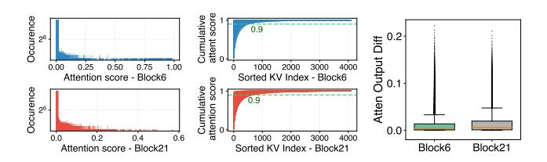
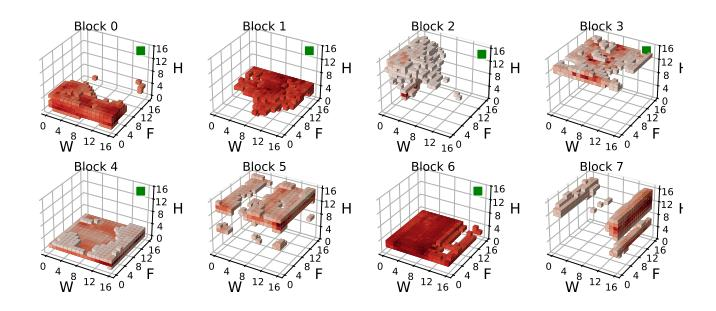
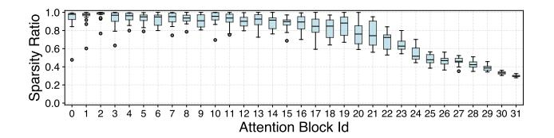
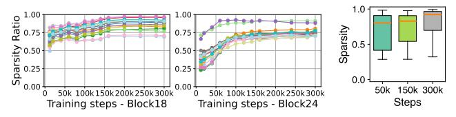
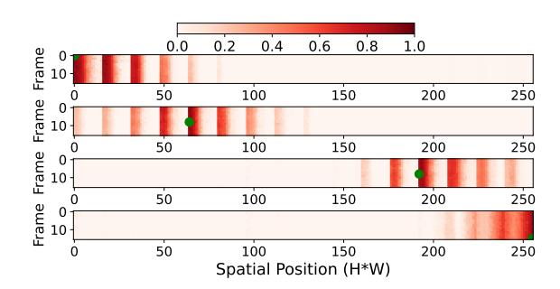

# 3 Empirical Observations on the Sparsity of Attention in Video DiT

We conduct an in-depth analysis of the sparsity patterns of attention in video DiT training across various video generation datasets and model sizes as detailed in §9. Our key findings, illustrated through a comprehensive case study, provide strong evidence to inform and substantiate our system design rationale. Our case study leverages a video DiT model with an architecture similar to Meta's MovieGen [39], consisting of 2.7B parameters, which is a moderate scale for video generation tasks [5, 9, 35]. We train this model on the widely adopted WebVid-10M dataset [14] using a dataparallel setup with 8 H100 GPUs and a global batch size of 32. The experiments utilize a latent input size of 16×16×16, representing frames, height, and width, respectively.

Figure 3: Left: The attention score dis-Figure 4: The tribution for each query in a histogram. output difference Right: The cumulative distribution func-between attention tion of the sorted attention scores for with full KV and each query.

We begin by some definitions. For a query vector q, we define critical KV pairs by considering the set  $S_q = (k_i, v_i)_{i=1}^n$ of all KV pairs, where *n* is the total number of pairs. Using the attention score function  $A(q, k_i) = \operatorname{softmax}(q \cdot k_i)$ , which computes the scaled dot product between query q and key  $k_i$ , we identify the set of critical KV pairs  $I_q \subseteq S_q$  as those pairs  $(k_i, v_i)$  where  $A(q, k_i)$  exceeds the  $\theta$ -percentile threshold of all attention scores. This threshold  $\theta$  can be determined by a numerical magnitude cutoff or a cumulative sum threshold (such that the sum of critical KV pairs account for 90% of total attention). We use the cumulative sum threshold of  $\theta = 90$  as the default setting in this paper, i.e. the critical KV pairs are the top ones that together represent 90% of total attention. The sparsity of an attention head is then defined as the average proportion of non-critical KV pairs across all queries:  $\mathbb{E}_{q \sim Q}\left[\frac{|S_q \setminus I_q|}{|S_q|}\right]$ 

Attention sparsity and power-law distribution. We first investigate the distribution of attention scores for each query to demonstrate attention sparsity.

## Observation 1: Attention scores in sparse blocks follow a power-law distribution.

As shown in Figure 3, attention scores for different queries in two blocks exhibit a skewed distribution, with most scores being small (<0.001) and only a few being large (>0.1). Notably, the top few keys contribute significantly to the total attention score sum. The CDF plots reveal that for 95.2% of queries in block 6 and 86.8% in block 21, the top 10% of keys account for over 90% of the total attention scores, highlighting the inherent sparsity in several attention blocks. Further, Figure 4 shows that using only the top 10% of KV pairs results in minimal output differences compared to using the full KV.

The power-law distribution of attention scores suggests that a substantial portion of attention computation may be pruned without significantly impacting performance. By efficiently identifying critical KV pairs, we can potentially reduce computational costs while maintaining model quality.

Figure 5: Distribution of critical KV positions for a query token (green) at position (15, 15, 15) in the 3D latent space. The visualized keys are those that yield attention scores exceeding the 90th percentile when attending to the query.

Figure 6: Sparsity of different heads across blocks in iteration 80k

Locality of critical KV. A common and simple method to identify critical KV pairs is to rely on locality: a token's query tends to attend to its nearby input tokens' keys or certain global keys, meaning that window-based patterns or token sinks can be used to obtain the critical KV. Some work has shown the utility of this method in LLM inference for language tasks [8, 50, 54]. Given the uniqueness of video DiT, which involves modeling spatio-temporal dependencies in video data, we first examine if such locality patterns also exist and can be similarly used in this context.

## Observation 2: Critical KV pairs do not exhibit locality patterns in video DiT.

As shown in Figure 5, we visualize the critical KV positions in a 3D space for a query. Contrary to expectations, critical KV pairs do not have a specific pattern, unlike those found in LLM inference tasks [8, 49, 54]. More generally across queries, our experiment reveals that only 15.1% of critical KV pairs are within a 5-token radius, while 48.5% are more than 10 tokens away. This suggests that applying fixed patterns to approximate attention computation would not fare well in video DiT.

**Heterogeneity of sparsity.** We further establish the spatial heterogeneity of attention sparsity across different attention blocks and heads within a block, which adds to the difficulty of identifying critical KV pairs.

Observation 3: Sparsity varies significantly across attention blocks and heads within the same block.

Figure 7: The change in sparsity of different Figure 8: The attention heads during the training process sparsity of all in transformer blocks. Only two blocks are blocks across shown due to space constraints.

Our analysis shows that not only varies across blocks but also among heads within the same block. Figure 6 displays the sparsity of attention heads for various blocks at iteration 80k, with the first 20 blocks being highly sparse and latter blocks less so. The box plot highlights variability in head sparsity within each block, such as block 2 where most heads have around 95% sparsity and some outliers have 90% and 80%. Figure 8 further validates this, illustrating disparate sparsity distributions of blocks across different training steps.

This aligns with previous studies [29, 31, 47], which have shown that different attention heads can capture distinct types of features and process various aspects of the input data. For example, some heads may focus on local features, while others may capture global context. Consequently, applying a uniform sparsity pattern to all heads and blocks may not be optimal: A low sparsity threshold may accommodate the sparsity of all heads but incur unnecessary computation, whereas a high sparsity threshold may compromise performance by omitting important KV pairs for heads with low sparsity. Instead, adaptive methods are needed to accommodate the unique sparsity characteristics of each block/head and maximize efficiency.

**Time-varying sparsity during training.** Continuing from the previous finding, we also observe that attention sparsity varies dynamically in the temporal dimension.

## Observation 4: Sparsity also varies over the course of training before stabilizing.

As illustrated in Figure 7, sparsity of different heads becomes more pronounced as training progresses. For block 24, the average attention sparsity for each head increases from 0.30 to 0.78. Further, Figure 8 shows that across all attention blocks, the median sparsity increases from 0.81 at 50k iterations to 0.92 at 300k iterations. This dynamic evolution of sparsity during training suggests that the strategy for leveraging sparsity should be adjusted dynamically: As the model learns to focus on the most relevant features, the attention mechanism becomes more selective, resulting in increased sparsity [45]. This highlights the importance of dynamic methods that can capture and exploit the evolving sparsity patterns throughout the training process.

Figure 9: Overlap ratio of critical KV pairs between four anchor queries (highlighted in green) and all other queries in an attention block. The anchor queries are positioned at indices 0, 2112, 2240, and 4095. Each subplot shows a 2D projection of the 3D video, with rows representing flattened frames along the width axis.

Critical KV overlap ratio for adjacent tokens in 3D space. Finally, we demonstrate an interesting phenomenon between queries of adjacent tokens.

## Observation 5: Adjacent tokens have similar critical KV pairs.

To quantify this phenomenon, we calculate the ratio of shared critical KV indices across queries. Figure 9 is a case study with four anchor queries highlighted in green, where darker shades to indicate higher overlap ratios. Significant overlaps of the critical KV pair indices can be seen among the adjacent tokens. For tokens within a 2×2×2 3D cube (note the figure shows the 2D project of the 3D space), specifically, the four anchor queries and their adjacent queries within the same cube exhibit an overlap in critical KV indices exceeding 92.4%. This high overlap ratio is consistent across blocks with an average 80.1%. This finding is intuitive, as pixels in videos represent continuous signals, unlike discrete signals in language, making adjacent tokens similar. It strongly suggests that neighboring queries tend to attend to similar KV pairs (though these KV pairs may not be close to the query as Obs 2 reveals), presenting an opportunity to optimize attention computation by leveraging the similarity in sparsity patterns among adjacent tokens.

#### 4 DSV Overview

Our empirical findings in §3 uncover inherent sparsity patterns in video DiT attention that can help alleviate computational bottlenecks. Building on this insight, we discuss the opportunities and challenges posed by these sparsity patterns and introduce the architecture of our solution, DSV.

## 4.1 Opportunities and Challenges

**Opportunities.** Sparsity in video DiT attention presents a promising opportunity for more efficient training, especially

Figure 10: The system overview of DSV.

for high-resolution, long-duration video data. Empirical evidence indicates that a subset of blocks consistently exhibits high sparsity, suggesting that only a small fraction of KV pairs significantly contribute to computation. Additionally, many attention heads show high sparsity exceeding 95%, with sparsity ratios increasing as training progresses. By selectively computing only the most critical KV pairs, the overall computational burden can be significantly reduced, leading to more efficient processing. Moreover, this reduction in KV computations also lowers communication overhead in multi-device settings, where KV data is frequently exchanged for context parallelism. Together, these factors highlight the potential for substantial end-to-end speedups with attention sparsity exploited in video DiT training.

**Challenges.** Applying sparse attention computation to video DiT training in practice introduces several obstacles:

- Dynamical critical KV identification: One major challenge stems from the dynamic and uncertain distribution of critical KV pairs in video DiT training (see Obs.2 of §3). A predefined or fixed sparse attention pattern becomes impractical in this scenario because the significance of specific KV pairs can shift dramatically with changing context or timesteps. While naively computing the complete attention score matrix (e.g., softmax(QKT)) and then selecting the top-k entries per query would capture these changing distributions, it leads to enormous memory consumption and computation overhead. Moreover, it disrupts the optimized fused attention kernel [18, 19], introducing considerable overhead and limiting the sparsity benefits to only the score-value (AV) computation, ultimately degrading overall performance.
- **Kernel efficiency:** Even when the attention scores are available for identifying critical KVs, performing top-k selection at large scales introduces considerable implementation hurdles. The intermediate matrix for attention scores can have a shape of [*H*, *S*, *S*], where H is the number of heads and S is the sequence length. Storing such large matrices requires excessive amounts of GPU memory, and

iterating through them for top-k selection (especially under tight memory constraints) can easily become a bottle-neck. Furthermore, following top-k selection, each query might access a sparse set of KV entries in an irregular or scattered pattern, complicating memory access. This irregularity can degrade parallel efficiency and result in suboptimal use of compute resources, making it difficult to fully exploit the gains from sparsity.

• Specialized sparse context parallelism: A third challenge emerges when training with long video tokens that must be distributed across multiple devices. Existing context parallelism-such as head-wise or sequence-wise would fail to capture efficient load balancing or to minimize redundant communications once sparsity is introduced. For instance, head-wise approaches can become problematic if certain heads exhibit higher degrees of sparsity than others (Obs.3 of §3), creating load imbalances and straggler effects. Moreover, purely sequence-wise approaches often transfer all KV pairs among devices without considering which entries are truly critical, unnecessarily increasing communication overhead. As a result, simply applying standard context parallelism in a sparse setting can undermine the performance benefits gained from sparsity, revealing a need for more specialized and dynamic parallelization schemes.

#### 4.2 Architecture and Workflow

Our solution. To enable dynamic estimation of critical KV pairs and achieve fully sparse attention computation, we propose a sparsity predictor for each self-attention module. This predictor learns approximations of attention score distributions, which would benefit accurate identification of the critical KV pairs for each query. We introduce a two-stage training algorithm that initially trains the sparsity predictors independently and subsequently leverages them to facilitate sparse computation during the second stage, which is supported by dedicated kernels. By utilizing the sparsity predictors and analyzing the underlying sparsity patterns, we further optimize context parallelism to dynamically adapt to varying sparsity levels across different attention heads, enhancing overall efficiency.

**Key components.** DSV consists of three key components as shown in Figure 10:

(1) Algorithm: Two-stage training. At the core of DSV lies a two-stage training algorithm that structures the sparse training workflow. In the first stage, sparsity predictors are trained independently to approximate the attention score distributions for each self-attention module. During the second stage, these trained predictors are employed to identify the critical KV pairs for each query, enabling fully sparse attention computation. This approach facilitates

Figure 11: The two-stage training paradigm.

the efficient discovery of sparsity patterns and seamless integration with the sparse attention mechanism.

- (2) Kernel: Critical KV estimation and sparse attention. To maximize the benefits of the sparse training stage (the second stage), DSV introduces optimized kernels tailored for critical KV estimation and sparse attention. Specifically, a fused "critical KV estimation" kernel calculates approximate attention scores using learned predictor parameters and then performs top-k selection at the desired sparsity level in a single pass. This fused operation reduces intermediate memory consumption and minimizes overhead during top-k selection. Additionally, as noted in Obs.5 of §3, queries that are close in position often share similar critical KVs, enabling further enhancements to memory and compute efficiency during sparse attention.
- (3) Parallelism: Sparsity-aware context parallelism. To further enhance sparse training efficiency in scenarios with long inputs and multiple devices, we propose a sparsity-aware context parallelism strategy. This strategy exploits sparsity patterns and dynamically adapts to varying sparsity levels across different attention blocks and heads. It not only introduces new practices for standard context parallelism in sparse settings but also determines the optimal parallelism configuration for each block based on its head-wise sparsity patterns. This approach minimizes communication overhead and maximizes computation efficiency, ensuring optimal performance when parallelizing large video inputs.

