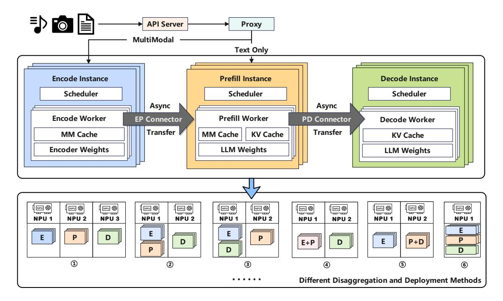
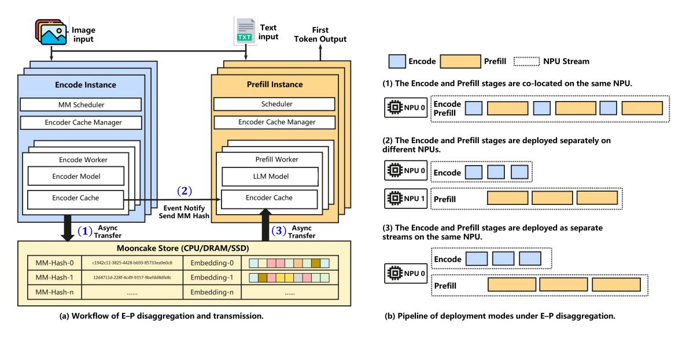

# 3 Method

This chapter presents the design of *EPD-Serve*, a multimodal EPD-disaggregated inference system. First, an overview of the overall EPD-disaggregated framework is provided in Section [3.1.](#page-3-0) Next, we focus on the tensor transmission optimization mechanisms of the disaggregated system, including the E-P disaggregated transmission in Section [3.2](#page-4-0) and the P-D disaggregated transmission in Section [3.3.](#page-5-0) Subsequently, the system's scheduling strategy is introduced in Section [3.4.](#page-6-0) Finally, Section [3.5](#page-6-1) discusses the throughput improvements and resource efficiency enabled by flexible co-location and stage disaggregation.

#### 3.1 EPD-Serve System

MLLMs typically execute inference through three stages: Encode, Prefill, and Decode. In traditional monolithic architectures, these stages run sequentially on the same computing resources, which fails to accommodate their significant computational heterogeneity. To overcome this limitation, we propose *EPD-Serve*, an inference architecture based on stage-level disaggregation. By modularizing the inference pipeline, *EPD-Serve* enables independent scheduling, efficient cross-stage transmission, and flexible resource co-location. The overall system architecture is shown in Figur[e3.](#page-3-1)

Figure 3: Overview of the *EPD-Serve* disaggregated inference architecture.

In *EPD-Serve*, the inference pipeline of MLLMs is partitioned into three stages: Encode, Prefill, and Decode. The functionality and data flow of each stage are outlined below.

Encode Stage: This stage processes multimodal inputs Im such as images, audio and video through the multimodal encoder E, producing high-dimensional embedding sequences:

$$V_m = E(I_m) \tag{1}$$

where Vm ∈ R n×d represents n multimodal tokens, each with a d-dimensional feature vector. These embeddings serve as input features for the Prefill stage.

Prefill Stage: Text prompts It are encoded into a text feature sequence Vt. The multimodal and text features are concatenated and fed into the Prefill stage:

$$O_1, \mathbf{KV}_1 = P(V_m, V_t) \tag{2}$$

which generates the first output token O1 and constructs the KVCache KV1, providing contextual dependencies for the Decode stage.

Decode Stage: Decode autoregressively produces subsequent tokens. Given the previous token and KV-Cache:

$$O_2, \mathbf{KV}_2 = P(O_1, \mathbf{KV}_1) \tag{3}$$

this process iterates until the end-of-sequence token <eos> appears or a maximum generation length is reached. Due to its strict dependency on historical context, Decode operates sequentially.

Cross-Stage Transmission: *EPD-Serve* enables efficient tensor transmission through asynchronous crossstage transmission modules: E-P transmission supports cross-node migration of multimodal feature vectors with asynchronous transmission and cache prefetching to reduce stage switching latency. P-D transmission uses hierarchical grouped caching and delayed transmission to precisely overlap communication with Prefill computation, enabling efficient transfer of KVCache from Prefill to Decode stages.

Overall, the EPD-disaggregated architecture achieves pipelined and parallelized inference through stage-level disaggregation and asynchronous communication. This design eliminates cross-stage resource interference, improves spatiotemporal utilization of compute and memory resources, and significantly reduces latency jitter and throughput degradation under high concurrency, thereby improving elastic scalability and maintaining stable SLO performance.

#### 3.2 Transmission Mechanism for E-P Disaggregation

As shown in Figure [4,](#page-4-1) in the E-P disaggregated architecture, multimodal features generated by the Encode stage are transmitted to Prefill instances, and the associated transmission latency directly affects TTFT, becoming a primary bottleneck. To mitigate this issue, we propose an event-driven asynchronous feature prefetching mechanism that enables low-blocking transmission via three optimizations: cache pooling, asynchronous prefetching, and fault-tolerant recomputation.

Figure 4: E-P disaggregation with asynchronous feature transmission and pipelining. Left: Asynchronous feature transmission between the Encode and Prefill stages via the Mooncake Store [\[12\]](#page-19-4). Right: Pipeline layouts supporting standalone deployment or physical co-location with the Prefill stage.

Multimodal Cache Pooling: *EPD-Serve* implements a shared multimodal cache pool, named MM Store, that stores encoded multimodal features using the hash of multimodal inputs as the key and the corresponding feature vectors as the value. This design avoids duplicate caching and transmission, supports cross-request reuse of features, and improves cache utilization and hit rate.

Event-Driven Asynchronous Prefetching: To overlap transmission latency, feature transfer is decoupled from computation using an event-driven mechanism. After the Encode stage completes, only the feature hash is asynchronously sent to the target Prefill instance. Upon receiving the event, the listener in the Prefill stage retrieves the feature from the MM Store using the hash and writes it to the local cache. By transmitting only lightweight hash values and parallelizing execution and data transfer, this approach significantly reduces TTFT.

Fault-Tolerant and Recomputation: To enhance robustness, if a Prefill instance fails to retrieve the feature from the MM Store, the system triggers local recomputation to regenerate the missing vector. This mechanism preserves pipeline continuity while balancing performance and reliability.

## 3.3 Transmission Mechanism for P-D Disaggregation

In the P-D disaggregated architecture, the large KVCache generated during Prefill must be transmitted to Decode instances. Under synchronous transmission, all KV data across layers must be transferred once Prefill computation completes, which leads to communication congestion and significantly increases TTFT. To mitigate this overhead, we propose a hierarchically grouped KV transmission mechanism that aligns KV transfer with the model's computation pipeline, enabling parallel transmission and Prefill computation.

Layer-wise KV Transmission: The KVCache is produced independently by each Transformer layer. *EPD-Serve* partitions the cache into layer-wise transmission units, as shown in Figure [5,](#page-5-1) to reduce instantaneous bandwidth demand from one-shot KV transfer. When Prefill begins computation of the (L+1)-th layer, the KV-Cache from the L-th layer is asynchronously transmitted, achieving temporal overlap between communication and computation.

Figure 5: P-D disaggregation with hierarchical KV transmission and pipelining. Left: Hierarchically grouped KV transmission between the Prefill and Decode stages. Right: Pipelined overlap of KV transmission and computation to hide communication latency.

Hierarchically Grouped KV Transmission: KV transmission between Prefill and Decode typically requires a metadata handshake, which introduces unpredictable latency and delays hierarchical KV transmission, preventing full communication-computation overlap. To eliminate this misalignment, we propose a grouped transmission mechanism that packages KV data from multiple layers and schedules delayed transmission to align communication with model computation.

The mechanism consists of three core ideas:

• Grouped Packaging: KVCache from adjacent layers is packaged and transmitted as a group, reducing communication frequency and handshake overhead. The group size is dynamically determined based on MLP compute load and handshake latency.

- Asynchronous Overlap: An event-driven queue enables parallel execution of group transmission and MLP computation, maximizing the communication-computation overlap.
- Precise Scheduling: KV transmission is scheduled to avoid peak communication phases, reducing link contention and improving bandwidth efficiency.

Through the combined design of hierarchical KV transmission and grouped scheduling, *EPD-Serve* achieves deep communication-computation overlap in the P-D stage. This significantly reduces cross-stage communication latency, mitigates bandwidth contention, and improves throughput and stability while maintaining low TTFT under high-concurrency multimodal workloads.

#### 3.4 Modality-Aware Multi-Path Scheduling Module

In multimodal inference systems, different request types follow distinct execution paths: text-only requests require only Prefill and Decode, whereas multimodal requests additionally involve the Encode stage. A unified scheduling strategy causes cross-modal blocking and inefficient resource use. To address this, *EPD-Serve* introduces a modality-aware multi-path scheduling module that selects inference paths based on request modality, achieving instance-level load balancing and maintaining high throughput and low latency under hybrid workloads.

Multi-Path Scheduling Strategy: Upon receiving a request from the API server, *EPD-Serve* identifies whether the input contains non-text modalities, such as images, audio, or video. The request is then routed to the appropriate path: multimodal requests are processed through the E-P-D pipeline, while text-only requests follow the P-D pipeline. This routing mechanism creates separate execution pipelines for different modalities, preventing high-load multimodal requests from preempting resources required by text tasks and allowing each request type to execute efficiently on its designated path.

Instance-Level Dynamic Load Balancing: To further improve stability and utilization, *EPD-Serve* employs a load-aware scheduling policy at the instance level. A global instance status table tracks metrics such as queue length, pending requests, and resource usage for each stage instance in real time. New requests are dispatched to the instance with the lowest load based on a least-loaded-first strategy, ensuring balanced distribution and preventing overload on individual nodes. Through the combination of modality-aware routing and instance-level load balancing, *EPD-Serve* achieves heterogeneous traffic splitting at the request layer and dynamic load balancing at the execution layer, ensuring resource isolation and performance optimization for both multimodal and text tasks while maintaining scalability in high-concurrency scenarios.

#### 3.5 Logical Isolation and Physical Co-location Strategy

To balance stage isolation with resource efficiency, *EPD-Serve* adopts a combined design of logical isolation and physical co-location. At the logical layer, each stage is treated as an independent module, while at the physical layer, computing resources can be shared across stages. This approach enables targeted resource allocation and adaptive deployment of disaggregation layouts based on workload characteristics, modality distribution, and hardware availability, supporting dynamic selection among deployments such as E-P-D, EP-D, ED-P, E-PD, etc to optimize SLO outcomes.

Flexible Stage Disaggregation and Elastic Deployment: *EPD-Serve* decouples the inference pipeline into independent instance processes for Encode, Prefill, and Decode stages, enabling separate scheduling and elastic scaling. A unified Proxy component performs cross-instance request routing and load balancing. Instances can be deployed on the same node or distributed across nodes depending on resource requirements, with low-overhead data transfer supported by asynchronous communication. Through software-level decoupling and communication optimization, *EPD-Serve* can dynamically switch between deployment topologies and maintain scalability under heterogeneous resource environments.

Physical Co-Location and Spatial Multiplexing: While retaining independent scheduling at the software layer, *EPD-Serve* supports physical co-location and spatial multiplexing of hardware resources. The Encode stage can be co-located with the Prefill or Decode stage on the same node, allowing complementary use of compute units and memory bandwidth. As shown in Figure [6,](#page-7-0) operators such as MatMul and AllReduce utilize different hardware components like AI Core and AI Vector. When one stage is waiting on communication, another stage can leverage idle compute cycles to execute its operators, achieving operator-level parallel reuse

and improving throughput. With shared hardware resources enabled by co-location, the system increases utilization and throughput while maintaining predictable latency.

Figure 6: Resource allocation and performance analysis of operator-level hardware co-location. The left subfigure illustrates the differences in hardware resource requirements, such as AI Core, AI Vector, across various operators, as well as their relative proportions of computation versus data movement. The right subfigure presents a heatmap of latency increase during operator parallel execution, where smaller values indicate weaker performance degradation. Experimental results show that operators with significant differences in resource requirements exhibit minimal mutual interference when co-located, whereas operators with similar resource demands generate more pronounced performance interference under co-location.

In summary, this strategy integrates software-level modularity with hardware-level resource sharing. The upper-layer architecture provides configurable disaggregation flexibility, while the lower-layer resources support spatial multiplexing, enabling a balanced trade-off between performance, energy efficiency, and latency across diverse multimodal workloads.

