# 4 Evaluation

#### 4.1 Experiments Setup

To evaluate the performance and scalability of *EPD-Serve*, we conduct ablation studies and comparative experiments using diverse hybrid-modal datasets and several mainstream multimodal large models.

Datasets: Two representative datasets are selected for experimental evaluation, covering different multimodal inference scenarios: VisualWebInstruct [\[16\]](#page-19-8) is a text-image mixed instruction dataset. A subset of 512 samples is randomly selected for testing, consisting of 256 text-image requests and 256 text-only requests. All images are standardized to a resolution of 1280×720, and text inputs contain 63.1 tokens on average. This dataset is used to evaluate the system's generalization performance in cross-modal inference scenarios. ShareGPT-4o [\[17\]](#page-19-9) is a text-image dataset. A subset of 512 requests is randomly extracted, with an average image resolution of 802×652 and an average text length of 9.6 tokens. This dataset is used to evaluate the system's performance on typical multimodal tasks. Considering the dataset distribution and characteristics of multimodal understanding tasks, the output sequence length is uniformly fixed to 64 tokens in all experiments. Request injection is controlled using AISBench at 1-12 req/s to simulate different concurrency levels. We record SLO attainment rate, throughput, TTFT, and TPOT as key metrics. For fair comparison across deployments, the per-NPU request rate is normalized by the number of NPUs in each deployment, ensuring a consistent single-device baseline. Additionally, SLO differs by disaggregation strategy: when the Encode stage is disaggregated, T T F T ≤ 2000ms and T P OT ≤ 80ms; when the Decode stage is disaggregated, T T F T ≤ 2000ms and T P OT ≤ 50ms.

Models: We use two mainstream multimodal large models to evaluate performance consistency at different model scales: openPangu-7B-VL and Qwen3-VL-8B [\[4\]](#page-18-3).

Baseline and Deployment Notation: The baseline for performance comparison is the default monolithic architecture of vLLM v0.11.0, which executes the Encode, Prefill, and Decode sequentially on the same computing resource. In contrast, *EPD-Serve* supports flexible disaggregation and co-location of the three stages. A unified notation is defined to characterize different deployments: The symbol "-" denotes disaggregated deployment of distinct stages on separate hardware resources. Parentheses "()" denote co-location of multiple stages on the same physical hardware, with logical isolation preserved. For example, (E-PD) places Encode and the combined Prefill-Decode on the same device with logical isolation. EP-D deploys the Encode-Prefill and Decode stages on separate devices.

Hardware Platform: All experiments are conducted in a single-machine Ascend environment using the Ascend Atlas 800I A2 server with 64 GB of on-device memory per NPU. To ensure fairness and reproducibility, all comparative evaluations are conducted under identical hardware configurations.

#### 4.2 Effectiveness of EPD-Disaggregated Tensor Transmission

We evaluate the two tensor transmission optimizations proposed in *EPD-Serve* through ablation experiments on the ShareGPT-4o dataset, testing the E-P asynchronous feature prefetching mechanism and the P-D hierarchically grouped KV transmission mechanism separately. Experiments are conducted under request rates of 2 and 3 req/s, and results are summarized in Table [2.](#page-8-0) When the E-P asynchronous feature prefetching mechanism is enabled, the system's TTFT decreased by approximately 16.6-21.7% relative to the baseline. This improvement mainly comes from preloading feature tensors, which overlaps E-P transmission with the Encode computation and effectively masks communication latency. The P-D hierarchically grouped KV transmission mechanism yields an 11.9-16% reduction in TTFT, showing that hierarchical grouping and delayed scheduling effectively reduce cross-instance KV transmission overhead. When both mechanisms are enabled, TTFT decreases by 26.1-31.6%, demonstrating complementary latency-masking effects at different stages and jointly hiding end-to-end transmission costs.

Table 2: Performance comparison of transmission optimizations in the E-P and P-D stages.

| Methods                         | Request Rate 2req/s |          | Request Rate 3req/s |          |
|---------------------------------|---------------------|----------|---------------------|----------|
|                                 | TTFT (ms)           | TPOT(ms) | TTFT(ms)            | TPOT(ms) |
| Baseline(E-P-D)                 | 703.75              | 39.29    | 880.22              | 42.39    |
| w/ E-P Asynchronous Prefetching | 586.87(-16.6%)      | 38.36    | 688.86(-21.7%)      | 41.5     |
| w/ P-D Hierarchically Grouped   | 590.80(-16.0%)      | 39.42    | 775.83(-11.9%)      | 43.89    |
| EPD-Serve                       | 481.38(-31.6%)      | 38.20    | 650.51(-26.1%)      | 43.95    |

To further examine the performance gains of the E-P asynchronous feature prefetching and P-D hierarchically grouped KV transmission mechanisms, we conduct dedicated experiments and analyses as follows.

#### 4.2.1 Performance Analysis of E-P Stage Asynchronous Feature Prefetching

To evaluate E-P transmission under different data scales, we use six groups of images with varying resolutions as input. We separately measure feature transmission latency and system scheduling latency to quantify the extent to which asynchronous transmission is hidden by system scheduling. The results are shown in Table [3.](#page-9-0)

The results demonstrate that feature transmission can be effectively overlapped by both inter-instance and intra-instance scheduling. When the input image resolution is below 4K, the feature transmission latency remains consistently lower than the scheduling latency, enabling nearly 100% transmission overlap ratio for the E-P stage. As image resolution increases, feature transmission latency increases rapidly and exceeds scheduling latency, resulting in only partial masking of the transmission process. For instance, at 4K resolution, the overlap ratio drops to 99.78%. In conclusion, the E-P stage asynchronous feature prefetching mechanism achieves nearly complete overlap efficiency for image inputs at mainstream resolutions, with a minor degradation in overlap capability under higher-resolution scenarios.

Table 3: Performance of asynchronous feature prefetching in the E-P stage.

| Image Resolution | Transmission Data | Transmission Latency(ms) | Scheduling Latency(ms) | Overlap Ratio |
|------------------|-------------------|--------------------------|------------------------|---------------|
| 280×280          | [100, 3584]       | 8.145                    | 30.803                 | 100%          |
| 560×560          | [400, 3584]       | 15.819                   | 42.406                 | 100%          |
| 640×960          | [529, 3584]       | 17.019                   | 49.549                 | 100%          |
| 720×1280         | [1196, 3584]      | 38.776                   | 81.028                 | 100%          |
| 1080×1920        | [2691, 3584]      | 80.771                   | 151.77                 | 100%          |
| 4096×3112        | [16206, 3584]     | 729.724                  | 728.109                | 99.78%        |

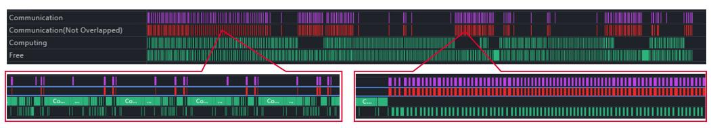

(a) Profiling of layer-wise KV transmission with a 1024-sequence input, where the KV transmission overlap ratio is only 15.27%.

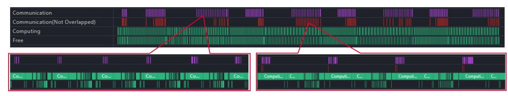

(b) Profiling of hierarchically grouped KV transmission with a 1024-sequence input, where the KV transmission overlap ratio reaches 98.78%.

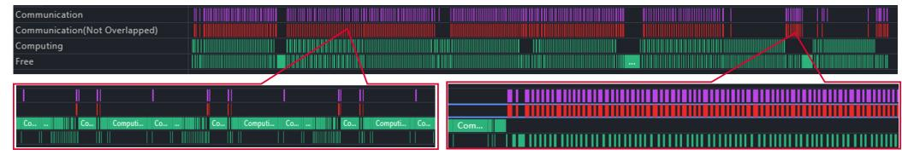

(c) Profiling of layer-wise KV transmission with a 2048-sequence input, where the KV transmission overlap ratio is only 25.08%.

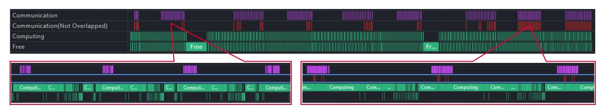

(d) Profiling of hierarchically grouped KV transmission with a 2048-sequence input, where the KV transmission overlap ratio reaches 99.92%.

Figure 7: Performance comparison of layer-wise KV transmission and optimized hierarchically grouped KV transmission under different input sequence lengths.

## 4.2.2 Performance Analysis of Hierarchically Grouped KV Transmission

To evaluate KV transmission efficiency under different data volumes, we compare the performance of the layer-wise transmission before and after applying hierarchically grouped optimization at input sequence lengths of 1024 and 2048 tokens, with a concurrency of 16. The results are shown in Figure [7.](#page-9-1)

The results show that hierarchically grouped KV transmission delivers substantial performance gains at both sequence lengths. With input lengths of 1024 and 2048 tokens, the KV transmission overlap ratio increases by 83.51% and 74.84% over the baseline, respectively. In general, overlap improves as sequence length grows. For example, the overlap ratio of the baseline rises from 15.27% at a sequence length of 1024 tokens to 25.08%

Table 4: Performance comparison of layer-wise KV transmission before and after optimization.

| Input Length | Method    |         | KV Latency(ms) Exposed Latency(ms) Prefill Latency (ms) Overlap Ratio Bandwidth (GB/s) |          |        |       |
|--------------|-----------|---------|----------------------------------------------------------------------------------------|----------|--------|-------|
| 1024         | Baseline  | 1127.45 | 955.24                                                                                 | 6793.50  | 15.27% | 7.98  |
|              | Optimized | 715.53  | 8.76                                                                                   | 6610.57  | 98.78% | 12.58 |
| 2048         | Baseline  | 1688.40 | 1264.87                                                                                | 14349.47 | 25.08% | 10.66 |
|              | Optimized | 1536.49 | 1.16                                                                                   | 14261.21 | 99.92% | 11.71 |

at 2048 tokens. This is because longer sequences yield more computation in the Prefill stage, reducing the exposed KV transmission time.

In contrast, the optimized scheme already achieves efficient overlap through computation-communication alignment, so its overlap ratio is less sensitive to sequence length. Furthermore, hierarchically grouped packaging combined with the asynchronous transmission interface of Mooncake increases the payload size of each transfer and improves bandwidth utilization. Compared with baseline layer-wise transmission, average bandwidth utilization increases by 58% at a sequence length of 1024 tokens and 10% at 2048 tokens, as shown in Table [4.](#page-10-0) The improvement is more pronounced for small inputs, where baseline layer-wise transmission results in small KV payloads per transfer, while grouped packaging increases transfer granularity and yields substantially higher bandwidth efficiency.

#### 4.3 Benefits of Encode Disaggregation

Given the complex impact of stage disaggregation on multimodal inference performance, we first analyze the effects of disaggregating the Encode stage. This section evaluates the performance differences of multiple deployments, including TP1, TP2, (E-PD), and E-PD, derived from the Encode disaggregation. Figures [8](#page-10-1) to [11](#page-12-0) illustrate the trends of four key metrics, SLO attainment rate, system throughput, TTFT, and TPOT, under varying request rates on the VisualWebInstruct and ShareGPT-4o datasets.

Figure 8: Comparison of SLO attainment rate between Encode-stage disaggregated and monolithic deployments. The (E-PD) deployment, which disaggregates and co-locates the E and PD on a single NPU, achieves a higher SLO attainment rate than the TP1 baseline.

The results show that the E-PD deployment places the Encode stage and the LLM inference stages on separate NPUs. Because the Encode stage has relatively low computational demand, dedicating an independent NPU to it leads to poor hardware utilization and inferior performance compared with the TP1 baseline across all metrics, including SLO attainment rate, throughput, TTFT, and TPOT. In contrast, the (E-PD) deployment leverages physical co-location, allowing the Encode and PD stages to complement each other in compute and

Figure 9: Comparison of throughput performance between Encode-stage disaggregated and monolithic deployments. The (E-PD) deployment, which disaggregates and co-locates the E and PD on a single NPU, outperforms the TP1 baseline in throughput under single-NPU settings.

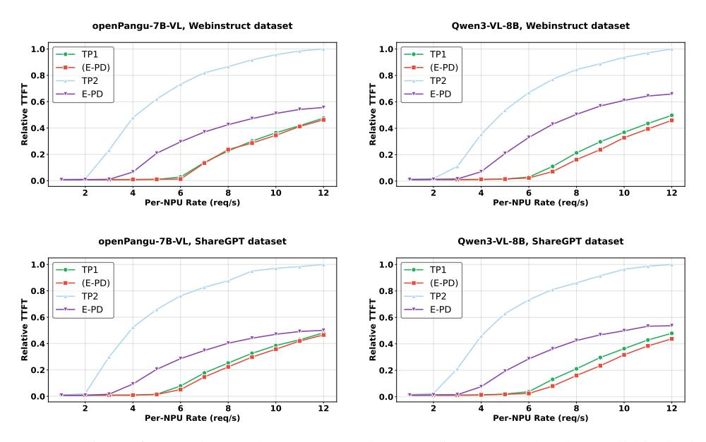

Figure 10: Comparison of TTFT latency between Encode-stage disaggregated and monolithic deployments. The (E-PD) deployment, which disaggregates and co-locates the E and PD on a single NPU, delivers lower TTFT latency than the TP1 baseline under single-NPU settings.

memory usage. This enables more effective reuse of AI Core and memory resources and yields consistently superior performance across models and datasets. For openPangu-7B-VL, compared with the TP1 baseline, (E-PD) maintains higher SLO attainment under all loads and, at 12 req/s, improves throughput by 12.87-14.88%, reduces TTFT by 2.7-3.25%, and reduces TPOT by 69.58-70.39%. For Qwen3-VL-8B, (E-PD) similarly outperforms TP1, with throughput gains of 7.36-9.24%, TTFT reductions of 7.65-8.74%, and TPOT reductions of 13.25-15.05%.

Further analysis of TTFT shows that (E-PD) surpasses TP1 once the load exceeds 6 req/s and provides more than a 2.7% improvement at 12 req/s. This indicates that under high concurrency, disaggregating the Encode

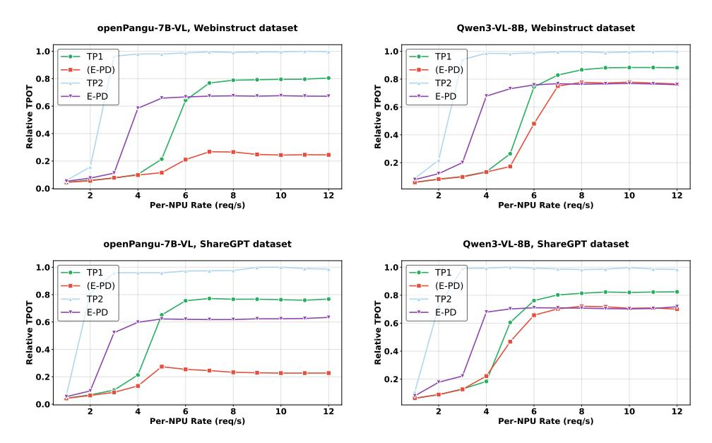

Figure 11: Comparison of TPOT latency between Encode-stage disaggregated and monolithic deployments. The (E-PD) deployment, which disaggregates and co-locates the E and PD on a single NPU, still maintains lower TPOT latency over the TP1 baseline under single-NPU settings.

stage enables more efficient multi-core utilization on the shared NPU, thereby improving end-to-end inference latency. For TPOT, although Decode dominates token-generation latency, Encode disaggregation shortens inference delay when Decode is momentarily blocked by new requests, yielding better TPOT performance than TP1. By contrast, TP2 increases parallelism through additional NPUs, but its inter-NPU synchronization overhead severely degrades performance, making it the worst-performing deployment. In summary, (E-PD) achieves both logical disaggregation and physical co-location of E and PD stages. This enables PD idle compute windows to be effectively reclaimed by the Encode stage, improving throughput while maintaining SLO stability and significantly reducing TTFT and TPOT. These results validate the advantages of Encode-stage disaggregation combined with physical co-location.

#### 4.4 Benefits of Decode Disaggregation

After examining the performance impact of Encode stage disaggregation, we now analyze the benefits of disaggregating the Decode stage. Figures 12 to 15 illustrate the evolution of four key metrics, SLO attainment rate, throughput, TTFT, and TPOT, as the request injection rate increases, on both the VisualWebInstruct and ShareGPT-40 datasets. The comparison includes representative deployments such as TP1, TP2, EP-D, (E-P)-D, and (E-D)-P.

The experimental results show that all Decode-disaggregated deployments, such as EP-D, (E-P)-D, and (E-D)-P, exhibit significant TPOT advantages across both datasets and models. Under high concurrency at req/s=12, TPOT is reduced by 79.99-93.31% relative to the TP1 baseline. This benefit arises because an independently deployed Decode stage no longer competes with Encode or Prefill for resources, thereby minimizing tail latency and demonstrating the central role of Decode disaggregation in stabilizing TPOT.

For TTFT, further decoupling Encode from Prefill, based on the Decode-disaggregated deployment, provides additional acceleration for first-token latency. When Encode is decoupled from Prefill and co-located with Decode in the (E-D)-P deployment, TTFT decreases by 39.22-54.56% compared with EP-D under high load. This improvement stems from the resource complementarity formed by the compute-intensive nature of Encode and the memory-intensive nature of Decode when co-located, thereby improving the execution efficiency of the Encode stage. In contrast, (E-P)-D co-locates two compute-intensive stages, yielding slightly higher TTFT than (E-D)-P, though still significantly better than the non-co-located EP-D. This confirms that physical co-location of Encode and Prefill improves TTFT through spatial multiplexing.

Regarding TPOT, both (E-P)-D and EP-D deliver optimal performance due to the independently deployed Decode stage, consistently maintaining low generation latency. Although (E-D)-P also deploys Decode

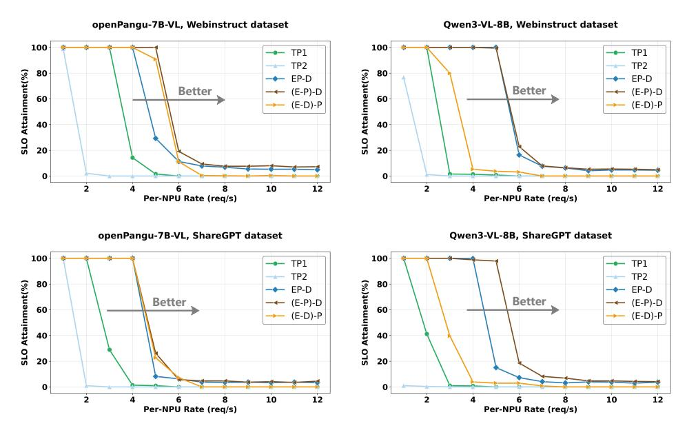

Figure 12: Comparison of SLO attainment rate between Decode-stage disaggregated and monolithic deployments. The (E-P)-D deployment, which further disaggregates and co-locates the E and P based on Decode-stage disaggregation, consistently achieves a higher SLO attainment rate than both the TP1 baseline and EP-D deployment.

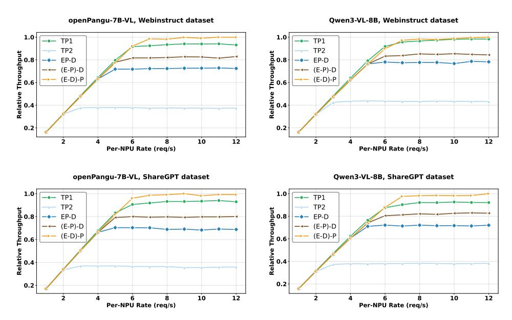

Figure 13: Comparison of throughput performance between Decode-stage disaggregated and monolithic deployments. The (E-D)-P deployment, which disaggregates and co-locates the E and D based on Decode-stage disaggregation, outperforms the TP1 baseline and EP-D deployment in throughput.

independently, its co-location with the Encode stage introduces minor resource contention during generation, causing slight TPOT degradation. However, this overhead remains small and is offset by the substantial TTFT gains.

Under SLO constraints requiring  $TTFT \leq 2000ms$  and  $TPOT \leq 50ms$ , only (E-P)-D and EP-D satisfy both latency requirements when using openPangu-7B-VL. Among them, (E-P)-D not only matches EP-D in TPOT but also achieves higher effective throughput, improving by 57.37-69.48% relative to EP-D, highlighting superior resource utilization and throughput scalability under high concurrency. Under more strict SLO

Figure 14: Comparison of TTFT performance between Decode-stage disaggregated and monolithic deployments. The (E-D)-P deployment, which disaggregates and co-locates the E and D based on Decode-stage disaggregation, delivers lower TTFT latency than the TP1 baseline and EP-D deployment.

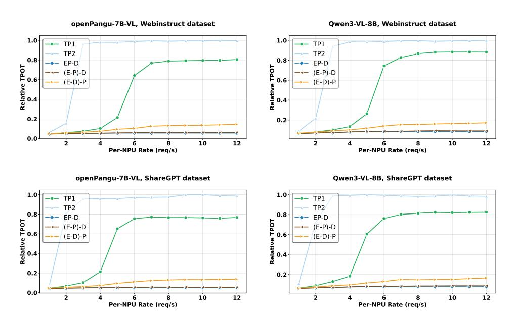

Figure 15: Comparison of TPOT performance between Decode-stage disaggregated and monolithic deployments. The (E-P)-D and EP-D deployments mitigate interference from the E and P stages by decoupling the D stage, resulting in lower TPOT latency compared to other deployments.

constraints of TTFT < 800ms and TPOT < 30ms, experiments are conducted on the ShareGPT-40 dataset with the average per-card request rate fixed at 4 req/s. In this setting, EP-D achieves an SLO attainment rate of 59.57% with an effective throughput of 294.68 tokens/s, whereas (E-P)-D improves the SLO attainment rate to 84.96% and increases effective throughput to 420.16 tokens/s. Compared with EP-D, (E-P)-D still delivers a 42.58% improvement in effective throughput under these stricter latency constraints.

In summary, independent deployment of the Decode stage is essential for achieving stable, low-tail TPOT. Building on this foundation, further decoupling the Encode stage and choosing appropriate co-location

Table 5: Performance comparison of different deployments for openPangu-7B-VL under high-load conditions, 10 req/s.

| Deployment | NPUs Number | TTFT(ms) | TPOT(ms) | SLO Attainment Rate | Per-NPU Effective Throughput |
|------------|-------------|----------|----------|---------------------|------------------------------|
| TP1×2      | 2           | 658.27   | 95.56    | 2.15%               | 13.38                        |
| (E-PD)×2   | 2           | 548.32   | 62.22    | 3.13%               | 19.70                        |
| EP-D       | 2           | 5523.82  | 27.31    | 8.20%               | 21.54                        |
| (E-P)-D    | 2           | 2386.85  | 28.40    | 26.17%              | 77.36                        |
| (E-D)-P    | 2           | 651.86   | 50.71    | 22.66%              | 69.18                        |
| E-P-D      | 3           | 557.89   | 28.92    | 94.34%              | 192.70                       |

strategies with Decode or Prefill enables additional TTFT or throughput gains, providing flexible performance tuning across workload levels and SLO.

#### 4.5 Benefits of Full Encode-Prefill-Decode Disaggregation

After separately analyzing the effects of Encode and Decode disaggregation, we now examine the synergistic behavior and performance benefits of fully disaggregating all three stages including Encode, Prefill, and Decode. Experiments are conducted on the ShareGPT-4o dataset with a fixed request rate of 10 req/s to compare TTFT, TPOT, and SLO attainment of different deployment strategies for the openPangu-7B-VL model. The results are summarized in Table [5.](#page-15-0)

Under high-load conditions at 10 req/s and stringent SLO constraints requiring T T F T ≤ 2000ms and T P OT ≤ 50ms, only four deployments, including EP-D, (E-P)-D, (E-D)-P, and E-P-D, can meet the SLO for a portion of requests. Among them, E-P-D delivers the best performance, achieving a 94.34% SLO attainment rate, the highest of all deployments. Its per-NPU effective throughput is 7.95 times that of EP-D, indicating that fully disaggregating all three stages enables substantially higher request-serving capacity under strict SLO constraints. These results demonstrate that the E-P-D deployment is particularly effective at improving the fraction of requests that meet tight latency constraints.

## 4.6 Comprehensive Analysis of EPD-Disaggregated Deployments

To further examine system behavior after disaggregating the Encode and Decode stages, Figure [16](#page-16-0) presents scatter plots of TTFT and TPOT distributions for the openPangu-7B-VL model under different request rates on the ShareGPT-4o dataset. These visualizations reveal how performance evolves across deployments under high concurrency from a fine-grained, request-level perspective.

For TTFT distribution, as the request injection rate increases, TP2 is the first to hit the system's processing limit, exhibiting clear queuing and rapidly rising TTFT. E-PD and TP1 subsequently enter overload. Under the high-load condition of 12 req/s, only (E-P)-D, (E-D)-P, and EP-D deployments maintain a relatively low TTFT range, while all others experience backlog and shift into the high-latency region. Notably, (E-D)-P achieves the best TTFT performance due to the complementary resource usage between its disaggregated Encode and Decode stages, confirming the effectiveness of Encode-Decode co-location for first-token latency optimization.

A similar pattern appears in the TPOT distribution. TP2 is the first to exhibit backlog, followed by E-PD, TP1, and (E-P)-D, indicating that PD monolithic deployments without Decode disaggregation are more susceptible to Decode-stage queuing and thus incur higher TPOT. At 12 req/s, all Decode-disaggregated deployments, like EP-D, (E-P)-D, and (E-D)-P, maintain low TPOT and clearly outperform monolithic deployments. Because (E-D)-P co-locates Encode and Decode, it experiences minor resource contention during generation, resulting in slightly higher TPOT than EP-D and (E-P)-D, though performance remains stable. Overall, under high concurrency, Decode-disaggregated designs consistently deliver the lowest output latency, demonstrating that decoupling Prefill and Decode effectively isolates the generation stage from new-request interference and ensures stable TPOT.

#### 4.7 Beneficial Scenarios for the EPD-Disaggregated Deployments

To clarify the applicability and performance advantage regions of different EPD-disaggregated deployments, Figure [17](#page-17-0) presents radar charts of TTFT, TPOT, and throughput for the openPangu-7B-VL model under varying request rates on the ShareGPT-4o dataset. These charts intuitively reveal the performance gains and the advantage regions of each deployment across different levels of concurrency pressure.

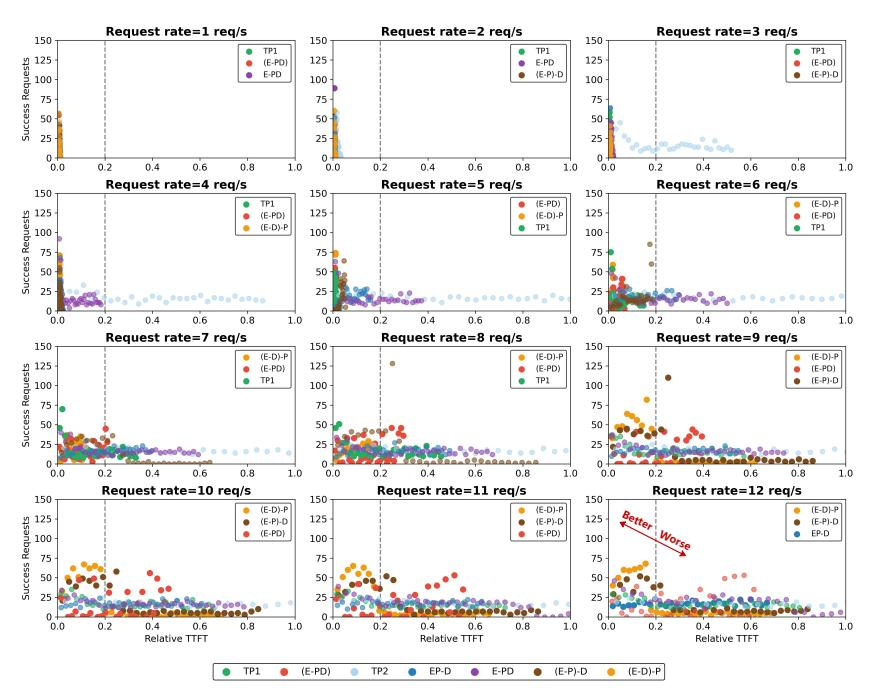

(a) TTFT distribution scatter plot of all requests. Higher-performing deployments cluster in the low-TTFT region with more successful requests. Under high load conditions, (E-P)-D, (E-D)-P, and EP-D concentrate in the low-TTFT region, outperforming other deployments.

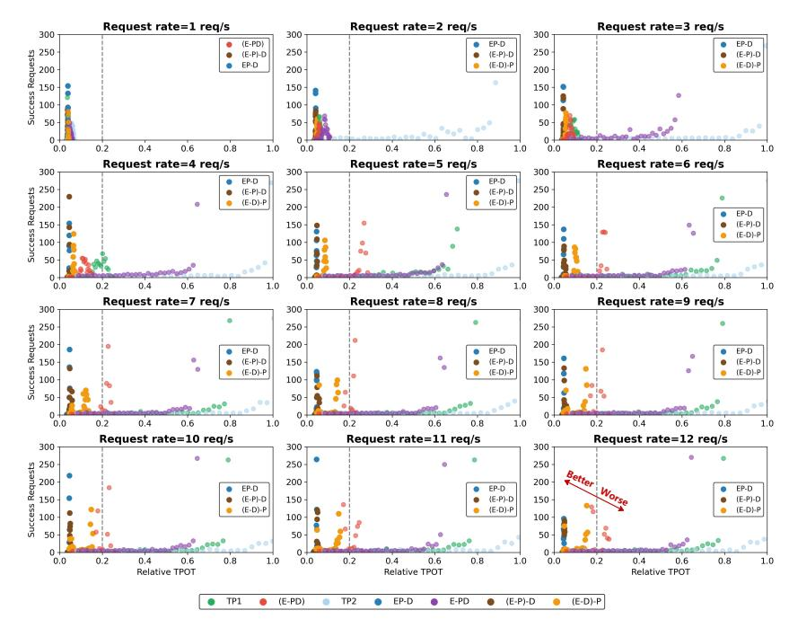

(b) TPOT distribution scatter plot of all requests. Higher-performing deployments cluster in the low-TPOT region with more successful requests. Under high load conditions, EP-D, (E-P)-D, and (E-D)-P concentrate in the low-TPOT region, outperforming other deployments.

Figure 16: TTFT and TPOT scatter plots of openPangu-7B-VL across deployments under increasing request rates. The subfigure legend highlights the top three deployments at each request rate.

