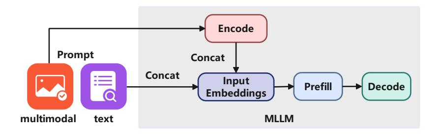
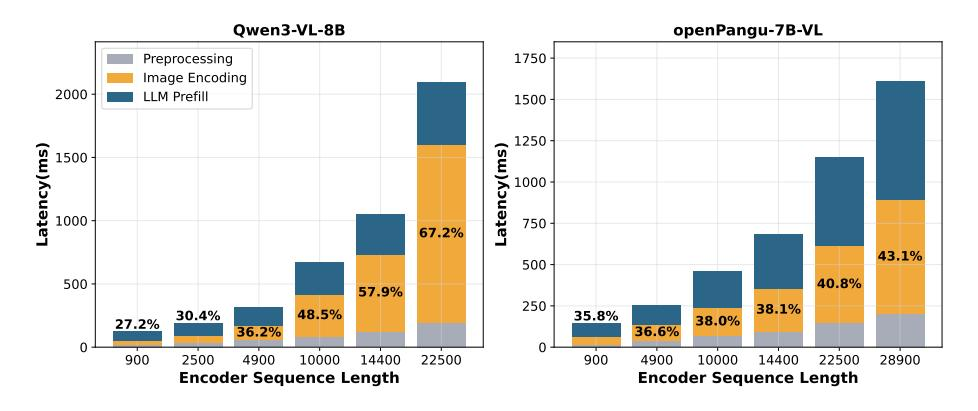

# EPD-SERVE: A FLEXIBLE MULTIMODAL EPD DISAGGREGATION INFERENCE SERVING SYSTEM ON ASCEND

Fan Bai1, Pai Peng1, Zhengzhi Tang1, Zhe Wang1, Gong Chen1, Xiang Lu1, Yinuo Li1, Huan Lin1, Weizhe Lin1, Yaoyuan Wang1, and Xiaosong Li1\*

1Huawei Technologies Co., Ltd

#### **ABSTRACT**

With the widespread deployment and continuous evolution of large models, the ability to process multiple modalities including text, image, audio, and video, has become increasingly essential for real-world applications. However, existing multimodal inference systems generally adopt a monolithic architecture, where the Encode, Prefill, and Decode stages are tightly coupled and executed on homogeneous hardware resources. This design fails to account for the heterogeneous computational characteristics of different inference stages, leading to suboptimal hardware utilization and severely constrained system throughput. To address these limitations, we propose EPD-Serve, a stage-level disaggregated inference serving system for multimodal models. Leveraging the computational characteristics of the inference pipeline, EPD-Serve decomposes the end-to-end inference process into three independent stages: Encode, Prefill, and Decode. This stage-level decoupling enables logical isolation and flexible co-located deployment of inference tasks through dynamic orchestration. Specifically, leveraging the Ascend hardware interconnect topology, EPD-Serve implements an asynchronous feature prefetching mechanism for the E-P stage and a hierarchical grouped KV cache transmission mechanism for the P-D stage, thereby improving cross-node communication efficiency. Moreover, to accommodate the properties of multimodal inputs, EPD-Serve incorporates multi-route scheduling strategies and instance-level load balancing schemes, along with multi-stage hardware resource co-location and spatial multiplexing at the physical layer. To validate the efficacy of EPD-Serve, we conduct comprehensive experiments on a set of multimodal understanding models, evaluating the system's end-to-end throughput under different disaggregated deployments and SLO constraints. Experimental results demonstrate that, in high-concurrency multimodal scenarios, EPD-Serve improves throughput by 57.37-69.48% relative to PD-disaggregated deployment while satisfying strict SLO constraints, including TTFT below 2000 ms and TPOT below 50 ms. These findings suggest a promising new direction for optimizing the architecture of multimodal large language model inference systems.

#### 1 Introduction

Multimodal Large Language Models (MLLMs) [1, 2, 3] achieve cross-modal semantic alignment based on a unified language foundation, and possess the capability of comprehensive inference on multimodal inputs such as images, audio, and video. Most mainstream MLLMs adopt an architectural paradigm that couples modality encoders with a large autoregressive decoder. Figure 1 illustrates the end-to-end inference pipeline of such models. In typical MLLM architectures, Vision encoders, typically implemented with Vision Transformers (ViTs) containing hundreds of millions to billions of parameters, generate visual token sequences that are significantly longer than those processed by foundation language models, whose parameter scales range from billions to tens of billions, as shown in Table 1. Since attention complexity grows quadratically with sequence length, the visual encoding stage can dominate end-to-end inference latency, in some cases exceeding the Prefill time of LLM, as shown in Figure 2. Moreover, multimodal requests exhibit wide variability in input modalities and token lengths, causing the performance bottleneck to shift dynamically across inference stages.

\* Corresponding author: lixiaosong20@huawei.com

Figure 1: Inference flow for large multi-modal language models.

Table 1: Parameter sizes of mainstream multimodal models.

| Models            | openPangu-7B-VL | Qwen3-VL-8B [4] | InternVL3-78B [5] |  |
|-------------------|-----------------|-----------------|-------------------|--|
| The Params of ViT | 0.7B            | 0.6B            | 6B                |  |
| The Params of LLM | 7B              | 8B              | 72B               |  |

Deploying such heterogeneous inference pipelines in real-world systems is challenging. Multimodal inference consists of three logically distinct stages, including Encode, Prefill, and Decode, whose data characteristics, module types, and parallelism requirements differ substantially. These differences manifest as three forms of heterogeneity. **Data heterogeneity** stems from diverse modality formats and dynamically varying sequence lengths, complicating unified dataflow management and resource allocation. **Model heterogeneity** arises because visual encoders rely on ViT or CNN modules with encoding, while LLM decoders depend on autoregressive generation with different computation and memory characteristics, complicating system-level scheduling. **Computational heterogeneity** further separates text-only from multimodal requests, as only the latter require executing the full Encode-Prefill-Decode pipeline, causing imbalanced workloads and execution blocking.

Existing inference frameworks, such as vLLM [6], SGLang [7], TGI [8], extend language-centric designs to multimodal settings by tightly coupling Encode and Prefill on the same hardware resources. This monolithic architecture exposes three critical performance bottlenecks in high-concurrency scenarios. First, **stage coupling creates execution interference**: visual encoding and text prefill compete for shared resources without isolation, allowing multimodal requests to block text-only requests, inflating Time-To-First-Token (TTFT), and disrupting Decode scheduling, thereby degrading Time-Per-Output-Token (TPOT) and overall throughput. Second, a unified parallelism strategy fails to accommodate heterogeneous stage requirements: Encode

Figure 2: Latency proportion of mainstream MLLMs as encoder sequence length increases.

prefers data or sequence parallelism, whereas Decode benefits from tensor parallelism for latency reduction. Unified parallelism prevents stage-specific optimization and limits scalability. Third, strict serial execution prevents resource reuse: Encode, Prefill, and Decode run exclusively in sequence despite complementary compute-memory characteristics, leaving substantial NPU resources underutilized.

These limitations render monolithic multimodal inference increasingly inefficient as deployment scales and hybrid-modal traffic intensifies. To overcome this fundamental architectural mismatch, we propose *EPD-Serve*, a flexible inference serving system that decouples the pipeline into independently schedulable Encode, Prefill, and Decode stages. *EPD-Serve* supports flexible disaggregation and co-location strategies, including E-P-D, EP-D, ED-P, and E-PD, enabling time-division specialization and spatial multiplexing tailored to diverse workload patterns. To mitigate the communication overhead introduced by disaggregation, we further design (1) an asynchronous feature prefetching mechanism that overlaps E-P data transfer with computation, and (2) a hierarchical grouped KV cache transmission mechanism that reduces and defers Prefill–Decode KV transfers. We evaluate *EPD-Serve* using the openPangu-7B-VL model and the ShareGPT-4o workload. Under an average load of 12 requests per second per NPU, *EPD-Serve* improves throughput by 57.37-69.48% over a strong PD-disaggregated baseline while satisfying stringent Service Level Objectives (SLOs) with T T F T ≤ 2000ms and T P OT ≤ 50ms. These results demonstrate that EPD disaggregation is a principled and effective architectural direction for high-performance multimodal inference.

