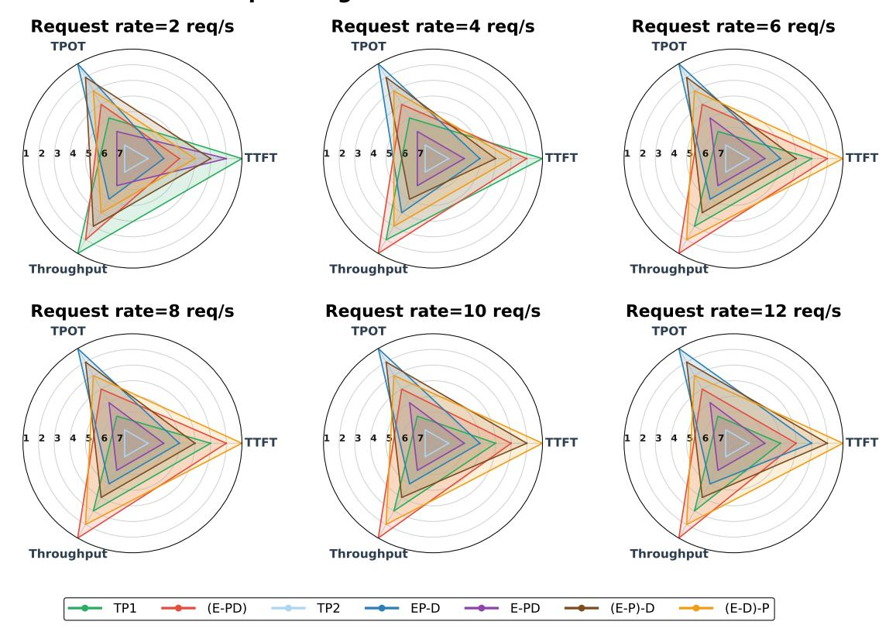

# **openPangu-7B-VL Performance**

Figure 17: TTFT, TPOT, and throughput performance of openPangu-7B-VL across deployments under varying request rates. This figure presents a radar chart where the 1-7 concentric circles indicate the ranking of deployments based on performance, with 1 representing the best. Under high-load scenarios, the EP-D, (E-D)-P, and (E-PD) deployments perform best on the TPOT, TTFT, and throughput, respectively.

As system load increases, the performance advantages and limitations of different deployments become increasingly distinct. Choosing an appropriate EPD-disaggregated strategy therefore requires aligning deployment decisions with specific SLO priorities:

High Performance: Low TTFT and Low TPOT. For scenarios demanding both fast first-token response and stable generation latency, (E-P)-D offers the most balanced performance. As shown in Figure [17,](#page-17-0) it maintains low TTFT and TPOT even under high concurrency, reflecting the benefits of three-stage disaggregation combined with selective co-location. This deployment is well suited for latency-critical production workloads with strict SLO constraints.

Fast Response for First-token: Low TTFT with Moderate TPOT Tolerance. When minimizing firsttoken latency is the primary objective and moderate TPOT is acceptable, (E-D)-P is preferable. Independent deployment of Encode significantly accelerates TTFT, although co-location with Decode introduces minor contention during generation, yielding slightly higher TPOT compared with EP-D. This deployment fits applications where rapid initial response is essential, such as short-text generation tasks.

Maximizing Throughput: Loose TTFT/TPOT Constraints. For workloads prioritizing throughput over strict latency metrics, (E-PD) provides clear advantages. By decoupling Encode and co-locating it with the PD stage on the same hardware, this deployment achieves substantial throughput gains, as shown in Figur[e17,](#page-17-0) despite being unable to meet tight SLO constraints for TTFT and TPOT. This makes it suitable for high-load, multi-user scenarios or RL post-training inference pipelines.

In summary, EPD-disaggregation strategies present complementary trade-offs among TTFT, TPOT, and throughput. (E-P)-D is ideal for meeting stringent latency SLOs, (E-D)-P excels when TTFT is the dominant requirement, and (E-PD) maximizes throughput under relaxed latency constraints. Such SLO-driven, finegrained deployment selection enables *EPD-Serve* to balance resource utilization and performance effectively across diverse workloads.

