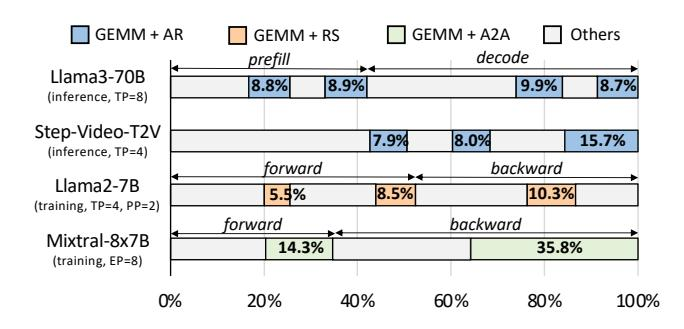

# 2.2 Inter-GPU Communication

The underlying behaviours of inter-GPU communication vary significantly across different hardware configurations (intra-node or inter-node, via NVLink [27], PCIe [40], or

**Figure 4.** Typical time portion of "GEMM + X" in inference and training. All profilings are on A800 GPUs.

InfiniBand [31], etc.). Aimed at hiding the interconnect hardware complexities from users, libraries such as the NVIDIA collective communications library (NCCL) [32] provide highlevel APIs for various communication primitives. NCCL supports encapsulated collective communication primitives including AllReduce, AllGather, and ReduceScatter, as well as point-to-point send/receive operations, which can be used for constructing the All-to-All primitive. Besides the convenience, NCCL also optimizes efficiency for communication, such as implementing the RING algorithm [38] for better bandwidth efficiency. The communication agnostism enables our design to leverage NCCL through standard API calls directly. Note that other libraries such as MSCCLang [8] and DeepEP [10] are achieving similar functionality, and can also be seamlessly integrated into our design through API calls.

