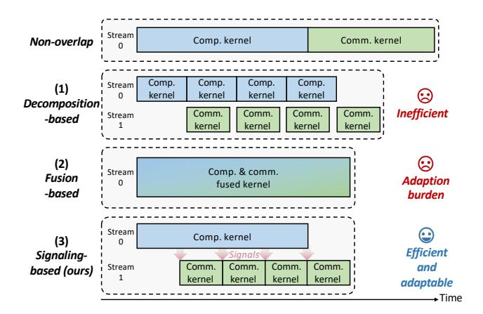
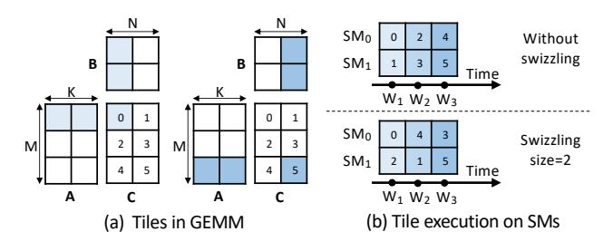

# 1 Introduction

In recent years, generative models have revolutionized various fields, powering applications including chatbots [\[9,](#page-14-1) [35,](#page-14-2) [47\]](#page-15-0), code assistants [\[6,](#page-13-0) [43\]](#page-15-1), video generation [\[13,](#page-14-3) [45,](#page-15-2) [48,](#page-15-3) [53\]](#page-15-4), and agent systems [\[14,](#page-14-4) [22\]](#page-14-5). To continuously enhance the intelligence capabilities of generative models, the number of parameters has dramatically increased, e.g., DeepSeek-V3 [\[9\]](#page-14-1) contains 671B parameters. Meta has recently previewed its most powerful model, Llama 4 Behemoth [\[23\]](#page-14-6), which scales

\*Corresponding to Yu Wang <yu-wang@tsinghua.edu.cn>, Xiuhong Li <lixiuhong@infini-ai.com>, Guodao Dai <daiguohao@sjtu.edu.cn>.

[This work is licensed under a Creative Commons Attribution 4.0 Interna](https://creativecommons.org/licenses/by/4.0)[tional License.](https://creativecommons.org/licenses/by/4.0)

EUROSYS '26, Edinburgh, Scotland Uk © 2026 Copyright held by the owner/author(s). ACM ISBN 979-8-4007-2212-7/26/04 <https://doi.org/10.1145/3767295.3769370>

Figure 1. Overlapping methods. (1) Decomposition-based methods are easy to implement while yielding suboptimal overlapping efficiency, (2) fusion-based methods are efficient at the cost of high adaptation efforts, while (3) the proposed signaling-based method optimizes for both efficiency and easy adaptation.

to 2T parameters. Computing devices, such as GPUs, typically offer limited memory capacity, making it infeasible to accommodate those massive parameters on a single GPU for deploying generative models. Consequently, parameter partitioning across multiple devices has become essential, typically through tensor parallelism (TP), pipeline parallelism (PP), and expert parallelism (EP). Besides, the growing data volume necessitates data parallelism (DP) to enable multi-GPU computation. Such multi-GPU computing paradigms inevitably introduce non-negligible inter-GPU communication overheads, primarily arising from collective communication primitives such as AllReduce, ReduceScatter, and All-to-All. For deployment on consumer-grade GPUs, such as in local inference scenarios, the communication overhead is further exacerbated, as PCIe interconnection (typically offering 16-64 GB/s bidirectional bandwidth) serves as the primary communication channel between GPUs.

Overlapping computation and communication has emerged as an effective technique to mitigate communication overhead. The core idea lies in executing computation with communication operations asynchronously, to fully exploit the heterogeneous hardware. In generative models, the computation part is typically general matrix multiplication (GEMM), and is executed on the high-throughput Tensor Core, while the communication part utilizes specialized interconnection hardware such as NVLink [\[27\]](#page-14-7). Unfortunately, data dependency between computation and communication prevents the concurrent execution. To resolve the data dependency, two mainstream methods have been proposed, as shown in Fig. [1.](#page-1-0) (1) Decomposition-based method decomposes the output tensor of the computation into multiple subtensors, enabling asynchronous overlap between communication for

Table 1. Comparison of existing works and our design. Tile-wise overlapping. Decomposition-based methods require contiguous data for library API communications, but a 2D GEMM tile is inherently non-contiguous (stride=). Interference-free computation. Decomposition-based methods fragment the original GEMM into smaller ones to interleave with communication, and fusion-based methods implement communication into the GEMM kernel. Communication agnosticism. Fusion-based methods necessitate adaptation efforts for the customized kernel.

| Method                                         | Tile-wise Overlapping | Interference-free Computation | Communication Agnosticism |  |
|------------------------------------------------|--------------------------|----------------------------------|------------------------------|--|
| Decomposition-based [5, 10, 15, 17, 49, 52] | ×                        | ×                                | ✓                            |  |
| Fusion-based [4, 28, 41, 51, 54, 56]        | ✓                        | ×                                | ×                            |  |
| Signaling-based (ours)                         | ✓                        | ✓                                | ✓                            |  |

the -th subtensor and computation for the ( +1)-th subtensor. The computation and communication of each subtensor form a pair of GEMM and communication kernels, which can be implemented by directly calling APIs such as cuBLAS [\[28\]](#page-14-11) and NCCL [\[32\]](#page-14-0), respectively. (2) Fusion-based method fuses the GEMM computation and the communication primitive into a single GPU kernel. In GEMM, a tile refers to a block of output data that is dispatched to streaming multiprocessors (SMs) as a unit for computation, as shown in Fig. [2.](#page-2-0) The fusion-based method exploits the inter-tile computation and communication overlap by carefully scheduling their behaviors in the customized kernel.

However, the two methods fail to jointly optimize for efficiency and adaptability. The inefficiency of the decompositionbased methods arises from two aspects. First, to ensure data contiguity for direct communication API calls, the decomposition is limited to only one dimension, otherwise the subtensor from the decomposition is not contiguous in address. Such a decomposition results in misalignment with the tile-based parallel paradigm for the GEMM, as a tile is inherently non-contiguous in address. Consequently, the decomposition-based method fails to exploit tile-wise finegrained overlapping. Second, if the GEMM shape is insufficiently large, the fragmented computation will fail to fully utilize the GPU computational resources, thereby negating the performance benefits of overlap. The fusion-based method requires prohibitive manual optimization requirements, which also arise from two aspects. First, fusion requires manually implemented communication primitives, failing to utilize the existing high-performance communication library such as NCCL [\[32\]](#page-14-0). Consequently, this method suffers from low generalizability: each communication primitive (AllReduce, ReduceScatter, etc.) demands a customized fusion implementation. Second, when implemented within the same kernel,

Figure 2. Tile partition and execution in GEMM.

aligning the data granularity between computation and communication may require modifications to the computational logic or tiling strategies, potentially leading to performance degradation that necessitates further tuning.

In this paper, we identify that an efficient and adaptable overlapping design should incorporate the following features. (1) Tile-wise overlapping. As tile is logically the minimum parallel data unit in the GEMM output, tile-wise overlapping maximizes the overlapping opportunity. (2) Interferencefree computation. To maintain original computational performance, interference with GEMM, including segmentation, tiling or logic changes, should be avoided. (3) Communication agnosticism. The design should be agnostic to the communication primitive, so that no repeated development efforts are spent in implementing the communication primitive. We categorize the existing works in Table 1. The decomposition-based methods fail to achieve tile-wise overlapping and interference-free computation, while the fusionbased methods suffer from repeated GEMM tuning and communication primitive implementation efforts.

We propose a novel signaling-based overlapping design named FlashOverlap that meets all three features. The core idea is utilizing signals to trigger communication without interrupting the GEMM computation process (interference*free computation*). On top of that, our design comprises two key components. (1) We analyze and optimize the signaling timing to maximize the overlap efficiency. The signaling mechanism can send a signal for an individual completed tile in GEMM computation (tile-wise overlapping), and based on that, we explore the inherent wave pattern in GEMM execution, which means multiple tiles are finished nearly simultaneously as if they are in a wave. Therefore, we unveil the potential of using a wave instead of a tile as the unit of overlapping to enhance the bandwidth utilization with nearly no overlapping opportunity loss. (2) Furthermore, we introduce a pair of reorderings to address the issue caused by data contiguity. Specifically, the pre-communication reordering ensures the contiguous address of data ready for communication, which enables the direct NCCL [32] API calls for implementation (communication agnosticism). The post-communication reordering is carefully designed to correct the data order after the communication. To further enhance the performance of our design, we extend the signaling timing to be a tunable number of waves (denoted as a

wave group in this paper), and further propose a predictive search method to find the optimal wave grouping solution in real time.

In summary, this paper makes the following contributions:

- We introduce a novel signaling-based design to achieve computation-communication overlap, which sends signals from the GEMM kernel to trigger communication without interrupting the computation process.
- Starting from the tile-wise signaling, we exploit the wave-wise signaling to enhance bandwidth utilization while maintaining the overlapping opportunity. We further enable the design to be tunable via wave grouping, and propose a predictive search method to optimize the wave grouping selection.
- We introduce a pair of reorderings before and after communication, with the former creating a contiguous data address for NCCL [32] API calling, and the latter correcting the data order. The overhead of reorderings is mitigated by kernel fusion.
- We conduct experiments to evaluate the proposed design with communication primitives including AllReduce, ReduceScatter, and All-to-All, with each tested under hundreds of GEMM sizes. We also evaluate the design in the inference and training tasks with typical generative models. The results demonstrate that our design achieves up to 1.65× speedup through computation-communication overlap, and is effective in end-to-end inference and training.

