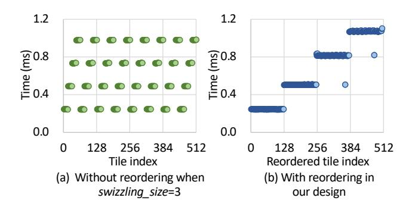

# 2 Background

In this section, we elaborate on the characteristics of the GEMM computation and the existing inter-GPU communication implementations on modern GPUs. Subsequently, we demonstrate that the pattern of GEMM computation followed by data-dependent communication can be commonly found in both training and inference of generative models, emerging as one of the primary bottlenecks for improving efficiency in multi-GPU computing systems. Based on that, we present a comprehensive survey and comparative analysis of prior works for computation-communication overlap.

#### 2.1 General Matrix Multiplication

**2.1.1 Wave Pattern in GEMM.** As the core operator in neural networks, general matrix multiplication (GEMM) can be formulated as  $A^{M \times K} \times B^{K \times N} = C^{M \times N}$ , where M, N, K collaboratively represent the GEMM size. Modern GPUs consist of multiple streaming multiprocessors (SMs) [26], where each SM contains independent computational and on-chip memory resources. To exploit the parallel execution across SMs, a GEMM workload is partitioned into tiles distributed across SMs. The output matrix C is partitioned into tiles, with each tile's workload including the corresponding data loading and computation from the input matrices A and B.

**Figure 3.** Wave pattern in GEMM execution. Each point in (a) and (b) represents the corresponding completion time of each tile, and the time is captured by the global timer [33].

Those tiles are scheduled across different SMs for parallel execution. A concrete example is illustrated in Fig. 2, where six tiles are distributed across two SMs. Consequently, the tile execution follows a specific sequential order. Notably, the completion time of the tiles exhibits a distinct wave pattern.

A wave is defined as a set of concurrently executed tiles [36]. As shown in Fig. 3, we record the completion time of each tile in a GEMM (M=2048, N=K=8192) on an RTX 4090 GPU, and the tile completion time can be distinctly categorized into four distinct waves, which is consistent with the result of dividing tile number (512) by SM number (128). Furthermore, we observe that the completion order of tiles does not align with the memory address (represented by tile index), if the block swizzling is applied, as detailed in Sec.2.1.2.

2.1.2 Block swizzling. The tile execution order in GEMM is influenced by techniques such as block swizzling [25]. Block swizzling refers to scheduling tiles onto SMs in a swizzling manner for enhanced memory access efficiency, as depicted in Fig. 2(b). The address discontiguity in a wave prevents early-finished tiles from being promptly communicated. To address the mismatch and enable tile-wise overlapping, we introduce the data reordering technique, which is described in Sec. 3.3.

**2.1.3 Main Loop and Epilogue.** The execution of a GEMM involves the main loop and the epilogue. The main loop performs the core multiply-accumulate operations and accounts for the majority of the GEMM duration, while the epilogue refers to element-wise operation (*e.g.*, ReLU, SiLU, or bias addition) performed after matrix multiplication. Those element-wise operation is typically fused with the preceding matrix multiplication into a single GPU kernel [7], thereby eliminating redundant memory accesses and kernel launch overhead.

