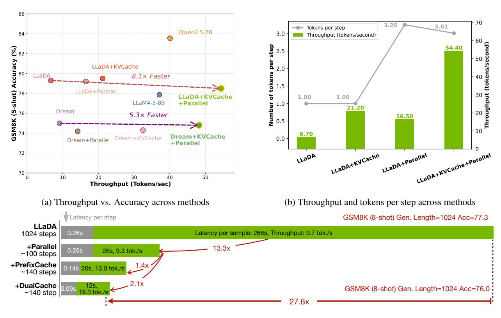

# 1. Introduction

Diffusion-based large language models (Diffusion LLMs) have recently attracted increasing attention due to their potential for parallel token generation and the advantages of bidirectional attention mechanisms. Notably, Mercury [\[13](#page-20-0) ] runs at over 1,000 tokens per second, and Gemini Diffusion [ [8\]](#page-20-1) by Google DeepMind has demonstrated the ability to generate over 1,400 tokens per second, highlighting the promise of significant inference acceleration.

However, current open-source Diffusion LLMs [\[21](#page-20-2) , [36\]](#page-21-0) have yet to close such throughput gap in practice, and their actual speed often falls short of autoregressive (AR) models. This is primarily due to two issues. First, diffusion LLMs do not support key-value (KV) caching, a critical component in AR models for speeding up inference. Second, the generation quality tends to degrade when decoding multiple tokens in parallel. For example, recent findings such as those from LLaDA [\[21\]](#page-20-2) indicate that Diffusion LLMs perform best when generating tokens one at a time and soon degrades when decoding multiple tokens simultaneously.

To bridge the performance gap with AR models that benefit from KV Cache, we present Fast-dLLM, a fast and practical diffusion-based language modeling framework. First, Fast-dLLM introduces an approximate KV Cache tailored to Diffusion LLMs. While the bidirectional nature of attention in Diffusion LLMs precludes a fully equivalent KV Cache, our approximation closely resembles an ideal cache in practice. To support KV Cache, we adopt a block-wise generation manner. Before generating a block, we compute and store KV Cache of the other blocks to reuse. After generating the block, we recompute the KV Cache of all the blocks. Visualizations confirm the high similarity with adjacent inference steps within the block, and our experiments show that this approximation preserves model performance during inference. We further propose a DualCache version that caches Keys and Values for both prefix and suffix tokens.

In parallel, Fast-dLLM investigates the degradation in output quality when generating multiple tokens simultaneously. Through theoretical analysis and empirical studies, we identify that simultaneous sampling of interdependent tokens under a conditional independence assumption disrupts critical token dependencies. To address this issue and fully exploit the parallelism potential of Diffusion LLMs, we propose a novel confidence-thresholding strategy to select which tokens can be safely decoded simultaneously. Instead of selecting the tokens with top K confidence to decode as in LLaDA, we select tokens with confidence larger than a threshold. Our theoretical justification and experimental results demonstrate that this strategy maintains generation quality while achieving up to 13.3 × inference speed-up.

In summary, our contributions are threefold:

1The University of Hong Kong 2NVIDIA 3MIT 4 Independent Researcher \*Equal contribution.

(c) End-to-end speedup over vanilla LLaDA baseline.

Figure 1 | Effectiveness of components of Fast-dLLM across different approaches. We use NVIDIA A100 GPU with a single batch size and no inference speedup frameworks.. (a) Inference throughput (tokens/sec) and GSM8K (5-shot) accuracy across various designs and models under a maximum generation length of 256. Caching mechanism and parallel decoding can significantly accelerate inference, while the combination provides up to an 8.1× increase in throughput with negligible accuracy reduction. (b) We break down the contributions of each method by showing both the number of tokens generated per step (line) and total throughput (bars). (c) With long prefilling (8-shot) and a maximum generation length of 1024, our combined approach achieves up to 27.6× end-to-end speedup compared to the vanilla LLaDA baseline.

- 1. **Key-Value Cache for Block-Wise Decoding** We introduce a block-wise approximate KV Cache mechanism specifically designed for bidirectional attention. Our approach reuses cached activations from previously decoded blocks by exploiting the high similarity of KV activations between adjacent steps. By caching both prefix and suffix blocks, the DualCache strategy enables substantial computational reuse.
- 2. **Confidence-Aware Parallel Decoding** We propose a novel confidence-aware parallel decoding method. Unlike prior approaches that select a fixed number of tokens per step, our method dynamically selects tokens whose confidence exceeds a global threshold, enabling safe and effective parallel decoding. This approach significantly accelerates inference by 13.3× while preserving output quality.
- 3. **State-of-the-Art Acceleration Results** We conduct comprehensive experiments on multiple open-source Diffusion LLMs (LLaDA, Dream) and four mainstream benchmarks (GSM8K, MATH, HumanEval, MBPP). Results demonstrate that our Fast-dLLM consistently deliver order-of-magnitude speedups with minimal or no degradation in accuracy, confirming the generality and practical value of our approach for real-world deployment. Fast-dLLM achieves higher acceleration (up to 27.6×) when generation length is longer (1024).

