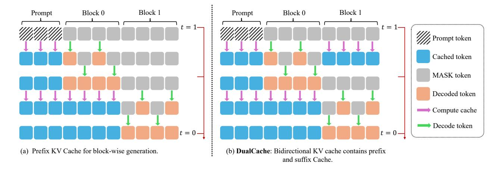

# 2. Preliminary

### 2.1. Masked Diffusion Model

Diffusion models for discrete data were first explored in [\[29,](#page-21-1) [11\]](#page-20-3). Subsequently, D3PM [\[2\]](#page-20-4) proposed a more general framework, defining the forward noising process via a discrete state Markov chain with specific transition matrices , and parameterized (0|) for learning the reverse process by maximizing the Evidence Lower Bound (ELBO). CTMC [\[3\]](#page-20-5) further extended D3PM to continuous time, formalizing it within a continuous-time Markov Chain (CTMC) framework. In a different approach, SEDD [\[17\]](#page-20-6) parameterizes the likelihood ratio () () for learning the reverse process, and employs Denoising Score Entropy to train this ratio.

Among the various noise processes in discrete diffusion, Masked Diffusion Models (MDMs), also termed absorbing state discrete diffusion models, have gained considerable attention. MDMs employ a forward noising process where tokens are progressively replaced by a special [MASK] token. This process is defined by the transition probability:

$$q_{t|0}\left(\boldsymbol{x}_{t}|\boldsymbol{x}_{0}\right) = \prod_{i=1}^{n} q_{t|0}\left(\boldsymbol{x}_{t}^{i}|\boldsymbol{x}_{0}^{i}\right) = \prod_{i=1}^{n} \operatorname{Cat}\left(\boldsymbol{x}_{t}^{i}; (1-t)\delta_{\boldsymbol{x}_{0}^{i}} + t\delta_{[\text{MASK}]}\right). \tag{1}$$

Here, ∈ [0*,* 1] denotes the diffusion time (or masking level), controlling the interpolation between the original data 0 (at = 0) and a fully masked sequence (at = 1).

More recently, work by MDLM [\[28,](#page-21-2) [27,](#page-21-3) [41\]](#page-21-4) and RADD [\[22\]](#page-21-5) has shown that for MDMs, different parameterizations are equivalent. Furthermore, they demonstrated that the training objective for MDMs can be simplified or directly derived from the data likelihood. This leads to the following objective function, an Evidence Lower Bound (ELBO) on log ():

$$-\log p_{\boldsymbol{\theta}}(x) \leq \int_{0}^{1} \frac{1}{t} \mathbb{E}_{q_{t|0}(\boldsymbol{x}_{t}|\boldsymbol{x}_{0})} \left[ \sum_{i:\boldsymbol{x}_{0}^{i} = [\text{MASK}]} -\log p_{\boldsymbol{\theta}}(\boldsymbol{x}_{0}^{i}|\boldsymbol{x}_{t}) \right] dt \coloneqq \mathcal{L}_{\text{MDM}}. \tag{2}$$

### 2.2. Generation Process of MDMs

The analytical reverse of the forward process defined in Equation [1](#page-2-0) is computationally inefficient for generation, as it typically involves modifying only one token per step [\[3,](#page-20-5) [17\]](#page-20-6). A common strategy to accelerate this is to employ a -leaping [\[6\]](#page-20-7) approximation for the reverse process. In the context of MDMs, this allows for an iterative generation process where multiple masked tokens can be approximately recovered in a single step from a noise level to an earlier level  *<* .

$$q_{s|t} = \prod_{i=0}^{n-1} q_{s|t}(\boldsymbol{x}_s^i | \boldsymbol{x}_t), \text{ where } q_{s|t}(\boldsymbol{x}_s^i | \boldsymbol{x}_t) = \begin{cases} 1, & \boldsymbol{x}_t^i \neq [\text{MASK}], \boldsymbol{x}_s^i = \boldsymbol{x}_t^i \\ \frac{s}{t}, & \boldsymbol{x}_t^i = [\text{MASK}], \boldsymbol{x}_s^i = [\text{MASK}] \\ \frac{t-s}{t} q_{0|t}(\boldsymbol{x}_s^i | \boldsymbol{x}_t), & \boldsymbol{x}_t^i = [\text{MASK}], \boldsymbol{x}_s^i \neq [\text{MASK}]. \end{cases}$$
(3)

Here, 0|( |) (when = [MASK]) represents a distribution over the vocabulary for predicting a non-[MASK] token, provided by the model. In scenarios involving conditional data, such as generating a response 0 to a prompt , the MDM's reverse process, as defined in Equation [3,](#page-2-1) requires adaptation. Specifically, the model's predictive distribution 0|( |) for unmasking a token is now also conditioned on the prompt , as 0|( |*,* ).

Curse of Parallel Decoding Directly reversing the forward process from Equation [1](#page-2-0) for generation is slow, typically altering just one token per step [\[3,](#page-20-5) [17\]](#page-20-6). A common strategy to accelerate this is to employ a -leaping [\[6\]](#page-20-7) approximation for the reverse process. For MDMs, this means multiple masked tokens will be generated in parallel in a single step. However, a significant challenge arises in multiple token prediction due to the conditional independence assumption. Consider an example from [\[30\]](#page-21-6): *The list of poker hands that consist of two English words are: \_ \_*. The subsequent two words could be, for instance, "high card," "two pair," "full house," or "straight flush." Notably, a correlation exists between these two words. However, the multi-token prediction procedure in MDMs first generates a probability distribution for each token and then samples from these distributions independently. This independent sampling can lead to undesirable combinations, such as "high house."

To formalize this, consider unmasking two token positions, and . MDMs sample these from ( |) · ( |) due to the conditional independence assumption. However, the true joint probability requires accounting for the dependency:

Figure 2 | Illustration of our Key-Value Cache for Block-Wise Decoding. (a) During prefix-only caching, the KV cache is computed once for the prompt and reused across multiple decoding steps within each block. The cache is updated after completing a block to maintain consistency, with negligible overhead. (b) DualCache extends this approach by caching both prefix and masked suffix tokens, further accelerating decoding. The high similarity of KV activations across steps allows effective reuse with minimal approximation error.

( *,* |) = ( |) · ( |*,* ) (or symmetrically, by conditioning on ). This discrepancy between the assumed independent generation and the true dependent data distribution can degrade the quality and coherence of the generated sequences. The issue is more problematic when a large number of tokens are unmasked simultaneously in a single step.

