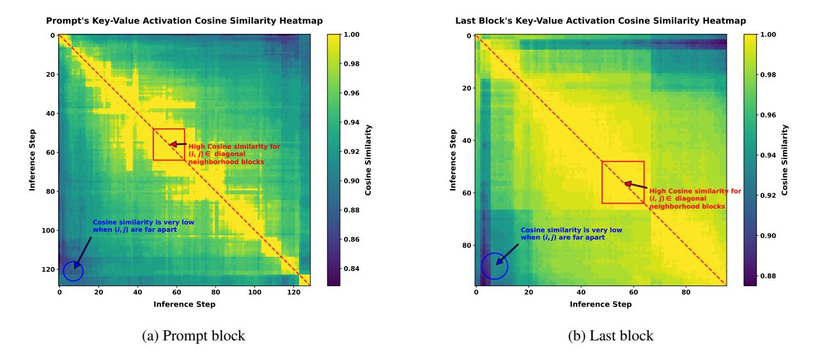
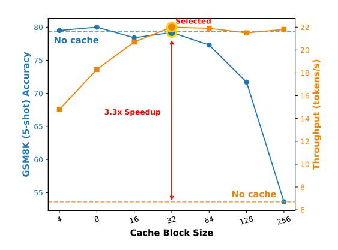
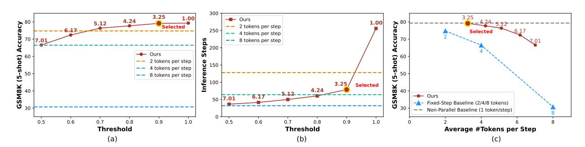

# 3. Methodology

#### 3.1. Pipeline Overview

Our approach, Fast-dLLM, builds on the Masked Diffusion Model (MDM) architecture to enable efficient and highquality sequence generation. To accelerate inference, the overall pipeline incorporates two key strategies: efficient attention computation through Key-Value (KV) Cache and a parallel decoding scheme guided by prediction confidence.

Specifically, we adopt Key-Value Cache for Block-Wise Decoding, which allows reusing attention activations across steps and significantly reduces redundant computation. Within each block, we further propose Confidence-Aware Parallel Decoding, enabling selective updates of tokens based on confidence scores to improve efficiency while maintaining output quality.

By combining these strategies, Fast-dLLM significantly speeds up inference for MDMs with minimal impact on generation performance. The overall procedure is summarized in Algorithm [1.](#page-5-0)

### 3.2. Key-Value Cache for Block-Wise Decoding

As shown in Figure [2,](#page-3-0) we adopt a block-wise decoding strategy to support the use of a Key-Value (KV) Cache. Initially, we compute and store the KV Cache for the prompt, which is reused throughout Block 0. Within each block, the same cache is reused for multiple decoding steps. After completing the decoding of a block, we update the cache for all tokens (not just the newly generated ones). This cache update can be performed jointly with the decoding step, so compared to not using caching, there is no additional computational overhead. This approach results in an approximate decoding process, due to the use of full attention in masked diffusion models [\[21,](#page-20-2) [36\]](#page-21-0).

The effectiveness of our approximate KV Cache approach stems from the observation that KV activations exhibit high similarity across adjacent inference steps, as illustrated in Figure [3.](#page-4-0) The red boxed region in Figure [3a](#page-4-0) highlights the similarity scores within a block, which are consistently close to 1. This indicates that the differences in prefix keys and values during block decoding are negligible, allowing us to safely reuse the cache without significant loss in accuracy.

Furthermore, we implement a bidirectional version of our KV caching mechanism, named DualCache, that caches not

only the prefix tokens but also the suffix tokens, which consist entirely of masked tokens under our block-wise decoding scheme. As shown in Table 4, DualCache results in further acceleration. The red boxed region in Figure 3b further demonstrates that the differences in suffix keys and values during block decoding are negligible.

<span id="page-4-0"></span>

Figure 3 | Heatmaps of Key-Value Activation Cosine Similarity Across Inference Steps in LLaDA-Instruct. (a) Cosine similarity heatmap for the prompt block, averaged over all prompt tokens. (b) Cosine similarity heatmap for the last block, averaged over all tokens in the last block (used to represent suffix tokens, as the last block always belongs to the suffix before its own decoding). In both (a) and (b), high similarity is observed near the diagonal ( $i \approx j$ ), indicating that Key-Value activations at adjacent inference steps within a block are highly similar. The red boxed regions highlight this effect, supporting the use of an approximate block-wise KV Cache: cached activations from previous steps can be safely reused during block decoding with minimal loss in accuracy. The DualCache strategy, which additionally caches suffix tokens, further demonstrates negligible differences in activations during block decoding, enabling greater acceleration with competitive accuracy.

#### 3.3. Confidence-Aware Parallel Decoding

While approaches like employing auxiliary models to explicitly capture these dependencies exist [16, 34], they typically increase the complexity of the overall pipeline. In contrast to these approaches, we propose a simple yet effective confidence-aware decoding algorithm designed to mitigate this conditional independence issue.

Concretely, at each iteration, rather than aggressively unmasking all masked tokens using their independent marginal probabilities, we compute a confidence score for each token (e.g., the maximum softmax probability). Only those with confidence exceeding a threshold are unmasked in the current step; the rest remain masked and are reconsidered in future steps. If no token's confidence exceeds the threshold, we always unmask the token with the highest confidence to ensure progress and prevent an infinite loop. This strategy accelerates generation while reducing errors from uncertain or ambiguous predictions.

A critical question, however, is: When is it theoretically justifiable to decode tokens in parallel using independent marginals, despite the true joint distribution potentially containing dependencies? We address this with the following formal result, which characterizes the conditions under which greedy parallel (product of marginal distribution) decoding is equivalent to greedy sequential (true joint distribution) decoding in the high-confidence regime, and quantifies the divergence between the two distributions.

<span id="page-4-1"></span>Prior to presenting the theorem, we will define the mathematical notation used in its statement. Let  $p_{\theta}(\cdot|E)$  denote the conditional probability mass function (PMF) given by an MDM condition on E (comprising a prompt  $p_0$  and previously generated tokens). Suppose the model is to predict n tokens for positions  $i_1,\ldots,i_n$  not in E. Let  $\mathbf{X}=(X_{i_1},\ldots,X_{i_n})$  be the vector of n tokens, where each  $X_{i_j}$  takes values in vocabulary  $\mathcal{V}$ . Let  $p(\mathbf{X}|E) \equiv p_{\theta}(X_{i_1},\ldots,X_{i_n}|E)$  be the joint conditional PMF according to the model. Let  $p_j(X_{i_j}|E) \equiv p_{\theta}(X_{i_j}|E)$  be the marginal conditional PMF for position  $i_j$ . Parallel decoding generates tokens using the product of marginals:  $q(\mathbf{X}|E) = \prod_{j=1}^n p_j(X_{i_j}|E)$ . The proof of Theorem 1 and relevant discussions are in Appendix A.

**Theorem 1** (Parallel Decoding under High Confidence). Suppose there exists a specific sequence of tokens  $\mathbf{x}^* = (x_{i_1}, \dots, x_{i_n})$  such that for each  $j \in \{1, \dots, n\}$ , the model has high confidence in  $x_{i_j}$ :  $p_j(X_{i_j} = x_{i_j}|E) > 1 - \epsilon$  for some small  $\epsilon > 0$ . Then, the following results hold:

1. Equivalence for Greedy Decoding: If  $(n+1)\epsilon \leq 1$  (i.e.,  $\epsilon \leq \frac{1}{n+1}$ ), then

$$\underset{\boldsymbol{z}}{\operatorname{argmax}} p(\boldsymbol{z}|E) = \underset{\boldsymbol{z}}{\operatorname{argmax}} q(\boldsymbol{z}|E) = \boldsymbol{x}^*. \tag{4}$$

This means that greedy parallel decoding (selecting argmax q) yields the same result as greedy sequential decoding (selecting argmax p).

This bound is tight: if  $\epsilon > \frac{1}{n+1}$ , there exist distributions  $p(\boldsymbol{X}|E)$  satisfying the high-confidence marginal assumption for which  $\operatorname{argmax}_{\boldsymbol{z}} p(\boldsymbol{z}|E) \neq \operatorname{argmax}_{\boldsymbol{z}} q(\boldsymbol{z}|E)$ .

2. Distance and Divergence Bounds: Let  $p(\cdot|E)$  and  $q(\cdot|E)$  be denoted as p and q for brevity.

 $L_p$  Distance  $(p \ge 1)$ : For n > 1,  $D_p(p,q) < ((n-1)^p + 2n)^{1/p}\epsilon$ . Specifically, for Total Variation Distance  $(D_{TV}(p,q) = \frac{1}{2}D_1(p,q))$ :  $D_{TV}(p,q) < \frac{3n-1}{2}\epsilon$ .

Forward KL Divergence: For n > 1,  $D_{\mathrm{KL}}(p||q) < (n-1)(H_b(\epsilon) + \epsilon \ln(|\mathcal{V}|-1))$ , where  $H_b(\epsilon) = -\epsilon \ln \epsilon - (1-\epsilon) \ln(1-\epsilon)$  is the binary entropy function, and  $|\mathcal{V}|$  is the size of the vocabulary.

Building on this theorem, we propose a practical factor-based parallel decoding strategy as an extension of the threshold strategy that adaptively selects how many tokens to decode in parallel based on the confidence levels. Concretely, given the model's marginal confidence estimates for n tokens in a block, we sort these confidences and select the largest n such that  $(n+1)(1-c^{(n)}) < f$ , where f is a fixed decoding factor hyperparameter and  $c^{(n)}$  is the n-th highest confidence. At each step, the top-n tokens are decoded in parallel. This formulation mirrors the bound in Theorem 1 and ensures that decoding only proceeds when the marginal confidence is sufficiently high to approximate the joint decoding reliably. In contrast to the static threshold-based strategy, factor-based decoding dynamically controls the degree of parallelism in a theoretically grounded manner.

### Algorithm 1 Block-wise Confidence-aware Parallel Decoding with (Dual) KV Cache

```
Require: p_{\theta}, prompt p_0, answer length L, blocks K, block size B, steps per block T, threshold \tau, use_DualCache,
    strategy \in \{threshold, factor\}, factor f
 1: x \leftarrow [p_0; [MASK], ..., [MASK]]
 2: Initialize KV Cache (single or dual) for x (fuse with decoding).
                                                                                                            // KV Cache Init
 3: for k = 1 to K do
        s \leftarrow |p_0| + (k-1)B, \ e \leftarrow |p_0| + kB
 4:
        for t = 1 to T do
 5:
            Use cache, run p_{\pmb{\theta}} on x^{[s,e)} if use_DualCache else x^{[s,:)}
                                                                                                              // Cache Reuse
 6.
            For masked x^i, compute confidence c^i = \max_x p_{\theta}(x^i|\cdot)
                                                                                                       // Confidence scoring
 7:
            if strategy == threshold then
 8:
                Unmask all i in [s, e) with c^i > \tau, always unmask max c^i
 g.
            else if strategy == factor then
10:
                Sort c^i in descending order as (c^{(1)}, c^{(2)}, ..., c^{(m)})
11:
                Find largest n such that (n+1)(1-c^{(n)}) < f
12:
                Unmask top-n tokens, always unmask the max c^i
13:
14.
            if all x^{[s,e)} unmasked then
15:
                break
16.
            end if
17.
18:
        Update KV cache: if use_DualCache: prefix & suffix; else: prefix.
                                                                                                            // Cache Update
20: end for
21: return x
```

<span id="page-6-0"></span>Table 1 | Comprehensive benchmark results on the LLaDA-Instruct suite. Each cell presents the accuracy and the decoding throughput in tokens per second with relative speedup to the LLaDA baseline (bottom row, blue: tokens per second/orange: relative speedup). The highest throughput and speedup for each configuration are highlighted.

| Benchmark          | Gen Length | LLaDA     | +Cache      | +Parallel    | +Cache+Parallel (Fast-dLLM) |
|--------------------|------------|-----------|-------------|--------------|-----------------------------|
|                    | 256        | 79.3      | 79.5        | 79.2         | 78.5                        |
| GSM8K (5-shot)     |            | 6.7 (1×)  | 21.2 (3.2×) | 16.5 (2.5×)  | 54.4 (8.1×)                 |
|                    | 512        | 77.5      | 77.0        | 77.6         | 77.2                        |
|                    |            | 3.2 (1×)  | 10.4 (3.3×) | 18.6 (5.8×)  | 35.3 (11.0×)                |
|                    | 256        | 33.5      | 33.3        | 33.4         | 33.2                        |
| MATH (4-shot)      |            | 9.1 (1×)  | 23.7 (2.6×) | 24.8 (2.7×)  | 51.7 (5.7×)                 |
|                    | 512        | 37.2      | 36.2        | 36.8         | 36.0                        |
|                    |            | 8.0 (1×)  | 19.7 (2.5×) | 23.8 (3.0×)  | 47.1 (5.9×)                 |
|                    | 256        | 41.5      | 42.7        | 43.9         | 43.3                        |
| HumanEval (0-shot) |            | 30.5 (1×) | 40.7 (1.3×) | 101.5 (3.3×) | 114.1 (3.7×)                |
|                    | 512        | 43.9      | 45.7        | 43.3         | 44.5                        |
|                    |            | 18.4 (1×) | 29.3 (1.6×) | 57.1 (3.1×)  | 73.7 (4.0×)                 |
|                    | 256        | 29.4      | 29.6        | 28.4         | 28.2                        |
| MBPP (3-shot)      |            | 6.0 (1×)  | 17.0 (2.8×) | 24.8 (4.1×)  | 44.8 (7.5×)                 |
|                    | 512        | 14.8      | 13.4        | 15.0         | 13.8                        |
|                    |            | 4.3 (1×)  | 10.1 (2.3×) | 22.3 (5.1×)  | 39.5 (9.2×)                 |

### 4. Experiments

#### 4.1. Experimental Setup

All experiments are conducted on an NVIDIA A100 80GB GPU. The proposed approach, Fast-dLLM, comprises two components: a Key-Value Cache mechanism and a Confidence-Aware Parallel Decoding strategy. The KV Cache component introduces a hyperparameter, the cache block size, varied between 4 and 32. The parallel decoding strategy uses a confidence threshold hyperparameter, explored in the range of 0.5 to 1.0. Unless otherwise specified, we use PrefixCache with block size of 32 and the threshold to 0.9.

We evaluate Fast-dLLM on two recent diffusion-based language models: LLaDA [21], LLaDA-1.5 [44] and Dream [36]. Benchmarks include four widely-used datasets—GSM8K, MATH, HumanEval, and MBPP, to assess performance across diverse reasoning and code generation tasks. We also test under varying generation lengths to evaluate scalability and robustness.

In addition, we extend our evaluation to LLaDA-V [38], a multimodal variant of LLaDA tailored for vision-language reasoning tasks. For this, we use two challenging multimodal benchmarks: MathVista and MathVerse, which require solving math problems grounded in complex visual scenes.

Inference throughput is measured as the average number of output tokens generated per second, calculated over the full sequence until the end-of-sequence (<eos>) token is reached. This metric reflects true end-to-end decoding speed. All evaluations are conducted using the standardized lm-eval library to ensure consistency and reproducibility.

<span id="page-6-1"></span>

Figure 4 | Impact of Cache Block Size on Accuracy and Throughput. The orange line illustrates the effect of varying cache block size on throughput, while the blue line depicts accuracy.

#### 4.2. Main Results: Performance and Speed

We report decoding performance and efficiency gains for Fast-dLLM on both the LLaDA-Instruct and Dream-Base models across the four benchmarks in Tables 1 and 2.

<span id="page-7-0"></span>Table 2 | Comprehensive benchmark results on Dream-Base variants over four tasks with different generation lengths (256 and 512). Each cell shows accuracy (top row) and decoding throughput in tokens per second with relative speedup to Dream-Base baseline (bottom row, blue: tokens per second/orange: relative speedup). Numbers in yellow indicate the highest throughput and speedup per configuration.

| Benchmark          | Gen Length | Dream     | +Cache            | +Parallel           | +Cache+Parallel (Fast-dLLM) |
|--------------------|------------|-----------|-------------------|---------------------|-----------------------------|
|                    | 256        | 75.0      | 74.3              | 74.2                | 74.8                        |
| GSM8K (5-shot)     |            | 9.1 (1×)  | $32.5(3.6\times)$ | $14.2 (1.6 \times)$ | 48.2 (5.3×)                 |
|                    | 512        | 76.0      | 74.3              | 73.4                | 74.0                        |
|                    |            | 7.7 (1×)  | 25.6 (3.3×)       | 14.6 (1.9×)         | 42.9 (5.6×)                 |
|                    | 256        | 38.4      | 36.8              | 37.9                | 37.6                        |
| MATH (4-shot)      |            | 11.4 (1×) | 34.3 (3.0×)       | 27.3 (2.4×)         | 66.8 (5.9×)                 |
|                    | 512        | 39.8      | 38.0              | 39.5                | 39.3                        |
|                    |            | 9.6 (1×)  | 26.8 (2.8×)       | 31.6 (3.2×)         | 63.3 (6.5×)                 |
|                    | 256        | 49.4      | 53.7              | 49.4                | 54.3                        |
| HumanEval (0-shot) |            | 23.3 (1×) | $35.2(1.5\times)$ | 45.6 (2.0×)         | 62.0 (2.8×)                 |
|                    | 512        | 54.3      | 54.9              | 51.8                | 54.3                        |
|                    |            | 16.3 (1×) | 27.8 (1.7×)       | 29.8 (1.8×)         | 52.8 (3.2×)                 |
|                    | 256        | 56.6      | 53.2              | 53.8                | 56.4                        |
| MBPP (3-shot)      |            | 11.2 (1×) | 34.5 (3.1×)       | 31.8 (2.8×)         | 76.0 (6.8×)                 |
|                    | 512        | 55.6      | 53.8              | 55.4                | 55.2                        |
|                    |            | 9.4 (1×)  | 26.7 (2.8×)       | 37.6 (4.0×)         | 73.6 (7.8×)                 |

Overall, introducing the KV Cache mechanism yields significant speed improvements for all tasks and sequence lengths, typically achieving a  $2\times$  to  $3.6\times$  speedup compared to the vanilla backbone. When the parallel decoding strategy is applied individually, we see additional acceleration, often pushing speedups to  $4\times-6\times$  for the evaluated settings, particularly as the generation length increases.

When both techniques are combined, the improvements become even more pronounced. On LLaDA, for example, combined KV Cache and parallel decoding methods boost throughput by up to  $11 \times$  (GSM8K, length 512) and  $9.2 \times$  (MBPP, length 512) over the standard baseline. Similarly, on Dream-Base, the largest throughput gains are observed on MBPP ( $7.8 \times$  at length 512) and GSM8K ( $5.6 \times$  at length 512). These results indicate that not only are our methods effective individually, but they are also highly complementary, resulting in the combined acceleration.

<span id="page-7-1"></span>

Figure 5 | (a) The red line shows the GSM8K (5-shot) accuracy across different confidence thresholds. Numbers along the red line indicate the average number of tokens decoded at each step. The three dashed lines represent the accuracy of the baseline method when selecting the top 2, 4, or 8 tokens per step. (b) The number of inference steps required under varying confidence thresholds. (c) A comparison between our method and the baseline on GSM8K (5-shot) accuracy, plotted against the average number of tokens per step. Our method consistently outperforms the baseline.

Importantly, these efficiency gains are achieved with negligible impact on accuracy. Across all benchmarks and settings, the accuracy of our accelerated methods remains within 1–2 points of the backbone, and in several cases, accuracy is even slightly improved. This demonstrates that the speedup comes at almost no cost to task performance, ensuring reliability for practical deployment. We also observe that longer sequences, which are common in few-shot and code generation scenarios, benefit proportionally more from our caching and parallelization techniques due to greater opportunities for cache reuse and batch computation. We also evaluate an advanced version, LLaDA-1.5, which achieves consistently stronger accuracy and comparable or higher throughput across benchmarks (Table 12).

<span id="page-8-1"></span>Table 3 | Performance and Speedup Comparison of LLaDA-V on MathVista and MathVerse. Each benchmark includes results from Full Steps, Half Steps, and Fast-dLLM. Fast-dLLM significantly improves throughput (highlighted), with minimal accuracy loss.

| Metric               | MathVista  |              |             | MathVerse  |              |             |
|----------------------|------------|--------------|-------------|------------|--------------|-------------|
|                      | Full Steps | Half Steps   | Fast-dLLM   | Full Steps | Half Steps   | Fast-dLLM   |
| Accuracy (%)         | 59.2       | 59.7         | 56.6        | 28.5       | 28.3         | 28.6        |
| Throughput (Speedup) | 2.84 (1×)  | 5.56 (1.96×) | 28.2 (9.9×) | 2.75 (1×)  | 5.17 (1.88×) | 23.3 (8.5×) |

In addition to text-only models, we evaluate Fast-dLLM on the multimodal LLaDA-V using the MathVista and MathVerse datasets, which require complex vision-language reasoning. As shown in Table [9,](#page-15-0) LLaDA-V shows a strong sensitivity to block size, with accuracy dropping by over 8% when reducing from 96 to 8 on MathVista. To address this, we retain a full block length and apply refresh-based updates instead of small-block caching. This yields up to 9*.*9× speedup with minimal accuracy degradation (Table [3\)](#page-8-1). On MathVerse, accuracy is even slightly improved under Fast-dLLM, demonstrating the broad applicability of our method to multimodal reasoning tasks.

Furthermore, the improvements generalize across model architectures (LLaDA and Dream), task types (math reasoning, program synthesis), and modalities (text and vision), confirming that Fast-dLLM is a practical and broadly applicable framework for accelerating masked diffusion-based language models.

### 4.3. Ablations and Analysis

<span id="page-8-0"></span>Table 4 | Performance and Speedup Comparison on LLaDA Between 5-Shot and 8-Shot Settings at Generation Length 1024. This table compares the accuracy and throughput speedups of different decoding strategies under 5-shot and 8-shot configurations using a generation length of 1024. The results demonstrate how increased prefill length enhances the effectiveness of caching strategies, particularly for DualCache.

| Setting. | LLaDA            | No Cache             | Parallel Decoding<br>PrefixCache | DualCache            |
|----------|------------------|----------------------|----------------------------------|----------------------|
|          |                  |                      |                                  |                      |
| 5-shot   | 77.0<br>1.1 (1×) | 77.4<br>11.7 (10.6×) | 75.2<br>14.4 (13.1×)             | 74.7<br>21.6 (19.6×) |
|          | 77.3             | 78.0                 | 75.7                             | 76.0                 |
| 8-shot   | 0.7 (1×)         | 9.3 (13.3×)          | 13.0 (18.6×)                     | 19.3 (27.6×)         |

Table 5 | Impact of Generation Length on Accuracy and Speedup Under 8-Shot for LLaDA. This table illustrates the effect of varying generation lengths (256, 512, and 1024) on decoding performance and efficiency for different caching strategies under the 8-shot setting. Longer generation lengths lead to higher throughput gains, especially for DualCache, validating the scalability of our approach.

|      |          |             | Parallel Decoding |              |
|------|----------|-------------|-------------------|--------------|
| Len. | LLaDA    | No Cache    | PrefixCache       | DualCache    |
|      | 77.6     | 77.9        | 77.3              | 76.9         |
| 256  | 4.9 (1×) | 16.4 (3.3×) | 49.2 (10.0×)      | 46.3 (9.4×)  |
|      | 78.9     | 78.9        | 74.8              | 75.4         |
| 512  | 2.3 (1×) | 14.0 (6.1×) | 32.0 (13.9×)      | 36.4 (15.8×) |
|      | 77.3     | 78.0        | 75.7              | 76.0         |
| 1024 | 0.7 (1×) | 9.3 (13.3×) | 13.0 (18.6×)      | 19.3 (27.6×) |

We conduct extensive ablation studies to understand how different components of Fast-dLLM contribute to performance, focusing on factors such as prefill length, generation length, cache mechanism variants, cache block size, and confidence thresholds.

Influence of Prefill and Generation Length on Acceleration Table [4](#page-8-0) and Table [5](#page-8-0) indicate that both prefill length (*n*-shot) and generation length markedly impact overall speedup. Specifically, as the prefill length increases from 5-shot to 8-shot, the speedup obtained by both versions of KV Cache rises significantly (e.g., speedup for DualCache increases from 19.6× in 5-shot to 27.6× in 8-shot for generation length 1024). Similarly, extending the generation length amplifies the potential for cache reuse, leading to higher speedup. Notably, for 8-shot, speedup with DualCache grows from 9.4× (gen len 256) up to 27.6× (gen len 1024). This aligns with the theoretical expectation that amortizing computation over longer sequences yields more pronounced efficiency gains.

Comparison of prefix KV Cache vs. DualCache We further compare our prefix KV Cache and DualCache versions in multiple settings. As shown in Table [5,](#page-8-0) DualCache generally achieves higher speedup than the prefix KV Cache, especially for longer generation lengths. For gen len 512 and 1024, DualCache demonstrates up to 27.6× speedup, outperforming the prefix KV Cache's 18.6× in the same scenario. Importantly, DualCache maintains competitive accuracy, with only minor trade-offs relative to the cache-only variant. This highlights DualCache's effectiveness in exploiting parallelism and cache locality for both efficiency and accuracy.

Effect of Cache Block Size Figure [4](#page-6-1) analyzes the influence of the cache block size hyperparameter. We observe that smaller block sizes tend to maximize accuracy but incur overhead due to frequent cache updates. In contrast, larger block sizes may diminish accuracy owing to increased context mismatch. Block size of 32 achieves the best trade-off, substantially improving throughput while largely preserving accuracy. This hyperparameter thus offers a practical knob for balancing latency and precision in real deployments.

Dynamic Threshold vs. Fixed Token-per-Step Strategies We evaluate our Confidence-Aware Parallel Decoding method against fixed token-per-step baselines on GSM8K (Figure [5\)](#page-7-1). Our adaptive strategy consistently outperforms fixed baselines across key metrics: it delivers higher accuracy at comparable or reduced number of function evaluations (NFE) and generates more tokens per step on average while closely tracking accuracy. In the rightmost panel, the dynamic method approaches or exceeds the accuracy of the 1-token (non-parallel) baseline, but with much greater throughput. The result demonstrates the effectiveness of Confidence-Aware Parallel Decoding, offering practical advantages.

Factor Decoding vs. Fixed Token-per-Step Strategies We further compare our factor-based parallel decoding approach with fixed token-per-step baselines on GSM8K (Figure [8\)](#page-18-1) and with the threshold-based strategy (Table [11\)](#page-16-0). Across a range of factor values, our method consistently achieves competitive or higher accuracy with fewer inference steps. As the factor increases, the number of tokens decoded per step grows steadily, reducing iteration count while maintaining performance. Compared to the threshold strategy, factor decoding achieves similar accuracy but significantly higher throughput by adaptively controlling decoding granularity. We also analyze parallel token counts across decoding step at Appendix [C.4.](#page-17-0)

Decoding Efficiency Analysis and Limitations As discussed in Section [C.5,](#page-18-2) PrefixCache significantly accelerates diffusion-based LLMs like LLaDA with up to 5× throughput improvement in compute-bound scenarios compared to LLaDA. At smaller batch sizes, PrefixCache achieves throughput comparable to or even exceeding that of autoregressive models like LLaMA. However, as batch sizes grow, PrefixCache struggles to match LLaMA, which transitions from memory-bound to compute-bound performance. This reflects a general challenge for diffusion-based LLMs, which tend to incur higher computational overhead due to full attention operations during decoding.

