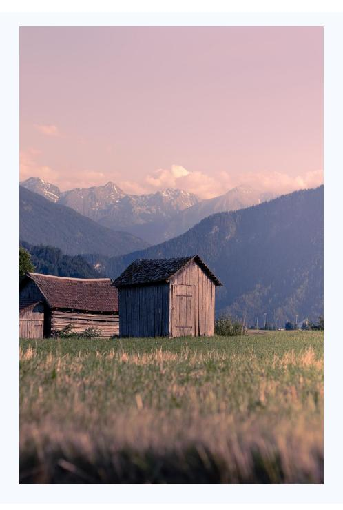

# B.2. Effect of Block Size in DualCache

Table [7](#page-14-1) examines different block sizes (8, 16, 32) in DualCache. For this arithmetic prompt, all settings yield correct, clearly explained answers with no meaningful output differences. Thus, DualCache is robust to block size for such problems, allowing efficiency improvements without compromising quality.

### B.3. Impact of Dynamic Threshold Settings

Table [8](#page-14-2) investigates dynamic threshold values (0.7, 0.8, 0.9). The model consistently produces the correct answer and clear explanations, regardless of threshold. While higher thresholds increase computational effort (NFE from 9 to 20), answer quality remains stable, indicating threshold adjustment mainly affects efficiency, not correctness, for straightforward arithmetic questions.

### B.4. Multimodal Generation with **LLAda-V**

To qualitatively analyze the effectiveness of our Fast-dLLM framework in multimodal scenarios, we conduct a visual case study where the model is tasked with generating a highly detailed image description. As illustrated in Figure [6,](#page-15-1) both the baseline model and our Fast-dLLM are given the same visual input and user prompt: "*Please describe the image in detail*."

**User:** Please describe the image in detail.

**Baseline (63.0 secs):** The image captures a serene rural landscape. Dominating the scene is a wooden barn, its weathered exterior a testament to the passage of time. The barn is nestled in a field of green grass, which stretches out to meet the horizon. In the distance, a range of mountains rises, their peaks shrouded in a blanket of clouds. The sky above is a soft pink, suggesting either dawn or dusk. The perspective of the image is from a low angle, making the barn appear grand and imposing. The overall composition of the image creates a sense of depth and tranquility, inviting the viewer to imagine themselves in this peaceful rural setting.

**Fast-dLLM (6.8 secs):** The image captures a serene rural landscape. Dominating the scene is a wooden barn, its rustic charm enhanced by the gray shingles on its roof. The barn is nestled in a field of tall grass, which stretches out towards the horizon. The field is framed by a range of mountains, their peaks dusted with snow, adding a touch of tranquility to the scene. The sky above is a soft pink, suggesting either early morning or late afternoon. The perspective of the image is from a low angle, making the barn appear grand and imposing. The overall composition of the image creates a harmonious blend of man-made structures and the natural world.

Figure 6 | Comparison between the baseline and Fast-dLLM on a visual description task. Fast-dLLM produces a comparable and faithful image caption in a fraction of the decoding time.

The baseline model requires 63.0 seconds to complete the generation, producing a detailed and poetic description of the rural landscape. It highlights elements such as the weathered wooden barn, the soft pink sky, and the tranquil atmosphere.

In contrast, our Fast-dLLM completes the task in just 6.8 seconds—a nearly 10× speedup—while maintaining rich visual detail. It further enhances the description with additional grounding (e.g., "gray shingles on its roof", "touch of tranquility"), reflecting a strong alignment with both appearance and mood cues from the image. Notably, the generated caption retains compositional depth and stylistic fluency, illustrating the model's ability to balance fluency and factuality even under diffusion-based parallel decoding.

This case highlights how LLAda-V with Fast-dLLM decoding enables high-quality vision-language generation at significantly improved efficiency, paving the way for faster and more interactive multimodal applications.

