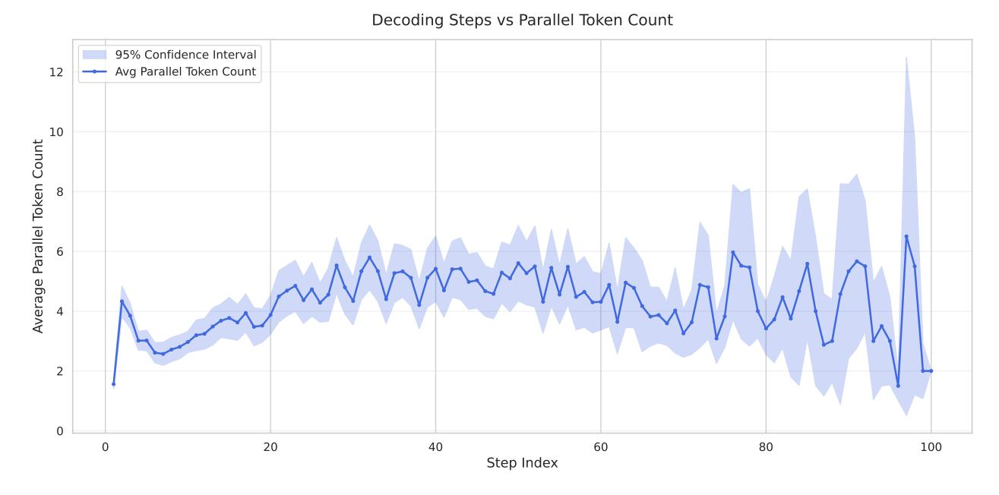
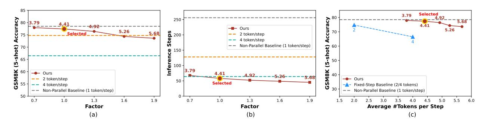
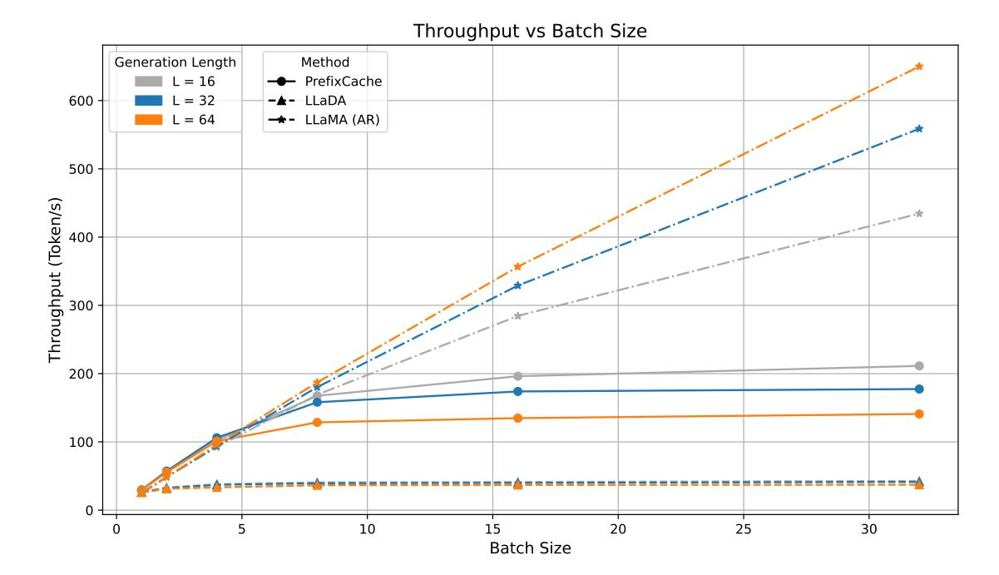

# C. Experiment Details

### C.1. Further Experiments with LLaDA-V

Table 9 | Effect of block length on performance (MathVista, 48 Steps)

| Block Length        | 4    | 8    | 16   | 32   | 96   |
|---------------------|------|------|------|------|------|
| Accuracy (%)        | 51.2 | 50.7 | 51.8 | 52.3 | 59.7 |
| Throughput (tok./s) | 6.1  | 6.2  | 5.5  | 5.5  | 5.6  |

Table 10 | MathVista Performance with Fast-dLLM at different refresh intervals (block length = 96)

| Refresh Interval    | 2    | 4    | 8    | 16   | 32   |
|---------------------|------|------|------|------|------|
| Accuracy (%)        | 59.2 | 59.2 | 58.2 | 57.1 | 56.6 |
| Throughput (tok./s) | 15.9 | 19.5 | 21.1 | 25.2 | 28.2 |

In Table [9,](#page-15-0) we investigate how the choice of block length affects the performance of LLaDA-V on MathVista under a fixed decoding length of 48 steps. The results show that the model achieves the highest accuracy with a block length of 96. However, when reducing the block size to 8 or 4, the accuracy drops significantly by over 8%.

Given this sensitivity to block length, we choose not to break the output into small blocks for updating caches individually. Instead, we keep the block length fixed at 96 and adopt a refresh-based strategy: the cache is updated only every decoding steps using the most recent full block. As shown in Table [10,](#page-16-1) increasing the refresh interval leads to consistent gains in throughput—from 15.9 tokens/s at interval 2 to 28.2 tokens/s at interval 32. While accuracy drops slightly with larger intervals, it remains above 56.6%, suggesting that aggressive refresh scheduling can yield substantial speedups with only minor performance degradation.

#### C.2. Performance Comparison between Threshold and Factor Strategy

Table 11 | Performance comparison between Threshold and Factor confidence-aware decoding on GSM8K and MATH benchmarks with generation lengths of 256 and 512. Each block shows accuracy (top row) and throughput with speedup (bottom row). Factor decoding provides favorable trade-offs in most settings.

| Benchmark      | Gen. Len | Threshold    | Factor       |
|----------------|----------|--------------|--------------|
|                | 256      | 78.5         | 77.5         |
| GSM8K (5-shot) |          | 54.4 (8.1×)  | 78.5 (11.7x) |
|                | 512      | 77.2         | 74.8         |
|                |          | 35.3 (11.0×) | 47.1 (14.7x) |
|                | 256      | 33.2         | 32.0         |
| MATH (4-shot)  |          | 51.7 (5.7×)  | 78.3 (8.6x)  |
|                | 512      | 36.0         | 35.2         |
|                |          | 47.1 (5.9×)  | 64.6 (8.1x)  |

We compare the performance of our threshold-based and factor-based confidence-aware parallel decoding strategies on GSM8K and MATH benchmarks (Table [11\)](#page-16-0). While the threshold strategy achieves marginally better accuracy in most settings (e.g., 78.5% vs. 77.5% on GSM8K with 256 tokens), the factor strategy demonstrates substantially superior throughput performance.

Specifically, factor decoding achieves 1.4-1.5× higher throughput than threshold decoding across all settings. On GSM8K with 256 tokens, factor decoding reaches 78.5 tokens/sec (11.7× speedup) compared to 54.4 tokens/sec (8.1× speedup) for threshold decoding. This throughput advantage becomes even more pronounced on longer generation tasks—for GSM8K with 512 tokens, factor decoding attains 47.1 tokens/sec while threshold only achieves 35.3 tokens/sec.

The results demonstrate that factor decoding offers a compelling trade-off: it sacrifices minimal accuracy (typically 1-3%) in exchange for significant throughput improvements (40-50% higher). This makes factor decoding particularly attractive for latency-sensitive applications where the slight accuracy reduction is acceptable. The consistent pattern across both benchmarks and generation lengths validates the robustness of the factor strategy's theoretical foundation, which adaptively controls parallelism based on the confidence bound ( + 1) *<* .

Figure 7 | Average number of tokens generated at each decoding step. Blue line shows the mean token count, and the shaded area denotes the 95% confidence interval.

#### C.3. Comparison between LLaDA and LLaDA-1.5

We compare the performance of LLaDA and its enhanced version LLaDA-1.5 across both GSM8K (5-shot) and MATH (4-shot) benchmarks under two generation length settings (256 and 512 tokens), as shown in Table [12.](#page-18-0) Each cell reports accuracy and decoding throughput (in tokens per second), along with the relative speedup over the greedy baseline.

Across GSM8K settings, LLaDA-1.5 consistently improves accuracy over the original LLaDA, achieving a notable +2.2% absolute gain at 256-token generation and +3.2% at 512-token generation. Furthermore, it maintains strong decoding efficiency, with throughput reaching 59.4 tokens/sec at 256 tokens, improving upon LLaDA's 54.1 tokens/sec under the same setting.

On the MATH benchmark, accuracy between the two versions remains comparable. However, LLaDA-1.5 slightly improves throughput at 256 tokens (53.7 vs. 51.7) while incurring a mild efficiency regression at the 512-token setting (41.1 vs. 47.1). This suggests that while LLaDA-1.5 introduces enhancements beneficial for shorter or moderate decoding contexts, longer sequences may require further optimization.

Overall, LLaDA-1.5 consistently provides either superior accuracy or better decoding speed across settings, demonstrating better performance-efficiency trade-offs and highlighting the benefit of incorporating adaptive improvements on top of the base LLaDA architecture.

### C.4. Analysis of Parallel Token Counts across Decoding Steps

To better understand the behavior of factor-based parallel generation, we analyze the average number of tokens generated at each decoding step. Specifically, we collect statistics from all intermediate steps of the sampling process and compute the average number of tokens generated in parallel per step. The results are visualized in Figure [7,](#page-17-1) along with a 95% confidence interval indicating cross-sample variability.

As shown in Figure [7,](#page-17-1) the average number of tokens generated in parallel gradually increases during the early to middle stages of decoding, peaking roughly between step 30 to step 60. After this peak, the parallelism tends to slightly decline toward the end of generation. This suggests that the model becomes more confident in generating outputs during the mid-decoding phase, allowing it to produce more tokens simultaneously. Toward the final steps, the decoding process tends to become more conservative, reducing the number of tokens produced at each step.

The shaded confidence interval reveals greater variance in later decoding steps, indicating instability and inconsistent generation behavior across samples. This is expected since tail-end decoding steps tend to handle only a few remaining

Table 12 | Performance comparison between LLaDA and LLaDA-1.5. Each cell presents the accuracy and the decoding throughput in tokens per second with relative speedup to the LLaDA baseline (bottom row, blue: tokens per second/orange: relative speedup).

| Benchmark      | Gen Length | LLaDA (Fast-dLLM) | LLaDA 1.5 (Fast-dLLM) |
|----------------|------------|-------------------|-----------------------|
|                | 256        | 78.5              | 80.7                  |
| GSM8K (5-shot) |            | 54.1 (8.1×)       | 59.4 (8.9×)           |
| ,              | 512        | 77.2              | 80.4                  |
|                |            | 35.3 (11.0×)      | 33.0 (10.3×)          |
|                | 256        | 33.2              | 32.6                  |
| MATH (4-shot)  |            | 51.7 (5.7×)       | 53.7 (5.9×)           |
| ()             | 512        | 36.0              | 35.1                  |
|                |            | 47.1 (5.9×)       | 41.1 (5.1×)           |

Figure 8 | (a) GSM8K (5-shot) accuracy across different factor values using our factor-based decoding strategy. Numbers above each point indicate the average number of tokens decoded per step. The dashed lines show the accuracy of the baseline method with 2 or 4 tokens per step, and the non-parallel (1 token/step) baseline. (b) The corresponding number of inference steps needed under each factor setting. Our method generally requires significantly fewer steps than fixed-step baselines. (c) Accuracy versus average number of tokens decoded per step on GSM8K (5-shot). Our factor-based decoding achieves better accuracy-efficiency trade-offs compared to baselines. The red "Selected" point represents the setting chosen in our main results.

tokens required to complete the output, and the number of remaining tokens could differ widely among different samples (e.g., due to early completion or padding).

These observations are important for understanding how decoding efficiency can be optimized: increasing parallelism during high-confidence phases (middle steps) offers computational savings, while conservative behavior near boundaries maintains quality.

#### C.5. Throughput Comparison under Varying Batch Sizes

All experiments are conducted on an NVIDIA A100 GPU, with the prefill length fixed to 256 tokens. The generation length is varied among 16, 32, and 64 tokens, and batch sizes range from 1 to 32. This setup reflects realistic deployment scenarios, allowing the evaluation of decoding efficiency under diverse conditions.

It should be noted that parallel decoding allows multiple tokens to be generated simultaneously affected by dummy input tokens. To ensure fairness, we focus solely on the acceleration provided by caching techniques.

PrefixCache is designed as an acceleration mechanism for LLaDA, a diffusion-based LLM, and successfully boosts the throughput significantly. Figure 9 shows that **PrefixCache achieves consistent improvements across all batch sizes and generation lengths**, making it particularly suited for scenarios with smaller generation lengths and larger batch sizes. For instance, with a generation length of 16 and batch size of 32, PrefixCache achieves a throughput of over 211 tokens/s, significantly outperforming the native LLaDA which reaches only 43 tokens/s, demonstrating nearly  $5 \times 10^{-5}$  improvement.

While LLaDA exhibits limited scalability with increasing batch sizes—its throughput plateaus after batch size 8—this

Figure 9 | Throughput comparison between **PrefixCache**, **LLaDA**, and **LLaMA** under different generation lengths and batch sizes. All models are evaluated on an **NVIDIA A100** GPU with the prefill length fixed at 256.

limitation is inherent to diffusion-based LLMs, which are compute-bound by nature. In contrast, LLaMA, an autoregressive (AR) model, benefits greatly from large batch sizes. As the batch size increases, LLaMA shifts from being memory-bound to compute-bound, allowing it to achieve high absolute throughput at larger batch settings.

These results highlight the practical advantages of PrefixCache in accelerating compute-bound diffusion models like LLaDA, especially for latency-critical and high-throughput applications. Furthermore, the scalability and efficiency provided by PrefixCache bridge the gap between diffusion-based LLMs and AR models like LLaMA, showcasing its importance for large-scale deployment settings.

