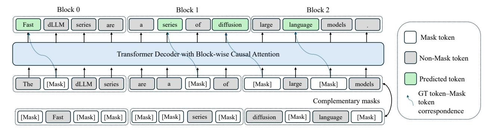
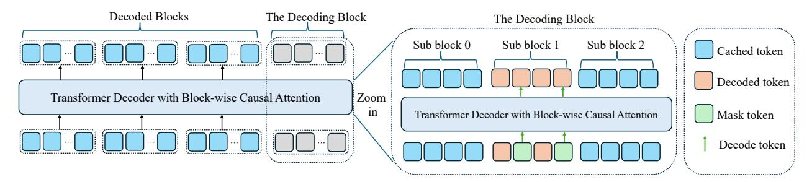

# 3. Methodology

### 3.1. Preliminary

Let = { 1 *,* 2 *, . . . ,* } denote a token sequence of length . Traditional autoregressive models generate sequentially by modeling the conditional distribution ( | *<*), and are trained to minimize the cross-entropy loss.

In contrast, diffusion language models define a generative distribution via a forward noising process and a learned reverse denoising model. At time ∈ (0*,* 1), each token in 0 is masked independently with probability , producing a corrupted sequence . The reverse model (0|) predicts the original tokens given the noised input.

Figure 2 | Training process of Fast-dLLM-v2. The input sequence is decoded block by block. Within each block, the model performs next-token prediction with partial masking. To ensure every token is trained, complementary masks are introduced so that masked tokens in one view can be predicted from the other. We only apply loss to predicted tokens that are highlighted in green, and dashed curves connect Mask tokens to their corresponding predictions.

The model is trained to minimize the expected masked token prediction loss:

$$\mathcal{L}(\theta) = -\mathbb{E}_{t,x_0,x_t} \left[ \frac{1}{t} \sum_{i=1}^L \mathbf{1}[x_t^i = \texttt{[MASK]]} \log p_{\theta}(x_0^i \mid x_t) \right],$$

where ∼ Uniform(0*,* 1) and is sampled from the forward process. The loss is computed only over the masked tokens.

## 3.2. Adaptation to Block Diffusion LLM

We build our block-wise diffusion training pipeline on top of pretrained Qwen2.5-Instruct models [\(Qwen et al.,](#page-10-9) [2025\)](#page-10-9), including both 1.5B and 7B variants. Fine-tuning is conducted as supervised fine-tuning (SFT) on instruction-tuning data, where each training batch is constructed using our blockwise diffusion setup. Specifically, we introduce partial token masking within each block together with a complementary masking strategy [\(Li et al.,](#page-10-16) [2025b\)](#page-10-16) to ensure that every token is trained in both visible and masked contexts. The overall architecture and training workflow are illustrated in Figure [2.](#page-3-0)

Block-wise organization. Given a set of tokenized samples, we first pad each sequence to a length that is an integer multiple of the block size by appending [MASK] tokens as needed. These padding tokens are ignored in the loss computation and do not contribute to gradient updates. After this alignment step, we pack the padded sequences by concatenating them into a long token stream and splitting it into training sequences of a fixed context length . Each packed sequence is therefore naturally divided into = */* non-overlapping blocks of size , already aligned by construction. This block-aligned packing ensures efficient batching while avoiding block boundaries crossing sample boundaries.

Masked token prediction with complementary views. For each block, we randomly sample a binary mask ∈ {0*,* 1} , where = 1 means position is replaced with a learned [MASK] embedding. To ensure all tokens receive both masked and unmasked supervision across training, we use a *complementary masking* strategy: each training sample is duplicated into two *views* with masks and ¯ = 1 − . These two views are placed together in the same batch, so the model can jointly see masked and unmasked contexts across the views.

Token shift for prediction. To preserve the pretrained AR model's representation quality [\(Ye et al.,](#page-10-8) [2025b](#page-10-8)[,a\)](#page-10-3), we adopt a shifted-label strategy: prediction of a token at masked position uses the logit from its preceding position ( − 1). Concretely, if is masked, the model uses the hidden state at − 1 to predict , consistent with the next-token prediction mechanism in causal language models. This allows dLLM to maintain AR-like temporal representations while supporting intra-block diffusion.

Figure 3 | Illustration of the inference process. The sequence is decoded block-by-block. The decoded blocks are cached to speed up inference. Within each block, we adopt the parallel decoding and DualCache in Fast-dLLM to further accelerate inference.

Training objective. We minimize the masked-token-only cross-entropy loss:

$$\mathcal{L}_{\text{block}}(\theta) = -\mathbb{E}_{x,m} \left[ \sum_{i=1}^{L} \mathbf{1}[x_t^i = [\text{MASK}]] \log p_{\theta}(x_0^i \mid x_{< i}, x_{\text{block}(i)}) \right],$$

where block() denotes all tokens in the block containing position (including masked/unmasked), and *<* are clean tokens from earlier blocks.

Block-wise attention masking. We use a hybrid attention scheme similar to that in [\(Arriola et al.,](#page-8-0) [2025\)](#page-8-0). For each training sample, we concatenate the noised sequence and its corresponding clean sequence 0 along the sequence dimension, resulting in a total length of 2. The attention mask ∈ {0*,* 1} 2×2 is then applied to control both causal and bidirectional connections.

This design allows simultaneous processing of corrupted and clean contexts, facilitating complementary mask supervision. The attention mask naturally supports both block-parallelism and causal autoregressive dependencies between blocks. We further employ the *flex-attention* implementation to efficiently realize this structured masking and accelerate training.

### 3.3. Inference Pipeline

At inference time, Fast-dLLM v2 employs a block-wise decoding strategy that balances the autoregressive nature of LLMs with the parallelism afforded by diffusion-based decoding. As shown in Figure [3,](#page-4-0) generation proceeds one block at a time: previously decoded blocks are cached and reused as clean prefix context, while the current block undergoes parallel masked token refinement.

By combining block-level caching, intra-block parallel decoding, and DualCache reuse, Fast-dLLM v2 maximizes decoding efficiency without requiring auxiliary models or extra inference overhead. Empirically, we observe up to 2*.*5× speedup compared to standard AR decoding, while maintaining generation quality on par with strong autoregressive baselines. This makes Fast-dLLM v2 a compelling candidate for practical LLM deployment in latency-sensitive applications.

Block-wise autoregressive decoding with caching. Since each block in Fast-dLLM v2 is decoded in a causal order, we naturally preserve left-to-right semantics across blocks. After decoding each block, its unmasked tokens are cached as read-only context for future blocks. This design enables block-level Key-Value (KV) cache reuse and significantly reduces redundant computation. The attention mask at inference time allows each block to attend bidirectionally within itself, while attending causally to preceding blocks, mirroring the configuration used during training.

Parallel refinement within each block. To accelerate generation within a block, we adopt the confidence-aware parallel decoding strategy proposed in Fast-dLLM [\(Wu et al.,](#page-10-4) [2025\)](#page-10-4). Specifically, we iteratively refine masked tokens in the current block based on their model confidence of predicted tokens. Tokens exceeding a confidence threshold are decoded and unmasked in parallel, while uncertain positions remain masked for future refinement. This avoids ambiguous predictions and reduces generation latency.

**DualCache for sub-block reuse.** To further reduce redundant computation during intra-block decoding, we integrate the DualCache mechanism from Fast-dLLM. DualCache maintains both prefix and suffix KV caches for partially decoded blocks, enabling efficient recomputation as additional tokens are revealed. This hierarchical caching not only rules out expensive recomputation, but also supports the iterative, selective decoding pattern used in confidence-aware refinement.

**Batch decoding with padding.** To support batch generation of sequences with varying target lengths, we right-pad each sequence with [MASK] tokens to make their total lengths divisible by the block size D. The sequences are then grouped and decoded block-by-block. At each step, all sequences in the batch decode the next block in parallel, regardless of how many real tokens remain, ensuring consistent and efficient scheduling on modern hardware.

