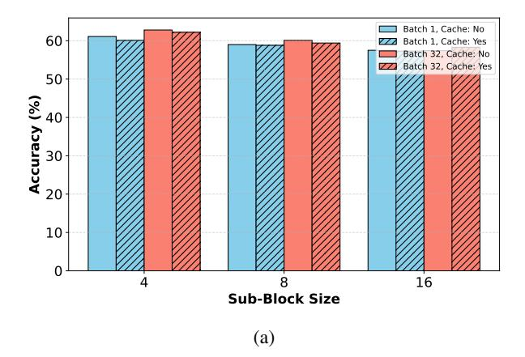

# 4. Experiments

### 4.1. Experimental Setup

We conduct adaptation experiments on the Qwen-2.5 1.5B and 7B Instruct models, tuning them into the Block Diffusion LLM configuration. For training, we use the LLaMA-Nemotron post-training dataset (Bercovich et al., 2025) with a batch size of 256. The learning rate and training steps are set specifically for each model: the 1.5B model is trained with a learning rate of  $2 \times 10^{-5}$  for 6,000 steps, while the 7B model uses a learning rate of  $1 \times 10^{-5}$  for 2,500 steps. We employ 64 NVIDIA A100 GPUs for training, with the 1.5B model training for approximately 8 hours and the 7B model for 12 hours. Unless otherwise stated, the sub-block size is fixed at 8, block size at 32, and parallel decoding is disabled (i.e., threshold is set to 1).

For benchmarking, we evaluate the tuned models on a comprehensive suite of tasks, covering diverse aspects of language modeling and reasoning abilities. The evaluation suite includes code generation tasks like HumanEval and MBPP, mathematical reasoning tasks such as GSM8K and MATH, as well as knowledge-intensive benchmarks like MMLU and GPQA, instruction-following tasks such as IFEval. Code-related benchmarks, including HumanEval and MBPP, are assessed using the EvalPlus framework, which provides a robust evaluation for code synthesis. All other benchmarks are evaluated using the LM-Eval framework, ensuring consistency and reliability of performance measurements across different tasks.

To provide meaningful comparisons, we include several baseline models in our evaluation. These baselines include widely recognized models with comparable parameter sizes, such as LLaMA-3.2, SmolLM-2, Dream, and LLaDA series. Additionally, results from the original Qwen-2.5 1.5B and 7B models, tuned with next token prediction under the same dataset and training steps, are incorporated to highlight the impact of our Block Diffusion methodology.

#### 4.2. Main Results: Performance and Speed

The 1.5B Fast-dLLM v2 achieves an average score of 45.0, outperforming the Qwen2.5-1.5B and Qwen2.5-1.5B-Nemo-FT baselines, and establishing new state-of-the-art performance among 1B-scale diffusion-based and NTP-trained autoregressive models. At the 7B scale, Fast-dLLM v2 reaches an average score of 60.3, surpassing all baselines including Qwen2.5-7B-Nemo-FT (59.6) and Dream (57.6), while matching or exceeding the best-performing models across most individual benchmarks. These results highlight Fast-dLLM v2's consistent and strong performance across diverse tasks, while maintaining the efficiency advantages of diffusion-based generation.

As shown in Table 1, our Fast-dLLM v2 models achieve competitive performance across a wide range of benchmarks. Notably, both the 1.5B and

Figure 4 | Accuracy and throughput under different thresholds on GSM8K. Threshold 0.9 is selected, offering a 2.6× speedup with minimal accuracy drop.

Table 1 | Benchmark results of various language models across a range of evaluation tasks. Models are grouped by parameter scale into 1B and 7B+ categories. Evaluation metrics include code generation (HumanEval, MBPP), mathematical reasoning (GSM8K, MATH), instruction following (IFEval), knowledge-intensive QA (MMLU, GPQA), and general average score (Avg.). "Base" and "Plus" refer to different evaluation settings for code benchmarks using EvalPlus. The best results per column are in bold, and the second-best are underlined.

| Model                | #Params | HumanEval |      | MBPP |      |       |      |        |      |      |      |
|----------------------|---------|-----------|------|------|------|-------|------|--------|------|------|------|
|                      |         | Base      | Plus | Base | Plus | GSM8K | Math | IFEval | MMLU | GPQA | Avg. |
| 1B Models            |         |           |      |      |      |       |      |        |      |      |      |
| LlaMA-3.2            | 1.2B    | 34.1      | 31.1 | 34.1 | 29.4 | 43.0  | 23.8 | 58.9   | 44.4 | 24.1 | 35.9 |
| SmolLM 2             | 1.7B    | 34.1      | 28.7 | 50.6 | 46.0 | 47.7  | 21.1 | 55.1   | 49.1 | 29.2 | 40.7 |
| Qwen2.5-1.5B         | 1.5B    | 42.1      | 37.2 | 48.1 | 41.3 | 57.0  | 46.8 | 41.2   | 54.6 | 30.6 | 44.3 |
| Qwen2.5-1.5B-Nemo-FT | 1.5B    | 37.2      | 33.5 | 53.4 | 44.4 | 58.5  | 43.5 | 39.4   | 58.1 | 31.0 | 44.3 |
| Fast-dLLM v2         | 1.5B    | 43.9      | 40.2 | 50.0 | 41.3 | 62.0  | 38.1 | 47.0   | 55.1 | 27.7 | 45.0 |
| 7B+ Models           |         |           |      |      |      |       |      |        |      |      |      |
| LLaDA                | 8B      | 35.4      | 31.7 | 31.5 | 28.6 | 78.6  | 26.6 | 59.9   | 65.5 | 31.8 | 43.3 |
| LLaDA-1.5            | 8B      | 52.4      | -    | 42.8 | -    | 83.3  | 42.6 | 58.2   | 66.0 | 36.9 | -    |
| LLaDA-MoE            | 7B      | 61.6      | -    | 70.0 | -    | 82.4  | 58.7 | 59.3   | 67.2 | -    | -    |
| Dream                | 7B      | 57.9      | 53.7 | 68.3 | 56.1 | 81.0  | 39.2 | 62.5   | 67.0 | 33.0 | 57.6 |
| Qwen2.5-7B           | 7B      | 51.2      | 47.6 | 57.7 | 49.5 | 71.4  | 73.3 | 70.8   | 68.7 | 33.5 | 58.2 |
| Qwen2.5-7B-Nemo-FT   | 7B      | 52.4      | 48.2 | 57.1 | 50.0 | 84.1  | 72.0 | 69.5   | 68.6 | 34.2 | 59.6 |
| Fast-dLLM v2         | 7B      | 63.4      | 58.5 | 63.0 | 52.3 | 83.7  | 61.6 | 61.4   | 66.6 | 31.9 | 60.3 |

7B variants perform on par with or better than their

counterparts trained with standard next-token prediction (NTP) loss on the same data and for the same number of steps.

To balance generation quality and efficiency, we adopt a confidence-based parallel decoding strategy, where each token is individually finalized once its predicted confidence exceeds a predefined threshold. As shown in Figure [4,](#page-5-0) a lower threshold allows more tokens to be finalized earlier in the denoising process, effectively reducing the number of required decoding steps and improving throughput. Specifically, with a threshold of 0.9, we observe only a marginal drop in GSM8K accuracy, while throughput increases significantly from 39.1 to 101.7 tokens/s—yielding a 2.6× speedup. This setting provides a favorable trade-off between performance and efficiency. Importantly, setting the threshold to 1.0 recovers the standard non-parallel decoding process, where all tokens are updated through the full sequence of denoising steps and finalized only at the end.

Figure [5](#page-7-0) compares the throughput of Fast-dLLM v2 (7B) and Qwen2.5-7B-Instruct across a range of batch sizes on both NVIDIA A100 and H100 GPUs for GSM8K, where we set the threshold to 0.9 and use sub-block cache. Across all settings, diffusion generation consistently outperforms the autoregressive baseline, demonstrating superior scalability with increasing batch size. On the A100, diffusion achieves up to 1.5× higher throughput at batch size 64, while the advantage is even more pronounced on the H100, reaching up to 1.8× speedup. This improvement highlights the efficiency benefits of diffusion decoding, especially on newer hardware architectures where parallelism can be better exploited. These results reinforce the practicality of diffusion-based generation in real-world deployment scenarios where low-latency, high-throughput inference is critical.

## 4.3. Ablation Study

We conduct all ablation experiments using the Fast-dLLM v2 1.5B model to systematically investigate the impact of architectural and decoding choices. As shown in Table [2,](#page-7-1) the baseline ("naive token shift") applies a strategy where, for each training block, a subset of tokens is randomly masked, and each masked token is predicted using the model's output at the preceding position. To improve training fidelity, we introduce a padding strategy ("+ pad") that appends non-loss-bearing <MASK> tokens to each training sample such that its length becomes a multiple of block size. This modification is crucial to preserve data integrity during sequence packing: without padding, an <EOS> token from one sample might be immediately followed by a <BOS> token from the next, and since our block-wise diffusion model uses bidirectional attention, this can lead to unintended attention across samples. Padding ensures clean sample boundaries, preventing cross-sample leakage during training.

Table 2 | Benchmark results for different token shift strategies. "+ CM" stands for "+ complementary mask". The best performance for each benchmark is shown in **bold**, while the second-best is <u>underlined</u>.

| Method            | HumanEval   |             | MBPP        |      | CSM8K       | Math | IFFvol      | MMLU        | CPOA        | Ava         |
|-------------------|-------------|-------------|-------------|------|-------------|------|-------------|-------------|-------------|-------------|
|                   | Base        | Plus        | Base        | Plus | GSMOK       | Math | II L vai    | WINILO      | OI QA       | Avg.        |
| Naive token shift | 38.4        | 32.9        | 44.4        | 38.6 | 59.0        | 37.3 | 39.9        | 52.9        | 27.9        | 41.3        |
| + pad             | <u>38.4</u> | <u>34.1</u> | <u>45.2</u> | 38.4 | <u>60.1</u> | 37.0 | <u>45.8</u> | <u>53.5</u> | <u>27.7</u> | <u>42.2</u> |
| + pad + CM        | 43.9        | 40.2        | 50.0        | 41.3 | 62.0        | 38.1 | 47.0        | 55.1        | <u>27.7</u> | 45.0        |

We further incorporate a complementary masking (CM) strategy, where the complement of each sampled mask is also used in training. This ensures that all tokens in the input receive supervision, increasing the coverage of the learning signal. The full recipe ("+ pad + CM") achieves the best overall performance across benchmarks, improving the average accuracy by +3.7 points over the naive strategy. These results highlight the importance of aligning training-time input construction with the model's attention mechanism and masking objectives.

As shown in Table 3 and Table 4, we explore how subblock size and block size affect final performance. In Table 3, we observe that adjusting the *sub-block size* during inference leads to notable gains, with a size of 8 achieving the highest accuracy on average across tasks. While GSM8K performs best with smaller sizes (e.g., 2), HumanEval and HumanEval+ show improved results up to size 8, indicating that the optimal sub-block size is task-dependent.

In contrast, Table 4 illustrates that directly modifying the *block size* at inference time—without aligning it to the training-time configuration—results in substantial performance degradation. For instance, GSM8K performance drops from 62.0 in the sub-block setting to 58.5 under mismatched block size, and HumanEval shows similar trends. This disparity underscores the importance of maintaining consistency between training and inference block structures. By introducing a sub-block decoding strategy, we are able to flexibly control inference granularity without violating this consistency,

Figure 5 | Throughput comparison between autoregressive and diffusion generation methods on NVIDIA A100 and H100 GPUs across varying batch sizes. Diffusion generation consistently outperforms autoregressive on both GPUs.

thereby achieving better performance across diverse benchmarks.

We further study the effects of sub-block size and sub-block cache on both accuracy and throughput, as illustrated in Figure 6. In Figure 6a, we observe that increasing the sub-block size leads to a slight drop in accuracy, consistent with previous findings in Table 3. As shown in Figure 6b, using larger sub-block sizes increases decoding throughput by decreasing the number of required sequential forward passes and exploiting greater intra-step parallelism.

In addition, we evaluate the impact of introducing a sub-block cache. While the cache introduces negligible gains when the batch size is small (and memory bandwidth is underutilized), it provides substantial speedup in the compute-bound regime, such as when the batch size is 32 as shown in Figure 5. Importantly, caching has no observable effect on model accuracy (Figure 6a), confirming that it is a purely efficiency-enhancing feature without compromising output quality. These results highlight that under practical batch sizes, combining larger sub-block sizes with caching yields strong performance-efficiency benefits.

### 5. Conclusion

In this work, we presented Fast-dLLM v2, a scalable block diffusion language model framework that adapts pretrained autoregressive LLMs into efficient diffusion-style decoders for parallel text generation. By integrating a blockwise diffusion mechanism with complementary masking, Fast-dLLM v2 enables intra-block bidirectional context modeling

Figure 6 | Effect of small block size and sub-block cache on model performance. (a) Accuracy remains largely unaffected by the use of sub-block cache across different block sizes and batch sizes. (b) Throughput increases as small block size grows due to higher decoding parallelism. While sub-block cache has negligible effect when batch size is small, it significantly improves throughput under compute-bound settings (e.g., batch size = 32).

Table 3 | Sub-Block size decoding improves performance, with size 8 being optimal.

| Sub-Block Size | 2           | 4           | 8                    | 16   | 32   |
|----------------|-------------|-------------|----------------------|------|------|
| GSM8K          | 62.8        | 61.8        | 62.0 43.9 40.2 | 61.3 | 60.2 |
| HumanEval      | 42.7        | <u>43.3</u> | 43.9                 | 39.6 | 38.4 |
| HumanEval+     | <u>39.6</u> | 40.2        | 40.2                 | 36.0 | 34.8 |

Table 4 | Inference with mismatched sizes reduces performance.

| Block Size                       | 2    | 4           | 8    | 16          | 32          |
|----------------------------------|------|-------------|------|-------------|-------------|
| GSM8K HumanEval HumanEval+ | 53.2 | 56.8        | 58.5 | <u>59.7</u> | 60.2        |
| HumanEval                        | 37.8 | 43.3        | 43.3 | <u>38.4</u> | <u>38.4</u> |
| HumanEval+                       | 34.1 | <u>39.0</u> | 39.6 | 34.1        | 34.8        |

while retaining the predictive capabilities of the original AR models. To address the latency of existing diffusion-based models, we further proposed a hierarchical caching strategy, consisting of a block-level cache for inter-block context reuse and a DualCache-based sub-block cache for efficient refinement within blocks, together with a parallel decoding pipeline. Extensive experiments on large-scale Qwen2.5-Instruct models (1.5B and 7B) demonstrate that Fast-dLLM v2 achieves up to  $2.5\times$  speedup over standard AR decoding without loss of generation quality, consistently matching strong AR baselines while surpassing prior diffusion-based approaches in efficiency. These results highlight the potential of block diffusion frameworks as a practical path toward deploying high-quality, low-latency LLMs in real-world applications.

