# FASTTREE: OPTIMIZING ATTENTION KERNEL AND RUNTIME FOR TREE-STRUCTURED LLM INFERENCE

Zaifeng Pan <sup>1</sup> Yitong Ding <sup>1</sup> Yue Guan <sup>1</sup> Zheng Wang <sup>1</sup> Zhongkai Yu <sup>1</sup> Xulong Tang <sup>2</sup> Yida Wang <sup>3</sup> Yufei Ding <sup>1</sup>

## ABSTRACT

Tree-structured prefix sharing is prevalent in recent large language model (LLM) applications. Existing LLM serving systems use a radix tree to organize the global key-value (KV) cache, facilitating cache reuse across different queries and thus reducing unnecessary memory use. Despite this, these systems still rely on conventional computation patterns for attention operations, resulting in redundant memory loads and GPU tensor core underutilization. To address these limitations, we present FastTree, which introduces GPU kernels tailored for efficiently processing queries that share contexts through the radix tree. To effectively employ the FastTree kernels, a significant challenge arises in finding optimal context-queries groups with a given KV cache tree, as the varying shared prefixes between queries create a giant decision space. To tackle this, we propose tree structure-adaptive runtime optimization within FastTree, applying a greedy heuristic to partition the tree to minimize overhead and splitting lengthy contexts to mitigate the tail effect. FastTree is built upon SGLang, and extensive experiments demonstrate that it improves the throughput of SGLang by up to 2.2×. FastTree's code is available at <https://github.com/PanZaifeng/FastTree-Artifact>.

## 1 INTRODUCTION

Large language models (LLMs) [\(OpenAI et al.,](#page-12-0) [2023;](#page-12-0) [Tou](#page-13-0)[vron et al.,](#page-13-0) [2023;](#page-13-0) [Jiang et al.,](#page-11-0) [2023;](#page-11-0) [Bai et al.,](#page-11-0) [2023\)](#page-11-0) have been increasingly deployed across various domains, achieving remarkable performance in applications like text generation [\(Li et al.,](#page-12-0) [2024\)](#page-12-0), program synthesis and optimization [\(Gur et al.,](#page-11-0) [2023;](#page-11-0) [Cummins et al.,](#page-11-0) [2024\)](#page-11-0), and information retrieval [\(Zhu et al.,](#page-14-0) [2023;](#page-14-0) [Gao et al.,](#page-11-0) [2023\)](#page-11-0). Recently, to solve more complicated tasks, the usage of tree-structured LLM programs has increased rapidly, including few-shot learning [\(Brown,](#page-11-0) [2020\)](#page-11-0), document QA [\(Ye et al.,](#page-13-0) [2024b\)](#page-13-0), tree of thoughts [\(Yao et al.,](#page-13-0) [2024b\)](#page-13-0), etc. Due to this, it has become typical for different queries within a program to share common token prefixes. Besides, different program instances can also share common parts, such as a long system prompt [\(TheBigPromptLibrary,](#page-13-0) [2024\)](#page-13-0). In this paper, we refer to the LLM inference procedure under tree-structured prefix sharing as *tree-structured LLM inference*.

In conventional LLM serving systems [\(NVIDIA,](#page-12-0) [2024;](#page-12-0) [Hug](#page-11-0)[gingFace,](#page-11-0) [2024;](#page-11-0) [Microsoft,](#page-12-0) [2024\)](#page-12-0), each query holds its own key-value (KV) caches, as Figure [1\(](#page-1-0)a) shows, over-

*Proceedings of the* 8 th *MLSys Conference*, Santa Clara, CA, USA, 2025. Copyright 2025 by the author(s).

looking the opportunity to reuse the shared KV cache between queries. To address this problem, radix tree optimization [\(Zheng et al.,](#page-13-0) [2023a\)](#page-13-0) has been proposed to organize the entire system-level KV caches as a tree illustrated in Figure [1\(](#page-1-0)b). In this way, the systems can reduce the GPU memory usage significantly, leading to higher throughput by serving more concurrent requests.

However, although optimizing the memory layouts with a radix tree, existing systems [\(Zheng et al.,](#page-13-0) [2023a\)](#page-13-0) still utilize the conventional attention kernels [\(Dao et al.,](#page-11-0) [2023;](#page-11-0) [Flash-](#page-11-0)[Infer,](#page-11-0) [2024\)](#page-11-0) shown in Figure [1\(](#page-1-0)c), which concatenate the KV cache for each query and dispatch its computation into an individual GPU thread block. Such a naively separated computation pattern suffers from the inefficient usage of shared memory and tensor cores on the GPU. It requires redundantly loading the shared KV cache from slow global memory for every query and cannot meet the minimum shape requirements for tensor cores without padding.

To bridge this gap, we propose FastTree, an LLM serving system that leverages the tree-structured KV cache at the memory level to guide the computation optimization of attention operations. It comprises efficient GPU kernels to process aggregated queries and their shared context together, leading to reduced memory transactions and increased FLOPS due to the utilization of fast shared memory and high-performance tensor cores on the GPU.

<sup>1</sup>University of California, San Diego, CA, USA <sup>2</sup>University of Pittsburgh, PA, USA <sup>3</sup>AWS, CA, USA. Correspondence to: Zaifeng Pan <zapan@ucsd.edu>.

<span id="page-1-0"></span>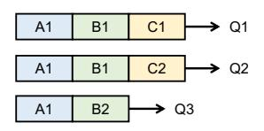

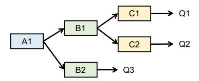

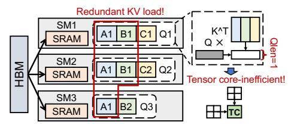

- (a) Queries with their own KV caches
- (b) KV cache sharing through Radix Tree
- (c) Computation pattern of existing system

Figure 1. Existing systems optimize the memory layouts by organizing KV caches as a radix tree, but they still rely on the conventional computation patterns to perform the attention operations, causing significant performance issues.

The key challenge in effectively utilizing the FastTree kernels is identifying the optimal context-queries groups, which defines how to partition the shared contexts and aggregate queries accordingly. With a given radix tree of the KV cache at runtime, we can generate enormous grouping plans by changing the shared contexts used for query aggregation, as the different queries can share varied prefixes. Moreover, the plan selection can significantly affect the execution performance of the attention kernel, as different plans can introduce distinct overheads, including wasted shared memory and computation due to tile padding and IO cost due to increased intermediate results (detailed in Section 4).

To tackle this challenge, we propose the *tree structure-adaptive runtime optimization* within FastTree. We formulate the optimal context-queries grouping problem as a binary edge assignment task, and the runtime then applies an overhead-aware greedy heuristic to search the results out of the giant decision space efficiently by choosing the assignment with minimal overhead at each step. Besides, we observe the GPU unsaturation problem due to insufficient block parallelism or long tail effect, and the runtime solves this problem by splitting lengthy contexts.

We build FastTree as a plugin for SGLang (Zheng et al., 2023a), which is an LLM serving framework with radix tree optimization. We evaluate the attention kernel performance of FastTree across various configurations on an NVIDIA H100 GPU, and experimental results demonstrate that FastTree delivers on average 5.1×, 4.2×, 10.6×, and 2.1× speedups over FlashAttention (Dao et al., 2022; Dao, 2023; Dao et al., 2023), FlashInfer (FlashInfer, 2024), DeFT (Yao et al., 2024a), and Multi-Level Cascade Attention (Ye et al., 2024b). We also evaluate the end-to-end performance of FastTree on models including Llama (Touvron et al., 2023) and Mistral (Jiang et al., 2023), showing up to a 2.2× improvement over SGLang across four benchmarks. In summary, we have the following contributions:

We reveal the limitations of existing LLM serving systems with radix tree optimizations, whose computation ignores the multi-level shareable memory patterns.

- We propose FastTree to accelerate the tree-structured LLM inference with efficient kernels and runtime optimizations. FastTree effectively searches the contextqueries groups with a greedy heuristic and improves GPU utilization when performing attention operations.
- We implement FastTree based on SGLang, and extensive experiments show that FastTree achieves up to 2.2× throughput improvement over the highly-optimized FlashInfer backend.

#### 2 BACKGROUND

#### 2.1 LLM Inference

The core of LLMs lies in the transformer architecture, which leverages self-attention (Vaswani et al., 2017) mechanisms to capture the dependencies between different tokens, enabling powerful contextual understanding capabilities. Self-attention mechanisms project each token into three vectors: query (Q), key (K), and value (V), and the output is calculated by the equation:

Attention
$$(Q, K, V) = \operatorname{softmax}(\frac{QK^T}{\sqrt{d}})V$$
 (1)

where d is the head dimension.

LLM inference is typically performed in an auto-regressive manner, where each token is generated based on the hidden state of the last token. The inference process is divided into two main phases: prefill and decoding. In the prefill phase, the initial input sequence is processed in a single forward pass, generating the attention outputs for all tokens simultaneously. During the decoding phase, tokens are generated one by one, so at each step, the model only calculates the attention between the last token's query vector and all previous tokens' key vectors.

Attention operations can account for a substantial portion of the time during LLM inference, especially when the sequence length is long. Figure 2 shows the Llama-2-7B (Touvron et al., 2023) execution time breakdown during decoding with batch size 32 and different sequence lengths. When the

<span id="page-2-0"></span>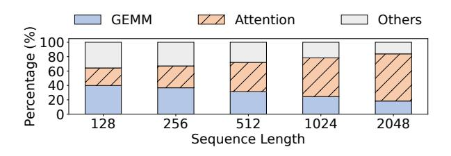

Figure 2. Llama-2-7B execution time breakdown during decoding on the H100 GPU. The batch size is 32.

sequence length becomes 2048, the attention computations can account for 65% of the model forward time on the GPU. Therefore, it is crucial to optimize the attention GPU kernels to reduce the LLM inference latency.

#### 2.2 Radix Tree-Based KV Cache Sharing

KV cache is an important optimization technique widely used in LLM serving systems. In the decoding phase, the KV caches store the KV vectors from previous tokens, thus eliminating the need to recompute the KV matrices for each new token and improving the inference efficiency.

Existing systems adopt the memory paging optimization (Kwon et al., 2023), which stores KV cache in noncontiguous blocks to reduce memory fragments. Based on this, they explore the KV cache sharing in specific scenarios like beam search (Sutskever et al., 2014) and single-level prefix sharing. Observing the opportunities of multi-level prefix sharing in recent complicated tasks, later works (Zheng et al., 2023a) further propose to manage the system-level KV cache as a radix tree, thus enabling the cache reuse across queries and reducing memory usage.

We use Figure 1 (b) as an example to illustrate how the radix tree works. The context associated with the root node A1 can be "You are a helpful assistant", a system prompt used to set the model's role. We can then provide two different few-shot learning examples in formats like "Q1:...; A1:...; Q2:...; A2:...;" to the model, storing the corresponding KV cache in B1 and B2 respectively. With this in-context learning pattern, a single model can be deployed as different applications to address multiple kinds of tasks. Each application can serve many requests, resulting in its own sub-tree of the KV cache, as shown in the figure.

However, we notice a significant gap between the treestructured memory layout and the query-separated computation pattern of existing systems. As Figure 1(c) depicts, they compute the attention of each query by separate blocks, failing to take advantage of the KV cache sharing based on the radix tree. Such a computation pattern leads to severe performance issues. First, the fast on-chip shared memory on the GPU is used insufficiently as the thread blocks for different queries cannot directly access the shared memory

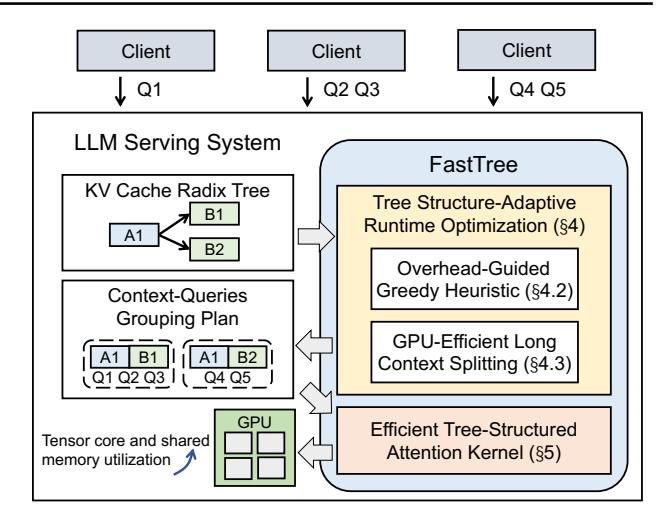

Figure 3. Overview of FastTree.

of each other for data reuse. As shown in Figure 1(c), the KV cache, even shared across multiple queries, has to be loaded from the slow global memory redundantly for each query, with bandwidth ten times lower than shared memory. Besides, during decoding, the Q matrix involved in the computation of each query is a vector because we only have one query token. Therefore, the basic computation within the attention transforms from the matrix-matrix multiplication (GEMM) to the GPU-inefficient matrix-vector multiplication (GEMV). For GEMV operations, it is hard for the kernels to effectively utilize the high-performance tensor cores on the GPU, which have specific input matrix shapes. The kernels have to resort to the CUDA cores with much lower FLOPS (FlashInfer, 2024) or pad the Q vector with wasted computation (Dao et al., 2023). According to our experiments, FlashAttention (Dao et al., 2022; Dao, 2023; Dao et al., 2023) only have less than 1% effective computation after padding the Q matrix. Note that batching (Yu et al., 2022) queries can only help increase the computation intensity of projection and MLP layers (Microsoft, 2024; Agrawal et al., 2024) during decoding but cannot benefit the attention directly due to the separate computation of queries.

In this paper, we explore how to leverage the tree-structured KV cache sharing at the memory level to guide the computation optimization for attention operations.

#### 3 OVERVIEW

We present the overview of FastTree in Figure 3, which serves as a plugin for the existing LLM serving system. During processing the queries sent from clients, the LLM serving system organizes the global KV cache as a radix tree and inputs it to FastTree. FastTree's tree structure-adaptive runtime (Section 4) will then generate the context-queries grouping plan to aggregate queries on the fly, thus enabling

<span id="page-3-0"></span>the memory layout-guided computation optimizations and balancing different overheads. It leverages the overheadguided greedy heuristic (Section [4.2\)](#page-4-0) to search the optimal plan out of a giant search space effectively and the long context splitting (Section [4.3\)](#page-6-0) to avoid GPU underutilization. With the grouping plan, FastTree then replaces the original attention kernel of the serving system with its efficient treestructured attention kernels (Section [5\)](#page-6-0). FastTree processes each context-queries group in FlashAttention style, reducing the redundant memory loads and improving tensor core utilization significantly.

## 4 TREE STRUCTURE-ADAPTIVE RUNTIME OPTIMIZATION

At runtime, the structure of the KV cache tree varies across time, requiring adaptive optimization on the fly to maximize the underlying GPU kernel performance. In this section, we detail the design of FastTree's runtime optimization.

### 4.1 Problem Formulation

Context-queries grouping. To enable the tensor core utilization and reduce context memory reloading, we need to aggregate queries that share the same context prefix and process them together. However, the shared prefixes can vary significantly between different queries, so there can be many different grouping plans with a given context tree at runtime. For example, in Figure [4,](#page-4-0) queries Q<sup>1</sup> to Q<sup>M</sup> share the same prefix A1 and B1, while queries QM+1 to QM+<sup>N</sup> share A1 and B2. By directly aggregating all associated queries for each node in the tree, we can get the grouping plan 1 shown in Figure [4\(](#page-4-0)b), which is (A1, {Q1, · · · , QM+<sup>N</sup> }), (B1, {Q1, · · · , QM}), and (B2, {QM+1, · · · , QM+<sup>N</sup> }). Then, by concatenating A1+B1 and A1+B2 respectively, we can obtain another grouping plan (A1+B1, {Q1, · · · , QM}) and (A1+B2, {QM+1, · · · , QM+<sup>N</sup> }), as shown in Figure [4\(](#page-4-0)c).

Different grouping plans change the computation-batching and memory-sharing patterns, which affects the performance of the final attention kernel significantly. Moreover, even with the same tree topology, the performance of the same plan can vary in different cases. For example, in the case shown in Figure [4\(](#page-4-0)d), the queries associated with B1 and B2 are both 8, while the kernel requires a tile size of 16 to utilize the memory and computing resources fully. Hence, for plan 2, the GPU kernel has to rely on input padding to meet the hardware requirements for all groups, while plan 1 can avoid this for the long-context A1 group. As a result, plan 2 introduces much more wasted computation, making its performance worse than plan 1.

In contrast, in another case shown in Figure [4\(](#page-4-0)e), where

M=N=128, both plans can fully utilize the shared memory and tensor cores. However, as plan 1 separates A1 from B1 and B2, there will be more intermediate results stored on the slow global memory and requires more sequential reduction steps in the subsequent GPU kernel [\(Dao et al.,](#page-11-0) [2023\)](#page-11-0). Suppose that both plans have enough block parallelism, i.e., the launched GPU blocks can fully occupy all the SMs. Then, this memory transaction and reduction overhead introduced by plan 1 can cause a higher execution latency than plan 2.

Decision space formulation. It is crucial to effectively find the optimal context-queries grouping plan for a given tree to balance different overheads at runtime. Directly formulating the problem as a searching process of a (context, {queries}) list is not easy, because we have to add complicated constraints to ensure that the results meet the implicit tree-structure requirements. Instead, we formulate the problem as a *binary edge-assignment* task. We assign a binary value to each edge in a tree, where a value of 1 indicates that the two connected nodes are "concatenated". Each time a node is concatenated to a leaf node, we "replicate" that node, such that each replica is individually concatenated to a different leaf node. This process produces a new virtual tree structure based on the assigned values. Note that this virtual tree does not alter the actual storage, such as memory replication, but serves as a guide for the grouping strategy. With this virtual tree, we can determine the shared contexts by directly using the tree nodes. Then, we can maximize the aggregated queries of each context by using the node-centric query aggregating to generate the grouping plan. That is, we generate the context-queries grouping plan by traversing each node and aggregating all queries that share the context associated with that node.

For example, as shown in Figure [5\(](#page-4-0)a), we assign the red values to the edges of the tree, concatenating A1+B1 and A1+B2. This assignment generates a virtual tree shown in Figure [5\(](#page-4-0)b). Based on this virtual tree, we then group a node's context with all its associated queries like plan 1 in Figure [4\(](#page-4-0)b) does.

Formally, given a KV cache tree T = (V, E) at runtime, where V represents the set of vertices and E the set of edges, the objective is to determine an assignment function f : E → {0, 1} that minimizes the latency of GPU kernel execution. Specifically, we aim to solve:

$$\begin{aligned} & \underset{f}{\min} & & \text{Latency}(\text{Groups}(\text{VT}(T, f(E)))) \\ & \text{s.t.} & & f(e) \in \{0, 1\}, & \forall e \in E, \end{aligned}$$

where:

- VT(T, f(E)) transforms the original tree T into a virtual tree based on the binary edge assignment f(E).
- Groups(·) maps the virtual tree to a grouping plan.
- Latency(·) evaluates the GPU kernel latency based on

<span id="page-4-0"></span>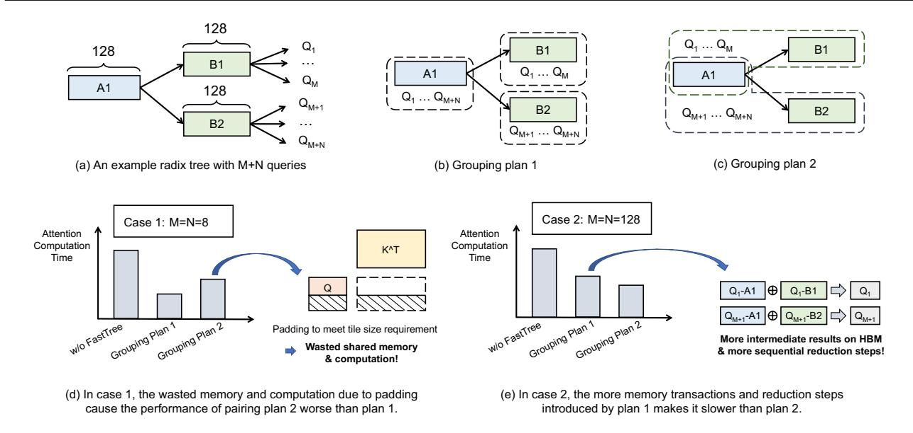

Figure 4. Illustration of two context-queries grouping plans. In different cases, the two plans each have their performance problems.

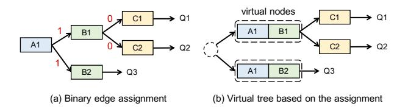

Figure 5. Example of edge assignment and virtual tree generation.

the given grouping plan.

### 4.2 Overhead-Guided Greedy Heuristic

In practice, the structure of the radix tree is dynamic (Zheng et al., 2023a) across time, so we need to update the grouping plan accordingly on the fly. Therefore, the runtime search for the optimal edge assignment should be lightweight, otherwise the overall inference performance can be affected. Enumerating all possible candidates thus becomes infeasible as we have  $2^{|E|}$  plans, and it is difficult to quickly predict the latency of the GPU kernels whose blocks are heterogeneous without actual evaluation.

We resort to a greedy heuristic to solve the search problem in linear time. We traverse the tree in a breadth-first search (BFS) order and determine the value of each edge by comparing the estimated costs of the two different assignments.

We illustrate the detailed assignment process with the greedy heuristic in Algorithm 1. We first initialize arrays A and L in Lines 1-2 to represent the current aggregated query number and context length of each node by assuming all nodes are separated. Their values can be updated if two nodes are concatenated. We then traverse the entire tree in a

BFS order (Line 3) and enumerate the leaf nodes for each node v (Line 6). For each leaf node l, we estimate the costs of assigning different values to the edge  $v \rightarrow l$  in Lines 8-9 based on the query numbers and context lengths of v and l, i.e.,  $nQ_{curr}$ ,  $nQ_l$ ,  $len_v$ , and  $len_l$ . The detailed cost analysis is discussed in the next paragraph. Finally, we assign the value to the edge by comparing the costs in Lines 10-16. If vand l are concatenated by assigning value 1 to the edge, we should also update the  $nQ_{curr}$  and L[l] accordingly. This is because after concatenating, the  $nQ_l$  queries should be grouped with the concatenated node rather than the original node v, so  $nQ_{curr}$  should be decreased. Meanwhile, for node l, we should increase its context length by the length of v. We use Figure 6 to illustrate what the variables used above represent and how the concatenation between v and laffects their aggregated query numbers and context lengths.

In the next part, we introduce how we construct the cost models based on the overhead analysis. Our insight is that although it is difficult to predict the accurate cost, leveraging a lightweight overhead estimation is yet effective in guiding the greedy search.

Cost due to padding. After grouping, the GPU kernel will process each group tile-by-tile, looping over query and context dimensions. Tile shapes are specified based on the hardware features to take full advantage of the on-chip shared memory and high-performance tensor cores, which are fixed across thread blocks. However, the dimensions may not always be perfectly divisible by the tile size. In such cases, padding is required to fill the last several tiles, wasting the shared memory resources. The padding area in a given dimension can be computed based on the tile size

## <span id="page-5-0"></span>Algorithm 1 Greedy Binary Edge Assignment

```
Input: Radix tree T = (V, E)
1: Initialize A as the number of all associated queries of
   each node in V
2: Initialize L as the context length of each node
3: for node v in BFS(V ) do
4: nQcurr = A[v] ▷ current #aggregated queries
5: lenv = L[v] ▷ accumulated context length
6: for l in leaves(v) do
7: nQl = A[l], lenl = L[l]
8: C0 = SplitKVCost(nQcurr, nQl
                                    , lenl
                                         , lenv)
9: C1 = SplitQCost(nQcurr, nQl
                                   , lenl
                                       , lenv)
10: if C0 ≥ C1 then
11: Assign 1 to edge v → l
12: nQcurr = nQcurr − nQl
13: L[l] = lenl + lenv
14: else
15: Assign 0 to edge v → l
16: end if
17: end for
18: end for
```

T S and the dimension size N through the function:

$$Pad(TS, N) = TS - ((N-1)\%TS + 1)$$
 (3)

Concatenating v and l requires splitting the Q matrix of v in the query dimension, as nQ<sup>l</sup> queries associated with l should be separated from the nQcurr queries associated with v. Such splitting will either keep the padding area unchanged or exacerbate the problem because we always have the following inequality:

$$Pad(TS, M + N) \le Pad(TS, M) + Pad(TS, N)$$
 (4)

Padding introduces two primary sources of performance overhead. First, it leads to inefficient utilization of shared memory, which could otherwise be used to cache additional aggregated queries for improved data reuse and reduced global memory access. Second, padding results in redundant computations that do not contribute to the final output. To estimate the overhead due to padding at the query dimension, we define its cost function by combining the increased memory loading and floating-point operations:

$$C_{P,q}(nQ, len) = \operatorname{Pad}(TS_q, nQ) \cdot len \cdot d$$
 (5)

where nQ represents the query number, len is the context length, T S<sup>q</sup> is the tile size, and d is the head dimension. Similarly, we have the cost function for padding at the context dimension:

$$C_{P,c}(nQ, len) = nQ \cdot \text{Pad}(TS_c, \min(len, TS_c)) \cdot d$$
 (6)

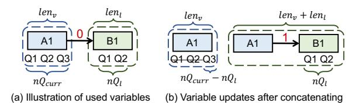

Figure 6. Illustrating example for the variables used in Algorithm 1.

where T S<sup>c</sup> is the tile size for the context dimension and β is another empirical coefficient. The difference from the cost for query dimension is that we only consider the overhead when the current context length is smaller than the tile size. This is because, unlike the number of aggregated queries, the context length can grow during tree traversal through concatenation. Once it exceeds the tile size, the overhead due to padding becomes difficult to estimate at each traversal step. Then, we define the overall padding cost of a virtual node as:

$$C_P(nQ, len) = \alpha \cdot C_{P,q}(nQ, len) + \beta \cdot C_{P,kv}(nQ, len)$$
 (7)

where α and β are two empirical coefficients.

Then, according to the computation patterns shown in Figure 6, we construct the costs for the two assignments as:

$$\begin{aligned} \text{SplitKVCost}_{P} &= C_{P}(nQ_{curr}, len_{v}) \\ &+ C_{P}(nQ_{l}, len_{l}) \end{aligned} \tag{8} \\ \text{SplitQCost} &= C_{P}(nQ_{curr} - nQ_{l}, len_{v}) \\ &+ C_{P}(nQ_{l}, len_{v} + len_{l}) \end{aligned} \tag{9}$$

Cost due to intermediate results. Besides padding, splitting the KV matrices at the context dimension (i.e., assign 0 to the edge) can introduce more intermediate results and cause additional overhead. This is because the attention computation requires reducing all elements across the context dimension. After context splitting, different groups are processed by separate thread blocks, so the intermediate partial reduction results should be stored in the global memory [\(Dao et al.,](#page-11-0) [2023\)](#page-11-0), which causes extra memory transaction overhead and brings more sequential reduction steps in the next stage to compute the final results. These overheads can accumulate and become significant when the plan contains lots of dependent groups with short contexts. We use the number of the increased intermediate elements along with an empirical coefficient γ to model this cost:

$$SplitKVCost_R = \gamma \cdot nQ_l \cdot d \tag{10}$$

Then, the total cost of assigning a value of 0 is:

$$SplitKVCost_P + SplitKVCost_R$$
 (11)

<span id="page-6-0"></span>By adjusting the empirical coefficients based on profiling the underlying hardware, we can reconcile the two overheads to leverage the greedy heuristic shown in Algorithm [1](#page-5-0) to generate the context-queries groups effectively at runtime.

### 4.3 GPU-Efficient Long Context Splitting

Our greedy heuristics consider the overhead introduced by different grouping plans, but the GPU can still be underutilized in certain cases. We propose runtime *long context splitting* to enhance GPU utilization, overcoming two problems that affect the attention kernel performance.

The first problem is that sometimes the group-level parallelisms can be insufficient to fully occupy the GPU, i.e., the total launched thread block numbers are smaller than the GPU capacity. The maximum block number that can reside on the GPU simultaneously is the product of the GPU SM number and the maximum block number per SM, where the latter is determined by the shared memory and register usage. With a small number of blocks, the GPU can fail to hide the instruction latency through warp scheduling and even have SMs idle, as shown in the left part of Figure 7.

The second problem is that partial tree nodes can have extremely long contexts, causing a significant tail effect like the right part of the figure shows. In this case, some blocks can consume much more execution time than others, so in the last waves, the active block number is very small, causing the same issue as in the first case.

For both of the above problems, we find that splitting the nodes with context lengths larger than a certain threshold at runtime can solve them effectively. Although contextsplitting introduces the intermediate result reduction overhead, experiments (detailed in Section [6.1\)](#page-7-0) demonstrate that the performance improvement it brings can totally hide the overhead when GPU SMs are underutilized.

## 5 EFFICIENT TREE-STRUCTURED ATTENTION KERNEL DESIGN

Existing GPU kernels designed for LLM inference [\(Dao](#page-11-0) [et al.,](#page-11-0) [2023;](#page-11-0) [FlashInfer,](#page-11-0) [2024\)](#page-11-0) do not consider the radix treebased KV cache sharing. They separate the computation of different queries into individual thread blocks, ignoring the opportunity to enable the tensor core usage and reuse the KV tiles in shared memory through query aggregation. By generating the context-queries groups based on the tree structures and hardware features, we can then utilize more efficient GPU kernels to address the above issues.

In detail, we use a single GPU kernel to process different groups in the tree in parallel, with each context-queries group dispatched to an individual block set, as Figure 8 shows. Such a one-kernel-accommodating-all design not

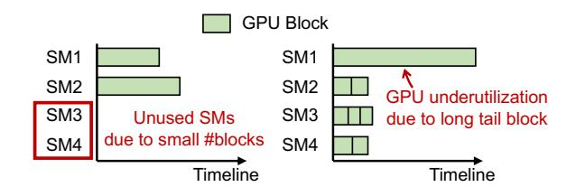

Figure 7. Two performance issues that can be solved by splitting long contexts.

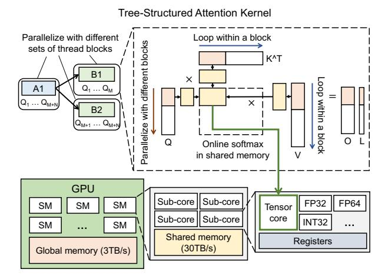

Figure 8. The design of the attention kernel in FastTree. The colors of tiles in the dotted rectangle indicate their memory location, according to the simplified GPU architecture figure at the bottom.

only increases the block parallelism but also eliminates the kernel launch overhead [\(Zhuang et al.,](#page-14-0) [2024;](#page-14-0) [Zheng et al.,](#page-13-0) [2022;](#page-13-0) [Pan et al.,](#page-12-0) [2023\)](#page-12-0).

Flash-Attn style group processing. Within the kernel, we perform the attention operation tile-by-tile. For each group, we divide the QKV matrices associated with it into multiple tiles and parallelize the tiles across the query dimension by dispatching the Q matrix tiles into different blocks. In contrast, we sequentially iterate the K and V tiles within a block due to the inter-tile dependency of the outputs across the context dimension. We first copy the QKV tiles from the GPU global memory to the fast on-chip shared memory, as Figure 8 depicts, and then utilize the online softmax technology [\(Rabe & Staats,](#page-13-0) [2021;](#page-13-0) [Milakov & Gimelshein,](#page-12-0) [2018;](#page-12-0) [Dao et al.,](#page-11-0) [2022;](#page-11-0) [Dao,](#page-11-0) [2023\)](#page-11-0) to store all partial softmax results in the shared memory. Compared with existing approaches [\(Dao et al.,](#page-11-0) [2023;](#page-11-0) [FlashInfer,](#page-11-0) [2024\)](#page-11-0) that separate each query, we are able to reduce the slow global memory transactions significantly, as for all queries within a Q tile, we only need to load the K matrix once and reuse them through the shared memory. Moreover, by aggregating queries, we can transform the GEMV operation into the GEMM operation, thus enabling the effective usage of

<span id="page-7-0"></span>tensor cores on the GPU, as shown in the figure.

After executing the attention kernel, we will obtain an intermediate output matrix O and a LogSumExp vector L for every group, stored in the GPU global memory, as shown in the right of Figure [8.](#page-6-0) We then launch another lightweight GPU kernel to reduce the intermediate outputs for each query to get the final results, while leveraging the LogSumExp vectors for re-scaling [\(Dao et al.,](#page-11-0) [2023\)](#page-11-0).

Multi-phase tiling. We adaptively select the tile size for the query dimension to efficiently handle different parts in the tree. This optimization is based on the fact that nodes closer to the root in the tree tend to aggregate more queries, requiring larger tile sizes to maximize KV reuse and reduce redundant memory loads. On the other hand, nodes near the leaves often have fewer queries, so we choose smaller tile sizes to avoid shared memory wastage and improve SM occupancy [\(NVIDIA,](#page-12-0) [2025;](#page-12-0) [Pan et al.,](#page-13-0) [2024\)](#page-13-0) to hide instruction latency. Our current implementation simply partitions the tree into multiple phases and utilizes separate kernels with distinct tile sizes to process them. We apply this optimization only when the block-level parallelism is large enough for each phase, ensuring that all the SMs on the GPU can be utilized.

## 6 EVALUATION

We build FastTree as a plugin of SGLang [\(Zheng et al.,](#page-13-0) [2023a\)](#page-13-0) and implement the attention kernels with Triton [\(Tillet et al.,](#page-13-0) [2019\)](#page-13-0) for quick prototyping and verification. We optimize the attention operations during decoding while using the kernels in FlashInfer [\(FlashInfer,](#page-11-0) [2024\)](#page-11-0) during prefill. There are no fundamental reasons preventing FastTree from optimizing the batched prefills or the mixed prefill and decoding except the engineering efforts. However, the benefit will be limited as the prefill stages often do not suffer from the redundant KV cache loads and tensor core underutilization.

We evaluate FastTree on an NVIDIA H100 GPU (80GB) with the support of CUDA 12.2. Our current implementation does not utilize Hopper-specific features (e.g., TMA), and we leave this as future work for further optimization.

## 6.1 Kernel Benchmark

Workloads and settings. We benchmark the GPU kernel performance for the attention operations with various configurations. We utilize two arrays to generate benchmarks with different tree shapes of the KV cache, which are the tree node number of each level (N) and the per-node context length of each level (C), respectively. The size of these arrays is equal to the number of levels in the tree, that is, the tree depth. For example, a three-level tree with N=1,2,4 and C=128,32,32 contains 1 + 2 + 4 = 7 total nodes. The

context length of the root node is 128 while the context lengths of all other nodes are 32. Each node in the second level has 4/2 = 2 child nodes. Besides, we benchmark the trees with grouped-query attention (GQA) [\(Ainslie et al.,](#page-11-0) [2023\)](#page-11-0) ratios 1, 4, and 16, respectively. The head dimension we use is 128.

Baselines. We compare the kernel execution time of FastTree against various state-of-the-art baselines, including FlashAttention [\(Dao et al.,](#page-11-0) [2022;](#page-11-0) [Dao,](#page-11-0) [2023;](#page-11-0) [Dao](#page-11-0) [et al.,](#page-11-0) [2023\)](#page-11-0) v2.6.3, FlashInfer [\(FlashInfer,](#page-11-0) [2024\)](#page-11-0) v0.1.6, and Triton-implemented [\(Tillet et al.,](#page-13-0) [2019\)](#page-13-0) kernels from SGLang [\(Zheng et al.,](#page-13-0) [2023a\)](#page-13-0) v0.2.13. SGLang adapts the Triton kernels from the token attention implementation in LightLLM [\(ModelTC,](#page-12-0) [2024\)](#page-12-0). We use Triton version 3.0.0 during evaluation. We also evaluate the performance of FlashInfer's Multi-level Cascade Attention (CascadeAttn) [\(Ye et al.,](#page-13-0) [2024b\)](#page-13-0) and DeFT [\(Yao et al.,](#page-13-0) [2024a\)](#page-13-0), which are two concurrent works optimizing attention operations under tree-structured KV cache sharing.

Results. Figure [9](#page-8-0) presents the GPU kernel performance of FastTree and the baselines across different tree shapes and GQA ratios. We normalize the performance to the bestperforming one for each configuration. Experimental results show that on average, FastTree achieves 5.1×, 9.2×, 4.2×, 10.6×, and 2.1× speedups over FlashAttention, SGLang's Triton kernels, FlashInfer, DeFT, and CascadeAttn, respectively. The performance improvement of FastTree comes from the tree-structured attention kernel designs that reduce HBM accesses and improve tensor core utilization as well as the runtime optimization that effectively identifies the efficient grouping plan.

We observe that when the GQA ratio is low, FastTree achieves significantly higher speedups over FlashAttention and FlashInfer compared to configurations with a high GQA ratio. This is because GQA can explicitly aggregate multiple query heads into a single KV head, alleviating the issues of shared memory waste and low tensor core utilization. However, even at a GQA ratio of 16, where FlashAttention and FlashInfer can effectively leverage tensor cores, Fast-Tree still outperforms these query-separate kernels across different tree shapes. This advantage arises from FastTree's ability to use larger tile sizes that aggregate more queries for KV reuse, thereby reducing redundant memory accesses effectively. SGLang's Triton kernel has not yet integrated GQA-specific optimizations, resulting in poor performance even when GQA is enabled.

Even without greedy search, FastTree outperforms DeFT and CascadeAttn, both of which also leverage treestructured optimizations. This performance gap is attributed to a series of kernel and runtime-level optimizations employed by FastTree. For instance, by adaptively partitioning the tree into phases with distinct tile sizes and selectively

<span id="page-8-0"></span>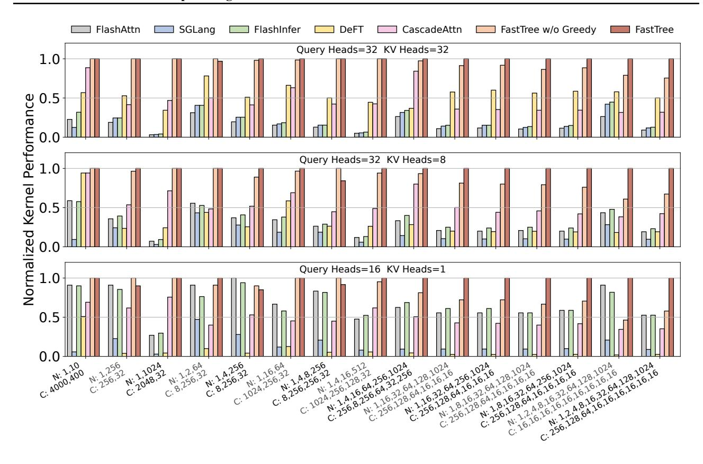

Figure 9. Normalized GPU kernel performance of FastTree and the baselines for the attention operation across various configurations. N: node number of each level. C: per-node context length of each level.

splitting the context, FastTree strikes a balance between parallelism and data reuse, leading to improved GPU utilization. In contrast, DeFT uses a fixed tile size, which results in substantial shared memory waste in many configurations, particularly with a high GQA ratio. Furthermore, DeFT introduces additional masking operations, which incur redundant computation and further degrade performance.

Optimization ablation. In the figure, we also include the performance of FastTree without greedy optimization (Section 4.2), where context-query groups are aggregated directly based on the original tree structure. Unlike the full version of FastTree, this variant does not employ a greedy heuristic to construct a virtual tree before aggregation. The figure shows that when the tree structure is relatively simple and shallow, the greedy heuristic in FastTree tends to produce a grouping plan similar to direct aggregation. In such cases, it prefers to separate different levels to aggregate more queries and maximize data reuse. On the other hand, as the tree becomes deeper and structurally more complex, the greedy heuristic can effectively identify more efficient grouping plans, achieving up to a 2.2× speedup. For instance, regarding the configuration in the bottom-right corner of the figure, FastTree tends to concatenate nodes for the final few levels of the tree and use a small tile size of 16. In contrast, direct aggregation may increase data reuse with larger tile sizes but also introduces excessive padding and lowers occupancy, ultimately leading to performance degradation.

Additionally, we study the impact of GPU-efficient long context splitting (Section 4.3) on performance. In specific configurations such as N=1,10 and C=4000,400, this splitting optimization can yield up to a  $1.9\times$  speedup. This is because, in these settings, the number of context-query groups that can be parallelized is limited and there exist nodes with very long contexts, leading to severe GPU SM under-utilization issues.

## **6.2** End-to-end Performance

We benchmark the end-to-end performance of FastTree by integrating it into SGLang v0.2.13. For comparison, we evaluate SGLang using both Triton and FlashInfer as attention operation backends. We measure the inference time for a batch of requests that share common prefixes to report the system throughput.

Workloads. We test FastTree on models Llama-2-7B (Tou-

vron et al., 2023) and Mistral-7B (Jiang et al., 2023), whose GQA ratios are 1 and 4, respectively. We adopt the Meta AI system prompt from The Big Prompt Library (TheBig-PromptLibrary, 2024) to imitate the LLM applications used in production, which contains 3193 tokens (with Llama tokenizer). We then combine it with the following benchmarks, where questions are collected from the GSM8K dataset (Cobbe et al., 2021):

- (A) Multi-level system prompt: a system prompt sets the initial guidelines for how an LLM model should respond, defining its tone, role, and focus, while some aspects can vary between users based on individual needs or session settings. In this benchmark, we randomly replace the user country and response language in the Meta AI system prompt with different values, splitting into four levels with 459, 38, 584, and 2112 tokens, respectively.
- (B) Multiple few-shot learning: few-shot learning (Brown, 2020) is an extensively used in-context learning method that lets LLMs learn from the few-shot examples provided in the prompt. We create the benchmark by constructing a three-level tree structure consisting of a system prompt, multiple (8 in our experiments) few-shot example combinations, and corresponding question-answer (QA) pairs. We let each combination contain 20-shot examples, with subsequent 16 individual questions.
- (C) <u>Multi-chain reasoning</u>: <u>Multi-chain reasoning</u> (Yoran et al., 2023) invokes multiple distinct chains of logic and then combines them to solve complex problems. In this benchmark, we construct four chains for each question.
- (D) Multi-document QA: In multi-document QA, questions can be input into the LLM with multiple documents in the prompt as the information sources (Jin et al., 2024). The used documents across questions can then form a radix tree with multi-level sharing. We split the Llama-2 report (Touvron et al., 2023) into different parts and use these parts to form the multi-document prompts. In this benchmark, we do not add the Meta AI system prompt at the beginning.

For all benchmarks, we keep the total number of parallel requests within a batch as 128 and set the generated token number of each request as 256.

**Results.** We present the normalized performance of Fast-Tree and the baselines in Figure 10. Experimental results demonstrate that FastTree consistently outperforms the baselines across the benchmarks. Compared to SGLang with Triton-implemented kernels, FastTree achieves average speedups of  $2.4\times$  and  $3.1\times$  on Llama and Mistral, respectively. As for SGLang with FlashInfer backend, the average speedups are  $1.6\times$  and  $1.9\times$ , respectively. Overall, FastTree improves the throughput of SGLang by up to  $2.2\times$  compared to FlashInfer backend. The improvement comes from accelerating the time-consuming attention operation,

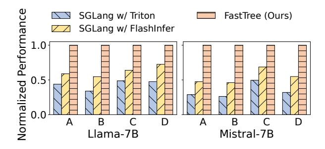

Figure 10. End-to-end performance comparison across benchmarks. A: multi-level system prompt. B: multiple few-shot learning. C: multi-chain reasoning. D: multi-document QA.

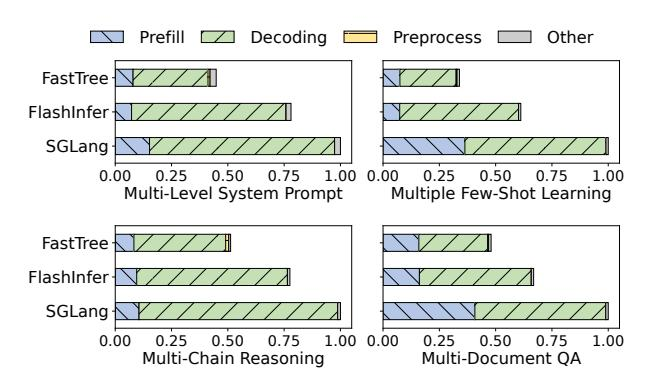

Figure 11. End-to-end execution time breakdown comparison on Llama. For abbreviation, we use "SGLang" to represent SGLang with Triton-implemented kernels and "FlashInfer" to represent SGLang with FlashInfer backend. The horizontal axis is the normalized execution time.

and we provide a detailed analysis in the following parts.

We find that the Triton-implemented attention kernels in SGLang are generally slower than FlashInfer. This is because FlashInfer is a more comprehensive CUDA kernel library optimized for various conditions.

**Breakdown analysis.** We report the latency breakdown on Llama in Figure 11 for performance analysis. We find that with FastTree, the decoding latency shrinks substantially for all benchmarks due to more efficient attention operations, with average speedups of  $2.3\times$  and  $1.9\times$  over SGLang-Triton and SGLang-FlashInfer. Besides, the preprocessing overhead on the CPU introduced by generating contextquery groups in FastTree is negligible in these benchmarks. This is due to two main reasons. First, when the batch size and context length are sufficiently large, the GPU kernel execution time dominates the overall inference process, making the CPU preprocessing overhead relatively small. Second, SGLang performs multiple consecutive decoding steps after scheduling a batch to amortize the scheduling overhead. As a result, the preprocessing overhead introduced by FastTree is also effectively amortized. Furthermore, it is possible

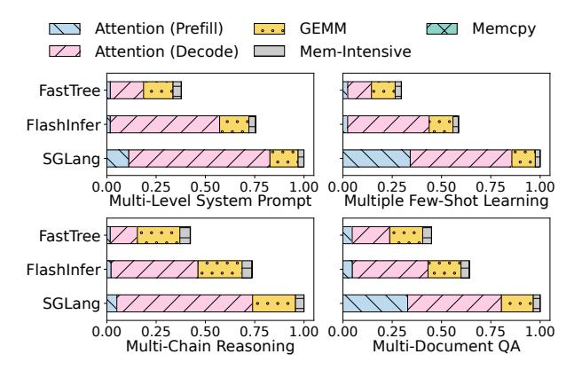

Figure 12. Execution time breakdown of GPU kernels on Llama. The CPU operations and overhead are not reported here. The horizontal axis is the normalized execution time.

to overlap the CPU-side preprocessing with GPU computation (Team, 2024b), which can further reduce overhead and deliver more robust performance gains.

**GPU** kernel execution time breakdown. Moreover, we show the breakdown of GPU kernels in Figure 12. We find that compared to GEMM operations in QKV projections and MLP layers, the unoptimized attention operations occupy substantial portions of the total kernel execution time across the tree-structured benchmarks. In contrast, with FastTree, the attention computation time can be reduced significantly. According to the figure, other kernels, which are mainly invoked by the element-wise and reduction operations in the model, only contribute to a small portion of the entire execution time.

#### 7 RELATED WORK

**LLM serving systems.** LLM serving systems are responsible for efficiently deploying models and managing inference requests, which have gained increasing attention in recent research. Many works optimize the request scheduling strategies of LLM serving systems. For example, Orca (Yu et al., 2022) proposes iteration-level scheduling (or continuous batching), which continuously schedules new requests to form a batch rather than waiting for the completion of previous requests. Another line of work focuses on efficient memory management during serving. vLLM (Kwon et al., 2023) adopts the paged KV cache mechanism to reduce memory fragments. CachedAttention (Gao et al., 2024) and Pensieve (Yu et al., 2023) maintain the multi-turn chat history to eliminate redundant computation. SGLang (Zheng et al., 2023a) organizes the KV cache as a radix tree to enable multi-level prefix sharing, but it overlooks the tree structure-unaware computation problem. In contrast, Fast-Tree optimizes the attention kernel performance guided by the tree-structured KV cache.

Attention kernel optimization. Many works study the GPU kernel optimization to accelerate attention computation. FlashAttention (Dao et al., 2022; Dao, 2023; Dao et al., 2023) fuses attention computation into one single GPU kernel by leveraging online softmax (Rabe & Staats, 2021; Milakov & Gimelshein, 2018), storing all intermediate results on the shared memory and reducing IO cost significantly. Several works (Ye et al., 2024a; Zhu et al., 2024; Lin et al., 2024; Zheng et al., 2024) improve the attention computation under single-level prefix sharing. Concurrent works (Ye et al., 2024b; Yao et al., 2024a; Juravsky et al., 2024) also optimize the attention kernel under treestructured KV cache sharing, but they do not identify and handle the context-queries grouping challenge as FastTree. Meanwhile, machine learning compilers (Chen et al., 2018; Zheng et al., 2020; Lattner et al., 2021; Zheng et al., 2023b; Tillet et al., 2019; Huang et al., 2023) are extensively used to generate efficient GPU kernel codes. We implement Fast-Tree with Triton (Tillet et al., 2019), which allows users to write fast GPU kernels with Python conveniently.

CUDAGraph (Gray, 2019) is often used during decoding to reduce CPU overhead by capturing and replaying GPU workloads, but it requires static inputs and fixed launch configurations to enable graph construction. To be compatible with CUDAGraph optimization, we can integrate the persistent threads (Aila & Laine, 2009; Boyer et al., 2009) technique to fix the launched blocks with FastTree, or we can leverage the PyTorch CUDAGraph Trees (Team, 2024a) to only capture the non-attention parts during decoding.

#### 8 CONCLUSION

In this paper, we identify the inefficient computation limitations of existing serving systems with tree-structured KV cache sharing. To address these, we introduce Fast-Tree, which improves the inference performance with tree structure-tailored attention kernel and runtime optimization. FastTree applies a greedy heuristic to effectively search for the efficient context-queries groups at runtime and then performs the attention operations with shared memory and tensor core-friendly kernels. Our experiments show that FastTree significantly improves the attention computation performance under the tree-structured KV cache.

#### 9 ACKNOWLEDGMENT

We sincerely thank the anonymous MLSys reviewers for their valuable feedback and insightful suggestions. We also appreciate the UCSD MLSys Group for their helpful comments. This work was supported in part by NSF Award 2124039 and the Amazon Research Awards. We use Chat-GPT to polish the paper writing and help write some scripts.

## <span id="page-11-0"></span>REFERENCES

- Agrawal, A., Kedia, N., Panwar, A., Mohan, J., Kwatra, N., Gulavani, B., Tumanov, A., and Ramjee, R. Taming {Throughput-Latency} tradeoff in {LLM} inference with {Sarathi-Serve}. In *18th USENIX Symposium on Operating Systems Design and Implementation (OSDI 24)*, pp. 117–134, 2024.
- Aila, T. and Laine, S. Understanding the efficiency of ray traversal on gpus. In *Proceedings of the conference on high performance graphics 2009*, pp. 145–149, 2009.
- Ainslie, J., Lee-Thorp, J., De Jong, M., Zemlyanskiy, Y., Lebron, F., and Sanghai, S. Gqa: Training generalized ´ multi-query transformer models from multi-head checkpoints. *arXiv preprint arXiv:2305.13245*, 2023.
- Bai, J., Bai, S., Chu, Y., Cui, Z., Dang, K., Deng, X., Fan, Y., Ge, W., Han, Y., Huang, F., Hui, B., Ji, L., Li, M., Lin, J., Lin, R., Liu, D., Liu, G., Lu, C., Lu, K., Ma, J., Men, R., Ren, X., Ren, X., Tan, C., Tan, S., Tu, J., Wang, P., Wang, S., Wang, W., Wu, S., Xu, B., Xu, J., Yang, A., Yang, H., Yang, J., Yang, S., Yao, Y., Yu, B., Yuan, H., Yuan, Z., Zhang, J., Zhang, X., Zhang, Y., Zhang, Z., Zhou, C., Zhou, J., Zhou, X., and Zhu, T. Qwen technical report. *arXiv preprint arXiv:2309.16609*, 2023.
- Boyer, M., Tarjan, D., Acton, S. T., and Skadron, K. Accelerating leukocyte tracking using cuda: A case study in leveraging manycore coprocessors. In *2009 IEEE international symposium on parallel & distributed processing*, pp. 1–12. IEEE, 2009.
- Brown, T. B. Language models are few-shot learners. *arXiv preprint arXiv:2005.14165*, 2020.
- Chen, T., Moreau, T., Jiang, Z., Zheng, L., Yan, E., Shen, H., Cowan, M., Wang, L., Hu, Y., Ceze, L., Guestrin, C., and Krishnamurthy, A. TVM: An automated End-to-End optimizing compiler for deep learning. In *13th USENIX Symposium on Operating Systems Design and Implementation (OSDI 18)*, pp. 578–594, Carlsbad, CA, October 2018. USENIX Association. ISBN 978-1-939133-08-3. URL [https://www.usenix.org/conference/](https://www.usenix.org/conference/osdi18/presentation/chen) [osdi18/presentation/chen](https://www.usenix.org/conference/osdi18/presentation/chen).
- Cobbe, K., Kosaraju, V., Bavarian, M., Chen, M., Jun, H., Kaiser, L., Plappert, M., Tworek, J., Hilton, J., Nakano, R., Hesse, C., and Schulman, J. Training verifiers to solve math word problems. *arXiv preprint arXiv:2110.14168*, 2021.
- Cummins, C., Seeker, V., Grubisic, D., Roziere, B., Gehring, J., Synnaeve, G., and Leather, H. Meta large language model compiler: Foundation models of compiler optimization. *arXiv preprint arXiv:2407.02524*, 2024.

- Dao, T. Flashattention-2: Faster attention with better parallelism and work partitioning. *arXiv preprint arXiv:2307.08691*, 2023.
- Dao, T., Fu, D., Ermon, S., Rudra, A., and Re, C. Flashat- ´ tention: Fast and memory-efficient exact attention with io-awareness. *Advances in Neural Information Processing Systems*, 35:16344–16359, 2022.
- Dao, T., Haziza, D., Massa, F., and Sizov, G. Flash-Decoding for long-context inference. [https://crfm.stanford.edu/2023/10/](https://crfm.stanford.edu/2023/10/12/flashdecoding.html) [12/flashdecoding.html](https://crfm.stanford.edu/2023/10/12/flashdecoding.html), 2023.
- FlashInfer. FlashInfer. [https://github.com/](https://github.com/flashinfer-ai/flashinfer) [flashinfer-ai/flashinfer](https://github.com/flashinfer-ai/flashinfer), 2024.
- Gao, B., He, Z., Sharma, P., Kang, Q., Jevdjic, D., Deng, J., Yang, X., Yu, Z., and Zuo, P. {Cost-Efficient} large language model serving for multi-turn conversations with {CachedAttention}. In *2024 USENIX Annual Technical Conference (USENIX ATC 24)*, pp. 111–126, 2024.
- Gao, Y., Xiong, Y., Gao, X., Jia, K., Pan, J., Bi, Y., Dai, Y., Sun, J., and Wang, H. Retrieval-augmented generation for large language models: A survey. *arXiv preprint arXiv:2312.10997*, 2023.
- Gray, A. Getting Started with CUDA Graphs. [https://developer.nvidia.com/blog/](https://developer.nvidia.com/blog/cuda-graphs/) [cuda-graphs/](https://developer.nvidia.com/blog/cuda-graphs/), September 2019.
- Gur, I., Furuta, H., Huang, A., Safdari, M., Matsuo, Y., Eck, D., and Faust, A. A real-world webagent with planning, long context understanding, and program synthesis. *arXiv preprint arXiv:2307.12856*, 2023.
- Huang, G., Bai, Y., Liu, L., Wang, Y., Yu, B., Ding, Y., and Xie, Y. Alcop: Automatic load-compute pipelining in deep learning compiler for ai-gpus. *Proceedings of Machine Learning and Systems*, 5:680–694, 2023.
- HuggingFace. Text Generation Inference. [https://github.com/huggingface/](https://github.com/huggingface/text-generation-inference) [text-generation-inference](https://github.com/huggingface/text-generation-inference), 2024.
- Jiang, A. Q., Sablayrolles, A., Mensch, A., Bamford, C., Chaplot, D. S., de las Casas, D., Bressand, F., Lengyel, G., Lample, G., Saulnier, L., Lavaud, L. R., Lachaux, M.-A., Stock, P., Scao, T. L., Lavril, T., Wang, T., Lacroix, T., and Sayed, W. E. Mistral 7b. *arXiv preprint arXiv:2310.06825*, 2023.
- Jin, C., Zhang, Z., Jiang, X., Liu, F., Liu, X., Liu, X., and Jin, X. Ragcache: Efficient knowledge caching for retrievalaugmented generation. *arXiv preprint arXiv:2404.12457*, 2024.

- <span id="page-12-0"></span>Juravsky, J., Brown, B., Ehrlich, R., Fu, D. Y., Re, C., and ´ Mirhoseini, A. Hydragen: High-throughput llm inference with shared prefixes. *arXiv preprint arXiv:2402.05099*, 2024.
- Kwon, W., Li, Z., Zhuang, S., Sheng, Y., Zheng, L., Yu, C. H., Gonzalez, J. E., Zhang, H., and Stoica, I. Efficient memory management for large language model serving with pagedattention. In *Proceedings of the ACM SIGOPS 29th Symposium on Operating Systems Principles*, 2023.
- Lattner, C., Amini, M., Bondhugula, U., Cohen, A., Davis, A., Pienaar, J., Riddle, R., Shpeisman, T., Vasilache, N., and Zinenko, O. Mlir: Scaling compiler infrastructure for domain specific computation. In *2021 IEEE/ACM International Symposium on Code Generation and Optimization (CGO)*, pp. 2–14. IEEE, 2021.
- Li, J., Tang, T., Zhao, W. X., Nie, J.-Y., and Wen, J.-R. Pretrained language models for text generation: A survey. *ACM Computing Surveys*, 56(9):1–39, 2024.
- Lin, C., Han, Z., Zhang, C., Yang, Y., Yang, F., Chen, C., and Qiu, L. Parrot: Efficient serving of {LLM-based} applications with semantic variable. In *18th USENIX Symposium on Operating Systems Design and Implementation (OSDI 24)*, pp. 929–945, 2024.
- Microsoft. DeepSpeed-MII. [https://github.com/](https://github.com/microsoft/DeepSpeed-MII) [microsoft/DeepSpeed-MII](https://github.com/microsoft/DeepSpeed-MII), 2024.
- Milakov, M. and Gimelshein, N. Online normalizer calculation for softmax. *arXiv preprint arXiv:1805.02867*, 2018.
- ModelTC. LightLLM: A Light and Fast Inference Service for LLM. [https://github.com/ModelTC/](https://github.com/ModelTC/lightllm) [lightllm](https://github.com/ModelTC/lightllm), 2024.
- NVIDIA. TensorRT-LLM. [https://github.com/](https://github.com/NVIDIA/TensorRT-LLM) [NVIDIA/TensorRT-LLM](https://github.com/NVIDIA/TensorRT-LLM), 2024.
- NVIDIA. Programming Guide :: CUDA Toolkit Documentation. [https://docs.nvidia.com/cuda/](https://docs.nvidia.com/cuda/cuda-c-programming-guide/index.html) [cuda-c-programming-guide/index.html](https://docs.nvidia.com/cuda/cuda-c-programming-guide/index.html), 2025.
- OpenAI, Achiam, J., Adler, S., Agarwal, S., Ahmad, L., Akkaya, I., Aleman, F. L., Almeida, D., Altenschmidt, J., Altman, S., Anadkat, S., Avila, R., Babuschkin, I., Balaji, S., Balcom, V., Baltescu, P., Bao, H., Bavarian, M., Belgum, J., Bello, I., Berdine, J., Bernadett-Shapiro, G., Berner, C., Bogdonoff, L., Boiko, O., Boyd, M., Brakman, A.-L., Brockman, G., Brooks, T., Brundage, M., Button, K., Cai, T., Campbell, R., Cann, A., Carey, B., Carlson, C., Carmichael, R., Chan, B., Chang, C., Chantzis, F., Chen, D., Chen, S., Chen, R., Chen, J., Chen, M., Chess,
- B., Cho, C., Chu, C., Chung, H. W., Cummings, D., Currier, J., Dai, Y., Decareaux, C., Degry, T., Deutsch, N., Deville, D., Dhar, A., Dohan, D., Dowling, S., Dunning, S., Ecoffet, A., Eleti, A., Eloundou, T., Farhi, D., Fedus, L., Felix, N., Fishman, S. P., Forte, J., Fulford, I., Gao, L., Georges, E., Gibson, C., Goel, V., Gogineni, T., Goh, G., Gontijo-Lopes, R., Gordon, J., Grafstein, M., Gray, S., Greene, R., Gross, J., Gu, S. S., Guo, Y., Hallacy, C., Han, J., Harris, J., He, Y., Heaton, M., Heidecke, J., Hesse, C., Hickey, A., Hickey, W., Hoeschele, P., Houghton, B., Hsu, K., Hu, S., Hu, X., Huizinga, J., Jain, S., Jain, S., Jang, J., Jiang, A., Jiang, R., Jin, H., Jin, D., Jomoto, S., Jonn, B., Jun, H., Kaftan, T., Łukasz Kaiser, Kamali, A., Kanitscheider, I., Keskar, N. S., Khan, T., Kilpatrick, L., Kim, J. W., Kim, C., Kim, Y., Kirchner, J. H., Kiros, J., Knight, M., Kokotajlo, D., Łukasz Kondraciuk, Kondrich, A., Konstantinidis, A., Kosic, K., Krueger, G., Kuo, V., Lampe, M., Lan, I., Lee, T., Leike, J., Leung, J., Levy, D., Li, C. M., Lim, R., Lin, M., Lin, S., Litwin, M., Lopez, T., Lowe, R., Lue, P., Makanju, A., Malfacini, K., Manning, S., Markov, T., Markovski, Y., Martin, B., Mayer, K., Mayne, A., McGrew, B., McKinney, S. M., McLeavey, C., McMillan, P., McNeil, J., Medina, D., Mehta, A., Menick, J., Metz, L., Mishchenko, A., Mishkin, P., Monaco, V., Morikawa, E., Mossing, D., Mu, T., Murati, M., Murk, O., Mely, D., Nair, A., Nakano, R., Nayak, R., Neelakantan, ´ A., Ngo, R., Noh, H., Ouyang, L., O'Keefe, C., Pachocki, J., Paino, A., Palermo, J., Pantuliano, A., Parascandolo, G., Parish, J., Parparita, E., Passos, A., Pavlov, M., Peng, A., Perelman, A., de Avila Belbute Peres, F., Petrov, M., de Oliveira Pinto, H. P., Michael, Pokorny, Pokrass, M., Pong, V. H., Powell, T., Power, A., Power, B., Proehl, E., Puri, R., Radford, A., Rae, J., Ramesh, A., Raymond, C., Real, F., Rimbach, K., Ross, C., Rotsted, B., Roussez, H., Ryder, N., Saltarelli, M., Sanders, T., Santurkar, S., Sastry, G., Schmidt, H., Schnurr, D., Schulman, J., Selsam, D., Sheppard, K., Sherbakov, T., Shieh, J., Shoker, S., Shyam, P., Sidor, S., Sigler, E., Simens, M., Sitkin, J., Slama, K., Sohl, I., Sokolowsky, B., Song, Y., Staudacher, N., Such, F. P., Summers, N., Sutskever, I., Tang, J., Tezak, N., Thompson, M. B., Tillet, P., Tootoonchian, A., Tseng, E., Tuggle, P., Turley, N., Tworek, J., Uribe, J. F. C., Vallone, A., Vijayvergiya, A., Voss, C., Wainwright, C., Wang, J. J., Wang, A., Wang, B., Ward, J., Wei, J., Weinmann, C., Welihinda, A., Welinder, P., Weng, J., Weng, L., Wiethoff, M., Willner, D., Winter, C., Wolrich, S., Wong, H., Workman, L., Wu, S., Wu, J., Wu, M., Xiao, K., Xu, T., Yoo, S., Yu, K., Yuan, Q., Zaremba, W., Zellers, R., Zhang, C., Zhang, M., Zhao, S., Zheng, T., Zhuang, J., Zhuk, W., and Zoph, B. Gpt-4 technical report. *arXiv preprint arXiv:2303.08774*, 2023.
- Pan, Z., Zheng, Z., Zhang, F., Wu, R., Liang, H., Wang, D., Qiu, X., Bai, J., Lin, W., and Du, X. Recom: A compiler

- <span id="page-13-0"></span>approach to accelerating recommendation model inference with massive embedding columns. In *Proceedings of the 28th ACM International Conference on Architectural Support for Programming Languages and Operating Systems, Volume 4*, pp. 268–286, 2023.
- Pan, Z., Zheng, Z., Zhang, F., Xie, B., Wu, R., Smith, S., Liu, C., Ruwase, O., Du, X., and Ding, Y. Recflex: Enabling feature heterogeneity-aware optimization for deep recommendation models with flexible schedules. In *SC24: International Conference for High Performance Computing, Networking, Storage and Analysis*, pp. 1–15. IEEE, 2024.
- Rabe, M. N. and Staats, C. Self-attention does not need o(n 2 ) memory. *arXiv preprint arXiv:2112.05682*, 2021.
- Sutskever, I., Vinyals, O., and Le, Q. V. Sequence to sequence learning with neural networks. In *Proceedings of the 27th International Conference on Neural Information Processing Systems - Volume 2*, NIPS'14, pp. 3104–3112, Cambridge, MA, USA, 2014. MIT Press.
- Team, T. P. CUDAGraph Trees. [https:](https://pytorch.org/docs/stable/torch.compiler_cudagraph_trees.html) [//pytorch.org/docs/stable/torch.](https://pytorch.org/docs/stable/torch.compiler_cudagraph_trees.html) [compiler\\_cudagraph\\_trees.html](https://pytorch.org/docs/stable/torch.compiler_cudagraph_trees.html), 2024a.
- Team, T. S. SGLang v0.4: Zero-Overhead Batch Scheduler, Cache-Aware Load Balancer, Faster Structured Outputs. [https://lmsys.org/blog/](https://lmsys.org/blog/2024-12-04-sglang-v0-4/) [2024-12-04-sglang-v0-4/](https://lmsys.org/blog/2024-12-04-sglang-v0-4/), December 2024b.
- TheBigPromptLibrary. The Big Prompt Library. [https:](https://github.com/0xeb/TheBigPromptLibrary) [//github.com/0xeb/TheBigPromptLibrary](https://github.com/0xeb/TheBigPromptLibrary), 2024.
- Tillet, P., Kung, H.-T., and Cox, D. Triton: an intermediate language and compiler for tiled neural network computations. In *Proceedings of the 3rd ACM SIGPLAN International Workshop on Machine Learning and Programming Languages*, pp. 10–19, 2019.
- Touvron, H., Martin, L., Stone, K., Albert, P., Almahairi, A., Babaei, Y., Bashlykov, N., Batra, S., Bhargava, P., Bhosale, S., Bikel, D., Blecher, L., Ferrer, C. C., Chen, M., Cucurull, G., Esiobu, D., Fernandes, J., Fu, J., Fu, W., Fuller, B., Gao, C., Goswami, V., Goyal, N., Hartshorn, A., Hosseini, S., Hou, R., Inan, H., Kardas, M., Kerkez, V., Khabsa, M., Kloumann, I., Korenev, A., Koura, P. S., Lachaux, M.-A., Lavril, T., Lee, J., Liskovich, D., Lu, Y., Mao, Y., Martinet, X., Mihaylov, T., Mishra, P., Molybog, I., Nie, Y., Poulton, A., Reizenstein, J., Rungta, R., Saladi, K., Schelten, A., Silva, R., Smith, E. M., Subramanian, R., Tan, X. E., Tang, B., Taylor, R., Williams, A., Kuan, J. X., Xu, P., Yan, Z., Zarov, I., Zhang, Y., Fan, A., Kambadur, M., Narang, S., Rodriguez, A., Stojnic, R., Edunov, S., and Scialom, T. Llama 2: Open foundation and fine-tuned chat models. *arXiv preprint arXiv:2307.09288*, 2023.

- Vaswani, A., Shazeer, N., Parmar, N., Uszkoreit, J., Jones, L., Gomez, A. N., Kaiser, L., and Polosukhin, I. Attention is all you need. *Advances in Neural Information Processing Systems*, 2017.
- Yao, J., Chen, K., Zhang, K., You, J., Yuan, B., Wang, Z., and Lin, T. Deft: Decoding with flash tree-attention for efficient tree-structured llm inference. *arXiv preprint arXiv:2404.00242*, 2024a.
- Yao, S., Yu, D., Zhao, J., Shafran, I., Griffiths, T., Cao, Y., and Narasimhan, K. Tree of thoughts: Deliberate problem solving with large language models. *Advances in Neural Information Processing Systems*, 36, 2024b.
- Ye, L., Tao, Z., Huang, Y., and Li, Y. Chunkattention: Efficient self-attention with prefix-aware kv cache and two-phase partition. *arXiv preprint arXiv:2402.15220*, 2024a.
- Ye, Z., Lai, R., Lu, B.-R., Lin, C.-Y., Zheng, S., Chen, L., Chen, T., and Ceze, L. Cascade Inference: Memory Bandwidth Efficient Shared Prefix Batch Decoding. [https://flashinfer.ai/2024/02/02/](https://flashinfer.ai/2024/02/02/cascade-inference.html) [cascade-inference.html](https://flashinfer.ai/2024/02/02/cascade-inference.html), 2024b.
- Yoran, O., Wolfson, T., Bogin, B., Katz, U., Deutch, D., and Berant, J. Answering questions by metareasoning over multiple chains of thought. *arXiv preprint arXiv:2304.13007*, 2023.
- Yu, G.-I., Jeong, J. S., Kim, G.-W., Kim, S., and Chun, B.- G. Orca: A distributed serving system for {Transformer-Based} generative models. In *16th USENIX Symposium on Operating Systems Design and Implementation (OSDI 22)*, pp. 521–538, 2022.
- Yu, L., Lin, J., and Li, J. Stateful large language model serving with pensieve. *arXiv preprint arXiv:2312.05516*, 2023.
- Zheng, L., Jia, C., Sun, M., Wu, Z., Yu, C. H., Haj-Ali, A., Wang, Y., Yang, J., Zhuo, D., Sen, K., Gonzalez, J. E., and Stoica, I. Ansor: Generating {High-Performance} tensor programs for deep learning. In *14th USENIX symposium on operating systems design and implementation (OSDI 20)*, pp. 863–879, 2020.
- Zheng, L., Yin, L., Xie, Z., Huang, J., Sun, C., Yu, C. H., Cao, S., Kozyrakis, C., Stoica, I., Gonzalez, J. E., Barrett, C. W., and Sheng, Y. Efficiently Programming Large Language Models using SGLang. *CoRR*, abs/2312.07104, 2023a. doi: 10.48550/ARXIV.2312.07104. URL [https:](https://doi.org/10.48550/arXiv.2312.07104) [//doi.org/10.48550/arXiv.2312.07104](https://doi.org/10.48550/arXiv.2312.07104).
- Zheng, Z., Yang, X., Zhao, P., Long, G., Zhu, K., Zhu, F., Zhao, W., Liu, X., Yang, J., Zhai, J., Song, S. L., and

<span id="page-14-0"></span>Lin, W. Astitch: Enabling a new multi-dimensional optimization space for memory-intensive ML training and inference on modern SIMT architectures. In Falsafi, B., Ferdman, M., Lu, S., and Wenisch, T. F. (eds.), *ASPLOS '22: 27th ACM International Conference on Architectural Support for Programming Languages and Operating Systems, Lausanne, Switzerland, 28 February 2022 - 4 March 2022*, pp. 359–373. ACM, 2022.

Zheng, Z., Pan, Z., Wang, D., Zhu, K., Zhao, W., Guo, T., Qiu, X., Sun, M., Bai, J., Zhang, F., Du, X., Zhai, J., and Lin, W. Bladedisc: Optimizing dynamic shape machine learning workloads via compiler approach. *Proceedings of the ACM on Management of Data*, 1(3):1–29, 2023b.

Zheng, Z., Ji, X., Fang, T., Zhou, F., Liu, C., and Peng, G. Batchllm: Optimizing large batched llm inference with global prefix sharing and throughput-oriented token batching. *arXiv preprint arXiv:2412.03594*, 2024.

Zhu, L., Wang, X., Zhang, W., and Lau, R. W. Relayattention for efficient large language model serving with long system prompts. *arXiv preprint arXiv:2402.14808*, 2024.

Zhu, Y., Yuan, H., Wang, S., Liu, J., Liu, W., Deng, C., Chen, H., Dou, Z., and Wen, J.-R. Large language models for information retrieval: A survey. *arXiv preprint arXiv:2308.07107*, 2023.

Zhuang, D., Zheng, Z., Xia, H., Qiu, X., Bai, J., Lin, W., and Song, S. L. MonoNN: Enabling a new monolithic optimization space for neural network inference tasks on modern GPU-Centric architectures. In *18th USENIX Symposium on Operating Systems Design and Implementation (OSDI 24)*, pp. 989–1005, Santa Clara, CA, July 2024. USENIX Association. ISBN 978-1-939133-40-3. URL [https://www.usenix.org/conference/](https://www.usenix.org/conference/osdi24/presentation/zhuang) [osdi24/presentation/zhuang](https://www.usenix.org/conference/osdi24/presentation/zhuang).

## A ARTIFACT APPENDIX

## A.1 Abstract

This artifact provides the kernel benchmark code for Fast-Tree, a system designed to optimize attention computation with a tree-structured KV cache. The artifact enables the reproduction of kernel performance results presented in the paper across various tree configurations and different GQA ratios. The evaluation compares FastTree against conventional attention kernels from FlashAttention, SGLang Triton, and FlashInfer. It also compares against DeFT and Flash-Infer's Multi-Level Cascade Attention, which are two concurrent works that target optimizations for tree-structured attention as well.

### A.2 Artifact check-list (meta-information)

- Run-time environment: Docker and NVIDIA container toolkit.
- Hardware: An NVIDIA H100 GPU.
- Experiments: The attention computation latency of Fast-Tree and baselines across different configurations.
- How much time is needed to complete experiments (approximately)?: 20 minutes.
- Publicly available?: Yes, at [https://github.com/](https://github.com/PanZaifeng/FastTree-Artifact) [PanZaifeng/FastTree-Artifact](https://github.com/PanZaifeng/FastTree-Artifact).
- Code licenses (if publicly available)?: Apache-2.0.

### A.3 Description

## *A.3.1 How delivered*

The artifact is provided as a public GitHub repository at [https:](https://github.com/PanZaifeng/FastTree-Artifact) [//github.com/PanZaifeng/FastTree-Artifact](https://github.com/PanZaifeng/FastTree-Artifact).

## *A.3.2 Hardware dependencies*

We use an NVIDIA H100 GPU for evaluation in the paper. Since FastTree is implemented with Triton and does not leverage Hopperspecific features, it should work on other GPUs. However, the provided hyperparameters are only tuned for H100.

### *A.3.3 Software dependencies*

We provide a Dockerfile to streamline the setup of the experimental environment, eliminating concerns about software dependencies. Inside the Docker container, we include the following specific software:

- CUDA 12.2.
- SGLang 0.2.13 (including PyTorch 2.4.0 and Triton 3.0.0).
- Flash Attention 2.6.3.
- FlashInfer 0.1.6.

## A.4 Installation

Users can effortlessly set up the environment and conduct evaluations by running the script kernel bench/run.sh. Alternatively, they can manually build the Docker image using the provided Dockerfile located at kernel bench/Dockerfile.

### A.5 Evaluation and expected result

Running the provided script will measure the attention computation latency of FastTree and baseline methods across various configurations. Upon completion, it will generate a normalized performance plot at kernel bench/norm perf.pdf. Users can expect to observe that FastTree outperforms the baselines and achieves significant speedups across different configurations.