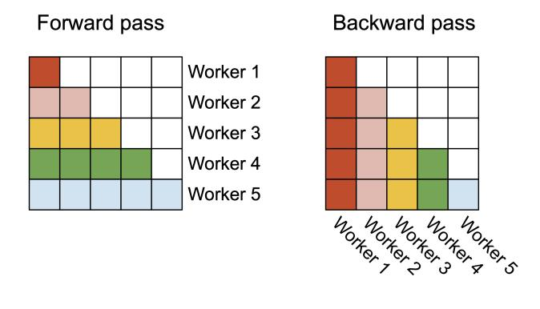

# **Algorithm 1** FLASHATTENTION-2 forward pass

**Require:** Matrices  $\mathbf{Q}, \mathbf{K}, \mathbf{V} \in \mathbb{R}^{N \times d}$  in HBM, block sizes  $B_c, B_r$ .

- 1: Divide **Q** into  $T_r = \begin{bmatrix} \frac{N}{B_r} \end{bmatrix}$  blocks  $\mathbf{Q}_1, ..., \mathbf{Q}_{T_r}$  of size  $B_r \times d$  each, and divide  $\mathbf{K}, \mathbf{V}$  in to  $T_c = \begin{bmatrix} \frac{N}{B_c} \end{bmatrix}$ blocks  $\mathbf{K}_1,...,\mathbf{K}_{T_c}$  and  $\mathbf{V}_1,...,\mathbf{V}_{T_c}$ , of size  $B_c \times d$  each.
- 2: Divide the output  $\mathbf{O} \in \mathbb{R}^{N \times d}$  into  $T_r$  blocks  $\mathbf{O}_i,...,\mathbf{O}_{T_r}$  of size  $B_r \times d$  each, and divide the logsum exp L into  $T_r$  blocks  $L_i,...,L_{T_r}$  of size  $B_r$  each.
- 3: **for**  $1 \le i \le T_r$  **do**
- Load  $\mathbf{Q}_i$  from HBM to on-chip SRAM. On chip, initialize  $\mathbf{O}_i^{(0)} = (0)_{B_r \times d} \in \mathbb{R}^{B_r \times d}, \ell_i^{(0)} = (0)_{B_r} \in \mathbb{R}^{B_r}, m_i^{(0)} = (-\infty)_{B_r} \in \mathbb{R}^{B_r}.$
- 6:
- Load  $\mathbf{K}_i$ ,  $\mathbf{V}_i$  from HBM to on-chip SRAM. 7:
- On chip, compute  $\mathbf{S}_{i}^{(j)} = \mathbf{Q}_{i} \mathbf{K}_{i}^{T} \in \mathbb{R}^{B_{r} \times B_{c}}$ . 8:
- On chip, compute  $m_i^{(j)} = \max(m_i^{(j-1)}, \operatorname{rowmax}(\mathbf{S}_i^{(j)})) \in \mathbb{R}^{B_r}, \, \tilde{\mathbf{P}}_i^{(j)} = \exp(\mathbf{S}_i^{(j)} m_i^{(j)}) \in \mathbb{R}^{B_r}$ 9:  $\mathbb{R}^{B_r \times B_c}$  (pointwise),  $\ell_i^{(j)} = e^{m_i^{j-1} - m_i^{(j)}} \ell_i^{(j-1)} + \operatorname{rowsum}(\tilde{\mathbf{P}}_i^{(j)}) \in \mathbb{R}^{B_r}$ .
- On chip, compute  $\mathbf{O}_{i}^{(j)} = \operatorname{diag}(e^{m_{i}^{(j-1)}-m_{i}^{(j)}})\mathbf{O}_{i}^{(j-1)} + \tilde{\mathbf{P}}_{i}^{(j)}\mathbf{V}_{i}$ . 10:
- end for 11.
- On chip, compute  $\mathbf{O}_i = \operatorname{diag}(\ell_i^{(T_c)})^{-1} \mathbf{O}_i^{(T_c)}$ . 12:
- On chip, compute  $L_i = m_i^{(T_c)} + \log(\ell_i^{(T_c)})$ .
- Write  $\mathbf{O}_i$  to HBM as the *i*-th block of  $\mathbf{O}$ .
- 15: Write  $L_i$  to HBM as the *i*-th block of L.
- 16: **end for**
- 17: Return the output  $\mathbf{O}$  and the logsum exp L.

#### Causal masking.

One common use case of attention is in auto-regressive language modeling, where we need to apply a causal mask to the attention matrix **S** (i.e., any entry  $S_{ij}$  with j > i is set to  $-\infty$ ).

- 1. As FLASHATTENTION and FLASHATTENTION-2 already operate by blocks, for any blocks where all the column indices are more than the row indices (approximately half of the blocks for large sequence length), we can skip the computation of that block. This leads to around 1.7-1.8× speedup compared to attention without the causal mask.
- 2. We do not need to apply the causal mask for blocks whose row indices are guaranteed to be strictly less than the column indices. This means that for each row, we only need apply causal mask to 1 block (assuming square block).

Correctness, runtime, and memory requirement. As with FLASHATTENTION, Algorithm 1 returns the correct output  $\mathbf{O} = \operatorname{softmax}(\mathbf{Q}\mathbf{K}^{\top})\mathbf{V}$  (with no approximation), using  $O(N^2d)$  FLOPs and requires

O(N) additional memory beyond inputs and output (to store the logsum exp L). The proof is almost the same as the proof of Dao et al. (2022, Theorem 1), so we omit it here.

#### 3.1.2 BACKWARD PASS

The backward pass of FLASHATTENTION-2 is almost the same as that of FLASHATTENTION. We make a minor tweak to only use the row-wise logsum exp L instead of both the row-wise max and row-wise sum of exponentials in the softmax. We include the backward pass description in Algorithm 2 for completeness.

Multi-query attention and grouped-query attention. Multi-query attention (MQA) (Shazeer, 2019) and grouped-query attention (GQA) (Ainslie et al., 2023) are variants of attention where multiple heads of query attend to the same head of key and value, in order to reduce the size of KV cache during inference. Instead of having to duplicate the key and value heads for the computation, we implicitly manipulate the indices into the head to perform the same computation. In the backward pass, we need to sum the gradients dK and dV across different heads that were implicitly duplicated.

#### 3.2 PARALLELISM

The first version of FLASHATTENTION parallelizes over batch size and number of heads. We use 1 thread block to process one attention head, and there are overall batch size number of heads thread blocks. Each thread block is scheduled to run on a streaming multiprocessor (SM), and there are 108 of these SMs on an A100 GPU for example. This scheduling is efficient when this number is large (say  $\geq$  80), since we can effectively use almost all of the compute resources on the GPU.

In the case of long sequences (which usually means small batch sizes or small number of heads), to make better use of the multiprocessors on the GPU, we now additionally parallelize over the sequence length dimension. This results in significant speedup for this regime.

**Forward pass.** We see that the outer loop (over sequence length) is embarrassingly parallel, and we schedule them on different thread blocks that do not need to communicate with each other. We also parallelize over the batch dimension and number of heads dimension, as done in FLASHATTENTION. The increased parallelism over sequence length helps improve occupancy (fraction of GPU resources being used) when the batch size and number of heads are small, leading to speedup in this case.

**Backward pass.** Notice that the only shared computation between different column blocks is in update  $d\mathbf{Q}$  in Algorithm 2, where we need to load  $d\mathbf{Q}_i$  from HBM to SRAM, then on chip, update  $d\mathbf{Q}_i \leftarrow d\mathbf{Q}_i + d\mathbf{S}_i^{(j)}\mathbf{K}_j$ , and write back to HBM. We thus parallelize over the sequence length dimension as well, and schedule 1 thread block for each column block of the backward pass. We use atomic adds to communicate between different thread blocks to update  $d\mathbf{Q}$ .

We describe the parallelization scheme in Fig. 2.

Figure 2: In the forward pass (left), we parallelize the workers (thread blocks) where each worker takes care of a block of rows of the attention matrix. In the backward pass (right), each worker takes care of a block of columns of the attention matrix.

**Decoding.** During LLM inference, most of the time is spent on iterative decoding, where one token is predicted at a time. The bottleneck for the attention operation during decoding is different from that during training or prefill (prompt processing), because the query length is very short (often query length is 1 since only the new extra token is attending to all the previous tokens, stored in the KV cache). As a

result, the bottleneck is no longer the read/write of intermediate matrices (the scores QK&gt; and attention probabilities softmax(QK>)). Instead, the bottleneck is to load the KV cache as quickly as possible.

To accommodate this setting, we split the KV cache loading among different thread blocks, to increase occupancy and saturate the HBM bandwidth. However, since the thread blocks cannot easily communicate with each other, we write intermediate results to HBM, then call a separate kernel to reduce the results and produce final output.

