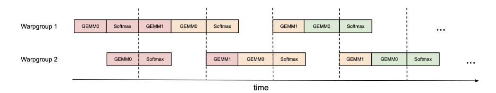
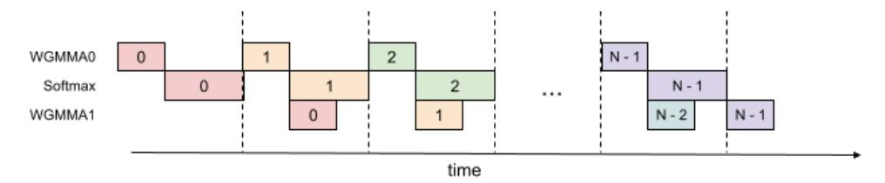

# 3 FlashAttention-3: Algorithm

In this section, we describe the FLASHATTENTION-3 algorithm. For simplicity, we focus on the forward pass, with the backward pass algorithm described in Appendix B.1. We first indicate how to integrate warp-specialization with a circular SMEM buffer into the base algorithm of FLASHATTENTION-2. We then explain how to exploit asynchrony of WGMMA to define an overlapped GEMM-softmax 2-stage pipeline. Finally, we describe the modifications needed for FP8, both in terms of layout conformance and accuracy via block quantization and incoherent processing.

### <span id="page-3-1"></span>3.1 Producer-Consumer asynchrony through warp-specialization and pingpong scheduling

**Warp-specialization** As with FLASHATTENTION-2, the forward pass of FLASHATTENTION-3 is embarrassingly parallel in the batch size, number of heads, and query sequence length. Thus, it will suffice to give a CTA-level view of the algorithm, which operates on a tile  $\mathbf{Q}_i$  of the query matrix to compute the corresponding tile  $\mathbf{O}_i$  of the output. To simplify the description, we first give the warp-specialization scheme with a circular SMEM buffer that does *not* have in addition the GEMM-softmax overlapping. Let d be the head dimension, N the sequence length, and fix a query block size  $B_r$  to divide  $\mathbf{Q}$  into  $T_r = \lceil \frac{N}{B_r} \rceil$  blocks  $\mathbf{Q}_1,...,\mathbf{Q}_{T_r}$ .

For our implementation of Algorithm 1 on Hopper, we use setmaxnreg for (de)allocations, TMA for loads of  $\mathbf{Q}_i$  and  $\{\mathbf{K}_j, \mathbf{V}_j\}_{0 \le j < T_c}$ , and WGMMA to execute the GEMMs in the consumer mainloop, with the SS or RS prefix indicating whether the first operand is sourced from shared memory or register file. For interpreting the execution flow of Algorithm 1, note that issuing TMA loads does not stall on the completion of other loads due to asynchrony. Moreover, in the producer mainloop, no waits will be issued for the first s iterations as the buffer gets filled.

**Pingpong scheduling** The asynchronous nature of WGMMA and TMA, along with warp-specialization, opens up the opportunity to overlap the softmax computation of one warpgroup with the GEMM of another warpgroup. To motivate this, notice that non-matmul operations have much lower throughput than matmul operations on modern hardware accelerators. As an example, the H100 SXM5 GPU has 989 TFLOPS of FP16 matmul but only 3.9 TFLOPS of special functions such as exponential<sup>5</sup> (necessary for softmax). For the attention forward pass in FP16 with head dimension 128, there are 512x more matmul FLOPS compared to exponential operations, but the exponential has 256x lower throughput, so exponential can take 50% of the cycle compared to matmul. The situation is even worse with FP8, where the matmul throughput doubles but the exponential throughput stays the same.

<span id="page-3-0"></span><sup>&</sup>lt;sup>5</sup>The CUDA programming guide specifies that 16 operations of special functions can be performed per streaming multiprocessor (SM) per clock cycle. We multiply 16 by 132 SMs and 1830 MHz clock speed to get 3.9 TFLOPS of special functions.

### <span id="page-4-2"></span>Algorithm 1 FLASHATTENTION-3 forward pass without intra-consumer overlapping – CTA view

```
Require: Matrices \mathbf{Q}_i \in \mathbb{R}^{B_r \times d} and \mathbf{K}, \mathbf{V} \in \mathbb{R}^{N \times d} in HBM, key block size B_c with T_c = \lceil \frac{N}{B} \rceil.
 1: Initialize pipeline object to manage barrier synchronization with s-stage circular SMEM buffer.
 2: if in producer warpgroup then
          Deallocate predetermined number of registers.
          Issue load \mathbf{Q}_i from HBM to shared memory.
 4:
 5:
          Upon completion, commit to notify consumer of the load of \mathbf{Q}_i.
          for 0 \le j < T_c do
 6:
             Wait for the (j\%s)th stage of the buffer to be consumed.
 7:
             Issue loads of \mathbf{K}_i, \mathbf{V}_i from HBM to shared memory at the (i\%s)th stage of the buffer.
 8:
 9:
             Upon completion, commit to notify consumers of the loads of \mathbf{K}_i, \mathbf{V}_i.
10:
          end for
11: else
          Reallocate predetermined number of registers as function of number of consumer warps.
12:
          On-chip, initialize \mathbf{O}_i = (0) \in \mathbb{R}^{B_r \times d} and \ell_i, m_i = (0), (-\infty) \in \mathbb{R}^{B_r}.
13:
          Wait for \mathbf{O}_i to be loaded in shared memory.
14:
          for 0 \le j < T_c do
15:
             Wait for \mathbf{K}_i to be loaded in shared memory.
16:
             Compute \mathbf{S}_{i}^{(j)} = \mathbf{Q}_{i} \mathbf{K}_{i}^{T} (SS-GEMM). Commit and wait.
17:
             Store m_i^{\text{old}} = m_i and compute m_i = \max(m_i^{\text{old}}, \text{rowmax}(\mathbf{S}_i^{(j)})).
18:
             Compute \widetilde{\mathbf{P}}_{i}^{(j)} = \exp(\mathbf{S}_{i}^{(j)} - m_{i}) and \ell_{i} = \exp(m_{i}^{\text{old}} - m_{i})\ell_{i} + \text{rowsum}(\widetilde{\mathbf{P}}_{i}^{(j)}).
19:
             Wait for \mathbf{V}_{i}^{t} to be loaded in shared memory.
20:
             Compute \mathbf{O}_i = \operatorname{diag}(\exp(m_i^{\text{old}} - m_i))\mathbf{O}_i + \widetilde{\mathbf{P}}_i^{(j)}\mathbf{V}_j (RS-GEMM). Commit and wait. Release the (j\%s)th stage of the buffer for the producer.
21:
22:
23:
          end for
          Compute \mathbf{O}_i = \operatorname{diag}(\ell_i)^{-1} \mathbf{O}_i and L_i = m_i + \log(\ell_i).
24:
25:
          Write O_i and L_i to HBM as the ith block of O and L.
26: end if
```

<span id="page-4-5"></span><span id="page-4-4"></span><span id="page-4-1"></span><span id="page-4-0"></span>Since the exponential is performed by a separate hardware unit (the multi-function unit), ideally we'd want the exponential calculation to be scheduled when the Tensor Cores are performing the matmul. To do so, we use synchronization barriers (bar.sync instructions) to force the GEMMs (GEMM1 – PV of one iteration, and GEMM0 –  $QK^{\top}$  of the next iteration) of warpgroup 1 to be scheduled before the GEMMs of warpgroup 2. As a result, the softmax of warpgroup 1 will be scheduled while warpgroup 2 is performing its GEMMs. Then the roles swap, with warpgroup 2 doing softmax while warpgroup 1 doing GEMMs (hence, "pingpong" scheduling). This is illustrated in Fig. 1. Though in practice the pingpong scheduling is not as clean as depicted in the figure, we generally find this to improve performance (e.g., from 570 TFLOPS to 620-640 TFLOPS for FP16 forward with head dimension 128 and sequence length 8192).

<span id="page-4-3"></span>

Figure 1: Pingpong scheduling for 2 warpgroups to overlap softmax and GEMMs: the softmax of one warpgroup should be scheduled when the GEMMs of another warpgroup are running. The same color denotes the same iteration.

**Attention variants** For multi-query attention [50] and grouped query attention [3], we follow the approach in FLASHATTENTION-2 and adjust the tensor indexing to avoid duplicating  $\mathbf{K}$  and  $\mathbf{V}$  in HBM.

#### 3.2 Intra-warpgroup overlapping GEMMs and softmax

Even within one warpgroup, we can overlap some instructions in the softmax with some instructions in the GEMMs. We describe one technique to do so.

In the attention algorithm, operations within the inner loop (main loop) have sequential dependencies that impede parallelization within a single iteration. For example, (local) softmax (lines 18 to 19) relies on the output  $\mathbf{S}_{i}^{(j)}$  of the first GEMM, while the second GEMM takes its result  $\widetilde{\mathbf{P}}_{i}^{(j)}$  as an operand. Indeed, the wait statements in lines 17 and 21 of Algorithm 1 serialize the execution of softmax and GEMMs. However, we can break these dependencies by pipelining across iterations through additional buffers in registers. Pursuing this idea, we propose the following two-stage<sup>6</sup> GEMM-softmax pipelining algorithm:



<span id="page-5-4"></span><span id="page-5-3"></span>Figure 2: 2-stage WGMMA-softmax pipelining

### <span id="page-5-1"></span>Algorithm 2 FLASHATTENTION-3 consumer warpgroup forward pass

**Require:** Matrices  $\mathbf{Q}_i \in \mathbb{R}^{B_r \times d}$  and  $\mathbf{K}, \mathbf{V} \in \mathbb{R}^{N \times d}$  in HBM, key block size  $B_c$  with  $T_c = \lceil \frac{N}{B_c} \rceil$ .

- Reallocate predetermined number of registers as function of number of consumer warps.
   On-chip, initialize O<sub>i</sub> = (0) ∈ ℝ<sup>B<sub>r</sub>×d</sup> and ℓ<sub>i</sub>,m<sub>i</sub> = (0),(-∞) ∈ ℝ<sup>B<sub>r</sub></sup>.
- 3: Wait for Q<sub>i</sub> and K<sub>0</sub> to be loaded in shared memory.
  4: Compute S<sub>cur</sub> = Q<sub>i</sub>K<sub>0</sub><sup>T</sup> using WGMMA. Commit and wait.
- 5: Release the 0th stage of the buffer for **K**.
- 6: Compute  $m_i$ ,  $\tilde{\mathbf{P}}_{cur}$  and  $\ell_i$  based on  $\mathbf{S}_{cur}$ , and rescale  $\mathbf{O}_i$ .
- 7: **for**  $1 \le j < T_c 1$  **do**
- <span id="page-5-2"></span>Wait for  $\mathbf{K}_i$  to be loaded in shared memory. 8:
- Compute  $S_{\text{next}} = Q_i K_i^T$  using WGMMA. Commit but do not wait. 9:
- Wait for  $V_{i-1}$  to be loaded in shared memory. 10:
- Compute  $O_i = O_i + \tilde{P}_{cur} V_{i-1}$  using WGMMA. Commit but do not wait. 11:
- <span id="page-5-5"></span>Wait for the WGMMA  $\mathbf{Q}_i \mathbf{K}_i^T$ . 12:
- Compute  $m_i$ ,  $\tilde{\mathbf{P}}_{\text{next}}$  and  $\ell_i$  based on  $\mathbf{S}_{\text{next}}$ . 13:
- 14: Wait for the WGMMA  $\mathbf{P}_{cur}\mathbf{V}_{j-1}$  and then rescale  $\mathbf{O}_i$
- Release the (j%s)th, resp. (j-1%s)th stage of the buffer for **K**, resp. **V**. 15:
- 16: Copy  $S_{next}$  to  $S_{cur}$ .
- 17: **end for**
- 18: Wait for  $V_{T_c-1}$  to be loaded in shared memory.
- 19: Compute  $\mathbf{O}_i = \mathbf{O}_i + \tilde{\mathbf{P}}_{last} \mathbf{V}_{T_c-1}$  using WGMMA. Commit and wait.
- 20: Epilogue: Rescale  $\mathbf{O}_i$  based on  $m_i$ . Compute  $L_i$  based on  $m_i$  and  $\ell_i$ . Write  $\mathbf{O}_i$  and  $L_i$  to HBM as the i-th block of  $\mathbf{O}$  and L.

Algorithm 2 functions as a replacement for the consumer path of Algorithm 1 to comprise the complete FLASHATTENTION-3 algorithm for FP16 precision. At a high-level, we use WGMMA as a metonym for asynchronous GEMM. Within the mainloop (lines 8 to 16), the second WGMMA operation of iteration j (line 11) is overlapped with softmax operations from iteration j+1 (line 13).

While the pipelined structure illustrated above offers theoretical performance gains, there are several practical aspects to consider:

<span id="page-5-0"></span> $<sup>^6</sup>$ Note that the number of stages of the overlapping scheme is bounded by, but need not equal, the number s of stages in the circular SMEM buffer.

<span id="page-6-1"></span>

|  | T0 {d0, d1} T1 {d0, d1} T2 {d0, d1} T3 {d0, d1} T0 {d4, d5} T1 {d4, d5} T2 {d4, d5} T3 {d4, d5} |  |  |  |
|--|-------------------------------------------------------------------------------------------------|--|--|--|
|  | T0 {d2, d3} T1 {d2, d3} T2 {d2, d3} T3 {d2, d3} T0 {d6, d7} T1 {d6, d7} T2 {d6, d7} T3 {d6, d7} |  |  |  |

Figure 3: FP32 accumulator register WGMMA layout – rows 0 and 8, threads 0-3, entries 0-7.

<span id="page-6-2"></span>

| T0 {a0, a1} T0 {a2, a3} T1 {a0, a1} T1 {a2, a3} T2 {a0, a1} T2 {a2, a3} T3 {a0, a1} T3 {a2, a3} |  |  |  |
|-------------------------------------------------------------------------------------------------|--|--|--|
| T0 {a4, a5} T0 {a6, a7} T1 {a4, a5} T1 {a6, a7} T2 {a4, a5} T2 {a6, a7} T3 {a4, a5} T3 {a6, a7} |  |  |  |

Figure 4: FP8 operand A register WGMMA layout – rows 0 and 8, threads 0-3, entries 0-7.

Compiler reordering The pseudocode represents an idealized execution order but the compiler (NVCC) often rearranges instructions for optimization. This can disrupt the carefully crafted WGMMA and non-WGMMA operation pipelining sequence, potentially leading to unexpected behavior or diminished performance gains. An analysis of the SASS code shows that the compiler generates overlapped code as expected (Section [B.2\)](#page-15-1).

Register pressure To maintain optimal performance, register spilling should be minimized. However, the 2-stage pipeline requires additional registers to store intermediate results and maintain context between stages. Specifically, an extra **S**next must be kept in registers, leading to extra register usage of size ××sizeof(float) per threadblock. This increased register demand may conflict with using larger block sizes (another common optimization), which is also register-hungry. In practice, trade-offs should be made based on profiling results.

3-stage pipelining Extending the 2-stage algorithm described above, we propose a 3-stage variant that would further overlap the second WGMMA with softmax. While this approach offers the potential for even higher Tensor Core utilization, it requires even more registers due to an additional stage in the pipeline, making the trade-off between tile size and pipeline depth more difficult to balance. A detailed description of the 3-stage algorithm and its evaluation results can be found in Appendix [B.3.](#page-16-0)

